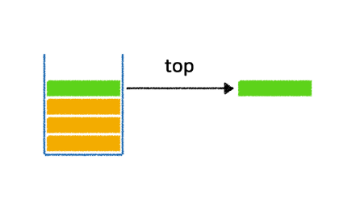
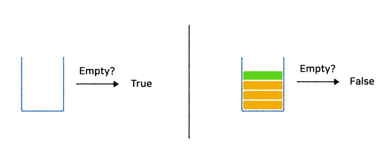
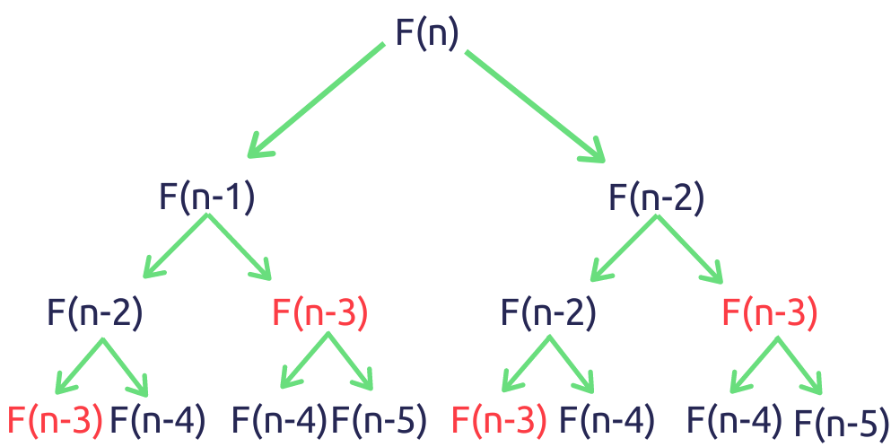
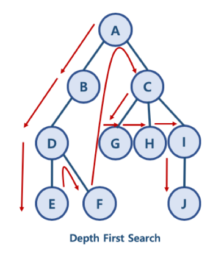

# 📍 Stack

## 1. 스택이란?<br>

- 데이터의 삽입과 삭제가 데이터의 가장 한쪽 끝에서만 일어나는 자료구조<br>

- 가장 마지막에 삽입된 데이터가 가장 먼저 사용되거나 삭제
- 후입선출 (LIFO - Last In, First Out)
- ex) 프링글스
<br><br><br>

## 2. 주요 Method
- push, pop<br>

  
  - push: 데이터를 삽입하는 과정
  - pop: 가장 마지막에 삽입한 데이터를 삭제하는 과정
    - 스택에 데이터가 비어있는지 여부 먼저 확인 후 실행
<br><br>

- top<br>

  
  - top: 가장 마지막에 삽입한 데이터를 삭제하지 않고 return 해주는 메소드
<br><br>

- isEmpty<br>

  
  - isEmpty: 현재 스택이 비어있는지 여부를 확인하는 메소드
<br><br>

## 3. 코드
```python
class Stack():
    def __init__(self):
        self.stack = []
        
    def push(self, data):
        self.stack.append(data)
        
    def pop(self):
        pop_object = None
        if self.isEmpty():
            print("Stack is Empty")
        else:
            pop_object = self.stack.pop()
            
        return pop_object
            
    def top(self):
        top_object = None
        if self.isEmpty():
            print("Stack is Empty")
        else:
            top_object = self.stack[-1]
            
        return top_object
            
            
    def isEmpty(self):
        is_empty = False
        if len(self.stack) == 0:
            is_empty = True
        return is_empty
```
<br><br>

---
# 📍 재귀호출(memoization)

## 1. 재귀함수 (recursive function)
- 어떤 함수에서 자신을 다시 호출하여 작업을 수행하는 방식의 함수
- 함수 정의 내에 같은 이름의 함수가 올 때!
- 반드시 탈출 조건이 있어야 **stack overflow** 방지
<br><br>

## 2. 재귀호출의 예
```python
def function(n):
    if n == 0:
      return
    else:
      function(n-1)
      print(n)

function(3)

# 결과
# 1
# 2
# 3
```
<br>

## 3. Memoization
- 재귀함수의 문제점<br>

  - 효율성이 좋지 x<br>

  - 이미 계산되었던 값일지라도 의미 없이 다시 계산을 반복
<br><br>
- **Memoization**
  - 동일한 연산을 반복해야 할 때 이전에 연산한 값을 메모리에 미리 저장해 둠으로써 계산의 반복수행을 제거하여 프로그램 실행 속도를 향상시키는 기술<br>

  - 예시: 피보나치 수
    - F1 = F2 = 1
    - Fn = F(n-1) + F(n-2)<br>

      

  ```python
  # 메모이제이션 기법 사용x

  def fib(n):
    if n == 1:
        return 1
    elif n == 2:
        return 1
    else:
        return fib(n-1) + fib(n-2)
  ```
  ```python
  # 메모이제이션 기법 사용O

  dic = {1:1, 2:1}  # memoization을 위한 dictionary를 함수 외부에 선언

  def fib_memoization(n):
    if n in dic:  # 기록되어 있는 값을 바로 return함으로써 효율 증대
        return dic[n]
    
    dic[n] = fib_memoization(n-1) + fib_memoization(n-2)
    return dic[n]
  ```
<br><br>

---
# 📍 DFS

## 1. DFS의 기본개념<br>

- Depth First Search<br>

- 그래프 자료에서 데이터를 탐색하는 알고리즘
- 위에서 아래로 찾는 방식<br>

  
<br><br>

## 2. DFS의 기본 원칙<br>

- 시작 정점 v를 결정하여 방문한다.<br>

- 정점 v에 인접한 정점 중에서
  - 방문하지 않은 정점 w가 있으면, 정점v를 스택에 push 하고 정점w를 방문한다. w를 <br>

- 스택이 공백이 될 때까지 2)를 반복한다.

<br><br>

## 3. DFS의 구현 방식
```python
# 인접 접점
graph = dict()
 
graph['A'] = ['B', 'C']
graph['B'] = ['A', 'D']
graph['C'] = ['A', 'G', 'H', 'I']
graph['D'] = ['B', 'E', 'F']
graph['E'] = ['D']
graph['F'] = ['D']
graph['G'] = ['C']
graph['H'] = ['C']
graph['I'] = ['C', 'J']
graph['J'] = ['I']
```
<br>

- stack 이용
  ```python
  def dfs(graph, start_node):
 
    ## 기본은 항상 두개의 리스트를 별도로 관리해주는 것
    stack, visited = list(), list()
 
    ## 시작 노드 시정하기
    stack.append(start_node)
    
    ## 만약 아직도 방문이 필요한 노드가 있다면,
    while stack:
 
        ## 그 중에서 가장 마지막 데이터를 추출 (스택 구조의 활용)
        node = stack.pop()
        
        ## 만약 그 노드가 방문한 목록에 없다면
        if node not in visited:
 
            ## 방문한 목록에 추가하기 
            visited.append(node)
 
            ## 그 노드에 연결된 노드를 
            stack.extend(graph[node])
            
    return visited

  dfs(graph, 'A')

  # ['A', 'B', 'D', 'E', 'F', 'C', 'G', 'H', 'I', 'J']
  ```
<br>

- 재귀함수 이용
  ```python
  def dfs_recursive(graph, start, visited = []):
  ## 데이터를 추가하는 명령어 / 재귀가 이루어짐 
    visited.append(start)
 
    for node in graph[start]:
        if node not in visited:
            dfs_recursive(graph, node, visited)
    return visited

  dfs_recursive(graph, 'A')

  # ['A', 'B', 'D', 'E', 'F', 'C', 'G', 'H', 'I', 'J']
  ```

  <br>

  ---
