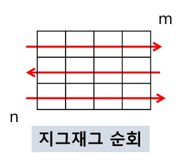

# 2차원 배열

## **1. 2차원 배열**

1. 2차원 배열의 선언
    - 1차원 List를 묶어놓은 List
    - 2차원 이상의 다차원 List는 차원에 따라 Index를 선언
    - 2차원 List의 선언 : 세로길이(행의 개수), 가로길이(열의 개수)를 필요로 함
    - Python에서는 데이터 초기화를 통해 변수선언과 초기화가 가능함
    
    ```python
    arr = [[0, 1, 2, 3], [4, 5, 6, 7]]    # 2행 4열의 2차원 list
    ```
    
    | 0 | 1 | 2 | 3 |
    | --- | --- | --- | --- |
    | 4 | 5 | 6 | 7 |
<br>

2. 참고
    
    3
    
    1 2 3
    
    4 5 6
    
    7 8 9
    
    ```python
    N = int(input())
    arr = [list(map(int, input().split())) for _ in range(N)]
    ```
    
    3
    
    123
    
    456
    
    789
    
    ```python
    N = int(input())
    arr = [list(map(int, input())) for _ in range(N)]
    ```
<br>

3. 배열 순회
    - n X m 배열의 n*m개의 모든 원소를 빠짐없이 조사하는 방법
    - 행 우선 순회
        
        
        
        ```python
        # i 행의 죄표
        # j 행의 좌표
        for i in range(n):
            for j in range(m):
                Array[i][j]  # 필요한 연산 수행
        ```
        
    - 열 우선 순회
        
        
        
        ```python
        # i 행의 죄표
        # j 행의 좌표
        for j in range(m):
            for i in range(n):
                Array[i][j]  # 필요한 연산 수행
        ```
        
    - 지그재그 순회
        
        
        
        ```python
        # i 행의 죄표
        # j 행의 좌표
        for i in range(n):
            for j in range(m):
                Array[i][j + (m-1-2*j) * {1%2}]  
                # 필요한 연산 수행
        ```
<br>        
    
4. 델타를 이용한 2차 배열 탐색
    - 2차 배열의 한 좌표에서 4방향의 인접 배열 요소를 탐색하는 방법
        
        ```python
        arr[0...N-1][0...N-1]  # NxN 배열
        di[] <- [0, 0, -1, -1]  # 상하좌우
        dj[] <- [-1, 1, 0, 0]
        for i  : 1 -> N-1
            for j : 1 -> N-1 :
                for k in range(4) :
                    ni <- i + di[k]
                    nj <- j + dj[k]
                    if 0 <= ni < N and 0 <= nj < N   # 유효한 인덱스면
                        test(arr[ni][nj])
        ```
<br>        
    
5. 전치 행렬
    
    
    
    ```python
    # i : 행의 좌표, len(arr)
    # j : 열의 좌표, len(arr[0])
    arr = [[1, 2, 3], [4, 5, 6], [7, 8, 9]]  # 3*3 행렬
    
    for i in range(3):
        for j in range(3):
            if i < j:
                arr[i][j], arr[j][i] = arr[j][i], arr[i][j]
    ```
<br>    

---
