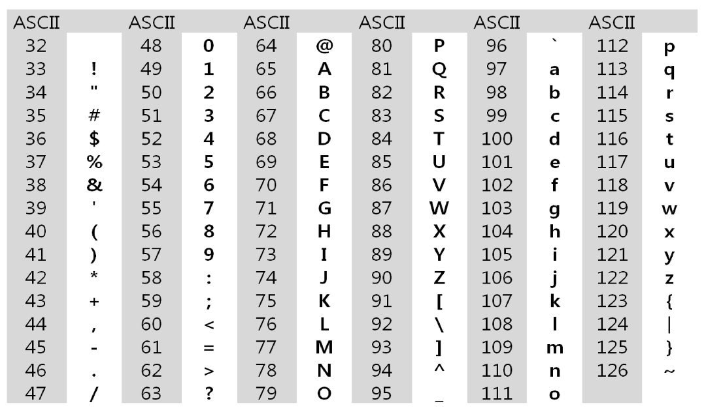
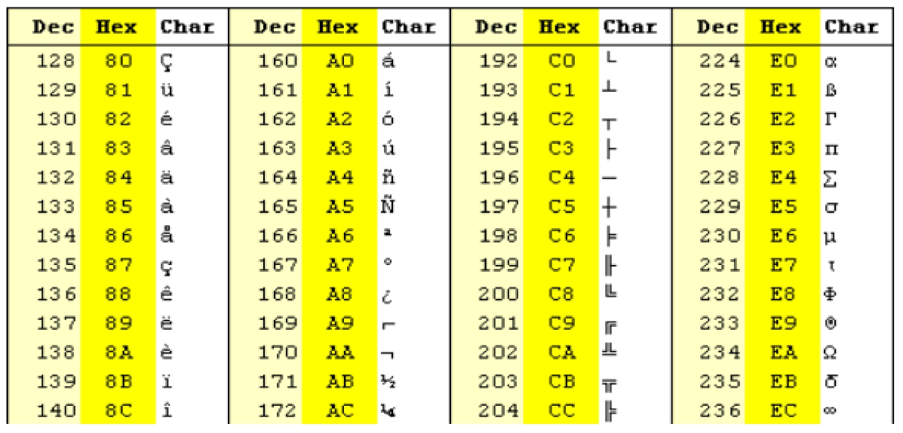
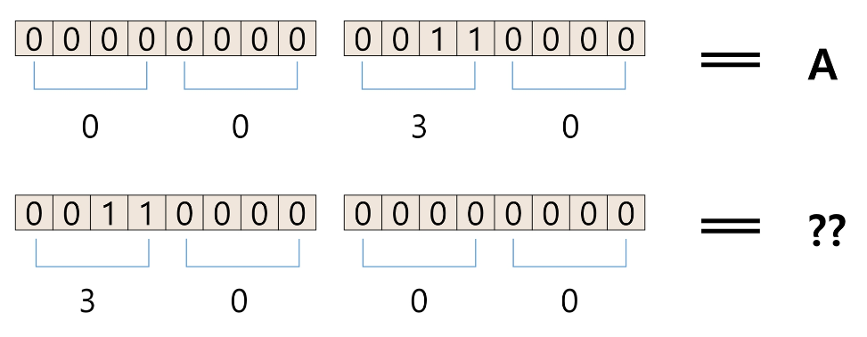

# string

## **1. 문자의 표현**

1. **코드체계**
    - 메모리는 숫자만을 저장할 수 있다.
    - 영어가 대소문자 합쳐서 52이므로 6(64비트)면 모두 표현 가능
    - 000000 → ‘a’, 000001 → ‘b’
  

2. **아스키**
    - 네트워크가 발전하면서 미국의 각 지역간에 정보를 주고 받을 때 정보를 달리 해석한다는 문제 발생
    - 1967년, 미국에서 **ASCII** (American Standard Code for Information Interchange)라는 문자 인코딩 표준이 제정
    - ASCII는 7bit 인코딩으로 128문자를 표현하며 33개의 출력 불가능한 제어 문제들과 공백을 비롯한 95개의 출력 가능한 문자들로 이루어짐
    - 출력 가능한 아스키 문자 (32~126)
        - 공백도 존재 → 문자열로 인정
        - 대문자 시작 : 65 / 소문자 시작 : 97  (기억하면 좋다)
        
        
          
    
3. **확장 아스키**   *→ 많이 사용하지 X*
    - 표준 문자 이외의 악센트 문자, 도형 문자, 특수 문자, 특수 기호 등 부가적인 문자를 128개 추가할 수 있는 부호
    - 표준 아스키는 7bit를 사용하여 문자를 표현하는 데 비해 확장 아스키는 1Byte 내의 8bit를 모두 사용함으로써 추가적인 문자를 표현할 수 있다.
    - 컴퓨터 생산자와 소프트웨어 개발자가 여러 가지 다양한 문자에 할당할 수 있도록 하고 있다.
    - 이렇게 할당된 확장 부호는 표준 아스키와 같이 서로 다른 프로그램이나 컴퓨터 사이에 교환되지 못한다.
    - 그러므로 표준 아스키는 마이크로컴퓨터 하드웨어 및 소프트웨어 사이에서 세계적으로 통용되는 데 비해, 확장 아스키는 프로그램이나 컴퓨터 또는 프린터가 그것을 해독할 수 있도록 설계되어 있어야만 올바르게 해독될 수 있다.
    - 예시
        
        
  

4. **유니코드**
    - 인터넷이 전 세계로 발전하면서 ASCII를 만들었을 때의 문제와 같은 문제가 국가간에 정보를 주고 받을 때 발생
    - 자국의 코드체계를 타 국가가 가지고 있지 않으면 정보를 잘못 해설할 수 밖에 없다.
    - 다국어 처리를 위해 표준 마련
    - 유니코드도 다시 Character Set으로 분류
        - UCS-2(Universal Character Set 2)
        - UCS-4(Universal Character Set 4)
        - 유니코드를 저장하는 변수의 크기를 정의
        - 그러나, 바이트 순서에 대해서 표준화하지 못했음
        - 다시 말해 파일을 인식 시 이 파일이 UCS-2, UCS-4인지 인식하고 각 경우를 구분해서 모두 다르게 구현해야 하는 문제 발생
        - 그래서 유니코드의 적당한 외부 인코딩이 필요!
  

5. big-endian, little-endian
    
    
  

6. 유니코드 인코딩 (UTF: Unicode Transformation Format)
    - **UTF-8** (in web)
        - MIN: 8bit, MAX:  32bit(1 Byte * 4)
        - ASCII(7bit)와 1대 1로 사용 가능
    - UTF-16 (in windows, java)
        - MIN: 16bit, MAX: 32ibt(2 Byte * 2)
    - UTF-32 (in unix)
        - MIN: 32bit, MAX: 32ibt(4 Byte * 1)
  

7. Python 인코딩
    - 2.x 버전 - ASCII → #-*-coding: utf-8-*- (첫 줄에 명시)
    - 3.x 버전 - 유니코드 UTF-8 → 생략 가능
    - CP-949 : windows에서 사용하는 인코딩 방식
    - 다른 인코딩 방식으로 처리 시 첫 줄에 작성하는 위 항목에 원하는 인코딩 방식을 지정해주면 됨
  

---
