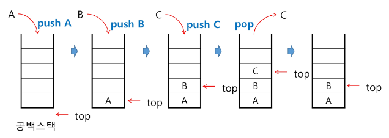
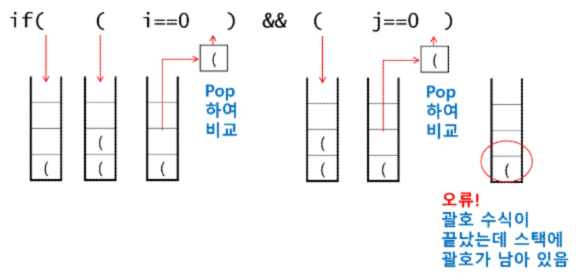

# 스택(Stack)

1. 스택(stack)의 특성<br>

    - 물건을 쌓아 올리듯 자료를 쌓아 올린 형태의 자료구조<br>

    - 스택에 저장된 자료는 선형 구조를 갖는다.
        - 선형구조: 자로 간의 관계가 1대1의 관계<br>

        - 비선형구조: 자료 간의 관계가 1대N의 관계 (예: 트리)
    - 스택에 자료를 삽입하거나 스택에서 자료를 꺼낼 수 있다.
    - 마지막에 삽입한자료를 가장 먼저 꺼낸다. → 후입선출(LIFO, Last In-First- Out)
<br><br><br>

2. 스택의 구현
    - 스택을 프로그램에서 구현하기 위해서 필요한 자료구조와 연산<br>

        - 자료구조: 자료를 선형으로 저장할 저장소
            - 배열 사용 가능<br>

            - 저장소 자테를 스택이라 부르기도 함
            - 스택에서 마지막 삽입된 원소의 위치: top
<br><br><br>

3. 연산
    - 삽입(push): 저장소에서 자료를 저장<br>

    - 삭제(pop): 저장소에서 삽입한 자료의 역순으로 자료를 꺼냄
    - `isEmpty`: 스택이 공백인지 아닌지 확인하는 연산
    - `peek`: 스택의 top에 있는 item(원소)을 반환하는 연산
<br><br><br>

4. 스택의 삽입/삭제 과정
    - 빈 스택에 원소 A, B, C를 차례로 삽입 후 한번 삭제하는 연산과정
        
        
<br><br><br>

    
5. push 알고리즘
    - append 메소드를 통해 리스트의 마지막에 데이터를 삽입
        
        ```python
        def push(item):
            s.append(item)
        ```
        
        ```python
        def push(item, size):
            global top
            top += 1
            if top == size:
                print(overflow!')
            else:
                stack[top] = item
        
        size = 10
        stack = [0] * size
        top = -1
        
        push(10, size)
        top += 1      # push
        stack[top] = 20
        ```
<br><br>

6. pop 알고리즘
    
    ```python
    def pop():
        if len(s) == 0:
            # underflow
            return
        else:
            return s.pop(-1);
    ```
    
    ```python
    def pop():
        global top
        if top == -1:
            print('underflow')
            return 0
        else:
            top -= 1
            return stack[top+1]
    print(pop())
    
    if top > -1:    # pop()
        top -= 1
        print(stack[top])
    ```
<br><br>

7. 연습문제1
    - 스택 구현하기<br>

    - 구현한 스택을 이용하여 3개의 데이터를 스택에 저장하고 다시 3번 꺼내서 출력
<br><br><br>

8. 스택 구현 고려 사항
    - 장점: 1차원 배열을 사용하여 구현할 경우 구현이 용이<br>

    - 단점: 스택의 크기를 변경하기 여러움
    - 이를 해결하기 위한 방법 → 저장소를 동적으로 할당하여 스택을 구현하는 방법
        - 동적 연결리스트를 이용하여 구현하는 방법<br>

        - 장점: 메모리를 효율적으로 사용
        - 단점: 구현이 복잡
        - 스택의 동적 구현 생략
<br><br><br>

9. 스택의 응용1: 괄호검사
    - 괄호의 종류: 대괄호 (’[’,’]’), 중괄호(’{’,’}’), 소괄호(’(’,’)’)<br>

    - 조건
        - 왼쪽 괄호의 개수와 오른쪽 괄호의 개수가 같아야 한다.<br>

        - 같은 괄호에서 왼쪽 괄호는 오른쪽 괄호보다 먼저 나와야 한다.
        - 괄호 사이에는 포함 관계만 존재한다.
    - 잘못된 괄호 사용의 예
        - (a(b)<br>

        - a(b)c)
        - a{b(c[d]e}f)
    - 스택을 이용한 괄호 검사
        
        
        
    - 괄호를 조사하는 알고리즘 개요
        - 문자열에 있는 괄호를 차례대로 조사하면서 왼쪽 괄호를 만나면 스택에 삽입하고, 오른쪽 괄호를 만나면 스택에서 top 괄호를 삭제한 후 오른쪽 괄호와 짝이 맞는지를 검사<br>

        - 이 때, 스택이 비어 있으면 조건 1 또는 조건 2에 위배되고 괄호의 짝이 맞지 않으면 조건 3에 위배된다.
        - 마지막 괄호까지를 조사한 후에도 스택에 괄호가 남아 있으면 조건 1에 위배된다.
<br><br><br>

10. 연습문제2
    - 괄호의 짝을 검사하는 프로그램을 작성해 본다.<br>

    - 작성한 프로그램으로 다음 괄호 사용을 검사해 본다.
        - ()()((()))
        - ((()((((()()((()())((()))))
<br><br><br>

11. 스택의 응용2: function call
    - 프로그램에서의 함수 호출과 복귀에 따른 수행 순서를 관리<br>

        - 가장 마지막에 호출된 함수가 가장 먼저 실행을 완료하고 복귀하는 후입선출 구조이므로, 후입선출 구조의 스택을 이용하여 수행순서 관리<br>

        - 함수 호출이 발생하면 호출한 함수 수행에 필요한 지역변수, 매개변수 및 수행 후 복귀할 주소 등의 정보를 스택 프레임(stack frame)에 저장하여 시스템 스택에 삽입
        - 함수의 실행이 끝나면 시스템 스택의 top 원소(스택 프레임)를 삭제(pop)하면서 프레임에 저장되어 있던 복귀주소를 확인하고 복귀
        - 함수 호출과 복귀에 따라 이 과정을 반복하여 전체 프로그램 수행이 종료되면 시스템 스택은 공백 스택이 된다.
    - 함수 호출과 복귀에 따른 전체 프로그램의 수행 순서
        
        
<br><br><br>        

---

