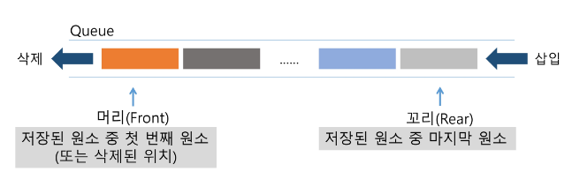
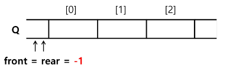
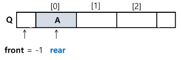
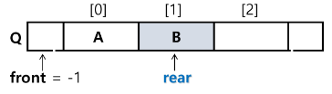
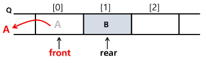
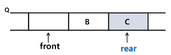
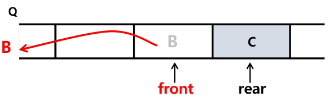
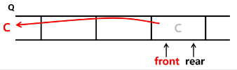

# Queue

1. 큐(Queue)의 특성
    - 삽입과 삭제의 위치가 제한적인 구조 

        - 큐의 뒤에서는 삽입만 하고, 큐의 앞에서는 삭제만 이루어지는 구조  

    - **선입선출구조(FIFO: First In First Out)**
     
        - 큐에 삽입한 순서대로 원소가 저장되어, 가장 먼저 삽입(First In)된 원소는 가장 먼저 삭제(First Out)된다.
   

2. 선입선출 구조
    
    
   

3. 기본 연산
    - 삽입: `enQueue`
    - 삭제: `deQueue`
   

4. 주요 연산
    
    
    | 연산 | 기능 |
    | --- | --- |
    | enQueue(item) | 큐의 뒤쪽(rear 다음)에 원소를 삽입하는 연산 |
    | deQueue() | 큐의 앞쪽(front)에서 원소를 삭제하고 반환하는 연산 |
    | createQueue() | 공백 상태의 큐를 생성하는 연산 |
    | isEmpty() | 큐가 공백상태인지를 확인하는 연산 |
    | isFull() | 큐가 포화상태인지를 확인하는 연산 |
    | Qpeek() | 큐의 앞쪽(front)에서 원소를 삭제 없이 반환하는 연산 |
  

5. 연산 과정
    - 공백 큐 생성: `createQueue();`
        - Q = []
        - Q = [0] * 1000  → 크기가 정해진 방식으로 구현하는 게 좋다.  
        
        
          
    
    - 원소 A 삽입: `enQueue(A);`
        - rear += 1
        - Q[rear] = ‘A’  
        
        
          
    
    - 원소 B 삽입: `enQueue(B);`
        
        
          
    
    - 원소 반환/삭제: `deQueue();`
        - front: 마지막으로 꺼낸 자리
        - rear: 마지막 저장 위치  
        
        
          
    
    - 원소 C 삽입: `enQueue(C);`
        
        
          
    
    - 원소 반환/삭제: `deQueue();`
        
        
          
    
    - 원소 반환/삭제: `deQueue();`
        
        
           

---
