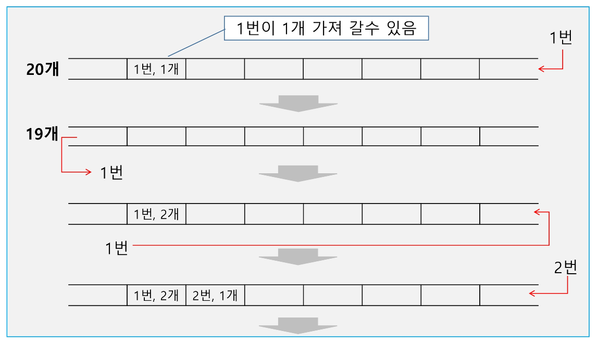
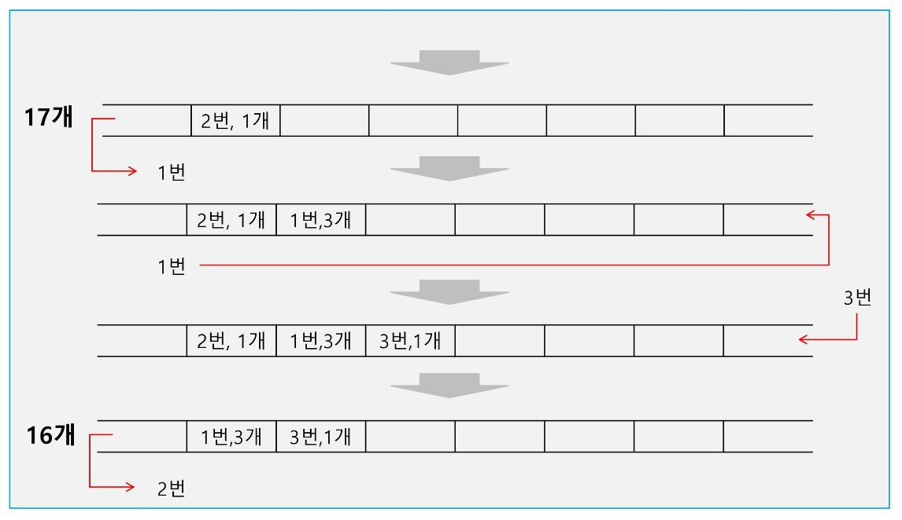
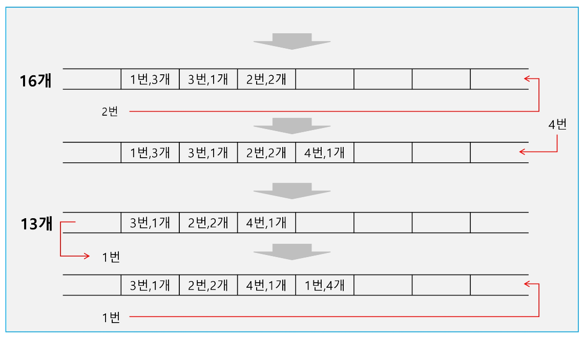
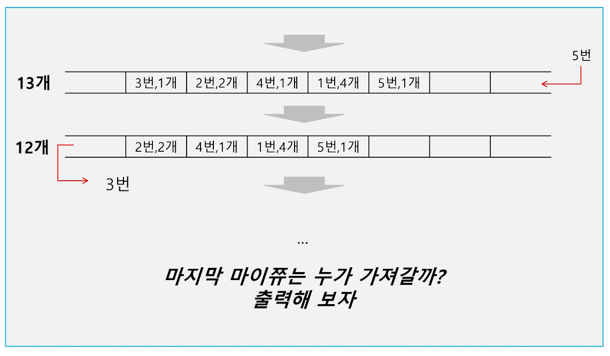

# 버퍼(Buffer)

1. **버퍼**
    - 데이터를 한 곳에서 다른 한 곳으로 전송하는 동안 일시적으로 그 데이터를 보관하는 메모리의 영역 

    - 버퍼링: 버퍼를 활용하는 방식 또는 버퍼를 채우는 동작을 의미
   

2. **버퍼의 자료 구조**
    - 버퍼는 일반적으로 입출력 및 네트워크와 관련된 기능으로 이용된다. 

    - 순서대로 입력/출력/전달되어야 하므로 FIFO 방식의 자료구조인 큐가 활용된다.
   

3. **키보드 버퍼**
    
    
   

4. **Revisit to 마이쮸**
    - Queue를 이용하여 마이쮸 나눠주기 시물레이션을 해보자 

        - 1번이 줄을 선다. 

        - 1번이 한 개의 마이쮸를 받는다.
          

        - 1번이 다시 줄을 선다.
        - 새로 2번이 들어와 줄을 선다.
          

        - 1번이 두 개의 마이쥬를 받는다.
        - 1번이 다시 줄으 선다.
        - 새로 3번이 들어와 줄을 선다.
          

        - 2번이 한 개의 마이쮸를 받는다.
        - 2번이 다시 줄을 선다.
        - 새로 4번이 들어와 줄을 선다.
          
        - 1번이 세 개의 마이쮸를 받는다.
        - 1번이 다시 줄을 선다.
        - 새로 5번이 들어와 줄을 선다.
          
        - 3번이 한 개의 마이쮸를 받는다.
        - …
        - 20개의 마이쮸가 있을 때 마지막 것을 누가 가져갈까?
    
    
    
    
    
    
    
    
   

5. **마이쮸 시뮬레이션 구현**
    - 엔터를 칠 때마다 다음 정보를 화면에 출력해보자. 

        - 큐에 있는 사람 수 

        - 현재 일인당 나눠주는 마이쮸의 수
        - 현재까지 나눠준 마이쮸의 수
       

---
