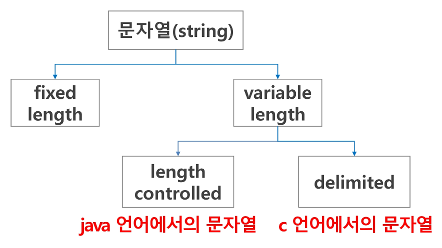
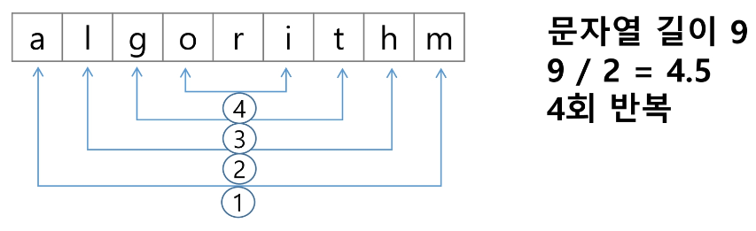

# 문자열

1. **문자열의 분류**
    
    
<br><br>

2. **Python에서의 문자열 처리**
    - char 타입 없음
    - 텍스트 데이터의 취급방법이 통일되어 있음
    - 문자열 기호
        - ‘(홑따옴표), “(쌍따옴표), ‘’’(홑따옴표 3개), “””(쌍따옴표 3개)
        - '+' 연결(Concatenation)
            - 문자열 + 문자열 : 이어 붙여주는 역할
        - '*' 반복
            - 문자열 * 수 : 수만큼 문자열이 반복
    - 문자열은 시퀸스 자료형으로 분류(iterable)되고, 시퀀스 자료형에서 사용할 수 있는 인덱싱, 슬라이싱 연산들을 사용할 수 있음
    - 문자열 클래스에서 제공되는 메소드
        
        ```python
        replace(), split(), isalpha(), find()
        ```
        
    - **문자열은 튜플과 같이 요소값을 변경할 수 없음(immutable)**
<br><br>    
    
3. **문자열 뒤집기**
    - 자기 문자열에서 뒤집는 방법이 있고 새로운 빈 문자열을 만들어 소스의 뒤에서부터 읽어서 타겟에 쓰는 방법이 존재
    - 자기 문자열을 이용할 경우는 swap을 위한 임시 변수가 필요
    - 반복 수행을 문자열 길이의 반만을 수행해야 한다.
    
    
    
    - Python에서 문자열 뒤집기
        - s = s[::-1]
        - s = ‘abcd’
        - s = list(s)
        - s.reverse()
        - s = “.join(s)
        - for 문을 이용해 구현
            
            ```python
            rev_str = ''
            
            for idx in range(len(s)-1, -1, -1):
                rev_str += s[idx]
            
            print(rev_str)
            ```
            
            ```python
            list_s = list(s)
            for idx in range(len(s) // 2):
                list_s[idx], list_s[-1-idx] = list_s[-1-idx], list_s[idx]
            
            print(''.join(list_s))
            ```
<br>            
    
4. **문자열 비교**
    - c strcmp() 함수를 제공 (아 그렇군)
    - Java에서는 equals() 메소드를 제공 (아 그렇군)
    - 파이썬에서는 == 연산자와 is 연산자를 제공
        - == 연산자는 내부적으로 특수 메소드 `__eq__()`를 호출
    - 참고
        - s1과 나머지 문자열을 ==, is로 비교한 결과를 확인
        - ==: 값만 같은지
        - is: 값, 같은 객체를 가리키는지
            
            ```python
            s1 = 'abc'
            s2 = 'abc'
            s3 = 'def'
            s4 = s1
            s5 = s1[:2] + 'c'
            
            # == 비교
            print(s1 == s2)  # True
            print(s1 == s3)  # False
            print(s1 == s4)  # True
            print(s1 == s5)  # True
            print('-' * 10)
            print(s2 == s3)  # False
            print(s2 == s4)  # True
            print(s2 == s5)  # True
            print('-' * 10)
            print(s3 == s4)  # False
            print(s3 == s5)  # False
            print('-' * 10)
            print(s4 == s5)  # True
            
            # is 비교
            print(s1 is s2)  # True
            print(s1 is s3)  # False
            print(s1 is s4)  # True
            print(s1 is s5)  # False
            print('-' * 10)
            print(s2 is s3)  # False
            print(s2 is s4)  # True
            print(s2 is s5)  # False
            print('-' * 10)
            print(s3 is s4)  # False
            print(s3 is s5)  # False
            print('-' * 10)
            print(s4 is s5)  # False
            ```
    <br>

    - 다음 C 코드를 참고해 문자열 비교함수를 만들기
        - 문자열이 같으면 0 리턴
        - str1이 str2보다 사전 순서상 앞서면 음수 혹은 -1 리턴
        - str1이 str2보다 사전 순서상 나중이면 양수 혹은 1 리턴
        <br><br>

        ```c
        int my_strcmp(const char *str1, const char *str2)
        {
            int i = 0;
            while(str1[i] != '\0')
            {
                if(str1[i] != str2[i]) break;
                i++;
            }
            return (str1[i] - str2[i]);
        }
        ```
<br>

5. **문자열 숫자를 정수로 변환하기**
    - c 언어에서는 atoi()함수를 제공, 역 함수로는 itoa()가 존재
        - atoi(): ascii to integer
        - itoa(): integer to ascii
    - java에서는 숫자 클래스의 parse 메소드를 제공
        - 예: Inetger.parselnt(String)
        - 역함수로는 toString() 메소드를 제공
    - 파이썬에서는 숫자와 문자변환 함수를 제공
        - 예) int(”123”), float(”3.14”), str(123), repr(123)
        
    - int()와 같은 atoi()함수 만들기
        - s = ‘123’
        - a = atoi(s)
        - print(a + 1)
        <br><br>

        ```python
        def atoi(s):
            i = 0
            for x in s:
                i = i*10 + ord(x) - ord('0')
            return i
        ```
   <br>     
    
6. **연습문제2**
    
    - str() 함수를 사용하지 않고, itoa()를 구현하기
        - 양의 정수를 입력 받아 문자열로 변환하는 함수
        - 입력 값: 변환할 정수 값, 변환된 문자열을 저장할 문자배열
        - 반환 값: 없음
        - ord(), chr() 이용
        <br><br>

        ```python
        def itoa(num):
        
            result = ''
            while num:
                num, remain = num // 10, num % 10
                result = chr(ord('0') + remain) + result  # 아스키 코드로 변경 -> 문자로 변경
        
            return result
        
        res = itoa(1234)
        print(type(itoa), res)  # <class 'function'> 1234
        ```
      
        - 음수를 변환할 때는 어떤 고려 사항이 필요한가?
        <br><br>

        ```python
        def itoa(num):
        
            # 음수인지 아닌지 판단
            neg = False    # flag : 음수라면 True, 양수라면 False
            if num < 0:
                neg = True
                num = -num
        
            result = ''
            while num:
                num, remain = num // 10, num % 10
                result = chr(ord('0') + remain) + result  # 아스키 코드로 변경 -> 문자로 변경
            
            if neg:
                return '-' + result
            else:
                return result
        
        res = itoa(-1234)
        print(type(itoa), res)   # <class 'function'> -1234
        ```
<br>        

---
