# BFS(Breadth First Search)

1. **그래프를 탐색하는 방법**
    - 깊이 우선 탐색(Depth First Search, DFS) ⇒ 재귀, 스택<br>

    - 너비 우선 탐색(Breadth First Search, BFS) ⇒ 큐
    - 활용 예시
        - 미로, 그래프 문제 중
            - A → B 경로 있는가  ⇒ DFS, BFS<br>

            - A → B 개수는?  ⇒ DFS
            - A → B 최단 경로의 길이는?  ⇒ BFS (DFS도 가능)
<br><br><br>

2. **BFS**
    - 탐색 시작점의 인접한 정점들을 먼저 모두 차례로 방문한 후, 방문했던 정점을 시작점으로 하여 다시 인접한 정점들을 차례로 방문하는 방식<br>

    - 인접한 정점들에 대해 탐색을 한 후, 차례로 다시 너비우선탐색을 진행해야 하므로, 선입선출 형태의 자료구조인 큐를 활용함
    - 탐색 순서
        
        
<br><br><br>        
    
3. **BFS 알고리즘**
    - 입력 파라미터: 그래프 G와 탐색 시작점 v<br><br>

    
    ```python
    def BFS(G, v):   # 그래프 G, 탐색 시작점 v
        visited = [0] * (n+1)     # n: 정점의 개수
        queue = []                # 큐 생성
        queue.append(v)           # 시작점 v를 큐에 삽입
        while queue:              # 큐가 비어있지 않은 경우 
            t = queue.pop(0)          # 큐의 첫 번째 원소 반환
            if not visited[t]:        # 방문되지 않은 곳이라면
                visited[t] = True     # 방문한 것으로 표시
                visit(t)              # 정점 t에서 할 일(문제에 따라 수정할 부분)
                for i in G[t]:            # t와 연결된 모든 정점에 대해
                    if not visited[i]:    # 방문되지 않은 곳이라면
                        queue.append(i)   # 큐에 넣기
    ```
<br>

4. **BFS 예제**
    
    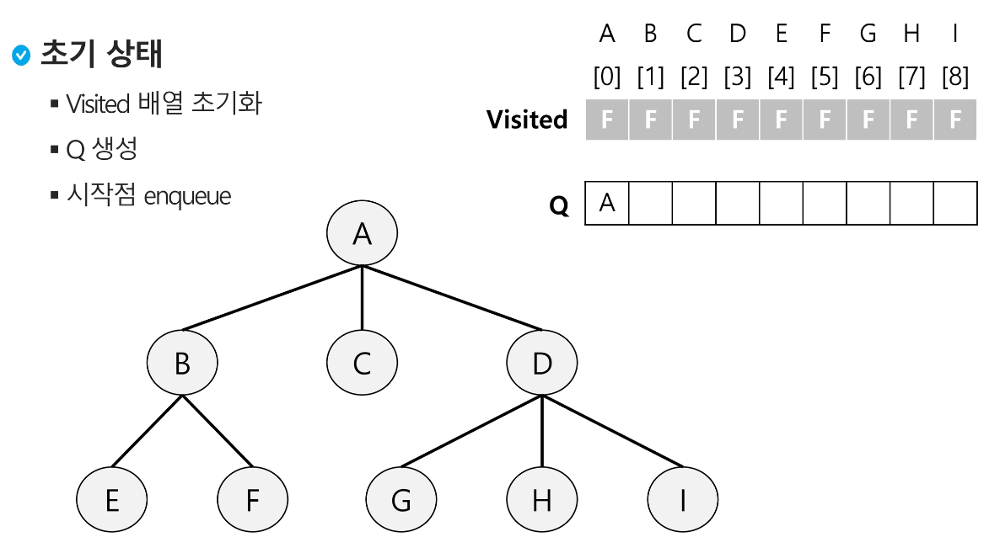
    
    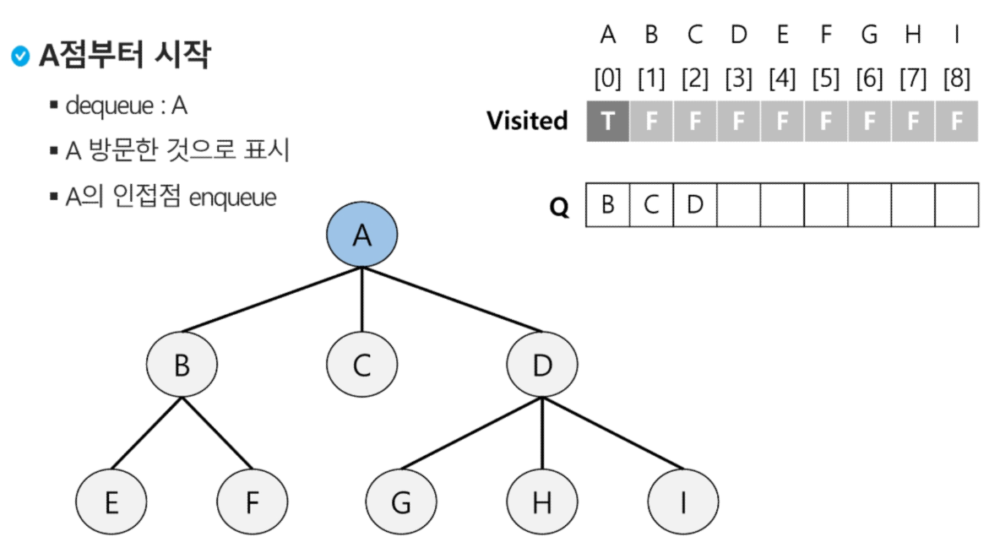
    
    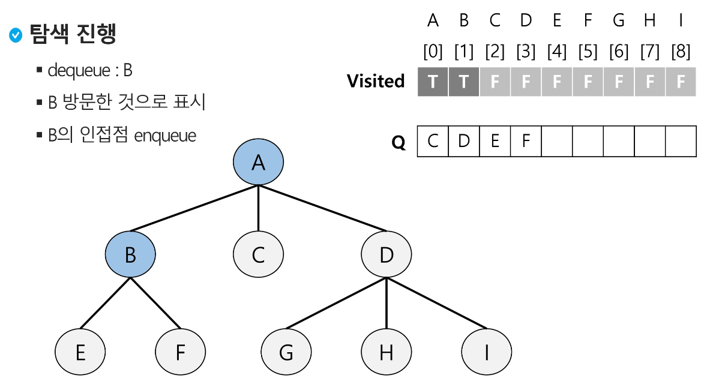
    
    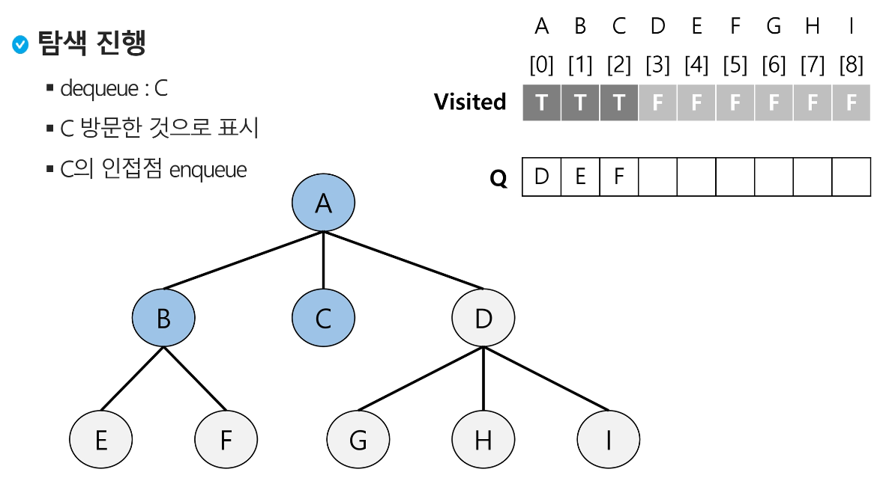
    
    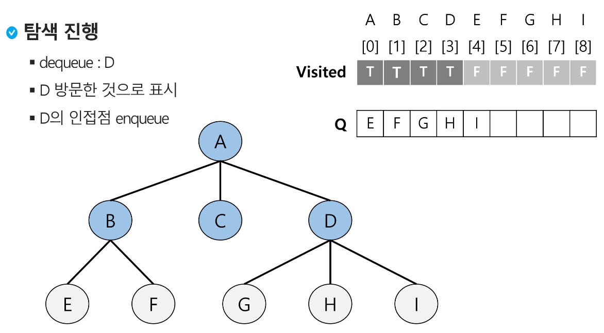
    
    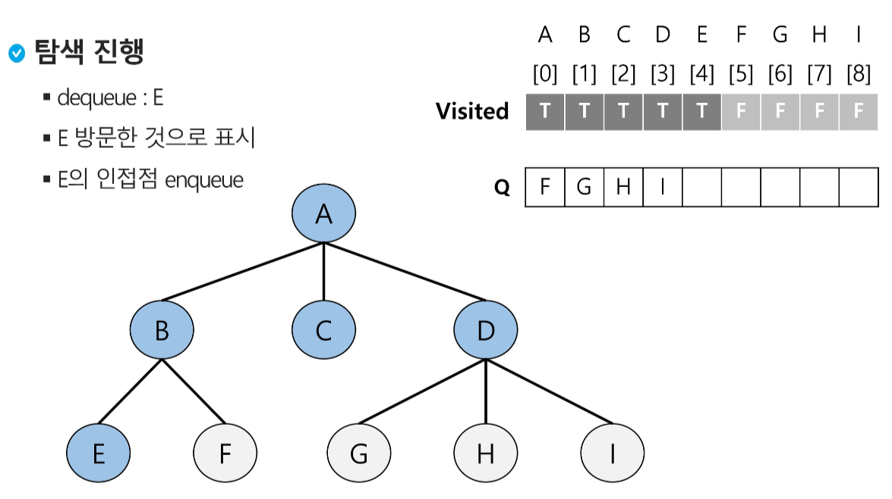
    
    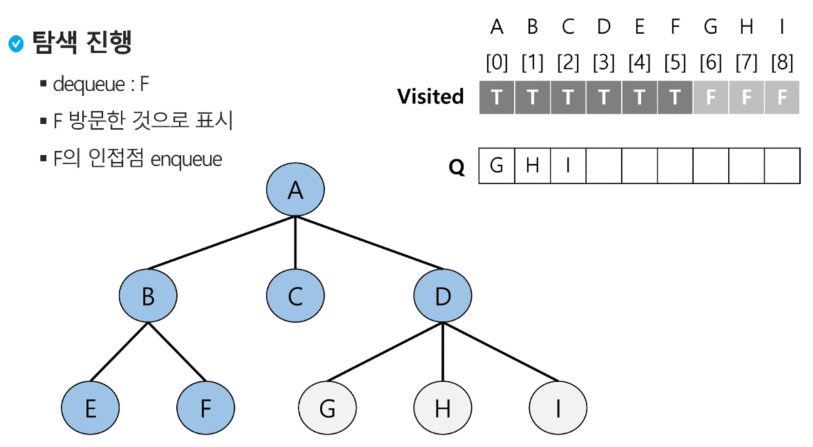
    
    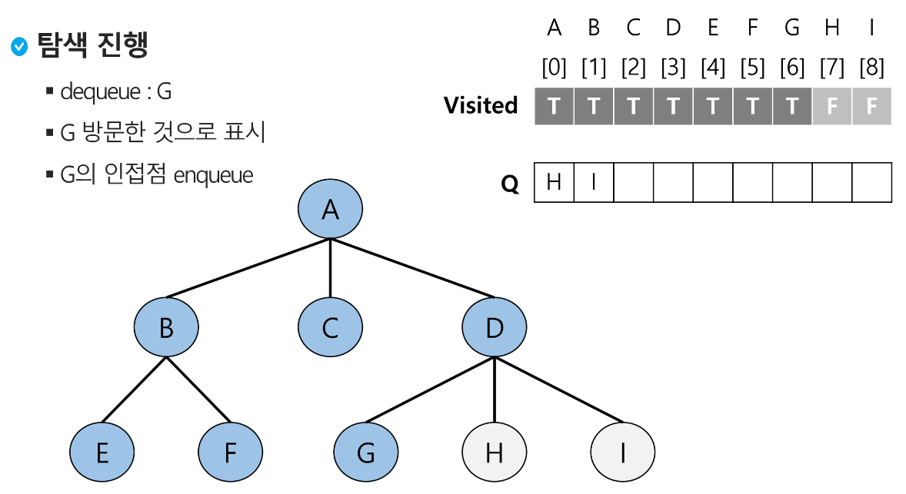
    
    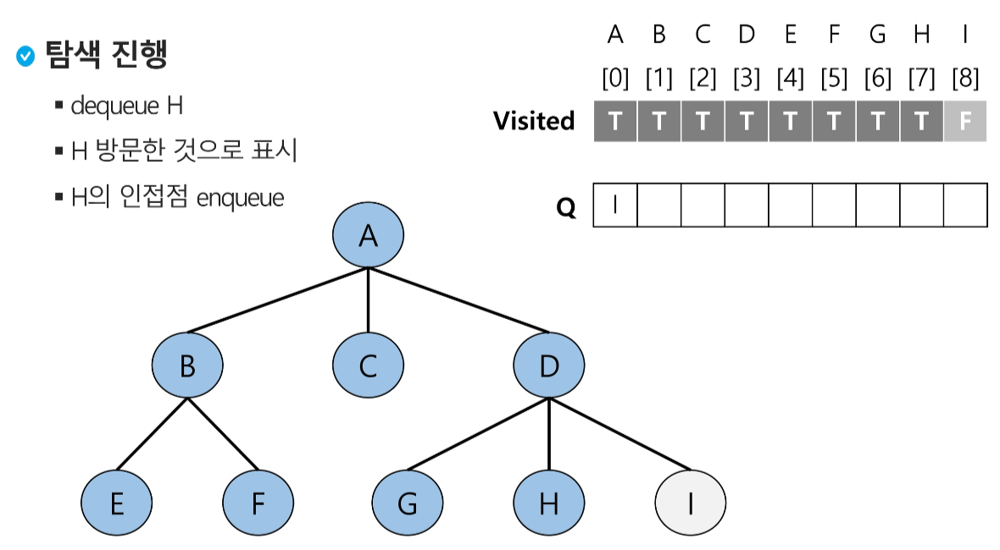
    
    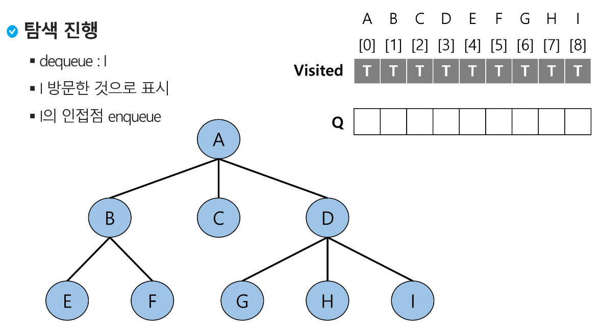
    
    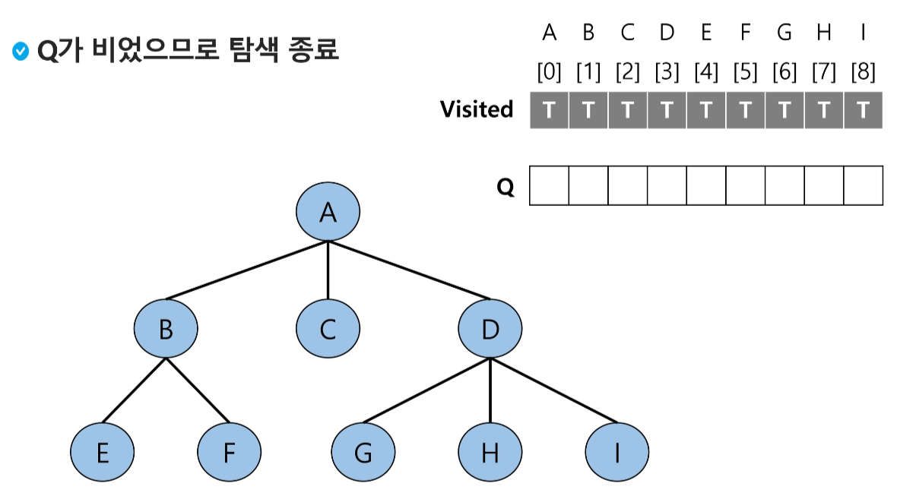
<br><br><br>    

---
