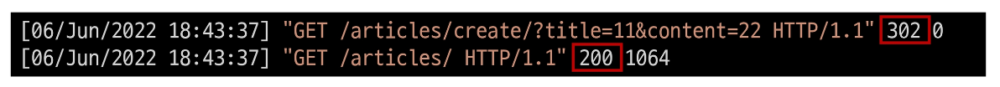

# **CRUD with view functions**

- 개요
    - 이전에 익힌 QuerySet API를 통해 view 함수에서 직접 CRUD 구현하기
<br><br><br>
---

### **1. 사전준비**

1. base 템플릿 작성
    - bootstrap CDN 및 템플릿 추가 경로 작성<br><br>
    
    ```html
    <!-- templates/base.html -->
    
    <!DOCTYPE html>
    <html lang="en">
    <head>
    	<meta charset="UTF-8">
      <meta http-equiv="X-UA-Compatible" content="IE=edge">
      <meta name="viewport" content="width=device-width, initial-scale=1.0">
      <!-- bootstrap CSS CDN -->
    	<title>Document</title>
    </head>
    <body>
        
        
    	<!-- bootstrap JS CDN -->
    </body>
    </html>
    ```
    
    ```python
    # settings.py
    
    TEMPLATES = [
        {
            ...,
            'DIRS': [BASE_DIR / 'templates',],
            ...,
    ]
    ```
<br><br>

2. url 분리 및 연결
    
    ```python
    # articles/urls.py
    
    from django.urls import path
    
    app_name = 'articles'
    urlpatterns = [
    ]
    ```
    
    ```python
    # crud/urls.py
    
    from django.contrib import admin
    from django.urls import path, include
    
    urlpatterns = [
    		path('admin/', admin.site.urls),
    		path('articles/', include('articles.urls')),
    ]
    ```
<br><br>

3. index 페이지 작성
    
    ```python
    # articles/urls.py
    
    from django.urls import path
    from . import views
    
    app_name = 'articles'
    urlpatterns = [
    		path('', views.indix, name='index'),
    ]
    ```
    
    ```python
    # articles/views.py
    
    def index(request):
    		return render(request, 'articles/index.html')
    ```
    
    ```html
    <!-- templates/articles/index.html -->
    
    
    
    
    	<h1>Articles</h1>
    
    ```
<br><br>
---    

### **2. READ 1 (index page)**

1. 전체 게시글 조회
    - index 페이지에서는 전체 게시글을 조회해서 출력한다.<br><br>
    
    ```python
    # articles/views.py
    
    from .models import Articles
    
    def index(request):
    		articles = Article.objects.all()
    		context = {
    			'articles': articles,
    		}
    		return render(request, 'articles/index.html', context)
    ```
    
    ```html
    <!--templates/articles/index.html-->
    
    
    
    
    	<h1>Articles</h1>
    	<hr>
    	
    		<p>글 번호: {{ article.pk }}</p>
    		<p>글 제목: {{ article.title }}</p>
    		<p>글 내용: {{ article.content }}</p>
    	
    
    ```
<br><br>
---    

### **3. CREATE**

1. 개요
    - CREATE 로직을 구현하기 위해서는 몇 개의 view 함수가 필요할까?<br>

        - 사용자의 입력을 받을 페이지를 렌더링하는 함수 1개
            - **“new” view function**
        - 사용자가 입력한 데이터를 전송 받아 DB에 저장하는 함수 1개
            - **”create” view function**
<br><br><br>

2. New
    
    ```python
    # articles/urls.py
    
    urlpatterns = [
    		path('', views.indix, name='index'),
    		path('new/', views.new, name='new'),
    ]
    ```
    
    ```python
    # articles/views.py
    
    def new(request):
    		return render(request, 'articles/new.html')
    ```
    
    ```html
    <!--templates/articles/new.html-->
    
    
    
    
    	<h1>NEW</h1>
    	<form action="#" method="GET">
    		<label for="title">Title: </label>
    		<input type="text" name="title"><br>
    		<label for="content">Content: </label>
    		<textarea name="content"></textarea><br>
    		<input type="submit">
    	</form>
    	<hr>
    	<a href="">[back]</a>
    
    ```
    <br>   
    - new 페이지로 이동할 수 있는 하이퍼링크 작성
    
    ```html
    <!--templates/articles/index.html-->
    
    
    
    
    	<h1>Articles</h1>
    	<a href="">NEW</a>
    	<hr>
    	...
    
    ```
<br><br><br>   

3. Create
    
    ```python
    # articles/urls.py
    
    urlpatterns = [
    		...
    		path('create/', views.create, name='create'),
    ]
    ```
    
    - 데이터를 생성하는 3가지 방법<br>

        
        ```python
        # articles/views.py
        
        def create(request):
        		title = request.GET.get('title')
        		content = request.GET.get('content')
        		
        		**# 데이터를 생성하는 3가지 방법**
        		# 1.
        		# article = Article()
        		# article.title = title
        		# article.content = content
        		# article.save()
        
        		# 2.
        		article = Article(title=title, content=content)
        		article.save()
        
        		# 3.
        		# Article.objects.create(title=title, content=content)
        
        		return render(request, 'articles/create.html')
        ```
        
        - 2번째 생성 방식을 사용하는 이유<br>

            - create 메서드가 더 간단해 보이지만 추후 데이터가 저장되기 전에 유효성 검사 과정을 거치게 될 예정<br>

            - 유효성 검사가 진행된 후에 save 메서드가 호출되는 구조를 택하기  위함
    - 게시글 작성 후 확인
        
        ```html
        <!--templates/articles/create.html-->
        
        
        
        
        	<h1>성공적으로 글이 작성되었습니다.</h1>
        
        ```
        
        ```html
        <!--templates/articles/new.html-->
        
        
        
        
        	<h1>NEW</h1>
        	<form action="" method="GET">
        		<label for="title">Title: </label>
        		<input type="text" name="title"><br>
        		<label for="content">Content: </label>
        		<textarea name="content"></textarea><br>
        		<input type="submit">
        	</form>
        	<hr>
        	<a href="">[back]</a>
        
        ```
        
    - 게시글 작성 후 index 페이지로 돌아가도록 함
        
        ```python
        # articles/views.py
        
        def create(request):
        		...
        		return render(request, 'articles/index.html')
        ```
<br><br>        
    
4. 2가지 문제점 발생
    - 게시글 작성 후 index 페이지가 출력되지만 게시글은 조회되지 않음<br>

        - create 함수에서 index.html 문서를 렌더링할 때 context 데이터와 함께 렌더링 하지 않았기 때문<br>

        - index 페이지 url로 다시 요청을  보내면 정상적으로 출력됨
    - 게시글 작성 후 URL은 여전히 create에 머물러 있음
        - index view 함수를 통해 렌더링된 것이 아니기 때문<br>

        - index view 함수의 반환 값이 아닌 단순히 index 페이지만 render 되었을 뿐
<br><br><br>

5. Django shortcut function - **“redirect()”**
    - 인자에 작성된 곳으로 요청을 보냄<br>

    - 사용 가능한 인자
        - view name (URL pattern name)
            
            `return redirect('articles:index')`
            
        - absolute or relative URL
            
            `return redirect('/articles/')`
            
    - 동작 확인 후 불필요해진 create.html은 삭제
        
        ```python
        # articles/views.py
        
        from django.shortcuts import render, redirect
        
        def create(request):
        		title = request.GET.get('title')
        		content = request.GET.get('content')
        
        		article = Article(title=title, content=content)
        		article.save()
        
        		# return redirect('/articles/')
        		return redirect('articles:index')
        ```
<br><br>

6. redirect 동작 이해하기
    - 게시글 작성 후 터미널 로그 확인하기<br>

        
        
        
    - 동작 원리
        - 클라이언트가 create url로 요청을 보냄<br>

        - create view 함수의 redirect 함수가 302 status code를 응답
        - 응답 받은 브라우저는 redirect 인자에 담긴 주소(index)로 사용자를 이동시키기 위해 index url로 Django에 재요청
        - index page를 정상적으로 응답 받음 (200 status code)
<br><br><br>

7. \[참고] 302 Found
    - HTTP response status code 중 하나<br>

    - 해당 상태 코드를 응답 받으면 브라우저는 사용자를 해당 URL의 페이지로 이동 시킴
<br><br><br>

8. HTTP response status code
    - 클라이언트에게 특정 HTTP **요청이 성공적으로 완료되었는지 여부**를 알려줌<br>

    - 응답은 5개읭 그룹으로 나뉘어짐
        - Informational responses (1xx)<br>

        - Successful responses (2xx)
        - Redirection messages (3xx)
        - Client error responses (4xx)
        - Server error responses (5xx)
<br><br><br>

9. HTTP method GET 재검토
    - 현재는 게시글이 작성될 때 **/articles/create/?title=11&content=22** 와 같은 URL로 요청이 보내짐<br>

    - GET은 쿼리 스트링 파라미터로 데이터를 보내기 때문에 url을 통해 데이터를 보냄
    - 하지만 현재 요청은 데이터를 조회하는 것이 아닌 작성을 원하는 요청
    - GET이 아닌 다른 HTTP method를 알아보기
<br><br><br>

10. HTTP request GET
    - HTTP는 request method를 정의하여, 주어진 리소스에 수행하길 원하는 행동을 나타냄<br>

    - GET
        - 특정 리소스를 가져오도록 요청할 때 사용<br>

        - 반드시 데이터를  가져올 때만 사용해야 함
        - DB에 변화를 주지 않음
        - CRUD에서 R 역할을 담당
    - POST
        - 서버로 데이터를 전송할 때 사용<br>

        - 서버에 변경사항을 만듦
        - 리소스를 생성/변경하기 위해 데이터를 HTTP body에 담아 전송
        - GET의 쿼리 스트링 파라미터와 다르게 URL로 보내지지 않음
        - CRUD에서 C/U/D 역할을 담당
<br><br><br>

11. POST method 적용하기
    - 실제 네이버에서 로그인 부분을 확인하기<br>

    - 로그인 부분에서 GET이 아닌 POST를 사용하고 있음
        
        
        
    - 그럼 왜 검색에서는 GET을 사용할까?
        - 검색은 서버에 영향을 미치는 것이 아닌 특정 데이터를 조회만 하는 요청이기 때문<br>

        - 특정 페이지를 조회하는 요청을 보내는 HTML의 a tag 또한 GET을 사용
    - 코드를 변경하고 URL에서 쿼리 스트링 파라미터가 없어진 것을 확인해보기
        
        ```html
        <!--templates/articles/new.html-->
        
        
        
        
        	<h1>NEW</h1>
        	<form action="" method="POST">
        		<label for="title">Title: </label>
        		<input type="text" name="title"><br>
        		<label for="content">Content: </label>
        		<textarea name="content"></textarea><br>
        		<input type="submit">
        	</form>
        	<hr>
        	<a href="">[back]</a>
        
        ```
        
    - 게시글 작성 후 서버로그 확인하기
        
        
        
        - 403 Forbidden 응답을 받았지만 이는 나중에 확인하고 요청된 URL(/articles/create/)을 확인<br>

            - 개발자도구 - NETWORK 탭 - Payload 탭의 Form-Data 확인
                
                
                
    - 데이터가 담긴 위치가 바뀌었기 때문에 view 함수에서도 다음과 같이 수정 필요
        
        ```python
        # articles/views.py
        
        def create(request):
        		title = request.POST.get('title')
        		content = request.POST.get('content')
        
        		article = Article(title=title, content=content)
        		article.save()
        		return redirect('articles:index')
        ```
<br><br>

12. HTTP methods 정리
    - GET은 단순히 조회하려는 경우 & POST는 서버나 DB에 변경을 요청하는 경우<br>

    - TMDB API나 다른 API 문서에서 봤던 요청 예시 문서에서 등장했던 친구들이 바로 HTTP methods였음
<br><br><br>

13. \[참고] 403 Forbidden
    - 서버에 요청이 전달되었지만, 권한 때문에 거절되었다는 것을 의미<br>

    - 서버에 요청은 도달했으나 서버가 접근을 거부할 때 반환됨
    - 즉, 게시글을 작성할 권한이 없다 → Django 입장에서는 “작성자가 누구인지 모르기 때문에 함부로 작성할 수 없다”라는 의미
    - 모델(DB)을 조작하는 것은 단순 조회와 달리 최소한의 신원 확인이 필요하기 때문
<br><br><br>

14. CSRF
    - Cross-Site-Request-Forgery<br>

    - “사이트 간 요청 위조”
    - 사용자가 자신의 의지와 무관하게 공격자가 의도한 행도응ㄹ 하여 특정 웹페이지를 보안에 취약하게 하거나 수정, 삭제 등의 작업을 하게 만드는 공격 방법
<br><br><br>

15. CSRF 공격 방어
    - “Security Token 사용 방식 (CSRF Token)”<br>

        - 사용자의 데이터에 임의의 난수 값(token)을 부여해 매 요청마다 해당 난수 값을 포함시켜 전송 시키도록 함<br>

        - 이후 서버에서 요청을 받을 때마다 전달된 token 값이 유효한지 검증
        - 일반적으로 데이터 변경이 가능한 POST, PATCH, DELETE Method 등에 적용
        - Django는 DTL에서 csrf_token 템플릿 태그를 제공
<br><br><br>

16. csrf_token 템플릿 태그
    
    ``
    
    - 해당 태그가 없다면 Django 서버는 요청에 대해 403 forbidden으로 응답<br>

    - 템플릿에서 내부 URL로 향하는 Post form을 사용하는 경우에 사용
        - 외부 URL로 향하는 POST form에 대해서는 CSRF 토큰이 유출되어 취약성을 유발할 수 있기 때문에 사용해서는 안됨<br>

    - 태그 작성 후 확인하기
    - input type이 hidden으로 작성되며 value는 Django에서 생성한 hash 값으로  설정
        
        ```html
        <!--templates/articles/new.html-->
        
        
        
        
        	<h1>NEW</h1>
        	<form action="" method="POST">
        		
        		...
        	</form>
        	<hr>
        	<a href="">[back]</a>
        
        ```
<br><br>

17. csrf_token 템플릿 태그 정리
    - 마지막으로 게시글을 작성하고 문제없이 저장되는지 확인하기<br>

    - “csrf_token은 해당 POST 요청이 내가 보낸 것인지를 검증하는 것”
<br><br><br>
---

### **4. READ 2 (detail page)**

1. 개요
    - 개별 게시글 상세 페이지 제작<br>

    - 모든 게시글 마다 뷰 함수와 템플릿 파일을 만들 수는 없음
        - 글의 번호(pk)를 활용해서 하나의 뷰 함수와 템플릿 파일로 대응
    - 무엇을 활용할 수 있을까?
        - Variable Routing
<br><br><br>

2. urls
    - URL로 특정 게시글을 조회할 수 있는 번호를 받음
        
        ```python
        # articles/urls.py
        
        urlpatterns = [
        		...
        		path('<int:pk>', views.detail, name='detail'),
        ]
        ```
<br><br>        
    
3. views
    - Article.objects.get(pk=pk)에서 오른쪽 pk는 variable routing을 통해 받은 pk, 왼쪽 pk는 DB에 저장된 레코드의 id 컬럼
        
        ```python
        # articles/views.py
        
        def detail(request, pk):
        		article = Article.objects.get(pk=pk)
        		content = {
        				'article': article,
        		}
        		return render(request, 'articles/detail.html', context)
        ```
<br><br>

4. templates
    
    ```html
    <!--templates/articles/detail.html-->
    
    
    
    
    	<h2>DETAIL</h2>
    	<h3>{{ article.pk }} 번째 글</h3>
    	<hr>
    	<p>제목: {{ article.title }}</p>
    	<p>내용: {{ article.content }}</p>
    	<p>작성 시각: {{ article.created_at }}</p>
    	<p>수정 시각: {{ article.updated_at }}</p>
    	<hr>
    	<a href="">[back]</a>
    
    ```
    
    ```html
    <!--templates/articles/index.html-->
    
    
    
    
    <h1>Articles</h1>
    <a href="">[NEW]</a>
    <hr>
    
    ...
    <a href="">[detail]</a>
    <hr>
    
    
    ```
<br><br>

5. redirect 인자 변경
    
    ```python
    # articles/views.py
    
    def create(request):
    		...
    			return redirect('articles:detail', article.pk)
    ```
<br><br>
---    

### **5. DELETE**

1. urls
    - 모든 글을 삭제하는 것이 아니라 삭제하고자 하는 특정 글을 조회 후 삭제해야 함
        
        ```python
        # articles/urls.py
        
        urlpatterns = [
        		...
        		path('<int:pk>/delete/', views.delete, name='delete'),
        ]
        ```
        
        ```python
        # articles/views.py
        
        def delete(request, pk):
        		article = Article.objects.get(pk=pk)
        		article.delete()
        		return redirect('articles:index')
        ```
<br><br>

2. templates
    - Detail 페이지에 작성하며 DB에 영향을 미치기 때문에 POST method를 사용
        
        ```html
        <!--templates/articles/detail.html-->
        
        
        
        
        	...
        	<form action="" method="POST">
        		
        		<input type="submit" value="DELETE">
        	</form>
        	<a href="">[back]</a>
        
        ```
<br><br>
---        

### **6. UPDATE**

1. 개요
    - 수정은 CREATE 로직과 마찬가지로 2개의 view 함수가 필요<br>

    - 사용자의 입력을 받을 페이지를 렌더링하는 함수 1개
        - “edit” view function
    - 사용자가 입력한 데이터를 전송 받아 DB에 저장하는 함수 1개
        - “update” view function
<br><br><br>

2. Edit - url & views
    
    ```python
    # articles/urls.py
    
    urlpatterns = [
    		...
    		path('<int:pk>/edit/', views.edit, name='edit'),
    ]
    ```
    
    ```python
    # articles/views.py
    
    def edit(request, pk):
    		article = Article.objects.get(pk=pk)
    		context = {
    				'article': article,
    		}
    		return render(request, 'articles/edit.html', context)
    ```
<br><br>

3. Edit - templates
    - html 태그의 value 속성을 사용해 기존에 입력되어 있던 데이터를 출력<br>

        - textarea 태그는 value 속성이 없으므로 태그 내부 값으로 작성해야 한다.
            
            ```html
            <!-- articles/edit.html-->
            
            
            
            
            	<h1>EDIT</h1>
            	<form action="#" method="POST">
            		
            		<label for="title">Title: </label>
            		<input type="text" name="title" value="{{ article.title }}"><br>
            		<label for="content">Content: </label>
            		<textarea name="content" cols="30" rows="5">{{ article.content }}</textarea><br>
            		<input type="submit">
            	</form>
            	<hr>
            	<a href="">[back]</a>
            
            ```
            
    - Edit 페이지로 이동하기 위한 하이퍼링크 작성
        
        ```html
        <!-- articles/detail.html-->
        
        
        
        
        	<h2>DETAIL</h2>
        	<h3>{{ article.pk }} 번째 글</h3>
        	<hr>
        	<p>제목: {{ article.title }}</p>
        	<p>내용: {{ article.content }}</p>
        	<p>작성 시각: {{ article.created_at }}</p>
        	<p>수정 시각: {{ article.updated_at }}</p>
        	<hr>
        	<a href="">EDIT</a><br>
        	<form action="" method="POST">
        		
        		<input type="submit" value="DELETE">
        	</form>
        	<a href="">[back]</a>
        
        ```
<br><br>

4. Update 로직 작성
    
    ```python
    # articles/urls.py
    
    urlpatterns = [
    		...
    		path('<int:pk>/update/', views.update, name='update'),
    ]
    ```
    
    ```python
    # articles/views.py
    
    def update(request, pk):
    		article = Article.objects.get(pk=pk)
    		article.title = request.POST.get('title')
    		article.content = request.POST.get('content')
    		article.save()
    		return redirect('article:detail', article.pk)
    ```
    
    ```html
    <!-- articles/edit.html-->
    
    
    
    
    	<h1>EDIT</h1>
    	<form action="" method="POST">
    		
    		...
    	<a href="">[back]</a>
    
    ```
<br><br>

---
