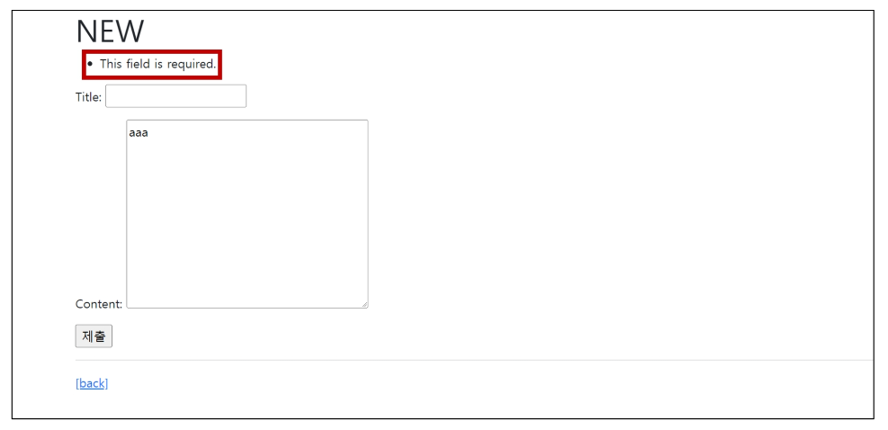

# **Django ModelForm**

1. 개요
    - Form Class를 작성하면서 든 생각<br>

        - “Model이랑 너무 중복되는 부분이 많은 것 같은데?”<br>

    - 이미 Article Model Class에 필드에 대한 정보를 작성했는데 이를 Form에 맵핑하기 위해 Form Class에 필드를 재정의 해야만 했음
    - ModeForm을 사용하면 이러한 Form을 더 쉽게 작성할 수 있음
<br><br><br>

2. ModelForm Class
    - Model을 통해 Form Class를 만들 수 있는 helper class<br>

    - ModelForm은 Form과 똑같은 방식으로 View 함수에서 적용
<br><br><br>

3. ModelForm 선언
    - forms 라이브러리에서 파생된 ModelForm 클래스를 상속받음<br>

    - 정의한 ModelForm 클래스 안에 Meta 클래스를 선언
    - 어떤 모델을 기반으로 form을 작성할 것인지에 대한 정보를 Meta 클래스에 지정
    
    ```python
    # articles/forms.py
    
    from django import forms
    from .models import Article
    
    class ArticleForm(forms.ModelForm):
    
    		class Meta:
    				model = Article
    				fields= '__all__'
    ```
    
    → 기존 ArticleForm은 주석처리
<br><br><br>

4. ModelForm에서 Meta Class
    - ModelForm의 정보를 작성하는 곳<br>

    - ModelForm을 사용할 경우 참조할 모델이 있어야 하는데, Meta class의 model 속성이 이를 구성함
        - 참조하는 모델에 정의된 field 정보를 Form에 적용함<br>

            
            ```python
            class Meta:
            		model = Article
            		fields= '__all__'
            ```
            
    - field 속성에 ‘\__all__’를 사용하여 모델의 모든 필드를 포함할 수 있음<br>

    - 또는 exclude 속성을 사용하여 모델에서 포함하지 않을 필드를 지정할 수 있음
    
    ```python
    # articles/forms.py
    
    class ArticleForm(forms.ModelForm):
    		
    		class Meta:
    				model = Article
    				field = '__all__'
    ```
    
    ```python
    # articles/forms.py
    
    class ArticleForm(forms.ModelForm):
    
    		class Meta:
    				model = Article
    				exclude = ('title',)
    ```
    
    → fields와 exclude를 함께 작성해도 되나 권장하지 않음
<br><br><br>

5. \[참고] Meta data
    - “데이터를 표현하기 위한 데이터”<br>

    - 예시 - “사진 파일”
        - 사진 데이터
        - 사진 데이터의 데이터(촬영 시각, 렌즈, 조리개 값 등)
        - 사진 데이터에 대한 데이터==사진의 Meta data)
<br><br><br>

6. \[참조] 참조 값과 반환 값
    - 호출하지 않고 이름만 작성하는 이 방식은 어떤 의미일까<br>

        
        ```python
        # articles/forms.py
        
        class ArticleForm(forms.ModelForm):
        
        		class Meta:
        				model = **Article**
        				fields = '__all__'
        ```
    <br>

    - 함수를 예시로 들면 아래와 같은 함수가 있을 때 함수의 이름을 그대로 출력하는 것과 호출 후의 결과를 비교<br>

        ```python
        def greeting():
        		return '안녕하세요'
        
        print(greeting)  # <function greeting at 0x10761caf0>
        print(greeting())  # 안녕하세요
        ```
        
        - 첫번재 결과는 함수의 **참조 값**을 출력<br>

        - 두번째 결과는 함수의 **반환 값**을 출력<br><br>

    - 언제 참조 값을 사용할까?<br>
        - 함수를 호출하지 않고 함수 자체를 그대로 전달하여, 다름 함수에서 **“필요한 시점에”** 호출하는 경우
            
            ```python
            urlpatterns = [
            		path('', **views.index**, name='index'),
            ]
            ```
            
        - view 함수의 참조 값을 그대로 넘김으로써, path 함수가 내부적으로 해당 view 함수를 “필요한 시점에”  사용하기 위해서<br><br>

    - 결국 클래스도 마찬가지<br>

    - Article이라는 클래스를 “출하지 않고 (== model을 인스턴스로 만들지 않고)” 작성하는 이유는 ArticleForm이 해당 클래스를 필요한 시점에 사용하기 위함
    - 더불어 이 경우에는 인스턴스가 필요한 것이 아닌, 실제 Article 모델의 참조 값을 통해 클래스의 필드나 속성 등을 내부적으로 참조하기 위한 이유도 있음
        
        ```python
        class ArticleForm(forms.ModelForm):
        
        		class Meta:
        				model = Article
        				fields = '__all__'
        ```
<br><br>        
    
7. 주의사항
    - Meta 클래스는 왜 여기서 작성할까…<br>

    - 클래스 안에 클래스..? 파이썬에서는 Inner class 혹은 Nested class라고 하는데…
    - 이건 지금 시점에 중요한 것이 아님
        - 파이썬의 문법적 개념으로 접근하지 말 것
    - 단순히 모델 정보를 Meta라는 이름의 내부 클래스로 작성하도록 ModelForm의 설계가 이렇게 되어있을 뿐 우리는 ModelForm의 역할과 사용법을 숙지해야 함
<br><br><br>
---

### **1. ModelForm with view functions**

1. 개요
    - ModelForm으로 인한 view 함수의 구조 변화 알아보기
<br><br><br>

2. CREATE
    - 유효성 검사를 통과하면<br>

        - 데이터 저장 후<br>

        - 상세 페이지로 리다이렉트
    - 통과하지 못하면
        - 작성 페이지로 리다이렉트<br><br>
    
    ```python
    # articles/views.py
    
    def create(request):
    		form = ArticleForm(request.POST)
    		if form.is_valid():
    				article = form.save()
    				return redirect('article:detail', article.pk)
    		return redirect('article:new')
    ```
<br><br>

3. “is_valid()” method
    - 유효성 검사를 실행하고, 데이터가 유효한지 여부를 boolean으로 반환<br>

    - 데이터 유효성 검사를 보장하기 위한 많은 테스트에 대해 Django는 `is_valid()`를 제공하여 개발자읜 편의를 도움
<br><br><br>

4. form 인스턴스의 errors 속성
    - is_valid()의 반환 값이 False인 경우 form 인스턴스의 errors 속성에 값이 작성되는데, 유효성 검증을 실패한 원인이 딕셔너리 형태로 저장됨<br>
        
        ```python
        # articles/views.py
        
        def create(request):
        		form = ArticleForm(request.POST)
        		if form.is_valid():
        				article = form.save()
        				return redirect('articles:detail', article.pk)
        		**print(f'에러: {form.errors}')**
        		return redirect('articles:new')
        ```
        
    - title에 공백을 넣고 제출해보기
        
        
        
    - 이 같은 특징을 통해 다음과 같은 구조로 코드를 작성하면 유효성 검증을 실패했을 때 사용자에게 실패 결과 메세지를 출력해줄 수 있음
        
        ```python
        # articles/views.py
        
        def create(request):
        		form = ArticleForm(request.POST)
        		if form.is_valid():
        				article = form.save()
        				return redirect('articles:detail', article.pk)
        		**context = {
        				'form': form,
        		}
        		return render(request, 'articles/new.html', context)**
        ```
<br><br>

    
5. The “save()” method
    - form 인스턴스에 바인딩 된 데이터를 통해 데이터베이스 객체를 만들고 저장<br>

    - ModelForm의 하위 클래스는 키워드 인자 instance 여부를 통해 생성할지, 수정할지를 결정함
        - 제공되지 않은 경우 save()는 지정된 모델의 새 인스턴스를 만듦(CREATE)<br>

        - 제공되면 save()는 해당 인스턴스를 수정(UPDATE)
    
    ```python
    # CREATE
    form = ArticleForm(request.POST)
    form.save()
    
    # UPDATE
    form = ArticleForm(request.POST, instance=article)
    form.save()
    ```
<br><br>

6. UPDATE
    - ModelForm의 인자 instance는 수정 대상이 되는 객체(기존 객체)를 지정<br>

        - `request.POST`
            - 사용자가 form을 통해 전송한 데이터 (새로운 데이터)
        - `instance`
            - 수정이 되는 대상
    - edit - view 수정
        
        ```python
        # articles/views.py
        
        def edit(request, pk):
        		article = Article.objects.get(pk=pk)
        		**form = ArticleForm(instance=article)**
        		context = {
        				'article': article,
        				**'form': form,**
        		}
        		return render(request, 'articles/edit.html', context)
        ```
        
    - edit - template 수정
        
        ```html
        <!-- articles/edit.html -->
        
        
        
        
        	<h1>EDIT</h1>
        	<form action="" method="POST">
        		
        		**{{ form.as_p }}**
        		<input type="submit">
        	</form>
        	<hr>
        	<a href="">[back]</a>
        
        ```
        
    - update - view 수정
        
        ```python
        # articles/views.py
        
        def update(request, pk):
        		article = Article.objects.get(pk=pk)
        		form = ArticleForm(request.POST, instance=article)
        		if form.is_valid():
        				form.save()
        				return redirect('articles:detail', article.pk)
        		context = {
        				'form': form,
        				'article': article,
        		}
        		return render(request, 'articles/edit.html', context)
        ```
<br><br>

    
7. \[참고] ModelForm 키워드 인자 data와 instance 살펴보기
    - [https://github.com/django/django/blob/7bdd09d016f418719f2d0297f58bd81c5349101d/django/forms/models.py#L286](https://github.com/django/django/blob/7bdd09d016f418719f2d0297f58bd81c5349101d/django/forms/models.py#L286)
    
    ```python
    class BaseModelForm(BaseForm):
    		def __init__(self, **data=None**, files=None, auto_id='id_%s', prefix=None, initial=None, error_class=ErrorList, label_suffix=None, empty_permited=False, **instance=None**, use_required_attribute=None, renderer=None):
    
    ```
<br><br>

8. Form과 ModelForm
    - ModelForm이 Form보다 더 좋은 것이 아니라 각자 역할이 다른 것<br>

    - **Form**
        - 사용자로부터 받은 데이터가 DB와 연관되어 있지 않는 경우에 사용<br>
        
        - DB에 영향을 미치지 않고 단순 데이터만 사용되는 경우
            - 예시 - 로그인, 사용자의 데이터를 받아 인증 과정에서만 사용 후 별도로 DB에 저장하지 않음
    - **ModelForm**
        - 사용자로부터 받은 데이터가 DB와 연관되어 있는 경우에 사용
        - 데이터의 유효성 검사가 끝나면 데이터를 각각 어떤 레코드에 맵핑해야 할지 이미 알고 있기 때문에 곧바로 save() 호출이 가능
<br><br><br>
---

### **2. Widgets 활용하기**

1. 위젯을 작성하는 2가지 방법
    - 오른쪽 작성 방식을 권장
    
    ```python
    class ArticleForm(forms.ModelForm):
    
    		class Meta:
    				model = Article
    				fields = '__all__'
    				widgets = {
    						'title': forms.TextInput(attrs={
    								'class': 'title',
    								'placeholder': 'Enter the title',
    								'maxlength': 10,
    								}
    						)
    				}
    ```
    
    ```python
    # articles/forms.py
    
    class ArticleForm(forms.ModelForm):
    		title = forms.CharField(
    				label='제목',
    				widget=forms.TextInput(
    						attrs={
    								'class': 'my-title',
    								'placeholder': 'Enter the title',
    						}
    				),
    		)
    
    		class Meta:
    				model = Article
    				fields = '__all__'
    ```
<br><br>

2. Widgets 활용하기
    
    ```python
    # articles/forms.py
    
    class ArticleForm(forms.ModelForm):
    		title = forms.CharField(
    				label='제목',
    				widget=forms.TextInput(
    						attrs={
    								'class': 'my-title',
    								'placeholder': 'Enter the title',
    								'maxlength': 10,
    						}
    				),
    		)
    		content = forms.CharField(
    				label='내용',
    				widget=forms.Textarea(
    						attrs={
    								'class': 'my-content',
    								'placeholder': 'Enter the content',
    								'rows': 5,
    								'cols': 50,
    						}
    				),
    				error_messages={
    						'required': 'Please enter your content'
    				}
    		)
    
    		class Meta:
    				model = Article
    				fields = '__all__'
    ```
<br><br>    

---
