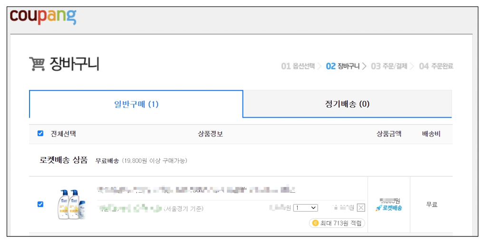
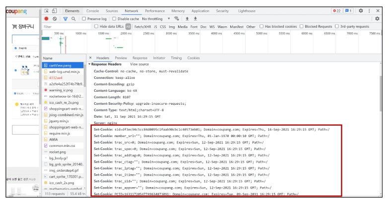
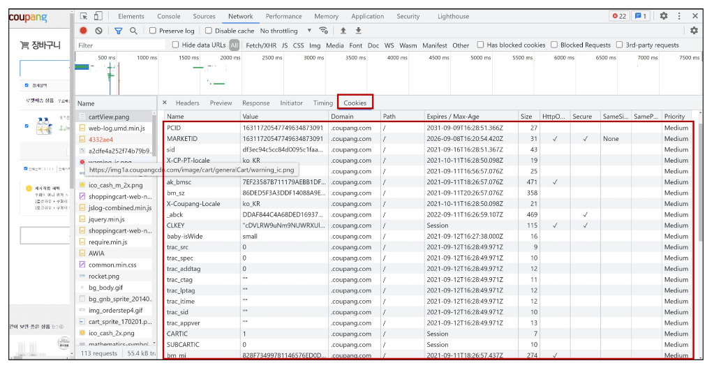
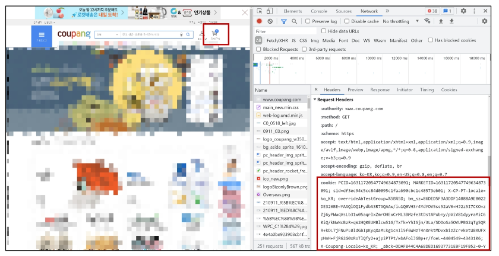
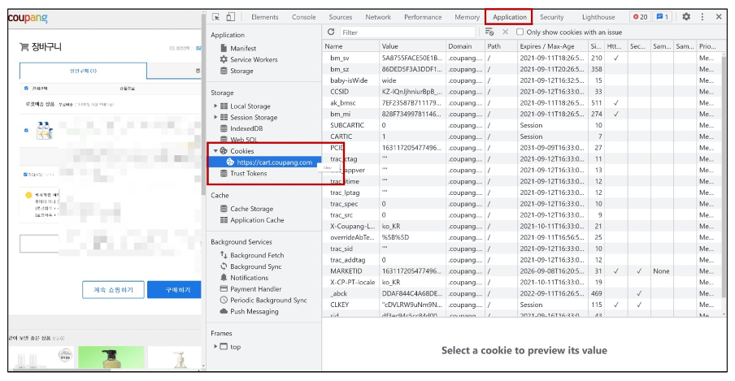
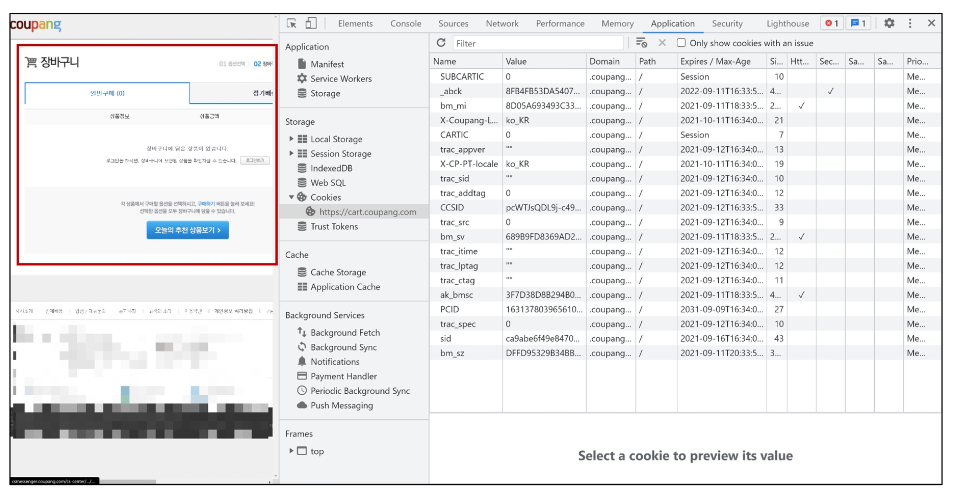

# **HTTP Cookies**

- 개요
    - 로그인과 로그아웃을 이해하기 전에 반드시 알아야하는 HTTP Cookies에 대해 먼저 알아보기
   
---

### **1. HTTP**

1. HTTP
    - Hyper Text Transfer Protocol 

    - HTML 문서와 같은 리소스들을 가져올 수 있도록 해주는 프로토콜(규칙, 규약)
    - 웹(WWW)에서 이루어지는 모든 데이터 교환의 기초
    - 클라이언트 - 서버 프로토콜이라고도 부름
   

2. 요청과 응답
    - **요청 (requests)**
        - 클라이언트(브라우저)에 의해 전송되는 메시지
    - **응답 (response)**
        - 서버에서 응답으로 전송되는 메시지
   

3. HTTP 특징
    - **비 연결 지향(connectionless)** 

        - 서버는 요청에 대한 응답을 보낸 후 연결을 끊음 

            - 예를 들어 우리가 네이버 메인 페이지를 보고 있을 때 우리는 네이버 서버와 연결되어 있는 것이 아님 

            - 네이버 서버는 우리에게 메인 페이지를 응답하고 연결을 끊은 것
    - **무상태(stateless)**
        - 연결을 끊는 순간 클라이언트와 서버 간의 통신이 끝나며 상태 정보가 유지되지 않음 

        - 클라이언트와 서버가 주고받는 메시지들은 서로 완전히 독립적
   

4. 어떻게 로그인 상태를 유지할까?
    - 그런데 우리가 로그인을 하고 웹 사이트를 사용할 때 페이지를 이동해도 로그인 “상태”가 유지됨 

    - 서버와 클라이언트 간 지속적인 상태 유지를 위해 **“쿠키와 세션”**이 존재
   
---

### **2. 쿠키(Cookie)**

1. 개요
    - HTTP 쿠키는 **상태가 있는 세션**을 만들도록 해 줌
   

2. 개념
    - 서버가 사용자의 웹 브라우저에 전송하는 작은 데이터 조각이다. 

    - 사용자가 웹사이트를 방문할 경우 해당 웹사이트의 서버를 통해 사용자의 컴퓨터에 설치되는 작은 기록 정보 파일
        - 브라우저(클라이언트)는 쿠키를 로컬에 KEY-VALUE의 데이터 형식으로 저장 

        - 이렇게 쿠키를 저장해 놓았다가, **동일한 서버에 재요청 시 저장된 쿠키를 함께 전송**
    - 쿠키는 두 요청이 동일한 브라우저에서 들어왔는지 아닌지를 판단할 때 주로 사용됨
        - 이를 이용해 사용자의 로그인 상태를 유지할 수 있음 

        - 상태가 없는(stateless) HTTP 프로토콜에서 상태 정보를 기억 시켜 주기 때문
    - 즉, 웹 페이지에 접속하면 웹 페이지를 응답한 서버로부터 쿠키를 받아 브라우저에 저장하고, 클라이언트가 같은 서버에 재요청 시마다 요청과 함께 저장해 두었던 쿠키도 함께 전송
   

3. 쿠키 사용 예시
    - 사원증 생각하기
    
    
   

4. 쿠키 사용 목적
    - 세션 관리 (Session management)
        - 로그인, 아이디 자동완성, 공지 하루 안 보기, 팝업 체크, 장바구니 등의 정보 관리
    - 개인화 (Personalization)
        - 사용자 선호, 테마 등의 설정
    - 트래킹(Tracking)
        - 사용자 행동을 기록 및 분석
   

5. 쿠키를 이용한 장바구니 예시
    - 장바구니에 상품 담기 

        
        
        
    - 개발자 도구 - Network 탭 - cartView.pang 확인
    - 서버는 응답과 함께 Set-Cookie 응답 헤더를 브라우저에게 전송
    - 이 헤더는 클라이언트에게 쿠키를 저장하라고 전달
        
        
        
    - Cookie 데이터 자세히 확인
        
        
        
    - 메인 페이지 이동 - 장바구니 유지 상태 확인
    - 서버로 전송되는 모든 요청에 브라우저는 Cookie HTTP 헤더를 사용해 서버로 이전에 저장했던 모든 쿠키들을 함께 전송 (장바구니 정보를 매 요청마다 보내는 것)
        
        
        
    - 개발자 도구 - Application 탭 - Cookies
    - 마우스 우측 버튼 - Clear 후 새로고침
        
        
        
    - 빈 장바구니로 변경된 것을 확인
        
        
           
    
6. 세션 (Session)
    - 사이트와 특정 브라우저 사이의 “state(상태)”를 유지시키는 것 

    - 클라이언트가 서버에 접속하면 서버가 특정 session id를 발급하고, 클라이언트는 session id를 쿠키에 저장
        - 클라이언트가 다시 동일한 서버에 접속하면 요청과 함께 쿠키(session id가 저장된)를 서버에 전달 

        - 쿠키는 요청 때마다 서버에 함께 전송되므로 서버에서 session id를 확인해 알맞은 로직을 처리
    - session id는 세션을 구별하기 위해 필요하며, 쿠키에는 session id만 저장
   

7. 쿠키 Lifetime (수명)
    - **Session cookie** 

        - 현재 세션(current session)이 종료되면 삭제됨 

        - 브라우저 종료와 함께 세션이 삭제됨
    - **Persistent cookies**
        - Expires 속성에 지정된 날짜 혹은 Max-Age 속성에 지정된 기간이 지나면 삭제됨
   

8. Session in Django
    - Django는 **database-backed sessions 저장 방식**을 기본 값으로 사용 

        - session 정보는 Django DB의 **django_session 테이블**에 저장 
        
        - 설정을 통해 다른 저장방식으로 변경 가능
            - [https://docs.djangoproject.com/en/3.2/topics/http/sessions/](https://docs.djangoproject.com/en/3.2/topics/http/sessions/)
    - Django는 특정 session id를 포함하는 쿠키를 사용해서 각각의 브라우저와 사이트가 연결된 session을 알아냄
    - Django는 우리가 session 메커니즘(복잡한 동작원리)에 대부분을 생각하지 않게끔 많은 도움을 줌
   
---
