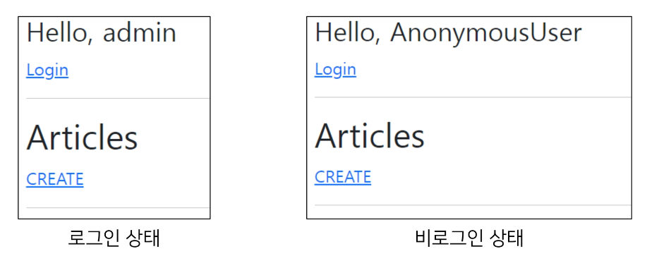

## **3. Authentication in Web requests**

- 개요
    - Django가 제공하는 인증 관련 built-in forms 익히기<br>

    - [https://docs.djangoproject.com/en/3.2/topics/auth/default/#module-django.contrib.auth.forms](https://docs.djangoproject.com/en/3.2/topics/auth/default/#module-django.contrib.auth.forms)
<br><br><br>
---

### **1. Login**

1. 개요
    - 로그인은 **Session을 Create**하는 과정
<br><br><br>

2. AuthenticationForm
    - 로그인을 위한 built-in form<br>

        - 로그인 하고자 하는 사용자 정보를 입력 받음<br>

        - 기본적으로 username과 password를 받아 데이터가 유효한지 검증
    - request를 첫번째 인자로 취함
    - [https://github.com/django/django/blob/main/django/contrib/auth/forms.py#L174](https://github.com/django/django/blob/main/django/contrib/auth/forms.py#L174)
<br><br><br>

3. 로그인 페이지 작성
    
    ```python
    # accounts/urls.py
    
    from django.urls import path
    from . import views
    
    app_name = 'accounts'
    urlpatterns = [
    		path('login/', views.login, name='login'),
    ]
    ```
    
    ```python
    # accounts/views.py
    
    from django.contrib.auth.forms import AuthenticationForm
    
    def login(request):
    		if request.method == 'POST':
    				pass
    		else:
    				form = AuthenticationForm()
    		context = {
    				'form': form
    		}
    		return render(request, 'accounts/login.html', context)
    ```
    
    ```html
    <!-- accounts/login.html -->
    
    
    
    
    	<h1>로그인</h1>
    	<form action="" method="POST">
    		
    		{{ form.as_p }}
    		<input type="submit">
    	</form>
    
    ```
<br><br>

4. login()
    - `login(request, user, backend=None)`<br>

    - 인증된 사용자를 로그인 시키는 로직으로 view 함수에서 사용됨
    - 현재 세션에 연결하려는 인증된 사용자가 있는 경우 사용
    - HttpRequest 객체와 User 객체가 필요
    - 사용자의 session 생성 → DB 저장 / 쿠키에 session_id 저장
<br><br><br>

5. 로그인 로직 작성
    - 로그인 페이지 작성<br>

    - view 함수 login과의 충돌을 방지하기 위해 import한 login 함수 이름을 auth_login으로 변경해서 사용
        
        ```python
        from django.shortcuts import render, redirect
        from django.contrib.auth import login as auth_login
        
        def login(request):
        		if request.method == 'POST':
        				form = AuthenticationForm(request, request.POST)
        				# form = AuthenticationForm(request, data=request.POST)
        				if form.is_valid():
        						auth_login(request, form.get_user())
        						return redirect('articles:index')
        		else:
        				form = AuthenticationForm()
        		context = {
        				'form': form
        		}
        		return render(request, 'accounts/login.html', context)
        ```
<br><br>

6. get_user()
    - AuthenticationForm의 인스턴스 메서드<br>

    - 유효성 검사를 통과했을 경우 로그인 한 사용자 객체를 반환
    - [https://github.com/django/django/blob/main/django/contrib/auth/forms.py#L244](https://github.com/django/django/blob/main/django/contrib/auth/forms.py#L244)
<br><br><br>

7. 세션 데이터 확인하기
    - 로그인 후 개발자 도구와 DB에서 Django로부터 발급받은 세션 확인 (로그인은 관리자 계정을 만든 후 진행)<br>

    - django_session 테이블에서 확인
        
        
        
    - 브라우저에서 확인
        - 개발자도구 - Application - Cookies
            
            
<br><br><br>            
    
8. 로그인 링크 작성
    - 실습 편의를 위해 base 템플릿에 로그인 페이지로 이동할 수 있는 하이퍼 링크 작성
        
        ```html
        <!-- base.html -->
        
        <body>
        	<div class="container">
        		**<a href="">Login</a>**
        		<hr>
        		
        		
        	</div>
        	...
        </body>
        </html>
        ```
<br><br>        
---

### **2.  Authentication with User**

1. 개요
    - 템플릿에서 인증 관련 데이터를 출력하는 방법
<br><br><br>

2. 현재 로그인 되어 있는 유저 정보 출력하기
    - 템플릿에서 인증 관련 데이터를 출력하는 방법<br>

        
        ```html
        <!-- base.html -->
        
        <body>
        	<div class="container">
        		**<h3>Hello, {{ user }}</h3>**
        		<a href="">Login</a>
        		<hr>
        		
        		
        	</div>
        	...
        </body>
        </html>
        ```
        
    - 어떻게 base 템플릿에서 context 데이터 없이 user 변수를 사용할 수 있을까
        - settings.py의 **context processors** 설정 값 때문
<br><br><br>

3. context processors
    - 템플릿이 렌더링 될 때 호출 가능한 컨텍스트 데이터 목록<br>

    - 작성된 컨텍스트 데이터는 기본적으로 템플릿에서 사용 가능한 변수로 포함됨
    - 즉, Django에서 자주 사용하는 데이터 목록을 미리 템플릿에 로드해 둔 것
    
    ```python
    # settings.py
    
    TEMPLATES = [
    		{
    				...
    				'OPTIONS': {
    						'context_processors': [
    								'django.template.context_processors.debug',
    								'django.template.context_processors.request',
    								**'django.contrib.auth.context_processors.auth',**
    								'django.contrib.messages.context_processors.messages',
    						],
    				},
    		},
    ]
    ```
    
    - 현재 user 변수를 담당하는 프로세서는 `django.contrib.auth.context_processors.auth`<br>

    - 이외에 더 많은 Built-in-template context processors들은 공식문서를 참고
    - [https://docs.djangoproject.com/en/3.2/ref/templates/api/#built-in-template-context-processors](https://docs.djangoproject.com/en/3.2/ref/templates/api/#built-in-template-context-processors)
<br><br><br>

4. django.contrib.auth.context_processors.auth
    - 현재 로그인한 사용자를 나타내는 User 클래스의 인스턴스가 템플릿 변수 **{{ user }}**에 저장됨<br>

        - 클라이언트가 로그인하지 않은 경우 AnonymousUser 클래스의 인스턴스로 생성

            
<br><br><br>
---            

### **3. Logout**

1. 개요
    - 로그아웃은 **Session을 Delete**하는 과정
<br><br><br>

2. logout()
    - `logout(request)`<br>

    - HttpReqest 객체를 인자로 받고 반환 값이 없음
    - 사용자가 로그인하지 않은 경우 오류를 발생시키지 않음
    - 다음 2가지 일을 처리한다.
        - 현재 요청에 대한 session data를 DB에서 삭제<br>

        - 클라이언트의 쿠키에서도 session id를 삭제
            
            → 이는 다른 사람이 동일한 웹 브라우저는 사용하여 로그인하고, 이전 사용자의 세션 데이터에 액세스하는 것을 방지하기 위함
<br><br><br>            
    
3. 로그아웃 로직 작성하기
    
    ```python
    # accounts/urls.py
    
    from django.urls import path
    from . import views
    
    app_name = 'accounts'
    urlpatterns = [
    		path('login/', views.login, name='login'),
    		path('logout/', views.logout, name='logout'),
    ]
    ```
    
    ```python
    # accounts/views.py
    
    from django.contrib.auth import logout as auth_logout
    
    def logout(request):
    		auth_logout(request)
    		return redirect('articles:index')
    ```
    
    ```html
    <!-- base.html -->
    
    <body>
    	<div class="container">
    		<h3>Hello, {{ user }}</h3>
    		<a href="">Login</a>
    		**<form action="" method="POST">
    			
    			<input type="submit" value="Logout">
    		</form>**
    		<hr>
    		
    		
    	</div>
    </body>
    ```
<br><br><br>

4. 로그아웃 출력 확인 및 테스트
    
    
<br><br><br>    

---
