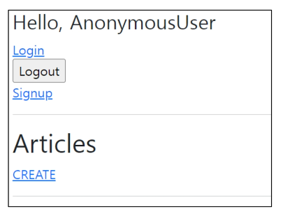
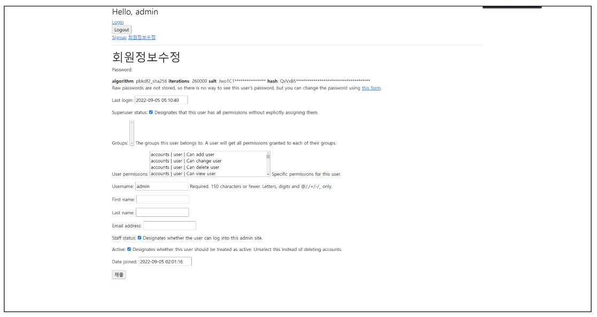
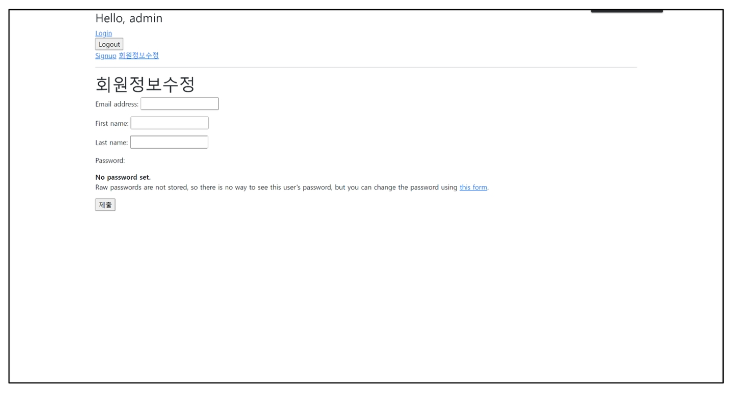
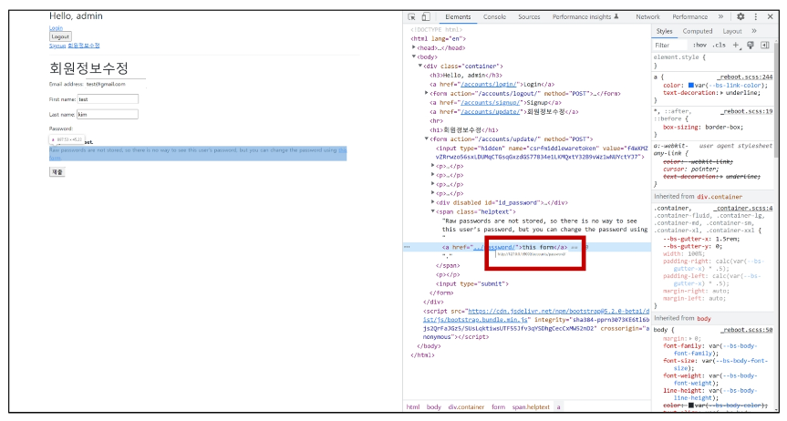
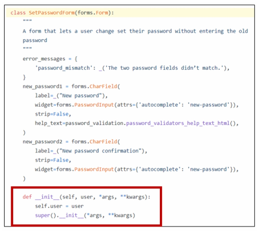

# **Authentication with User**

- 개요
    - User Object와 User CRUD에 대한 이해<br>

        - 회원 가입, 회원 탈퇴, 회원정보 수정, 비밀번호 변경
<br><br><br>
---

### **1. 회원 가입**

1. 개요
    - 회원가입은 User를 **Create**하는 것이며 **UserCreationForm** built-in form을 사용
<br><br><br>

2. `UserCreationForm`
    - 주어진 username과 password로 권한이 없는 새 user를 생성하는 ModelForm<br>

    - 3개의 필드를 가짐
        - username (from the user model)<br>

        - password1
        - password2
    - [https://github.com/django/django/blob/stable/3.2.x/django/contrib/auth/forms.py#L75](https://github.com/django/django/blob/stable/3.2.x/django/contrib/auth/forms.py#L75)
<br><br><br>

3. 회원 가입 페이지 작성
    
    ```python
    # accounts/urls.py
    
    app_name = 'accounts'
    urlpatterns = [
    		...,
    		path('signup/', views.signup, name='signup'),
    ]
    ```
    
    ```html
    <!-- accounts/signup.html -->
    
    
    
    
    <h1>회원가입</h1>
    <form action="" method="POST">
    	
    	{{ form.as_p }}
    	<input type="submit">
    </form>	
    
    ```
    
    ```python
    # accounts/views.py
    
    from django.contrib.auth.forms import AutenticationForm, UserCreationForm
    
    def signup(request):
    		if request.method == 'POST':
    				pass
    		else:
    				form = UserCreationForm()
    		context = {
    				'form': form,
    		}
    		return render(request, 'accounts/signup.html', context)
    ```
<br><br><br>

4. 회원가입 링크 작성 후 페이지 확인
    
    ```html
    <!-- base.html -->
    
    <div class="container">
    	<h3>Hello, {{ user }}</h3>
    	<a href="">Login</a>
    	<form action="" method="POST">
    		
    		<input type="submit" value="Logout">
    	</form>
    	<a href="">Signup</a>
    	<hr>
    	
    	
    </div>
    ```
    
    
<br><br><br>

5. 회원가입 로직 작성
    
    ```python
    # accounts/views.py
    
    def signup(request):
    		if request.method == 'POST':
    				from = UserCreationForm(request.POST)
    				if form.is_valid():
    						form.save()
    						return redirect('articlesLindex')
    		else:
    				form = UserCreationForm()
    		context = {
    				'form': form,
    		}
    		return render(request, 'accounts/signup.html', context)
    ```
<br><br><br>

6. 회원가입 진행 후 에러 페이지를 확인
    - 회원가입에 사용하는 UserCreationForm이 우리가 대체한 커스텀 유저 모델이 아닌 기존 유저 모델로 인해 작성된 클래스이기 때문<br>

        - [https://github.com/django/django/blob/main/django/contrib/auth/forms.py#L106](https://github.com/django/django/blob/main/django/contrib/auth/forms.py#L106)
        
        
        
        ```python
        class UserCreationForm(forms.ModelForm):
        		...
        
        		class Meta:
        				model = User
        				fields = ("Username",)
        				field_classes = {"username": UsernameField}
        ```
<br><br>

---        

### **2. Custom user & Built-in auth forms**

1. 개요
    - Custom user와 기존 Built-in auth forms 간의 관계<br>

    - Custom user로 인한 Built-in auth forms 변경
<br><br><br>

2. AbstractBaseUser의 모든 subclass와 호환되는 forms
    - 아래 Form 클래스는 User 모델을 대체하더라도 커스텀 하지 않아도 사용가능<br>

        - `AuthenticationForm`<br>

        - `SetPasswordForm`
        - `PasswordChangeForm`
        - `AdminPasswordChangeForm`
    - 기존 User 모델을 참조하는 Form이 아니기 때문
<br><br><br>

3. 커스텀 유저 모델을 사용하려면 다시 작성하거나 확장해야 하는 forms
    - `UserCreationForm`<br>

    - `UserchangeForm`
    
    → 두 form 모두 `class Meta: model = User`가 등록된 form이기 때문에 반드시 커스텀(확장)해야 함
<br><br><br>

4. UserCreationForm() 커스텀 하기
    
    ```python
    # accounts/forms.py
    
    from django.contrib.auth import get_user_model
    from django.contrib.auth.forms import UserCreationForm, UserChangeForm
    
    class CustomUserCreationForm(UserCreationForm):
    		class Meta(UserCreationForm.Meta):
    				model = get_user_model()
    
    class CustomUserChangeForm(UserChangeForm):
    		class Meta(UserChangeForm.Meta):
    				model = get_user_model()
    ```
<br><br>

5. `get_user_model()`
    - **“현재 프로젝트에서 활성화된 사용자 모델(active user model)”**을 반환<br>

    - 직접 참조하지 않는 이유
        - 예를 들어 기존 User 모델이 아닌 User 모델을 커스텀 한 상황에서는 커스텀 User 모델을 자동으로 반환해주기 때문<br>

    - Django User 클래스를 직접 참조하는 대신 `get_user_model()`을 사용해 참조해야 한다고 강조하고 있음
    - User model 참조에 대한 자세한 내용은 추후 모델 관계 수업에서 다룰 예정
<br><br><br>    
     
    
6. `CustomUserChangeForm()` 으로 대체하기
    
    ```python
    # accounts/views.py
    
    from django.contrib.auth.forms import AuthenticationForm, UserCreationForm
    from .forms import CustomUserCreationForm, CustomUserChangeForm
    
    def signup(request):
    		if request.method == 'POST':
    				from = CustomUserCreationForm(request.POST)
    				if form.is_valid():
    						form.save()
    						return redirect('articlesLindex')
    		else:
    				form = CustomUserCreationForm()
    		context = {
    				'form': form,
    		}
    		return render(request, 'accounts/signup.html', context)
    ```
<br><br>

7. 회원가입 진행 후 테이블 확인
    
    
<br><br><br>

8. 회원가입 후 곧바로 로그인 진행
    
    ```python
    # accounts/views.py
    
    def signup(request):
    		if request.method == 'POST':
    				from = CustomUserCreationForm(request.POST)
    				if form.is_valid():
    						user = form.save()
    						auth_login(request, user)
    						return redirect('articlesLindex')
    		else:
    				form = CustomUserCreationForm()
    		context = {
    				'form': form,
    		}
    		return render(request, 'accounts/signup.html', context)
    ```
<br><br>

9. \[참고] UserCreationForm의 save 메서드
    - user를 반환하는 것을 확인
    - [https://github.com/django/django/blob/main/django/contrib/auth/forms.py#L139](https://github.com/django/django/blob/main/django/contrib/auth/forms.py#L139)
        
        ```python
        def save(self, commit=True):
                user = super().save(commit=False)
                user.set_password(self.cleaned_data["password1"])
                if commit:
                    user.save()
                return user
        ```
<br><br>

---        

### **3.  회원 탈퇴**

1. 개요
    - 회원 탈퇴하는 것은 DB에서 유저를 Delete하는 것과 같음
<br><br><br>

2. 회원 탈퇴 로직 작성
    
    ```python
    # accounts/urls.py
    
    app_name = 'accounts'
    urlpatterns = [
    		...,
    		path('delete/', views.delete, name='delete'),
    ]
    ```
    
    ```python
    # accounts/views.py
    
    def delete(request):
    		request.user.delete()
    		return redirect('articles:index')
    ```
    
    ```html
    <!-- base.html -->
    
    <h3>Hello, {{ user }}</h3>
    ...
    <form action="" method="POST">
    	
    	<input type="submit" value="회원탈퇴">
    </form>
    ```
<br><br>

3. \[참고] 탈퇴 하면서 해당 유저의 세션 정보도 함께 지우고 싶을 경우
    - “탈퇴(1) 후 로그아웃(2)”의 순서가 바뀌면 안됨<br>

        - 먼저 로그아웃 해버리면 해당 요청 객체 정보가 없어지기 때문에 탈퇴에 필요한 정보 또한 없어지기 때문
            
            ```python
            # accounts/views.py
            
            def delete(request):
            		request.user.delete()
            		auth_logout(request)
            ```
<br><br>

---            

### **4. 회원정보 수정**

1. 개요
    - 회원정보 수정은 User를 Update하는 것이며 **UserChangeForm** built-in form을 사용
<br><br><br>

2. UserChangeForm
    - 사용자의 정보 및 권한을 변경하기 위해 admin 인터페이스에서 사용되는 ModelForm<br>

    - UserChangeForm 또한 ModelForm이기 때문에 instance 인자로 기존 user 데이터 정보를 받는 구조 또한 동일함
    - 이미 이전에 CustomUserChangeForm으로 확장했기 때문에 CustomUserChangeForm을 사용하기
<br><br><br>

3. 회원정보 수정 페이지 작성
    
    ```python
    # accounts/urls.py
    
    app_name = 'accounts'
    urlpatterns = [
    		...,
    		path('update/', views.update, name='update'),
    ]
    ```
    
    ```python
    # accounts/views.py
    
    def update(request):
    		if request.method == 'POST':
    				pass
    		else:
    				form = CustomUserChangeForm(instance=request.user)
    		context = {
    				'form': form,
    		}
    		return render(request, 'accounts/update.html', context)
    ```
    
    ```html
    <!-- accounts/update.html -->
    
    
    
    
    <h1>회원정보수정</h1>
    <form action="" method="POST">
    	
    	{{ form.as_p }}
    	<input type="submit">
    </form>	
    
    ```
<br><br>

4. 회원정보 수정 페이지 링크 작성
    
    ```html
    <!-- base.html -->
    
    <div class="container">
    	<h3>Hello, {{ user }}</h3>
    	<a href="">Login</a>
    	<form action="" method="POST">
    		
    		<input type="submit" value="Logout">
    	</form>
    	<a href="">Signup</a>
    	<a href="">회원정보 수정</a>
    	<hr>
    	
    	
    </div>
    ```
<br><br>

5. 회원정보 수정 페이지 확인
    
    
<br><br><br>

6. UserChangeForm 사용 시 문제점
    - 일반 사용자가 접근해서는 안 될 정보들(fields)까지 모두 수정이 가능해짐<br>

        - admin 인터페이스에서 사용되는 ModelForm이기 때문
    - 따라서 UserChangeForm을 상속받아 작성해 두었던 서브 클래스 CustomUserChangeForm 에서 접근 가능한 필드를 조정해야함
<br><br><br>

7. UserChangeForm fields 재정의
    - User 모델의 fields명은 어떻게 알 수 있을까?
        
        ```python
        # accounts/forms.py
        
        class CustomUserChangeForm(UserChangeForm):
        		class Meta(UserChangeForm.Meta):
        				model = get_user_model()
        				fields = ???
        ```
<br><br>

8. User model 상속 구조 살펴보기
    - UserChangeForm 클래스 구조 확인하기<br>

        - Meta 클래스를 보면 User라는 model을 참조하는 ModelForm이라는 것을 확인할 수 있음<br>

        - [https://github.com/django/django/blob/main/django/contrib/auth/forms.py#L147](https://github.com/django/django/blob/main/django/contrib/auth/forms.py#L147)
    - User 클래스 구조 확인
        - 실제로 User 클래스는 Meta 클래스를 제외한 코드가 없고 AbstractUser 클래스를 상속 받고 있음<br>

        - [https://github.com/django/django/blob/main/django/contrib/auth/forms.py#L405](https://github.com/django/django/blob/main/django/contrib/auth/forms.py#L405)
    - AbrstracUser 클래스 구조 확인
        - 클래스 변수명들을 확인해보면 회원수정 페이지에서 봤던 필드들과 일치한다는 것을 확인할 수 있음<br>

        - [https://github.com/django/django/blob/main/django/contrib/auth/forms.py#L334](https://github.com/django/django/blob/main/django/contrib/auth/forms.py#L334)
    - 마지막으로 공식문서의 User 모델 Fields 확인
        - [https://docs.djangoproject.com/en/3.2/ref/contrib/auth/#user-model](https://docs.djangoproject.com/en/3.2/ref/contrib/auth/#user-model)
<br><br><br>

9. CustomUserChangeForm fields 재정의
    - 수정하고자 하는 필드 작성 후 출력 변화 확인
        
        ```python
        # accounts/forms.py
        
        class CustomUserChangeForm(UserChangeForm):
        		class Meta(UserChangeForm.Meta):
        				model = get_user_model()
        				fields = ('email', 'first_name', 'last_name')
        ```
        
        
<br><br><br>        
    
10. 회원정보 수정 로직 작성
    - 작성 후 실제 회원정보가 수정되었는지 확인
        
        ```python
        # accounts/views.py
        
        def update(request):
        		if request.method = 'POST':
        				form = CustomUserChangeForm(request.POST, instance=request.user)
        				# form = CustomUserChangeForm(data=request.POST, instance=request.user)
        				if form.is_valid():
        						form.save()
        						return redirect('articles:index')
        		else:
        				form = CustomUserChangeForm(instance=request.user)
        		context = {
        				'form': form,
        		}
        		return render(request, 'accounts/update.html', context)
        ```
<br><br>

---        

### **5. 비밀번호 변경**

1. PasswordChangeForm
    - 사용자가 비밀번호를 변경할 수 있도록 하는 Form<br>

    - 이전 비밀번호를 입력하여 비밀번호를 변경할 수 있도록 함
    - 이전 비밀번호를 입력하지 않고 비밀번호를 설정할 수 있는 SetPasswordForm을 상속받는 서브 클래스
    - 회원정보 수정 페이지에서 비밀번호 변경 form 주소를 확인해보기
        - `/accounts/password/`
        
        
<br><br><br>        
    
2. 비밀번호 변경 페이지 작성
    
    ```python
    # accounts/urls.py
    
    app_name = 'accounts'
    urlpatterns = [
    		...,
    		path('password/', views.change_password, name='change_password'),
    ]
    ```
    
    ```python
    # accounts/views.py
    
    from django.contrib.auth.forms import AuthenticationForm, PasswordChangeForm
    
    def chage_password(request):
    		if request.method == 'POST'
    				pass
    		else:
    				form = PasswordChangeForm(request.user)
    		context = {
    				'form': form,
    		}
    		return render(request, 'accounts/change_password.html', context)
    ```
    
    ```html
    <!-- accounts/change_password.html -->
    
    
    
    
    <h1>비밀번호 변경</h1>
    <form action="" method="POST">
    	
    	{{ form.as_p }}
    	<input type="submit">
    </form>	
    
    ```
<br><br>

3. \[참고] SetPasswordForm 살펴보기
    - PasswordChangeForm은 SetPasswordForm의 하위 클래스이기 때문에 SetPasswordForm을 확인
        
        
<br><br><br>

4. 비밀번호 변경 로직 작성
    - 작성 후 비밀번호 변경 확인<br>

        - 변경 후 로그인 상태가 지속되지 못하는 문제 발생
            
            ```python
            # accounts/views.py
            
            def chage_password(request):
            		if request.method == 'POST'
            				form = PasswordChangeForm(request.user, request.POST)
            				# form = PasswordChangeForm(user=request.user, data=request.POST)
            				if form.is_valid():
            						form.save()
            						return redirect('articles:index')
            		else:
            				form = PasswordChangeForm(request.user)
            		context = {
            				'form': form,
            		}
            		return render(request, 'accounts/change_password.html', context)
            ```
<br><br>

5. 암호 변경 시 세션 무효화 방지하기
    - 비밀번호가 변경되면 기존 세션과의 화원 인증 정보가 일치하지 않게 되어 버려 로그인 상태가 유지되지 못함<br>

    - 비밀번호는 잘 변경되었으나 비밀번호가 변경 되면서 기존 세션과의 회원 인증 정보가 일치하지 않기 때문
<br><br><br>
    
6. update_session_auth_hash()
    - `update_session_auth_hash(request, user)`<br>

    - 현재 요청(current request)과 새 session data가 파생 될 업데이트 된 사용자 객체를 가져오고, session data를 적절하게 업데이트해줌
    - 암호가 변경되어도 로그아웃 되지 않도록 새로운 password의 session data로 session을 업데이트
<br><br><br>

7. update_session_auth_hash() 작성
    
    ```python
    # accounts/views.py
    
    from django.contrib.auth import update_session_auth_hash
    
    def chage_password(request):
    		if request.method == 'POST'
    				form = PasswordChangeForm(request.user, request.POST)
    				# form = PasswordChangeForm(user=request.user, data=request.POST)
    				if form.is_valid():
    						form.save()
    						update_session_auth_hash(request, form.user)
    						return redirect('articles:index')
    		else:
    				form = PasswordChangeForm(request.user)
    		context = {
    				'form': form,
    		}
    		return render(request, 'accounts/change_password.html', context)
    ```
<br><br>    

---
