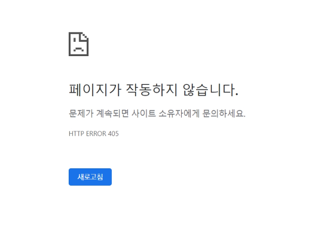

# **Limiting access to logged-in users**

1. 개요
    - 로그인 사용자에 대한 접근 제한하기<br>

    - 로그인 사용자에 대해 접근을 제한하는 2가지 방법
    - The raw way<br>

        - `is_authenticated` attribute
    - The `login_required` decorator
<br><br><br>

2. is_authenticated
    - User model의 속성(attributes) 중 하나<br>

    - 사용자가 인증 되었는지 여부를 알 수 있는 방법
    - 모든 User 인스턴스에 대해 항상 True인 읽기 전용 속성
        - AnonymousUser에 대해서는 항상 False
    - 일반적으로 `request.user`에서 이 속성을 사용 (`request.user.is_authenticated`)
    - 권한(permission)과는 관련이 없으며, 사용자가 활성화 상태(active)이거나 유효한 세선(valid session)을 가지고 있는지도 확인하지 않음
<br><br><br>

3. \[참고] is_authenticated 코드 살펴보기
    - [https://github.com/django/django/blob/main/django/contrib/auth/base_user.py#L56](https://github.com/django/django/blob/main/django/contrib/auth/base_user.py#L56)
        
        ```python
        class AbstractBaseUser(models.Model):
            ...
            def is_authenticated(self):
                """
                Always return True. This is a way to tell if the user has been
                authenticated in templates.
                """
                return True
        ```
<br><br>        
    
4. is_authenticated 적용하기
    - 로그인과 비로그인 상태에서 출력되는 링크를 다르게 설정하기
        
        ```html
        <!-- base.html -->
        
        
        	<h3>Hello, {{ user }}</h3>
        	<form action="" method="POST">
        		
        		<input type="submit" value="Logout">
        	</form>
        	<a href="">회원정보 수정</a>
          <form action="" method="POST">
            
            <input type="submit" value="회원탈퇴">
          </form>
        
          <a href="">Login</a>
          <a href="">Signup</a>
        
        ```
        
    - 인증된 사용자만 게시글 작성 링크를 볼 수 있도록 처리하기
    - 하지만 아직 비 로그인 상태로도 URL을 직접 입력하면 게시글 작성 페이지로 갈 수 있음
        
        ```html
        <!-- articles/index.html -->
        
        
        
        
          <h1>Articles</h1>
          
            <a href="">CREATE</a>
          
            <a href="">새 글을 작성하려면 로그인하세요</a>
          
          ...
        
        ```
        
    - 인증된 사용자라면 로그인 로직을 수행할 수 없도록 처리
        
        ```python
        # accounts/views.py
        
        def login(request):
            if request.user.is_authenticated:
                return redirect('articles:index')
            ...
        ```
<br><br><br>

5. login_required
    - `login_required` decorator<br>

    - 사용자가 로그인 되어 있으면 정상적으로 view 함수를 실행
    - 로그인 하지 않은 사용자의 경우 settings.py의 `LOGIN_URL` 문자열 주소로 redirect
        - \[참고] `LOGIN_URL`의 기본 값은 `/accounts/login/`<br>

        - 두번째 app 이름을 accounts로 했던 이유 중 하나
    - 로그인 상태에서만 글을 작성/수정/삭제할 수 있도록 변경
        
        ```python
        from django.contrib.auth.decorators import login_required
        
        @login_required
        @require_http_methods(['GET', 'POST'])
        def create(request):
            pass
        
        @login_required
        @require_POST
        def delete(request, pk):
            pass
        
        @login_required
        @require_http_methods(['GET', 'POST'])
        def update(request, pk):
            pass
        ```
<br><br>

6. login_required 적용 확인하기
    - `/articles/create/` 로 강제 접속 시도 해보기<br>

    - 로그인 페이지로 리다이렉트 후 `/accounts/login/?next=/articles/create/` url 확인하기
    - 인증 성공 시 사용자가 redirect 되어야하는 경로는 “next”라는 쿼리 문자열 매개 변수에 저장됨
        - 예시) /accounts/login/**?next=/articles/create/**
<br><br><br>

7. “next” query string parameter
    - 로그인이 정상적으로 진행되면 이전에 요청했던 주소로 redirect 하기 위해 Django가 제공해주는 쿼리 스트링 파라미터<br>

    - 해당 값을 처리할지 말지는 자유이며 별도로 처리 해주지 않으면 view에 설정한 redirect 경로로 이동하게 됨
<br><br><br>

8. “next” query string parameter 대응
    
    ```python
    # accounts/views.py
    
    def login(request):
        if request.user.is_authenticated:
            return redirect('articles:index')
        
        if request.method == 'POST':
            form = AuthenticationForm(request, request.POST)
            if form.is_valid():
                auth_login(request, form.get_user())
                return redirect(request.GET.get('next') or 'articles:index')
    ...
    ```
<br><br>   

9. “next” query string parameter 주의사항
    - 만약 login 템플릿에서 form action이 작성되어 있다면 동작하지 않음<br>

    - 해당 action 주소 next 파라미터가 작성 되어있는 현재 url이 아닌 /accounts/login/으로 요청을 보내기 때문
        
        ```html
        <!-- accounts/login.html -->
        
        
        <h1>로그인</h1>
        <form action="" method="POST">
          
          {{ form.as_p }}
          <input type="submit">
        </form>
        
        ```
<br><br><br>

10. 두 데코레이터로 인해 발생하는 구조적 문제
    - 1) 먼저 비로그인 상태로 detail 페이지에서 게시글 삭제 시도<br>

    - 2) delete view 함수의 `@login_required`로 인해 로그인 페이지로 리다이렉트
        - http://127.0.0.1:8000/accounts/login/?next=/articles/1/delete/
    - 3) redirect로 이동한 로그인 페이지에서 로그인 진행
    - 4) delete view 함수의 `@require_POST`로 인해 405 상태 코드를 받게 됨
        - 405(Method Not Allowed) status code 확인
    
    - 로그인 성공 이후 GET method로 next 파라미터 주소로 리다이렉트 되기 때문
        
        
        
        ```html
        Method Not Allowed (GET): /articles/1/delete/
        [05/Sep/2022 15:10:04] "GET /articles/1/delete/ HTTP/1.1" 405 0
        ```
        
    
    - 두 가지 문제가 발생한 것
        - 1) redirect 과정에서 POST 요청 데이터의 손실<br>

        - 2) redirect로 인한 요청은 GET 요청 메서드로만 요청됨
    <br><br>

    - 해결방안
        - `@login_required`는 GET request method를 처리할 수 있는 View 함수에서만 사용해야함
<br><br><br>

11. 두 데코레이터로 인해 발생하는 구조적 문제 해결
    - POST method만 허용하는 delete 같은 함수는 내부에서는 is_authenticated 속성 값을 사용해서 처리<br>

        
        ```python
        # articles/views.py
        
        @require_POST
        def delete(request, pk):
            if request.user.is_authenticated:
                article = Article.objects.get(pk=pk)
                article.delete()
            return redirect('articles:index')
        ```
<br><br><br>

12. accounts view 함수에 모든 데코레이터 및 속성 값 적용해보기
    
    ```python
    # accounts/views.py
    
    from django.contrib.auth.decorators import login_required
    from django.views.decorators.http import require_POST, require_http_methods
    
    @require_http_methods(['GET', 'POST'])
    def login(request):
        pass
    
    @require_POST
    def logout(request):
        if request.user.is_authenticated:
            pass
    
    @require_http_methods(['GET', 'POST'])
    def signup(request):
        pass
    
    @login_require
    @require_http_methods(['GET', 'POST'])
    def update(request):
        pass
    
    @login_required
    @require_http_methods(['GET', 'POST'])
    def change_password(request):
        pass
    ```
<br><br>    

---

# **마무리**

- The Django authentication system<br>

    - User 모델 대체하기<br><br>
- HTTP Cookies
    - 상태가 있는 세션 구성<br><br>
- Authentication in Web requests
    - Auth built-in form 사용하기<br><br>
- Authentication with User
    - User Object와 User CRUD
<br><br><br>

---
