# **2. Response JSON**

- 개요
    - JSON 형태로의 서버 응답 변화<br>

    - 다양한 방법의 JSON 응답
<br><br><br>

---

## **1. Intro**

1. 서버가 응답하는 것
    - 지금까지 Django로 작성한 서버는 사용자에게 페이지(html)만 응답하고 있었음<br>

    - 하지만 사실 서버가 응답할 수 있는 것은 페이지 뿐만 아니라 다양한 데이터 타입을 응답할 수 있음
    <br><br>

    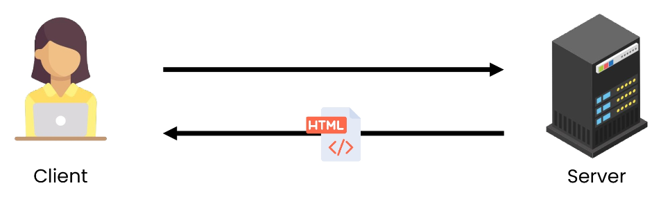
    
    - 페이지(html)를 응답하는 서버
    <br><br>

    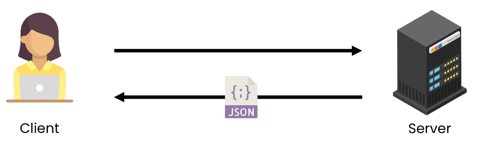
    
    - 이제는 JSON 데이터를 응답하는 서버로의 변환<br>

    - 그렇다면 사용자에게 보여질 화면은 누가 구성하게 될까?
    <br><br>

    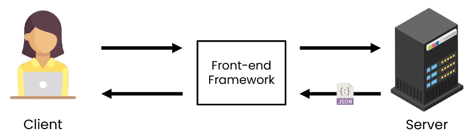
    
    - JSON 데이터를 받아 화면을 구성하여 사용자에게 보여주는 것은 Front-end Framework가 담당할 예정
    <br><br>

    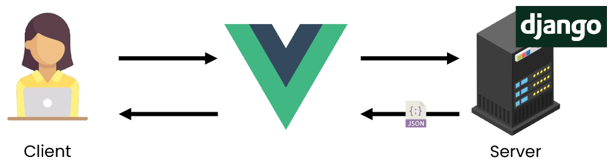
    
    - Front-end Framework는 Vue.js를 사용<br>

    - Django는 더 이상 Template 부분에 대한 역할을 담당하지 않게 되며 Front-end와 Back-end가 분리되어 구성되게 됨
    <br><br>

    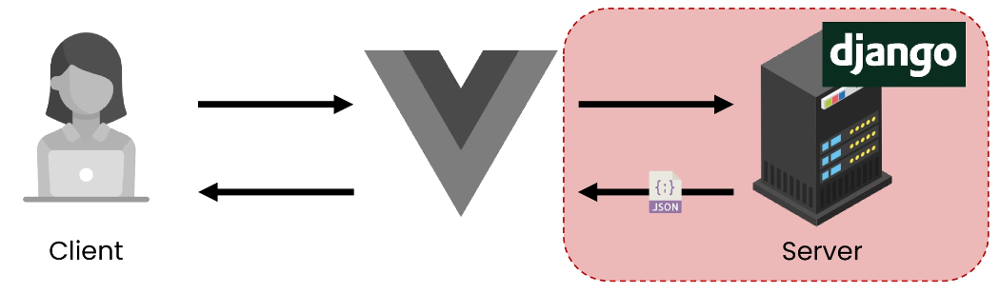
    
    - 이번 시간에는 JSON을 응답하는 Django 서버를 구성하는 법을 학습
<br><br><br>

2. 사전 준비
    - 사전 제공된 **01_json_response** 프로젝트 준비<br>

    - 가상 환경 생성,  활성화 및 패키지 설치
    - migrate 진행
        
        - `$ python manage.py migrate`
        
    - 준비된 fixtures 파일을 load하여 실습용 초기 데이터 입력
        
        - `$ python manage.py loaddata articles.json`
    <br><br>    
    
    - 입력된 데이터 확인
        
        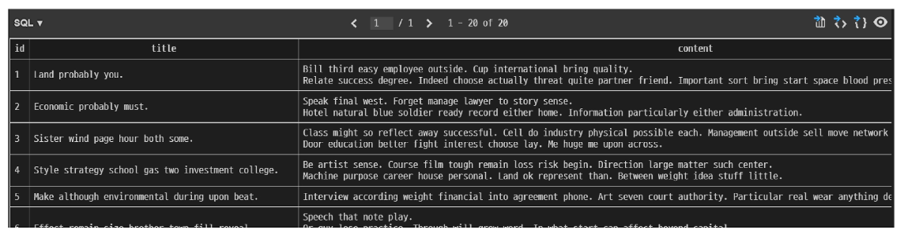
    <br><br>    
    
    - 미리 작성된 프로젝트 둘러보기
        - view 함수는 필요한 부분만 작성해 나갈 예정
        
        ```python
        # my_api/urls.py
        
        from django-contrib import admin
        from django.urls import path, include
        
        urlpatterns = [
            path('admin/', admin.site.urls),
            path('api/v1/', include('artiles.urls')),
        ]
        ```
        
        ```python
        # articles/urls.py
        
        from django.urls import path
        from . import views
        
        urlpatterns = [
            path('html/', views.article_html),
            path('json-1/', views.article_json_1),
            path('json-2/', views.article_json_2),
            path('json-3/', views.article_json_3),
        ]
        ```
<br><br>

---

## **2. Response**

1. 개요
    - 다양한 방법으로 JSON 데이터 응답해보기<br>

        - HTML 응답<br>

        - `JsonResponse()`를 사용한 JSON 응답
        - Django Serializer를 사용한 JSON 응답
        - Django REST framework를 사용한 JSON 응답
<br><br><br>

2. HTML 응답
    - 문서(HTML) 한 장을 응답하는 서버 확인하기<br>

    - 지금까지 Django로 응답 해오던 방식
    
    ```python
    # articles/urls.py
    
    from django.urls import path
    from . import views
    
    urlpatterns = [
        path('html/', views.article_html),
    ]
    ```
    
    ```python
    # articles/views.py
    
    from django.shortcuts import render
    from .models import Article
    
    def article_html(request):
        articles = Article.objects.all()
        context = {
            'articles': articles,
        }
        return render(request, 'articles/article.html', context)
    ```
    
    ```html
    <!-- articles/article.html -->
    
    <!DOCTYPE html>
    <html lang="en">
    <head>
      ...
    </head>
    <body>
      <h1>Article List</h1>
      <hr>
      <p>
        {$ for article in articles $}
          <h2>{{ article.pk }}번 글. {{ article.title }}</h2>
          <p>{{ article.content }}</p>
          <hr>
        
      </p>
    </body>
    </html>
    ```
    
    - 응답 페이지 확인 [http://127.0.0.1:8000/api/v1/html/](http://127.0.0.1:8000/api/v1/html/)
        
        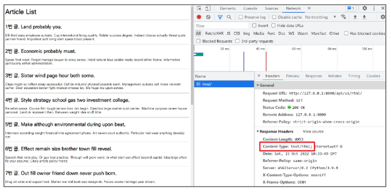

<br><br><br>        
    
3. [참고] **Content-Type** entity header
    - 리소스의 media type(MIME type, content type)을 나타내기 위해 사용됨<br>

    - 응답 내에 있는 컨텐츠의 컨텐츠 유형이 실제로 무엇인지 클라이언트에게 알려줌
<br><br><br>

4. JsonResponse()를 사용한 JSON 응답
    - 이제는 문서(HTML) 한 장을 응답한는 것이 아닌 JSON 데이터를 응답해보기<br>

    - Django가 기본적으로 제공하는 JsonResponse 객체를 활용하여 Python 데이터 타입을 손쉽게 JSON으로 변환하여 응답 가능
    
    ```python
    # articles/views.py
    
    from django.http.response import JsonResponse
    
    def article_json_1(request):
        articles = Article.objects.all()
        articles_json = []
    
        for article in articles:
            articles_json.append(
            {
                'id': article.pk,
                'title': article.title,
                'content': article.content,
                'created_at': article.created_at,
                'updated_at': article.updated_at,
                }
            )
        return JsonResponse(articles_json, safe=False)
    ```
    <br>

    - 응답 확인 [http://127.0.0.1:8000/api/v1/json-1/](http://127.0.0.1:8000/api/v1/json-1/)
        
        
        
    <br>

    - **JsonResponse()**<br>

        - JSON-encoded response를 만드는 클래스
    - **‘safe’** parameter
        - 기본 값 True<br>

        - False로 설정 시 모든 타입의 객체를 serialization 할 수 있음 (그렇지 않으면 dict 인스턴스만 허용됨)
<br><br><br>

5. Django Serializer를 사용한 JSON 응답
    - Django의 내장 `HttpResponse()`를 활용한 JSON 응답<br>

    - 이전에는 JSON의 모든 필드를 하나부터 열까지 작성해야 했지만 이제는 그렇지 않음
        
        ```python
        # articles/views.py
        
        from django.http.response import JsonResponse, HttpResponse
        from django.core import serializers
        
        def article_json_2(request):
            artilces = Article.obejcts.all()
            data = serializers.serialize('json', articles)
            return HttpResponse(data, content_type='application/json')
        ```
        
    - 응답 확인 [http://127.0.0.1:8000/api/v1/json-2/](http://127.0.0.1:8000/api/v1/json-2/)
        
        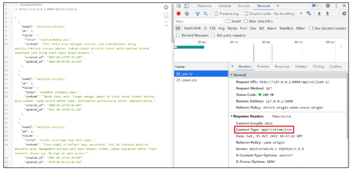

<br><br><br>        
    
6. Serialization
    - “직렬화”<br>

    - 데이터 구조나 객체 상태를 동일 혹은 다른 컴퓨터 환경에 저장하고, 나중에 재구성할 수 있는 포맷으로 변환하는 과정
        - 즉, 어떠한 언어나 환경에서도 **“냐중에 다시 쉽게 사용할 수 있는 포맷으로 변환하는 과정”**
    - 변환 포맷은 대표적으로 json, xml, yaml이 있으며 **json**이 가장 보편적으로 쓰임
    - 데이터 구조나 객체 상태를 나중에 재구성할 수 있는 포맷으로 변환하는 과정
        
        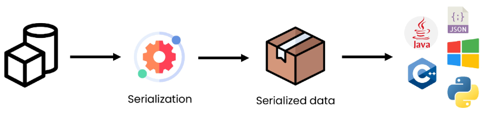

<br><br><br>        
    
7. Serializers in Django
    - Django의 **serialize()**는 Queryset 및 Model Instance와 같은 복잡한 데이터를 JSON, XML 등의 유형으로 쉽게 변환할 수 있는 Python 데이터 타입으로 만들어 줌
        
        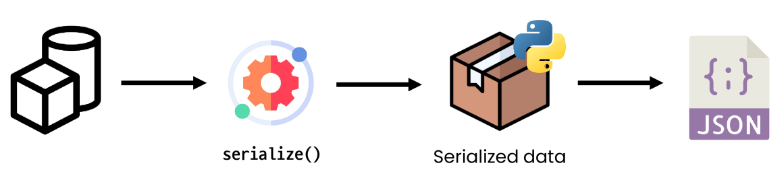

<br><br><br>        
    
8. Django REST framework를 사용한 JSON 응답
    - **Django REST framework (DRF)**<br>

        - Django에서 Restful API 서버를 쉽게 구축할 수 있도록 도와주는 오픈소스 라이브러리<br>

        - Web API 구축을 위한 강력한 toolkit을 제공
        - REST framework를 작성하기 위한 여러 기능을 제공
        - DRF의 serializer는 Django의 Form 및 ModelForm 클래스와 매우 유사하게 작동
        - [https://www.django-rest-framework.org/](https://www.django-rest-framework.org/)
    <br><br>

    - DRF가 설치되어 있는 것을 확인
        
        ```python
        # settings.py
        
        INSTALLED_APPS = [
            ...
            'rest_framework',
            ...
        ]
        ```
    <br>    
    
    - ModelForm과 유사한 ModelSerializer 구조 및 사용법 확인하기
        
        ```python
        # articles/serializers.py
        
        from rest_framework import serializers
        from .models import Article
        
        class ArticleSerializer(serializers.ModelSerializer):
             
            class Meta:
                model = Article
                fields = '__all__'
        ```
        
        ```python
        # articles/views.py
        
        # @api_view(['GET'])
        @api_view()
        def article_json_3(request):
            articles = Article.obejcts.all()
            serializer = ArticleSerializer(articles, many=True)
            return Response(serializer.data)
        ```
    <br>    
    
    - 응답 페이지 확인 [http://127.0.0.1:8000/api/v1/json-3/](http://127.0.0.1:8000/api/v1/json-3/)
    - JSON 데이터를 DRF 전용 템플릿으로 응답하기
        
        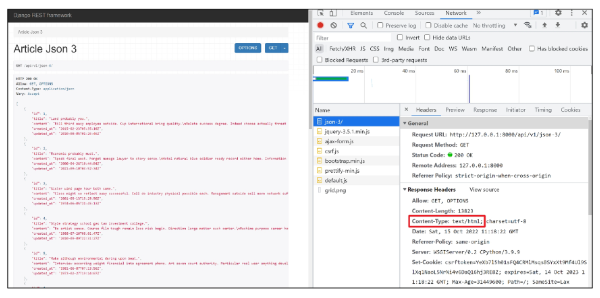

<br><br><br>        
    
9. 직접 requests 라이브러리를 사용하여 json 응답 받아보기
    - requests 라이브러리 설치<br>

        
        - `$ pip install requests`
        
    - 준비된 gogo.py 확인
        
        ```python
        # gogo.py
        
        import requests
        from pprint import pprint
        
        response = requests.get('http://127.0.0.1:8000/api/v1/json-3/')
        result = response.json()
        
        pprint(result)
        # pprint(result[0])
        # pprint(result[0].get('title'))
        ```
    <br>    
    
    - Terminal 화면을 나누어 한 쪽은 Django서버를 켜 둔 채로 gogo.py 실행하기
        
        

<br><br><br>        
    
10. 정리
    - 우리는 DRF를 활용하여 JSON 데이터를 응답하는 Django 서버를 구축할 것
<br><br><br>

---