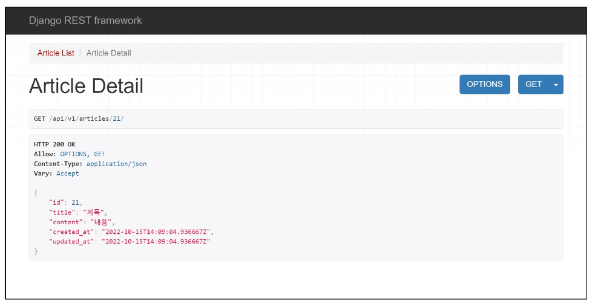

# **Django REST framework - Single Model**

1. 개요
    - 단일 모델의 data를 Serialization하여 JSON으로 변환하는 방법에 대한 학습
<br><br><br>

2. 사전 준비
    - Postman 설치<br>

        - [https://www.postman.com/downloads/](https://www.postman.com/downloads/)
    - Postman
        - API를 구축하고 사용하기 위한 플랫폼<br>

        - API를 빠르게 만들 수 있는 여러 도구 및 기능을 제공
    <br><br>

    - Postman 화면 구성
        
        
    <br><br>    
    
    (1) 준비된 `02_drf` 프로젝트로 진행
    
    (2) 가상환경 생성, 활성화 및 패키지 목록 설치
    
    (3) Article 모델 주석 해제 및 Migraiton 진행
    
    ```python
    # articles/models.py
    
    class Article(models.Model):
        title = models.CharField(max_length=10)
        content = models.TextField()
        created_at = models.DateTimeField(auto_now_add=True)
        updated_at = models.DateTimeField(auto_now=True)
    ```
    

    - `$ python manage.py migrate`
    <br><br>
    
    - 준비된 fixtures 데이터 load
        
        - `$ python manage.py loaddata articles.json`
    <br><br>    
    
    - DRF 설치, 등록 및 패키지 목록 업데이트
        
        - `$ pip install djangorestframework`
        
        ```python
        # settings.py
        
        INSTALLED_APPS = [
            ...
            'rest_framework',
            ...
        ]
        ```
        
        - `$ pip freeze > requirements.txt`
<br><br>

---

## **1. ModelSerializer**

1. ModelSerializer 작성
    - articles/serializers.py 생성<br>

        - serializers.py의 위치나 파일명은 자유롭게 작성 가능
    - ModelSerializer 작성
        
        ```python
        # articles/serializers.py
        
        from rest_framework import serializers
        from .models import Article
        
        class ArticleListSerializer(serializers.ModelSerializer):
        
            class Meta:
                model = Article
                fields = ('id', 'title', 'content',)
        ```
<br><br>        
    
2. ModelSerializer
    - ModelSerializer 클래스는 모델 필드에 해당하는 필드가 있는 Serializer 클래스를 자동으로 만들 수 있는 shortcut을 제공<br>

        - (1) Model 정보에 맞춰 자동으로 필드를 생성<br>

        - (2) serializer에 대한 유효성 검사기를 자동으로 생성
        - (3) `.create` 및 `.update`의 간단한 기본 구현이 포함됨
<br><br><br>    
     
    
3. Serializer 연습하기
    - shell_plus 실행 및 ArticleListSerializer import<br>

        - `$ python [manage.py](http://manage.py) shell_plus`
        - `>>> from articles.serializers import ArticleListSerializer`
    <br><br>

    - 인스턴스 구조 확인
        
        ```python
        >>> serializer = ArticleListSerializer()
        
        >>> serializer
        ArticleListSerializer():
            id = IntegerField(label='ID', read_only=True)
            title = CharField(max_length=10)
            content = CharField(style={'base_template': 'textarea.html'})
        ```
    <br>    
    
    - Model instance 객체 serialize
        
        ```python
        >>> article = Article.objects.get(pk=1)
        
        >>> serializer = ArticleListSerializer(article)
        
        >>> serializer
        ArticleListSerializer(<Article: Article object (1)>):
            id = IntegerField(label='ID', read_only=True)
            title = CharField(max_length=10)
            content = CharField(style={'base_template': 'textarea.html'})
        
        # serialized data 조회
        >>> serializer.data
        {'id': 1, 'title': 'Site teconomic if two country science.' ...}
        ```
    <br>    
    
    - QuerySet 객체 serialize
        
        ```python
        article = Article.objects.all()
        
        # many=True 옵션 X
        >>> serializer = ArticleListSerializer(articles)
        >>> serializer.data
        AttributeError: Got AttributeError when attempting to get a value for field 'title' on serializer 'ArticleListSerializer'.
        The serializer field might be named incorrectly and not match any attribute or key on the 'QuerySey' instance.
        Original exception text was: 'QuerySet' object has no attribute 'title'.
        
        # many=Ture 옵션 O
        >>> serializer = ArticleListSerializer(articles, many=True)
        >>> serializer.data
        [OrderdDict([('id', 1), ('title', 'Live left resesasrch.'), ('content', 'Small drive until back board drive')...])]
        ```
<br><br>        
    
4. ModelSerializer의 **many** option
    - 단일 객체 인스턴스 대신 QuerySet 또는 객체 목록을 serialize 하려면 many=True를 작성해야 함
        
        ```python
        # many 예시
        
        queryset = Book.object.all()
        serializer = BookSerializer(queryset. many=True)
        serializer.data
        # [
        #     {'id': 0, 'title': 'The electric kool-aid acid test', 'author': 'Tom Wolfe'},
        #     {'id': 1, 'title': 'If this is a man', 'author': 'Prime Levi'},
        #     {'id': 2, 'title': 'The wind-up bird chronicle', 'author': 'Haruki Murakami'}
        # ]
        ```
<br><br>

---

## **2. Build RESTful API - Article**

1. URL과 HTTP requests methods 설계
    
    
    |  | GET | POST | PUT | DELETE |
    | --- | --- | --- | --- | --- |
    | articles/ | 전체 글 조회 | 글 작성 | 전체 글 수정 | 전체 글 삭제 |
    | articles/1/ | 1번 글 조회 | . | 1번 글 수정 | 1번 글 삭제 |
<br><br><br>

2. GET - List
    - 게시글 데이터 목록 조회<br>

    - DRF에서 **api_view** 데코레이터 작성은 필수
    
    ```python
    # articles/urls.py
    
    urlpatterns = [
        path('articles/', view.article_list),
    ]
    ```
    
    ```python
    # articles/views.py
    
    from rest_framework.response import Response
    from rest_framework.decorators import api_view
    
    from .models import Article
    from .serializers import ArticleListSerializer
    
    @api_view(['GET'])
    def article_list(request):
        articles = Article.objects.all()
        serializer = ArticleListSerializer(articles, many=True)
        return Response(serializer.data)
    ```
    
    - [http://127.0.0.1:8000/api/v1/articles/](http://127.0.0.1:8000/api/v1/articles/) 응답 확인
        
        
<br><br><br>        
    
3. **‘api_view’** decorator
    - DRF view 함수가 응답해야 하는 HTTP 메서드 목록을 받음<br>

    - 기본적으로 GET 메서드만 허용되며 다른 메서드 요청에 대해서는 405 Method Not Allowed로 응답
<br><br><br>

4. GET - Detail
    - 단일 게시글 데이터 조회하기<br>

    - 각 데이터의 상세 정보를 제공하는 ArticleSerializer 정의
        
        ```python
        # articles/Serializers.py
        
        class ArticleSerializer(serializers.ModelSerializer):
            
            class Meta:
                model = Article
                fields = '__all__'
        ```
    <br>    
    
    - url 및 view 함수 작성
        
        ```python
        # articles/urls.py
        
        urlpatterns = [
            ...
            path('articles/<int:article_pk>/', views.article_detail),
        ]
        ```
        
        ```python
        # articles/views.py
        
        from .serializers import ArticleListSerializer, ArticleSerializer
        
        @api_view(['GET'])
        def article_detail(request, article_pk):
            article = Article.objects.get(pk=article_pk)
            serializer = ArticleSerializer(article)
            return Response(serializer.data)
        ```
    <br>    
    
    - [http://127.0.0.1:8000/api/v1/articles/1/](http://127.0.0.1:8000/api/v1/articles/1/) 응답 확인
        
        
<br><br><br>        
    
5. POST
    - 게시글 데이터 생성하기<br>

    - 요청에 대한 데이터 생성이 성공했을 경우는 201 Created 상태 코드를 응답하고 실패 했을 경우는 400 Bad request를 응답
        
        ```python
        # articles/views.py
        
        from rest_framework import status
        
        @api_view(['GET', 'POST'])
        def article_list(request):
            if request.method == 'GET':
                article = Article.objects.all()
                serializer = ArticleListSerializer(article, many=True)
                return Response(serializer.data)
        
            elif request.method == 'POST':
                serializer = ArticleSerializer(data=request.data)
                if serializer.is_valid():
                    serializer.save()
                    return Response(serializer.data, status=stsatus.HTTP_201_CREATED)
                return Response(serializer.errors, status=status.HTTP_400_BAD_REQUEST)
        ```
    <br>    
    
    - POST [http://127.0.0.1:8000/api/v1/articles/](http://127.0.0.1:8000/api/v1/articles/) 응답 확인
        
        
    <br><br>    
    
    - 새로 생성된 데이터 확인 해보기
        
        
<br><br><br>        
    
6. Raising an exception on invalid data
    - “유효하지 않은 데이터에 대해 예외 발생시키기”<br>

    - is_valid()는 유효성 검사 오류가 있는 경우 ValidationError 예외를 발생시키는 선택적 raise_exception 인자를 사용할 수 있음
    - DRF에서 제공하는 기본 예외 처리기에 의해 자동으로 처리되며 기본적으로 HTTP 400 응답을 반환
    - view 함수 코드 변경
        
        ```python
        # articles/views.py
        
        @api_view(['GET', 'POST'])
        def article_list(request):
            ...
        
            elif request.method == 'POST':
                serializer = ArticleSerializer(data=request.data)
                if serializer.is_valid(raise_exception=True):
                    serializer.save()
                    return Response(serializer.data, status=stsatus.HTTP_201_CREATED)
        ```
<br><br>        
    
7. DELETE
    - 게시글 데이터 삭제하기<br>

    - 요청에 대한 데이터 삭제가 성공했을 경우는 204 No Content 상태 코드 응답 (명령을 수행했고 더 이상 제공할 정보가 없는 경우)
        
        ```python
        # articles/views.py
        
        @api_view(['GET', 'DELETE'])
        def article_detail(request, article_pk):
            article = Article.objects.get(pk=article_pk)
            if request.method == 'GET':
                serializer = ArticleSerializer(article)
                return Response(serializer.data)
        
            elif request.method == 'DELETE':
                article.delete()
                return Response(status=status.HTTP_204_NO_CONTENT)
        ```
        
    - DELETE [http://127.0.0.1:8000/api/v1/articles/21/](http://127.0.0.1:8000/api/v1/articles/21/) 응답 확인
        
        
<br><br><br>        
    
8. PUT
    - 게시글 데이터 수정하기<br>

    - 요청에 대한 데이터 수정이 성공했을 경우는 200 OK 상태 코드로 응답
        
        ```python
        # articles/views.py
        
        @api_view(['GET', 'DELETE', 'PUT'])
        def article_detail(request, article_pk):
            ...
        
            elif request.method == 'PUT':
                serializer = ArticleSerializer(article, data=request.data)
                # serializer = ArticleSerializer(instance=article, data=request.data)
                if serializer.is_valid(raise_exception=True):
                    serializer.save()
                    return Response(serializer.data)
        ```
    <br>    
    
    - PUT [http://127.0.0.1:8000/api/v1/articles/1/](http://127.0.0.1:8000/api/v1/articles/1/) 응답 확인
        
        
    <br><br>

    - 수정된 데이터 확인 해보기
        
        
<br><br><br>        

---