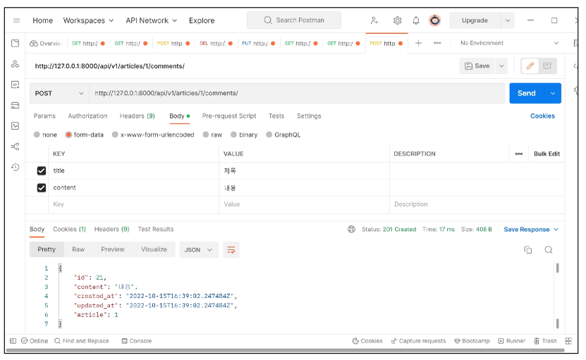

# **Django REST framework - N:1 Relation**

1. 개요
    - N:1 관계에서의 모델 data를 Serialization하여 JSON으로 변환하는 방법 학습
<br><br><br>

2. 사전 준비
    - Comment 모델 주석 해제 및 데이터베이스  초기화
        
        ```python
        # articles/models.py
        
        class Comment(models.Model):
            article = models.ForeignKey(Article, on_delete=models.CASCADE)
            content = models.TextField()
            created_at = models.DateTimeField(auto_now_add = True)
            updated_at = models.DateTimeField(auto_not=True)
        ```
        
    - Migration 진행
        
        ```python
        $ python manage.py makemigrations
        $ python manage.py migrate
        ```
        
    - 준비된 fixtures 데이터 load
        
        ```python
        $ python manage.py loaddata articles.json comments.json
        ```
<br><br>        
    
3. GET - List
    - 댓글 데이터 목록 조회하기<br>

    - Article List와 비교하며 작성해보기
        
        ```python
        # articles/serializers.py
        
        from .models import Article, Comment
        
        class CommentSerializer(serializers.ModelSeriaizer):
            
            class Meta:
                model = Comment
                fields = '__all__'
        ```
        
        ```python
        # articles/urls.py
        
        urlpatterns = [
            ...,
            path('comments/', views.comment_list),
        ]
        ```
        
        ```python
        # articles/views.py
        
        from .models import Article, Comment
        from .serializers import ArticleListSerializer, ArticleSerializer, CommentSerializer
        
        @api_view(['GET'])
        def comment_list(request):
            comments = Comment.objects.all()
            serializer = CommentSerializer(comments, many=True)
            return Response(serializer.data)
        ```
    <br>    
    
    - GET [http://127.0.0.1:8000/api/v1/comments/](http://127.0.0.1:8000/api/v1/comments/) 응답 확인
        
        
<br><br><br>        
    
4. GET - Detail
    - 단일 댓글 데이터 조회하기<br>

    - Article과 달리 같은 serializer 사용하기
        
        ```python
        # articles/urls.py
        
        urlpatterns = [
            ...,
            path('comments/<int:comment_pk>/', views.comment_detail),
        ]
        ```
        
        ```python
        # articles/views.py
        
        @api_view(['GET'])
        def comment_detail(request, comment_pk):
            comment = Comment.objects.get(pk=comment-pk)
            serializer = CommentSerializer(comment)
            return Response(serializer.data)
        ```
    <br>    
    
    - GET [http://127.0.0.1:8000/api/v1/comments/1/](http://127.0.0.1:8000/api/v1/comments/1/) 응답 확인
        
        
<br><br><br>        
    
5. POST
    - 단일 댓글 데이터 생성하기
        
        ```python
        # articles/urls.py
        
        urlpatterns = [
           ...,
            path('articles/<int:article_pk>/comments/', views.comment_create),
        ]
        ```
        
        ```python
        # articles/view.py
        
        @api_view(['POST'])
        def comment_create(request, article_pk):
            article = Article.objects.get(pk=article_pk)
            serializer = CommentSerializer(data=request.data)
            if serializer.is_valid(raise_exception=True):
                serializer.save()
                return Response(serializer.data, status=status.HTTP_201_CREATED)
        ```
<br><br>        
    
6. Passing Additional attributes to **.save()**
    - `.save()` 메서드는 특정 Serializer 인스턴스를 저장하는 과정에서 추가적인 데이터를 받을 수 있음<br>

    - `CommentSerializer`를 통해 Serialize되는 과정에서 Parameter로 넘어온 `article_pk`에 해당하는 article 객체를 추가적인 데이터를 넘겨 저장
        
        ```python
        # articles/views.py
        
        @api_view(['POST'])
        def comment_create(request, article_pk):
            article = Article.objects.get(pk=article_pk)
            serializer = CommentSerializer(data=request.data)
            if serializer.is_valid(raise_exception=True):
                serializer.save(article-article)
                return Response(serializer.data, status=status.HTTP_201_CREATED)
        ```
<br><br>        
    
7. POST
    - POST [http://127.0.0.1:8000/api/v1/articles/1/comments/](http://127.0.0.1:8000/api/v1/articles/1/comments/) 응답 확인<br>

        
        
        
    - 에러 이유
        - CommentSerializer에서 article field 데이터 또한 사용자로부터 입력 받도록 설정되어 있기 때문
<br><br><br>

8. 읽기 전용 필드 설정
    - **read_only_fields**를 사용해 외래 키 필드를 **‘읽기 전용 필드’**로 설정<br>

    - 읽기 전용 필드는 데이터를 전송하는 시점에 **’해당 필드를 유효성 검사에서 제외시키고 데이터 조회 시에는 출력’**하도록 함
        
        ```python
        # articles/serializer.py
        
        class CommentSerializer(serializers.ModelSerialzier):
        
            class Meta:
                model = Comment
                fields = '__all__'
                read_only_fields = ('article',)
        ```
<br><br>        
    
9. POST
    - POST [http://127.0.0.1:8000/api/v1/articles/1/comments/](http://127.0.0.1:8000/api/v1/articles/1/comments/) 응답 재확인
        
        
<br><br><br>        
    
10. DELETE & PUT
    
    ```python
    # articles/views.py
    
    @api_view(['GET', 'DELETE', 'PUT'])
    def comment_detail(request, comment_pk):
        comment = Comment.objects.get(pk=comment-pk)
        if request.method == 'GET':
            serializer = CommentSerializer(comment)
            return Response(serializer.data)
    
        elif request.method == 'DELETE':
            comment.delte()
            return Response(status=status.HTTP_204_NO_CONTENT)
    
        elif request.method == 'PUT':
            serializer = CommentSerializer(comment, data=request.data)
            if serializer.is_valid(raise_exception=True):
                serializer.save()
                return Response(serializer.data)
    ```
<br><br>

11. DELETE
    - DELETE [http://127.0.0.1:8000/api/v1/comments/21/](http://127.0.0.1:8000/api/v1/comments/21/) 응답 확인
        
        
<br><br><br>        
    
12. PUT
    - PUT [http://127.0.0.1:8000/api/v1/comments/1/](http://127.0.0.1:8000/api/v1/comments/1/) 응답 확인
        
        
<br><br><br>        

---

## **1. N:1 - 역참조 데이터 조회**

1. 개요
    - (1) 특정 게시글에 작성된 댓글 목록 출력하기<br>

        - 기존 필드 override
    - (2) 특정 게시글에 작성된 댓글의 개수 출력하기
        - 새로운 필드 추가
<br><br><br>

2. 특정 게시글에 작성된 댓글 목록 출력하기
    - 기존 필드 override - Article Detail<br>

        - “게시글 조회 시 해당 게시글의 댓글 목록까지 함께 출력하기”<br>

        - Serializer는 기존 필드를 override 하거나 추가적인 필드를 구성할 수 있음
    <br><br>

    - (1) `PrimaryKeyRelatedField()`
        
        ```python
        # articles/serializers.py
        
        class ArticleSerializer(serializers.ModelSerializer):
            comment_set = serializers.PrimaryKeyRelatedField(many=True, read_only=True)
        
            class Meta:
                model = Article
                fields = '__all__'
        ```
        
        - 댓글이 있는 게시글 응답 예시
            
            
    <br><br>        
    
    - models.py에서 `related_name`을 통해 이름 변경 가능
    - 역참조 시 생성되는 `comment_set`을 override 할 수 있음
        
        ```python
        # articles/models.py
        
        class Comment(models.Model):
            article= models.ForeignKey(Article, on_delete=models.CASCADE, related_name='comments')
            content = models.TextField()
            created_at = models.DateTimeField(auto_not_add=True)
            updated_at = models.DateTimeField(auto_not=True)
        ```
        
    - 작성 후 삭제
    <br><br>

    - (2) Nested relationships
        
        ```python
        # articles/serializers.py
        
        class CommentSerializer(serializers.ModelSerializer):
        
            class Meta:
                model = Comment
                fields = '__all__'
                read_only_fields = ('article',)
        
        class ArticleSerializer(serializers.ModelSerializer):
            comment_set = CommentSerializer(many=True, read_only=True)
        
            class Meta:
                model = Article
                fields = '__all__'
        ```
        
        - 모델 관계 상으로 참조 된 대상은 참조하는 대상의 표현에 포함되거나 중첩(nested)될 수 있음<br>

        - 이러한 중첩된 관계는 serializers를 필드로 사용하여 표현할 수 있음
        - 두 클래스의 상/하 위치를 변경해야 함
        - 댓글이 있는 게시글 응답 예시
            
            
<br><br><br>            
    
3. 특정 게시글에 작성된 댓글 개수 출력하기
    - 새로운 필드 추가 - Article Detail
        - “게시글 조회 시 해당 게시글의 댓글 개수까지 함께 출력하기”
        
        ```python
        # articles/serializers.py
        
        class ArticleSerializer(serializers.ModelSerializer):
            comment_set = CommentSerializer(many=True, read_only=True)
            comment_count = serializers.IntegerField(source='comment_set.count', read_only=True)
        
            class Meta:
                model = Article
                fields = '__all__'
        ```
    <br>    
    
    - **source**
        - serializers field’s argument<br>

        - 필드를 채우는 데 사용할 속성의 이름
        - 점 표기법(dotted notation)을 사용하여 속성을 탐색할 수 있음
    <br><br>
    - 댓글이 있는 게시글 응답 예시
        
        
<br><br><br>        
    
4. [주의] 일기 전용 필드 지정 이슈
    - 특정 필드를 override 혹은 추가한 경우 `read_only_fields`가 동작하지 않으니 주의
        
        ```python
        # 사용 불가능
        
        class ArticleSerializer(serializers.ModelSerializer):
            comment_set = CommentSerializer(many=True)
            comment_count = serializers.IntegerField(source='comment_set.count')
        
            class Meta:
                model = Article
                fields = '__all__'
                read_only_fields = ('comment_set', 'comment_count',)
        ```
<br><br>

---

## **2. Django shortcuts functions**

1. 개요
    - `django.shortcuts` 패키지는 개발에 도움 될 수 있는 여러 함수와 클래스를 제공<br>

    - 제공되는 shortcuts 목록
        - `render()`, `redirect()`, `get_object_or_404()`, `get_list_or_404()`<br>

        - [https://docs.djangoproject.com/en/3.2/topics/http/shortcuts/](https://docs.djangoproject.com/en/3.2/topics/http/shortcuts/)
<br><br><br>

2. `get_object_or_404()`
    - 모델 manager objects에서 **get()**을 호출하지만, 해당 객체가 없을 땐 기존 DoesNotExist 예외 대신 Http404를 raise 함
        
        ```python
        # articles/view.py
        
        from django.shortcuts import get_object_or_404
        
        article = Article.objects.get(pk=article_pk)
        comment = Comment.objects.get(pk=comment_pk)
        
        # 위 코드를 모두 다음과 같이 변경
        article = get_object_or_404(Article, pk=article_pk)
        comment = get_object_or_404(Comment, pk=comment_pk)
        ```
<br><br>        
    
3. `get_list_or_404()`
    - 모델 manager objects에서 **filter()**의 결과를 반환하고 해당 객체 목록이 없을 땐 Http404를 raise 함
        
        ```python
        # articles/views.py
        
        from django.shortcuts import get_object_or_404, get_list_or_404
        
        articles = Article.objects.all()
        comments = Comment.objects.all()
        
        # 위코드를 모두 다음과 같이 변경
        articles = get_list_or_404(Article)
        comments = get_list_or_404(Comment)
        ```
<br><br>        
    
4. 적용 전/후 비교
    - 존재하지 않는 게시글 조회 시 이전에는 500 상태코드를 응답했지만 현재는 404 상태코드를 응답
        
        
<br><br><br>        
    
5. 왜 사용해야 할까?
    - 클라이언트 입장에서 “서버에 오류가 발생하여 요청을 수행할 수 없다(500)”라는 원인이 정확하지 않은 에러를 마주하기 보다는, 서버가 적절한 예외 처리를 하고 클라이언트에게 올바른 에러를 전달하는 것 또한 중요한 요소
<br><br><br>

---