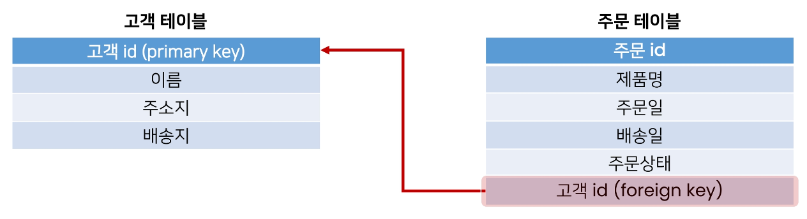
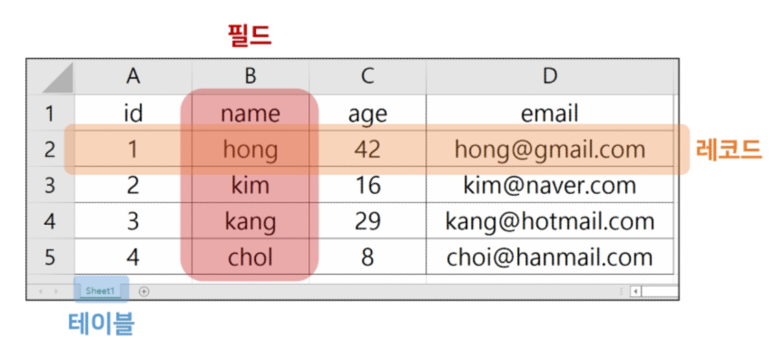
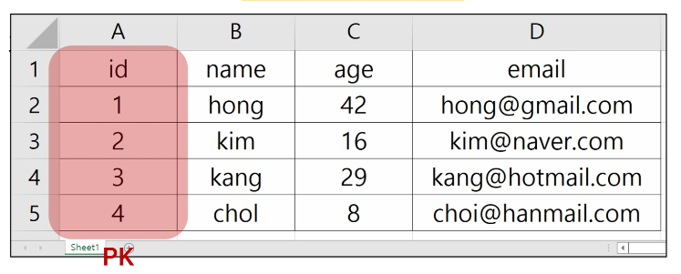

# **Database**

## **1. Intro**

1. 데이터베이스의 등장
    - 파일을 이용한 데이터 관리 

        - 우리는 일반적으로 데이터를 **파일**에 저장한다. 

        - 장점
            - 운영체제에 관계 없이 어디에서나 쉽게 사용가능 

            - 이메일이나 메신저를 이용해 간편하게 전송 가능
        - 단점
            - 선능과 보안적 측면에서 한계가 명확 

            - 대용량 데이터를 다루기에 적합하지 않음
            - 데이터를 구조적으로 정리하기에 어려움
            - 확장이 불가능한 구조
    
    - **스프레드 시트**를 이용한 데이터 관리 

        - 스프레드 시트(엑셀 시트)을 사용 

        - 스프레드 시트는 컬럼(열)을 통해 데이터의 유형을 지정하고 레코드(행)을 통해 구체적인 데이터 값을 포함
        - 스프레드 시트 자체를 데이터베이스라고 부를 수는 없지만 데이터베이스로 가는 길목정도로 생각해볼 수 있음
    
    - 스프레드 시트와 달리 프로그래밍 언어를 사용해 작동 시킬 수 있음
    - 데이터베이스는 많은 형태가 있지만 실제 가장 많이 쓰이는 유형은 RDB(Relational Database)라고 부르는 **관계형 데이터베이스**
    - RDB는 각각의 데이터를 테이블에 기입함 (마치 스프레드 시트에 작성하는 것처럼)
    - 쉽게 생각하면 스프레드시트 파일 모음을 관계형 RDB라고 생각하자!
   

2. Database 학습 목표
    - 데이터베이스를 사용하면 데이터를 안전하고 편리하고 빠르게 보관하고 사용할 수 있음 

    - 거대하고 복잡하고 데이터를 다루기 위해서 고안된 도구이기 때문에 매우 많은 기능을 제공
        - 기능이 많다 == 데이터 관련해서 할 수 있는 일들이 많다. 

        - 모든 기능을 학습하는 것은 불필요함 == 우선 기초적인 부분에 집중하자
    - DB 학습의 기초
        - “데이터베이스에 데이터를 어떻게 **입력**(저장, 수정, 삭제)하고, 어떻게 **출력**(조회)하는가” 

    - 즉 데이터베이스에서의 CRUD와 여러 키워드들 위주로 학습할 예정
   
    
3. Database 정의
    - 체계화된 데이터의 모임 

    - 여러 사람이 공유하고 사용할 목적으로 통합 관리되는 정보의 집합
    - 검색, 구조화 같은 작업을 보다 쉽게 하기 위해 조직화된 데이터를 수집하는 저장 시스템
        - 내용을 고도로 구조화 함으로써 검색과 갱신의 효율화를 꾀한 것 

        - 즉, 자료 파일을 조직적으로 통합하여 자료 항목의 중복을 없애고 구조화하여 기억시켜 높은 자료의 집합체
    - 이러한 Database를 조작하는 프로그램 = DBMS(Database Management System)
        - 한 번쯤 들어봤을 Oracle, MySQL, SQLite, … 등이 모두 DBMS 

        - DBMS에서 Database를 조작하기 위해 사용하는 언어를 SQL이라 함
    - 웹 개발에서 대부분의 데이터베이스는 ‘관계형 데이터베이스 관리 시스템(RDBMS)’을 사용하여 SQL로 데이터와 프로그래밍을 구성
   

---

## **2. RDB**

1. RDB란
    - Relational Database (관계형 데이터베이스) 
    
    - 데이터를 테이블, 행, 열 등으로 나누어 구조화 하는 방식
    - 자료를 여러 테이블로 나누어서 관리하고, 이 테이블간 관계를 설정해 여러 데이터를 쉽게 조작할 수 있다는 장점이 있음
    - SQL을 사용해서 데이터를 조회하고 조작
   

2. [참고] 테이블간 관계 설정 예시
    
    
    
    - 고객 테이블에서 고객 ID는 고객이 관계형 데이터베이스에서 고유하게 식별되는 기본 키(primary key) 

    - 주문 테이블에서 특정 주문을 식별하는 기본 키는 주문 ID
        - 외래 키(foreign key)를 사용하여 고객 테이블의 고객 ID를 연결하여 고객을 주문과 연결할 수 있음 

    - 이 관계를 통해 특정 날짜와 구매한 모든 고객에 관한 정보를 조회하거나 지난 달에 배송일이 지연된 주문을 받은 고객을 파악하거나 할 수 있음
    - 외래 키 개념 및 RDB 모델에 관련된 자세한 사항은 추후 Django 모델 관계에서 진행
   

3. RDB 기본 구조
    - 스키마 

    - 테이블
        - 필드 

        - 레코드
        - 기본 키
   

4. 스키마(Schema)
    - 테이블의 구조(Structure) 

    - 데이터베이스에서 자료의 구조, 표현 방법, 관계 등 전반적인 명세를 기술한 것
    
    | column | datatype |
    | --- | --- |
    | id | INTEGER |
    | name | TEXT |
    | address | TEXT |
    | age | INTEGER |
   

5. 테이블(Table)
    - 필드와 레코드를 사용해 조직된 데이터 요소들의 집합 

    - 관계(Relation)라고도 부름
    
    
    
    - 필드(field)
        - 속성, 컬럼(Column)
    - 레코드(record)
        - 튜플, 행(Row)
   

6. 레코드(record)
    - 튜플 혹은 행(row) 

    - 테이블의 데이터는 레코드에 저장됨
   

7. PK(Primary Key)
    
    
    
    - 기본 키 

    - 각 레코드의 고유한 값
        - 각각의 데이터를 구분할 수 있는 고윳값
    - 기술적으로 다른 항목과 절대로 중복될 수 없는 단일 값(unique)
    - 데이터베이스 관리 및 테이블 (짤림)
   

8. 관계형 데이터베이스의 이점
    - 데이터를 직관적으로 표현할 수 있음 

    - 관련한 각 데이터에 쉽게 접근할 수 있음
    - 대량의 데이터도 효율적으로 관리 가능
   

9. RDBMS
    - Relational Database Management System (관계형 데이터베이스 관리 시스템) 

    - 관계형 데이터베이스를 만들고 업데이트하고 관리하는 데 사용하는 프로그램
    - 예시
        - **SQLite**, MySQL, PostgreSQL, Microsoft SQL Server, Oracle Database 등
   

10. SQLite
    - 응용프로그램에 파일 형식으로 넣어 사용하는 비교적 가벼운 데이터베이스 

    - 인드로이드, iOS, macOS에 기본적으로 탑재되어 있으며 임베디드 소프트웨어에서도 많이 활용됨
    - 오픈 소스 프로젝트이기 때문에 자유롭게 사용가능
   

11. SQLite 단점
    - 대규모 동시 처리 작업에는 적합하지 않음 

    - 다른 RDMBS에서 지원하는 SQL 기능을 지원하지 않을 수 있음
   

12. SQLite를 학습하는 이유
    - 어떤 환경에서나 실행 가능한 호환성 

    - 데이터 타입이 비교적 적고 강하지 않기 때문에 유연한 학습 환경을 제공
    - Django Framework의 기본 데이터베이스
   

---

