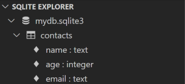
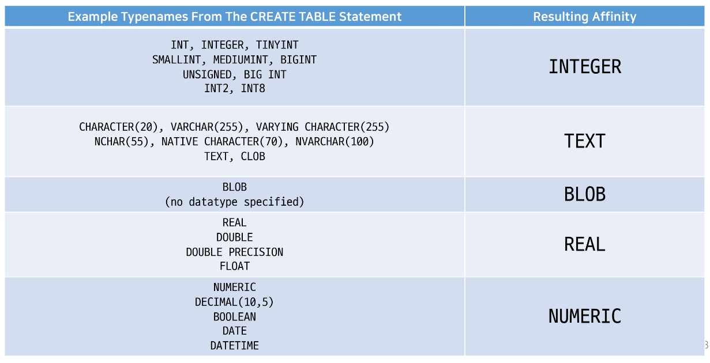
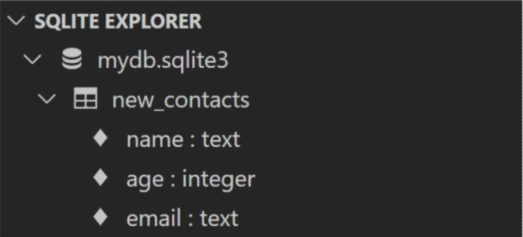
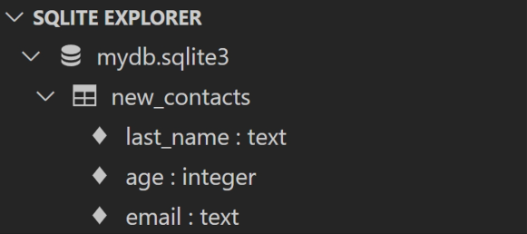
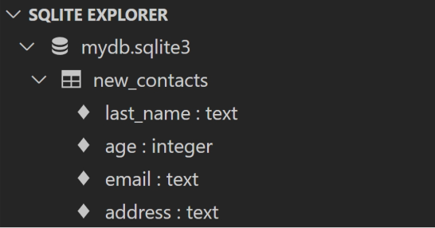
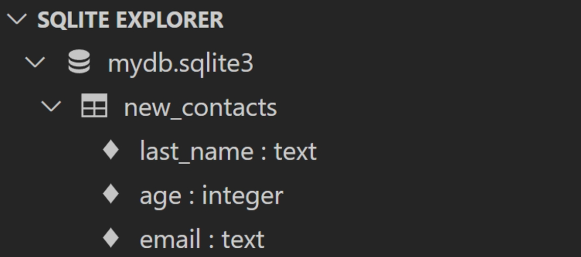
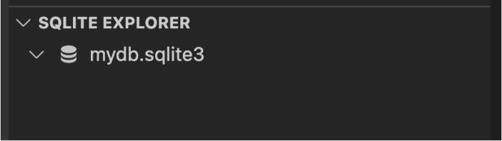

# **DDL (Data Definition Language)**

- 사전 준비
    - 데이터베이스 mydb.sqlite3 파일 생성<br>

    - DDL.sql 파일 생성
    - vscode 실행 후 DDL.sql 화면에서 마우스 우측 버튼 클릭
        - Use Database 선택
    - 데이터베이스 목록에서 mydb.sqlite3 선택
<br><br><br>

- 개요
    - “Data definition”<br>

    - SQL 데이터 정의 언어를 사용하여 테이블 데이터베이스 개체를 만드는 방법을 학습
    - DDL은 테이블 구조를 관리
        - CREATE, ALTER, DROP
<br><br><br>

---

## **1. CREATE TABLE**

1. CREATE TABLE statement
    - “Create a new table in the database”<br>

    - 데이터베이스에 새 테이블을 만듦
        
        ```sql
        CREATE TABLE table_name (
        	column_1 data_type constraints,
        	column_2 data_type constraints,
        	column_3 data_type constraints
        );
        ```
<br><br>        
    
2. CREATE TABLE 실습
    - contacts 테이블 생성<br>

      
        ```sql
        -- DDL.sql
        
        CREATE TABLE contacts (
        	name TEXT NOT NULL,
        	age INTEGER NOT NULL,
        	email TEXT NOT NULL UNIQUE
        );
        ```
        
    
    - Query 실행하기
        - 실행하고자 하는 명령문에 커서를 두고 마우스 우측 버튼
            
            → ‘Run Selected Query’ 선택
            
        - 명령문을 모두 선택할 필요 없으며, 실행하고자 하는 명령문 안에 커서가 올라가 있으면 가능
    
    - 쿼리 실행 후 테이블 및 스키마 확인
        
        
        
    - id 컬럼은 우리가 직접 기본 키 역할의 컬럼을 정의하지 않으면 자동으로 **rowid**라는 컬럼으로 만들어짐<br>

    - rowid에 대한 자세한 사항은 이어지는 주제에서 자세히 다룸
    - 먼저 테이블을 생성하면서 작성한 **데이터 타입**과 **제약조건**을 알아본다.
<br><br><br>

---

## **2. SQLite Data Types**

1. Data Types 종류
    - NULL<br>

        - NULL value<br>

        - 정보가 없거나 알 수 없음을 의미 (missing information or unknown)
    - INTEGER
        - 정수<br>

        - 크기에 따라 0, 1, 2, 3, 4, 6 또는 8바이트와 같은 가변 크기를 가짐
    - REAL
        - 실수<br>

        - 8바이트 부동 소수점을 사용하는 10진수 값이 있는 실수
    - TEXT
        - 문자 데이터
    - BLOB(Binary Large Object)
        - 입력된 그대로 저장된 데이터 덩어리 (대용 타입 없음)<br>

        - 바이너리 등 멀티미디어 파일
        - 예시
            - 이미지 데이터
<br><br><br>

2. [참고] Boolean type
    - SQLite에는 별도의 Boolean 타입이 없음<br>

    - 대신 Boolean 값은 정수 0(false)과 1(true)로 저장됨
<br><br><br>

3. [참고] Data & Time Datatype
    - SQLite에는 날짜 및 시간을 저장하기 위한 타입이 없음<br>

    - 대신 SQLite의 built-in “Data And Time Functions”으로 TEXT, REAL 또는 INTEGER 값으로 저장할 수 있음
    - [https://www.sqlite.org/lang_datefunc.html](https://www.sqlite.org/lang_datefunc.html)
<br><br><br>

4. [참고] Binary Data
    - 데이터의 저장과 처리를 목적으로 0과 1의 이진 형식으로 인코딩 된 파일<br>

    - 기본적으로 컴퓨터의 모든 데이터는 binary data
        - 다만, 이를 필요에 따라서 텍스트 타입으로 변형해서 사용하는 것
<br><br><br>

5. SQLite는 다음 규칙을 기반으로 데이터 타입을 결정
    - 값에 둘러싸는 따옴표와 소수점 또는 지수가 없으면 - **INTEGER**<br>

    - 값이 작은 따옴표나 큰따옴표에 묶이면 - **TEXT**
    - 값에 따옴표나 소수점, 지수가 없으면 - **REAL**
    - 값이 따옴표 없이 NULL이면 - **NULL**
<br><br><br>

6. SQLite Datatypes 특징
    - SQLite는 다른 모든 SQL 데이터베이스 엔진(MySQL, PostgreSQL 등)의 정적이고 엄격한 타입(static, rigid typing)이 아닌 **동적 타입 시스템**(dynamic type system)을 사용<br>

        - 컬럼에 선언된 데이터 타입에 의해서가 아니라 **컬럼에 저장된 값에 따라 데이터 타입이 결정**됨
    <br><br>

    - 또한 테이블을 생성할 때 컬럼에 대해 특정 데이터 타입을 선언하지 않아도 됨
        - 예를 들어 동일한 컬럼에 정수 1을 넣을 경우 INTEGER로 타입이 지정되고, 문자 ‘1’을 넣을 경우는 TEXT 타입으로 지정됨<br>

        - 이러한 SQLite의 동적 타입 시스템을 사용하면 기존의 엄격하게 타입이 지정된 데이터베이스에서는 불가능한 작업을 유연하게 수행할 수 있음
        - 게다가 정적 타입 시스템이 지정된 데이터베이스에서 작동하는 SQL 문이 SQLite에서 동일한 방식으로 작동한다는 점
        - 다만 이는 다른 데이터베이스와의 호환성 문제가 있기 때문에 테이블 생성 시 **데이터 타입을 지정하는 것을 권장**
    <br><br>
    - 데이터 타입을 지정하게 되면 SQLite는 입력된 데이터의 타입을 지정된 데이터 타입으로 변환
        - 예를 들어 TEXT 타입 컬럼에 정수 1을 저장할 경우 문자 타입의 ‘1’로 저장됨
        - 허용 가능한 타입 변환은 다음과 같음
            
            
            | Column Datatype | Types Allowed In That Column |
            | --- | --- |
            | INTEGER | INTEGER, REAL, TEXT, BLOB |
            | REAL | REAL, TEXT, BLOB |
            | TEXT | TEXT, BLOB |
            | BLOB | INTEGER, REAL, TEXT, BLOB |
<br><br>

7. [참고] “static, rigid typing” 데이터베이스
    - statically, rigidly, typed databases 라고도 부름<br>
    - 저장되는 값의 데이터 타입은 컬럼에 선언된 데이터 타입에 의해 결정된다.
    - 동작 예시
        
        ```sql
        CREATE TABLE my_table (
        	a INTEGER NOT NULL,
        	b TEXT NOT NULL,
        );
        ```
        
    - 만약 a 컬럼에 ‘123’, b 컬럼에 456 데이터를 삽입하려는 경우 삽입을 수행하기 전에 문자열 ‘123’을 정수 123으로 변환하고, 정수 456을 문자열 ‘456’으로 변환
<br><br><br>

8. Type Affinity
    - “타입 선호도”<br>

    - 특정 컬럼에 저장된 데이터에 권장되는 타입
    - 데이터 타입 작성 시 SQLite의 5가지 데이터 타입이 아닌 다른 데이터 타입을 선언한다면, 내부적으로 각 타입의 지정된 선호도에 따라 5가지 선호도로 인식됨
        - INTEGER<br>

        - TEXT
        - BLOB
        - REAL
        - NUMERIC
    
    
    
    - 타입 선호도 존재 이유
        - 다른 데이터베이스 엔진 간의 **호환성**을 최대화<br>

        - 정적이고 엄격한 타입을 사용하는 데이터베이스의 SQL문을 SQLite에서도 작동하도록 하기 위함
<br><br><br>

---

## **3. Constraints**

1. 개요
    - “제약조건”<br>

    - 입력하는 자료에 대한 제약을 정함
    - 제약에 맞지 않다면 입력이 거부됨
    - 사용자가 원하는 조건의 데이터만 유지하기 위한 즉, 데이터의 무결성을 유지하기 위한 보편적인 방법으로 테이블의 특정 컬럼에 설정하는 제약
<br><br><br>

2. 데이터의 무결성
    - 데이터 베이스 내의 데이터에 대한 정확성, 일관성을 보장하기 위해 데이터 변경 혹은 수정 시 여러 제한을 두어 데이터의 정확성을 보증하는 것<br>

        - 무결성이란 데이터의 정확성, 일관성을 나타냄
    - 데이터베이스에 저장된 데이터의 무결성을 보장하고 데이터베이스의 상태를 일관되게 유지하는 것이 목적
<br><br><br>

3. Constraints 종류
    - `NOT NULL`<br>

        - 컬럼이 NULL 값을 허용하지 않도록 지정<br>

        - 기본적으로 테이블의 모든 컬러은 NOT NULL 제약 조건을 명시적으로 사용하는 경우를 제외하고는 NULL 값을 허용함
    - `UNIQUE`
        - 컬럼의 모든 값이 서로 구별되거나 고유한 값이 되도록 함
    - `PRIMARY KEY`
        - 테이블에서 행의 고유성을 식별하는 데 사용되는 컬럼
        - 각 테이블에는 하나의 기본 키만 있음
        - 암시적으로 NOT NULL 제약 조건이 포함되어 있음
            
            ```sql
            -- 예시
            
            CREATE TABLE table_name (
            	id integer PRIMARY KEY,
            	..
            );
            ```
            
            → 주의) INTEGER 타입에만 사용가능 (INT BIGINT 등 불가능)
            
    - `AUTOINCREMENT`
        - 사용되지 않은 값이나 이전에 삭제된 행의 값을 재사용하는 것을 방지
        - INTEGER PRIMARY KEY 다음에 작성하면 해당 word를 다시 재사용하지 못하도록 함
            
            ```sql
            -- 예시
            
            CREATE TABLE table_name (
            	id INTEGER PRIMARY KEY AUTOINCREMENT,
            	..
            );
            ```
            
        - Django에서 테이블 생성 시 id 컬럼에 기본적으로 사용하는 제약조건
    - 그외 기타 `Constraints`
<br><br><br>

4. rowid의 특징
    - 테이블을 생성할 때마다 rowid라는 암시적 자동 증가 컬럼이 자동으로 생성됨<br>

    - 테이블의 행을 고유하게 식별하는 64비트 부호 있는 정수 값
    - 테이블에 새 행을 삽입할 때마다 정수 값을 자동으로 할당
        - 값은 1에서 시작<br>

        - 데이터 삽입 시에 rowid 또는 INTEGER PRIMARY KEY 컬럼에 명시적으로 값이 지정되지 않은 경우, SQLite는 테이블에서 가장 큰 rowid보다 하나 큰 다음 순차 정수를 자동으로 할당 (AUTOINCREMENT와 관계없이)
    <br><br>

    - 만약 INTEGER PRIMARY KEY 키워드를 가진 컬럼을 직접 만들면 이 컬럼은 rowid 컬럼의 별칭(alias)이 됨
        - 즉, 새 컬럼 이름으로 rowid에 액세스 할 수 있으며 rowid 이름으로도 여전히 액세스 가능
    - 데이터가 최대 값에 도닥하고 새 행을 삽입하려고 하면 SQLite는 사용되지 않는 정수를 찾아 사용 (Limits in SQLite - [https://www.sqlite.org/limits.html](https://www.sqlite.org/limits.html))
    - 만약 SQLite가 사용되지 않은 정수를 찾을 수 없으면 SQLITE_FULL 에러가 발생
        - 또한 일부 행을 삭제하고 새 행을 삽입하려면 SQLite는 삭제된 행에서 rowid 값을 재사용하려고 시도
<br><br><br>

---

## **4. ALTER TABLE**

1. 개요
    - “Modify the structure of an existing table.”<br>

    - 기존 테이블의 구조를 수정(변경)
    - SQLite의 ALTER TABLE 문을 사용하면 기존 테이블을 다음과 같이 변경할 수 있음
        - **Rename** a table<br>

        - **Rename** a column (3.20.0 에서 추가됨)
        - **Add** a new column to a table
        - **Delete** a column (3.35.0 에서 추가됨)
    - [https://www.sqlite.org/lang_altertable.html](https://www.sqlite.org/lang_altertable.html)
<br><br><br>

2. ALTER TABLE statement 예시
    
    ```sql
    -- 1. Rename a table
    ALTER TABLE table_name RENAME TO new_table_name;
    
    -- 2. Rename a column
    ALTER TABLE table_name RENAME COLUMN column_name TO new_column_name;
    
    -- 3. Add a new column to a table
    ALTER TABLE table_name ADD COLUMN column_definition;
    
    -- 4. Delete a column
    ALTER TABLE table_name DROP COLUMN column_name;
    ```
<br><br>

3. ALTER TABLE RENAME
    - “Rename a table” (테이블명 변경)<br>

    - 작성 및 결과 확인
        
        ```sql
        -- DDL.sql
        
        ALTER TABLE contacts RENAME TO new_contacts;
        ```
        
        
<br><br><br>

4. ALTER TABLE RENAME COLUMN
    - “Rename a column” (컬럼명 변경)<br>

    - 작성 및 결과 확인
        
        ```sql
        -- DDL.sql
        
        ALTER TABLE new_contacts RENAME COLUMN name TO last_name;
        ```
        
        
<br><br><br>        
    
5. ALTER TABLE ADD COLUMN
    - “Add a new column to a table” (새 컬럼 추가)<br>

    - 작성 및 결과 확인
        
        ```sql
        -- DDL.sql
        
        ALTER TABLE new_contacts ADD COLUMN address TEXT NOT NULL;
        ```
        
        
    <br><br>    
    
    - 현재 과정에서는 일어나지 않지만 만약 테이블에 기존 데이터가 있을 경우 다음과 같은 에러가 발생
        - `Cannot add NOT NULL column with default value NULL`
    - 이전에 이미 저장된 데이터들은 새롭게 추가되는 컬럼에 값이 없기 때문에 NULL이 작성됨
    - 그런데 새로 추가되는 컬럼이 NOT NULL 제약조건이 있기 때문에 기본 값 없이는 추가될 수 없다는 에러가 발생한 것
   <br><br> 

    - 다음과 같은 **DEFAULT** 제약 조건을 사용하여 해결할 수 있음
        
        ```sql
        ALTER TABLE new_contacts ADD COLUMN address TEXT NOT NULL DEFAULT 'no address';
        ```
        
    - 이렇게 하면 address 컬럼이 추가되면서 기존에 있던 데이터들의 address 컬럼값은 ‘no address’가 됨
<br><br><br>

6. [참고] DEFAULT 제약조건
    - column 제약조건 중 하나<br>

    - 데이터를 추가할 때 값을 생략할 시에 기본 값을  설정함
    - [https://www.sqlite.org/syntax/column-constraint.html](https://www.sqlite.org/syntax/column-constraint.html)
<br><br><br>

7. ALTER TABLE DROP COLUMN
    - “Delete a column” (컬럼 삭제)<br>

    - 작성 및 결과 확인
        
        ```sql
        -- DDL.sql
        
        ALTER TABLE new_contacts DROP COLUMN address;
        ```
        
        
    <br><br>    
    
    - 단, 삭제하지 못하는 경우가 있음
        - 컬럼이 다른 부분에서 참조되는 경우<br>

            - FOREIGN KEY(외래 키) 제약조건에서 사용되는 경우 (추후 Django 모델 관계에서 다룰 예정)
        - PRIMARY KEY인 경우
        - UNIQUE 제약 조건이 있는 경우
        
        ```sql
        ALTER TABLE new_contacts DROP COLUMN email;
        ```
        
        → `Cannot drop UNIQUE column: "email"`
<br><br><br>

---

## **5. DROP TABLE**

1. 개요
    - “Remove a table from the database.”<br>

    - 데이터베이스에서 테이블을 제거
        
        ```sql
        DROP TABLE table_name;
        ```
        
    - 존재하지 않는 테이블을 제거하면 SQLite에서 오류가 발생
        
        `no such table: table_name`
<br><br><br>        
    
2. DROP TABLE 실습
    - 작성 및 결과 확인
        
        ```sql
        -- DDL.sql
        
        DROP TABLE new_contacts;
        ```
        
        
<br><br><br>        
    
3. DROP TABLE 특징
    - 한 번에 하나의 테이블만 삭제할 수 있음<br>

    - 여러 테이블을 제거하려면 여러 DROP TABLE 문을 실행해야 함
    - DROP TABLE 문은 실행 취소하거나 복구할 수 없음
        - 따라서 각별히 주의하여 수행해야 한다.
<br><br><br>

4. DDL 정리
    - “데이터 정의 언이”<br>

    - CREATE TABLE
        - 데이터  타입과 제약조건
    - ALTER TABLE
        - RENAME<br>
        
        - RENAME COLUMN
        - ADD COLUMN
        - DROP COLUMN
    - DROP TABLE
<br><br><br>

---