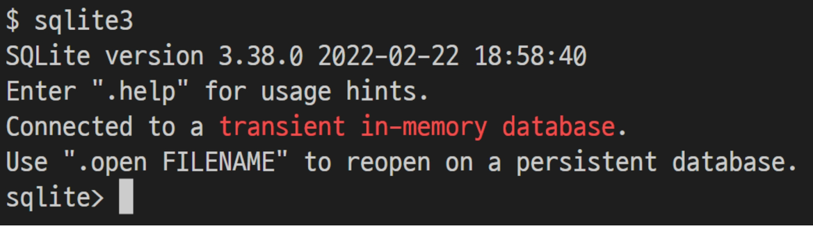
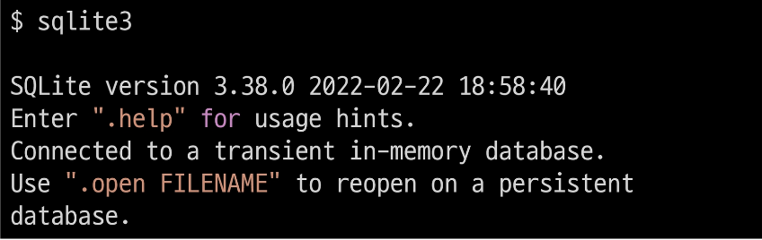

# **DML (Data Manipulation Language)**

1. 개요
    - DML을 통해 데이터를 조작하기 (CRUD)<br>

    - INSERT, SELECT, UPDATE, DELETE
<br><br><br>

2. command-line program - **“sqlite3”**
    - SQL 문 및 commands을 사용하여 SQLite 데이터베이스와 상호 작용할 수 있는 간단한 command-line tool<br>

    - 실행 화면 예시
        
        
<br><br><br>        
    
3. sqlite3 사용하기
    - 시작하기<br>
        
        
        
    - 데이터베이스 파일 열기
        
        `sqlite> .open mydb.sqlite3`
        
        - 혹은 다음과 같이 시작하면서 데이터베이스를 열 수도 있음
            
            `$ sqlite3 mydb.sqlite3`
            
        
    - sqlite3 종료하기
        
        `sqlite> .exit`
        
    - 이외에 다양한 commands는 .help 명령어를 사용해 확인 해보기
<br><br><br>

4. CSV 파일을 SQLite 테이블로 가져오기
    - sqlite3 tool을 사용하여 CSV 파일을 테이블로 가져오는 방법<br>

        - DML.sql 파일 생성<br>

        - 테이블 생성하기
            
            ```sql
            -- DML.sql
            
            CREATE TABLE users (
            	first_name TEXT NOT NULL,
            	last_name TEXT NOT NULL,
            	age INTEGER NOT NULL,
            	country TEXT NOT NULL,
            	phone TEXT NOT NULL,
            	balance INTEGER NOT NULL
            );
            ```
            
        - 데이터베이스 파일 열기
            
            `$ sqlite3 mydb.sqlite3`
            
        - 모드(.mode)를 csv로 설정
            
            `sqlite> .mode csv`
            
        - .import 명령어를 사용하여 csv 데이터를 테이블로 가져오기
            
            `sqlite> .import users.csv users`
            
        - import 된 데이터 확인하기
    - sqlite3 tool 에서도 SQL문을 사용할 수 있지만, 실습의 편의와 명령어 기록을 위해 sql 확장자 파일에서 진행하도록 함
<br><br><br>

---

## **1. Simple query**

1. 개요
    - **SELECT** 문을 사용하여 간단하게 단일 테이블에서 데이터를 조회하기
<br><br><br>

2. SELECT statement
    
    ```sql
    SELECT column1, column2 FROM table_name;
    ```
    
    - “Query data from a table”<br>

    - 특정 테이블에서 데이터를 조회하기 위해 사용
    - 문법 규칙
        - SELECT 절에서 컬럼 또는 쉼표로 구분된 컬럼 목록을 지정<br>

        - FROM 절(clause)에서 데이터를 가져올 테이블을 지정
    
    - SELECT 문은 SQLite에서 가장 복잡한 문
    - 다양한 절과 함께 사용할 수 있으며 하나씩 학습할 예정
        - ORDER BY<br>

        - DISTINCT
        - WHERE
        - LIMIT
        - LIKE
        - GROUP BY
<br><br><br>

3. SELECT statement 실습
    - 이름과 나이 조회하기
        
        ```sql
        -- DML.sql
        
        SELECT first_name, age FROM users;
        ```
        
      <br>
    - 전체 데이터 조회하기
    - 모든 컬럼에 대한 shorthand(약칭)인 *(asterisk)를 사용할 수 있음
        
        ```sql
        -- DML.sql
        
        SELECT * FROM users;
        ```
        
      <br>
    - rowid 컬럼은 다음과 같이 조회할 수 있다.
        
        ```sql
        -- DML.sql
        
        SELECT rowid, first_name FROM users;
        ```
<br><br>

---

## **2. Sorting rows**

1. 개요
    - **ORDER BY** 절을 사용하여 쿼리의 결과를 정렬하기
<br><br><br>

2. ORDER BY clause
    
    ```sql
    SELECT select_list FROM table_name
    ORDER BY column_1 ASC, column_2 DESC;
    ```
    
    - “Sort a result set of a query”<br>

    - SELECT 문에 추가하여 결과를 정렬
    - ORDER BY 절은 FROM 절 뒤에 위치함
    - 하나 이상의 컬럼을 기준으로 결과를 오름차순, 내림차순으로 정렬할 수 있음
    - 이를 위해 ORDER BY 절 다음에 ‘ASC’ 또는 ‘DESC’ 키워드를 사용
        - ASC : 오름차순 (기본 값)<br>

        - DESC : 내림차순
<br><br><br>

3. ORDER BY clause 실습
    - 이름과 나이를 나이가 어린 순서대로 조회하기
        
        ```sql
        -- DML.sql
        
        SELECT first_name, age FROM users ORDER BY age ASC;
        
        SELECT first_name, age FROM users ORDER BY age;
        ```
        <br>
    
    - 이름과 나이를 나이가 많은 순서대로 조회하기
        
        ```sql
        -- DML.sql
        
        SELECT first_name, age FROM users ORDER BY age DESC;
        ```
        <br>
    - 이름, 나이, 계좌 잔고를 나이가 어린순으로, 만약 같은 나이라면 계좌 잔고가 많은 순으로 정렬해서 조회하기
        
        ```sql
        -- DML.sql
        
        SELECT first_name, age, balance FROM users ORDER BY age ASC, balance DESC;
        ```
        
    - ORDER BY 절은 하나 이상의 컬럼을 정렬할 경우 첫 번째 열을 사용하여 행을 정렬하고, 그런 다음 두번째 컬럼을 사용하여 정렬 되어있는 행을 정렬하는 방식<br>

    - 즉, 먼저 age를 기준으로 먼저 오름차순으로 정렬하고, 이 결과를 balance를 기준으로 내림차순으로 정렬한 것
<br><br><br>

4. [참고] Sorting NULLs
    - NULL의 정렬 방식<br>

    - 정렬과 관련하여 SQLite는 NULL을 다른 값보다 작은 것으로 간주
    - 즉, ASC를 사용하는 경우 결과의 시작 부분에 NULL이 표시되고, DESC를 사용하는 경우 결과의 끝에 NULL이 표시됨
    - [https://www.sqlitetutorial.net/sqlite-order-by/](https://www.sqlitetutorial.net/sqlite-order-by/)
<br><br><br>

---

## **3. Filtering data**

1. 개요
    - 데이터를 필터링하여 중복 제거, 조건 설정 등 쿼리를 제어하기<br>

    - Clause
        - SELECT DISTINCT<br>

        - WHERE
        - LIMIT
    - Operator
        - LIKE<br>

        - IN
        - BETWEEN
<br><br><br>

2. **SELECT DISTINCT** clause
    
    ```sql
    SELECT DISTINCT select_list FROM table_name;
    ```
    
    - “Remove duplicate rows in the result”<br>

    - 조회 결과에서 중복된 행을 제거
    - DISTINCT 절은 SELECT 에서 선택적으로 사용할 수 있는 절
    - 문법 규칙
        - DISTINCT 절은 SELECT 키워드 바로 뒤에 나타나야 함<br>

        - DISTINCT 키워드 뒤에 컬럼 또는 컬럼 목록을 작성
<br><br><br>

3. SELECT DISTINCT 실습
    - 모든 지역 조회하기
        
        ```sql
        -- DML.sql
        
        SELECT country FROM users;
        ```
        
      <br>
    - 중복없이 모든 지역 조회하기
        
        ```sql
        -- DML.sql
        
        SELECT DISTINCT country FROM users;
        ```
        <br>
    
    - 지역 순으로 내림차순 정렬하여 중복없이 모든 지역 조회하기
        
        ```sql
        -- DML.sql
        
        SELECT DISTINCT country FROM users ORDER BY country;
        ```
        <br>
    
    - 이름과 지역이 중복 없이 모든 이름과 지역 조회하기
        
        ```sql
        -- DML.sql
        
        SELECT DISTINCT first_name, country FROM users;
        ```
        
        → 각 컬럼의 중복을 따로 계산하는 것이 아니라 두 컬럼을 하나의 집합으로 보고 중복을 제거
        
       <br>
    - 이름과 지역 중복 없이 지역 순으로 내림차순 정렬하여 모든 이름과 지역 조회하기
        
        ```sql
        -- DML.sql
        
        SELECT DISTINCT first_name, country FROM users ORDER BY country;
        ```
<br><br>        
    
4. [참고] NULL with DISTINCT
    - SQLite는 NULL 값을 중복으로 간주<br>

    - NULL 값이 있는 컬럼에 DISTINCT 절을 사용하면 SQLite는 NULL 값의 한 행을 유지
<br><br><br>

5. **WHERE** clause
    
    ```sql
    SELECT column_list FROM table_name WHERE search_condition;
    ```
    
    - “Specify the search condition for rows returned by the query”<br>

    - 조회 시 특정 검색 조건을 지정
    - WHERE 절은 SELECT 문에서 선택적으로 사용할 수 있는 절
        - SELECT 문 외에도 UPDATE 및 DELETE 문에서 WHERE 절을 사용할 수 있음
    - FROM 절 뒤에 작성
<br><br><br>

6. WHERE의 검색 조건 작성 형식
    
    `left_expression COMPARISON_OPERATOR right_expression`
    
    - 작성 예시
        
        ```sql
        WHERE column_1 = 10
        
        WHERE column_2 LIKE 'Ko%'
        
        WHERE column_3 IN (1, 2)
        
        WHERE column_4 BETWEEN 10 AND 20
        ```
<br><br>        
    
7. SQLite comparison operators (비교연산자)
    - 두 표현식이 동일한지 테스트
        - =
        - <> or !=
        - <
        - \>
        - <=
        - \>=
<br><br><br>

8. SQLite logical operators (논리연산자)
    - 일부 표현식의 truth를 테스트할 수 있음<br>

    - 1, 0 또는 NULL 값을 반환
    - SQLite는 Boolean 데이터 타입을 제공하지 않으므로 1은 TRUE를 의미하고 0은 FALSE를 의미
    - ALL, AND, ANY, BETWEEN, IN, LIKE, NOT, OR 등
<br><br><br>

9. WHERE 실습
    - 나이가 30살 이상인 사람들의 이름, 나이, 계좌 잔고 조회하기
        
        ```sql
        -- DML.sql
        
        SELECT first_name, age, balance FROM users WHERE age >= 30;
        ```
        
       <br>
    - 나이가 30살 이상이고 계좌 잔고가 50만원 초과인 사람들의 이름, 나이, 계좌 잔고 조회하기
        
        ```sql
        -- DML.sql
        
        SELECT first_name, age, balance FROM users WHERE age >= 30 AND balance > 500000;
        ```
<br><br>        
    
10. **LIKE** operator
    - “Query data based on pattern matching”<br>

    - 패턴 일치를 기반으로 데이터를 조회
    - SELECT, DELETE, UPDATE 문의 WHERE 절에서 사용
    - 기본적으로 대소문자를 구분하지 않음
        - `‘A’ LIKE ‘a’`  는 true
    
    - SQLite는 패턴 구성을 위한 두 개의 와일드카드(wildcards)를 제공
        - % (percent)<br>

            - 0개 이상의 문자가 올 수 있음을 의미
        - _ (underscore)
            - 단일(1개) 문자가 있음을 의미
<br><br><br>

11. **‘%’** wildcard 예시
    - ‘영%’ 패턴은 영으로 시작하는 모든 문자열과 일치 (영, 영미, 영미리 등)<br>

    - ‘%도’ 패턴은 도로 끝나는 모든 문자열과 일치 (도, 수도, 경기도 등)
    - ‘%강원%’ 패턴은 강원을 포함하는 모든 문자열과 일치 (강원, 강원도, 강원도에 살아요 등)
<br><br><br>

12. **‘_’** wildcard 예시
    - ‘영_’ 패턴은 영으로 시작하고 총 2자리인 문자열과 일치 (영미, 영수, 영호 등)<br>

    - ‘_도’ 패턴은 도로 끝나고 총 2자리인 문자열과 일치 (수도, 과도 등)
<br><br><br>

13. wildcard 종합 예시
    
    
    | 패턴 | 의미 |
    | --- | --- |
    | 2% | 2로 시작하는 패턴 |
    | %2 | 2로 끝나는 패턴 |
    | %2% | 2를 포함하는 패턴 |
    | _2% | 첫번째 자리에 아무 값이 하나 있고 두 번째가 2로 시작하는 패턴 (최소 2자리) |
    | 1___ | 1로 시작하는 4자리 패턴 (반드시 4자리) |
    | 2_%_% or 2__% | 2로 시작하고 최소 3자리인 패턴 (3자리 이상) |
<br><br>

14. [참고] “wildcards” character
    - 파일을 지정할 때, 구체적인 이름 대신에 여러 파일을 동시에 지정할 목적으로 사용하는 특수 기호<br>

        - *, ? 등
    - 주로 특정한 패턴이 있는 문자열 혹은 파일을 찾거나, 긴 이름을 생략할 때 쓰임
    - 텍스트 값에서 알 수 없는 문자를 사용할 수 있는 특수 문자로, 유사하지만 동일한 데이터가 아닌 여러 항목을 찾기에 매우 편리한 문자
    - 지정된 패턴 일치를 기반으로 데이터를 수집하는 데도 도움이 될 수 있음
<br><br><br>

15. LIKE 실습
    - 이름에 ‘호’가 포함되는 사람들의 이름과 성 조회하기
        
        ```sql
        -- DML.sql
        
        SELECT first_name, last_name FROM users WHERE first_name LIKE '%호%';
        ```
        
      <br>
    - 이름이 ‘준’으로 끝나는 사람들의 이름 조회하기
        
        ```sql
        -- DML.sql
        
        SELECT first_name, last_name FROM users WHERE last_name LIKE '%준';
        ```
        
      <br>
    - 서울 지역 전화번호를 가진 사람들의 이름과 전화번호 조회하기
        
        ```sql
        -- DML.sql
        
        SELECT first_name, phone FROM users WHERE phone LIKE '02-%';
        ```
        
      <br>
    - 나이가 20대인 사람들의 이름과 나이 조회하기
        
        ```sql
        -- DML.sql
        
        SELECT first_name, age FROM users WHERE age LIKE '2_';
        ```
        
      <br>
    - 전화번호 중간 4자리가 51로 시작하는 사람들의 이름과 전화번호 조회하기
        
        ```sql
        -- DML.sql
        
        SELECT first_name, phone FROM users WHERE phone LIKE '$-51__-%';
        ```
<br><br>        
    
16. **IN** operator
    - “Determine whether a value matches any value in a list of values”<br>

    - 값이 값 목록 결과에 있는 값과 일치하는지 확인
    - 표현식이 값 목록의 값과 일치하는지 여부에 따라 true 또는 false를 반환
    - IN 연산자의 결과를 부정하려면 **NOT IN** 연산자를 사용
<br><br><br>

17. IN 실습
    - 경기도 혹은 강원도에 사는 사람들의 이름과 지역 조회하기
        
        ```sql
        -- DML.sql
        
        SELECT first_name, country FROM users WHERE country IN ('경기도', '강원도');
        ```
        
    - IN 연산자 대신 OR 연산자를 사용하여 동일한 결과를 반환할 수 있음
        
        ```sql
        -- DML.sql
        
        SELECT first_name, country FROM users WHERE country = '경기도' OR country = '강원도';
        ```
        
    
    - 경기도 혹은 강원도에 살지 않는 사람들의 이름과 지역 조회하기
        
        ```sql
        -- DML.sql
        
        SELECT first_name, country FROM users WHERE country NOT IN ('경기도', '강원도');
        ```
<br><br>        
    
18. **BETWEEN** operator
    
    `test_expression BETWEEN low_expression AND high_expression`
    
    - “Test whether a value is in a range of values.”<br>

    - 값이 값 범위에 있는지 테스트
    - 값이 지정된 범위에 있으면 true를 반환
    - SELECT, DELETE, 및 UPDATE 문의 WHERE 절에서 사용할 수 있음
    - BETWEEN 연산자의 결과를 부정하려면 **NOT BETWEEN** 연산자를 사용
<br><br><br>

19. BETWEEN 실습
    - 나이가 20살 이상, 30살 이하인 사람들의 이름과 나이 조회하기
        
        ```sql
        -- DML.sql
        
        SELECT first_name, age FROM users WHERE age BETWEEN 20 AND 30;
        ```
        
    - AND 연산자를 사용하여 이전 쿼리와 동일한 결과를 반환할 수 있음
        
        ```sql
        -- DML.sql
        
        SELECT first_name, age FROM users WHERE age >= 20 AND age <= 30;
        ```
        
    
    - 나이가 20살 이상, 30살 이하가 아닌 사람들의 이름과 나이 조회하기
        
        ```sql
        -- DML.sql
        
        SELECT first_name, age FROM users WHERE age NOT BETWEEN 20 AND 30;
        ```
        
    - OR 연산자를 사용하여 이전 쿼리와 동일한 결과를 반환할 수 있음
        
        ```sql
        -- DML.sql
        
        SELECT first_name, age FROM users WHERE age < 20 OR age > 30;
        ```
<br><br>       
    
20. **LIMIT** clause
    
    ```sql
    SELECT column_list FROM table_name LIMIT row_count;
    ```
    
    - “Constrain the number of rows returned by a query.”<br>

    - 쿼리에서 반환되는 행 수를 제한
    - SELECT 문에서 선택적으로 사용할 수 있는 절
    - row_count는 반환되는 행 수를 지정하는 양의 정수를 의미
<br><br><br>

21. LIMIT 실습
    - 첫 번째부터 열 번째 데이터까지 rowid와 이름 조회하기
        
        ```sql
        -- DML.sql
        
        SELECT rowid, first_name FROM users LIMIT 10;
        ```
        
      <br>
    - 계좌 잔고가 가장 많은 10명의 이름과 계좌 잔고 조회하기
        
        ```sql
        -- DML.sql
        
        SELECT first_name, balance FROM users ORDER BY balance DESC LIMIT 10;
        ```
        
        - ORDER BY 절과 함께 사용하여 지정된 순서로 여러 행을 가져올 수도 있음<br>

        - LIMIT 절에 지정된 행 수를 가져오기 전에 결과를 정렬하기 때문
      
      <br>
    - 나이가 가장 어린 5명의 이름과 나이 조회하기
        
        ```sql
        -- DML.sql
        
        SELECT first_name, age FROM users ORDER BY age LIMIT 5;
        ```
<br><br>       
    
22. **OFFSET** keyword
    - LIMIT 절을 사용하면 첫 번째 데이터부터 지정한 수 만큼의 데이터를 받아올 수 있지만, OFFSET과 함께 사용하면 특정 지정된 위치에서부터 데이터를 조회할 수 있음<br>

    - 11번째부터 20번째 데이터의 rowid와 이름 조회하기
        
        ```sql
        -- DML.sql
        
        SELECT rowid, first_name FROM users LIMIT 10 OFFSET 10;
        ```
<br><br>

---

## **4. Grouping data**

1. **GROUP BY** clause
    
    ```sql
    SELECT column_1, aggregate_function(column_2) FROM table_name GROUP BY column_1, column_2;
    ```
    
    - “Make a set of summary rows from a set of rows”<br>

    - 특정 그룹으로 묶인 결과를 생성
    - 선택된 컬럼 값을 기준으로 데이터(행)들의 공통 값을 묶어서 결과로 나타냄
    - SELECT 문에서 선택적으로 사용가능한 절
    - SELECT 문의 FROM 절 뒤에 작성
        - WHERE 절이 포함된 경우 WHERE 절 뒤에 작성해야 함
    - 각 그룹에 대해 MIN, MAX, SUM, COUNT 또는 AVG와 같은 집계 함수(aggregate function)를 적용하여 각 그룹에 대한 추가적인 정보를 제공할 수 있음
<br><br><br>

2. Aggregate function
    - “집계함수”<br>

    - 값 집합의 최대값, 최소값, 평균, 합계 및 개수를 계산
    - 값 집합에 대한 계산을 수행하고 단일 값을 반환
        - 여러 행으로부터 하나의 결과 값을 반환하는 함수
    - SELECT 문의 GROUP BY 절과 함께 종종 사용됨
    - 제공하는 함수 목록
        - AVG(), COUNT(), MAX(), MIN(), SUM()
    - AVG(), MAX(), MIN(), SUM()는 숫자를 기준으로 계산이 되어져야 하기 때문에 반드시 컬럼의 데이터 타입이 숫자(INTEGER)일 때만 사용 가능
    - [http://www.sqlitetutorial.net/sqlite-aggregate-functions/](http://www.sqlitetutorial.net/sqlite-aggregate-functions/)
<br><br><br>

3. Aggregate function 예시
    - users 테이블의 전체 행 수 조회하기
        
        ```sql
        -- DML.sql
        
        SELECT COUNT(*) FROM users;
        ```
        
      <br>
    - 나이가 30살 이상인 사람들의 평균 나이 조회하기
        
        ```sql
        -- DML.sql
        
        SELECT AVG(age) FROM users WHERE age >= 30;
        ```
<br><br>        
    
4. GROUP BY 사용해보기
    - 각 지역별로 몇 명씩 살고 있는지 조회하기<br>

        - ‘각 지역별’은 지역 별로 그룹을 나눌 필요가 있음을 의미함
        - country 컬럼으로 그룹화
            
            ```sql
            -- DML.sql
            
            SELECT country FROM users GROUP BY country;
            ```
            
        - 마지막으로 몇 명씩 사는지 계산하기 위해서 그룹별로 포함되는 데이터의 수를 구함
        - Aggregation Function의 COUNT를 사용
            
            ```sql
            -- DML.sql
            
            SELECT country, COUNT(*) FROM users GROUP BY country;
            ```
            
            → 각 지역별로 그룹이 나뉘어졌기 때문에 COUNT(*)는 지역별 데이터 개수를 세개 된
<br><br><br>            
    
5. [참고] COUNT 참고사항
    - 이전 쿼리에서 COUNT(), COUNT(age), COUNT(last_name) 등 어떤 컬럼을 넣어도 결괴는 같음<br>

    - 현재 쿼리에서는 그룹화된 country를 기준으로 카운트 하는 것이기 때문에 어떤 컬럼을 카운트해도 전체 개수는 동일하기 때문
<br><br><br>

6. GROUP BY 실습
    - 각 성씨가 몇 명씩 있는지 조회하기
        
        ```sql
        -- DML.sql
        
        SELECT last_name, COUNT(*) FROM users GROUP BY last_name;
        ```
        
    - AS 키워드를 사용해 컬럼명을 임시로 변경하여 조회할 수 있음
        
        ```sql
        -- DML.sql
        
        SELECT last_name, COUNT(*) AS number_of_name FROM users GROUP BY last_name;
        ```
        
      <br>
    - 인원이 가장 많은 성씨 순으로 조회하기
        
        ```sql
        -- DML.sql
        
        SELECT last_name, COUNT(*) FROM users GROUP BY last_name ORDER BY COUNT(*) DESC;
        ```
      
      <br>
    - 각 지역별 평균 나이 조회하기
        
        ```sql
        -- DML.sql
        
        SELECT country, AVG(age) FROM users GROUP BY country;
        ```
<br><br>

---

## **5. Changing data**

1. 개요
    - 데이터를 삽입, 수정, 삭제하기<br>

        - INSERT<br>

        - UPDATE
        - DELETE
<br><br><br>

2. 사전 준비
    - 실습 편의를 위해 새 테이블 생성
        
        ```sql
        -- DML.sql
        
        CREATE TABLE classmates (
        	name text NOT NULL,
        	age INTEGER NOT NULL,
        	address TEXT NOT NULL
        );
        ```
<br><br>

3. INSERT statement
    
    ```sql
    INSERT INTO table_name (column1, column2, ...) VALUES (value1, value2, ...);
    ```
    
    - “Insert new rows into a table.”<br>

    - 새 행을 테이블에 삽입
    - 문법 규칙
        - 먼저 INSERT INTO 키워드 뒤에 데이터를 삽입할 테이블의 이름을 지정<br>

        - 테이블 이름 뒤에 쉼표로 구분된 컬럼 목록을 추가
            - 컬럼 목록은 선택 사항이지만 컬럼 목록을 포함하는 것이 권장됨
        - VALUES 키워드 뒤에 쉼표로 구분된 값 목록을 추가
            - 만약 컬럼 목록을 생략하는 경우 값 목록의 모든 컬럼에 대한 값을 지정해야 함<br>

            - 값 목록의 값 개수는 컬럼 목록의 컬럼 개수와 같아야 함
<br><br><br>

4. INSERT 사용해보기
    - 단일 행 삽입
        
        ```sql
        -- DML.sql
        
        INSERT INTO classmates (name, age, address) VALUES ('홍길동', 23, '서울');
        ```
        
    - 다음과 같이 작성할 수도 있음
        
        ```sql
        -- DML.sql
        
        INSERT INTO classmates VALUES ('홍길동', 23, '서울');
        ```
        
    - 여러 행 삽입하기
        
        ```sql
        -- DML.sql
        
        INSERT INTO classmates
        VALUES
        	('김철수', 30, '경기'),
        	('이영미', 31, '강원'),
        	('박진성', 26, '전라'),
        	('최지수', 12, '충청'),
        	('정요한', 28, '경상');
        ```
<br><br>        
    
5. **UPDATE** statement
    
    ```sql
    UPDATE table_name
    SET column_1 = new_value_1,
    		column_2 = new_value_2
    WHERE
    		search_condition;
    ```
    
    - “Update existing rows in a table.”<br>

    - 테이블에 있는 기존 행의 데이터를 업데이트한다.
    - 문법 규칙
        - UPDATE 절 이후에 업데이트할 테이블을 지정<br>

        - SET 절에서 테이블의 각 컬럼에 대해 새 값을 설정
        - WHERE 절의 조건을 사용하여 업데이트할 행을 지정
            - WHERE 절은 선택사항이며, 생략하면 UPDATE 문은 테이블의 모든 행에 있는 데이터를 업데이트 함
        - 선택적으로 ORDER BY 및 LIMIT 절을 사용하여 업데이트할 행 수를 지정 할 수도 있음
<br><br><br>

6. UPDATE 실습
    - 2번 데이터의 이름을 ‘김철수한무두루미’, 주소를 ‘제주도’로 수정하기
        
        ```sql
        -- DML.sql
        
        UPDATE classmates
        SET name = ‘김철수한무두루미',
        		address = '제주도'
        WHERE rowid = 2;
        ```
<br><br>

7. **DELETE** statement
    
    ```sql
    DELETE FROM table_name WHERE search_condition;
    ```
    
    - “Delete rows from a table.”<br>

    - 테이블에서 행을 제거
    - 테이블의 한 행, 여러 행 및 모든 행을 삭제할 수 있음
    - 문법 규칙
        - DELETE FROM 키워드 뒤에 행을 제거하려는 테이블의 이름을 지정<br>

        - WHERE 절에 검색 조건을 추가하여 제거할 행을 식별
            - WHERE 절은 선택 사항이며, 생략하면 DELETE 문은 테이블의 모든 행을 삭제
        - 선택적으로 ORDER BY 및 LIMIT 절을 사용하여 삭제할 행 수를 지정할 수도 있음
<br><br><br>

8. DELETE 사용해보기
    - 5번 데이터 삭제하기
        
        ```sql
        -- DML.sql
        
        DELETE FROM classmates WHERE rowid = 5;
        ```
        
    - 삭제된 것 확인하기
        
        ```sql
        -- DML.sql
        
        SELECT rowid, * FROM classmates;
        ```
<br><br>        
    
9. DELETE 실습
    - 이름에 ‘영’이 포함되는 데이터 삭제하기
        
        ```sql
        -- DML.sql
        
        DELETE FROM classmates WHERE name LIKE '%영%';
        ```
        
    - 테이블의 모든 데이터 삭제하기
        
        ```sql
        -- DML.sql
        
        DELETE FROM classmates;
        ```
<br><br><br><br>        

---

## **5. 마무리**

- Database<br>

    - RDB
- SQL
- DDL
    - CREATE TABLE<br>

        - Data Type<br>

        - Constraints
    - ALTER TABLE
    - DROP TABLE
- DML
    - SELECT<br>

        - SELECT DISTINCT
    - ORDER BY
    - WHERE
        - LIKE, IN, BETWEEN
    - LIMIT, OFFSET
    - GROUP BY
        - Aggregate Function
    - INSERT / UPDATE / DELETE

- 데이터 구조화의 중요성
    - 다루고자 하는 데이터를 구조화해서 저장하면 데이터의 가공 및 확장이 용이<br>
    
    - 모든 서비스는 데이터를 효율적으로 다루는 것이 필수적
        - 예를 들어 빅데이터, 인공지능과 같은 대규모 데이터로부터 의미 있는 분석결과를 뽑아낼 수 있음
<br><br><br>

---