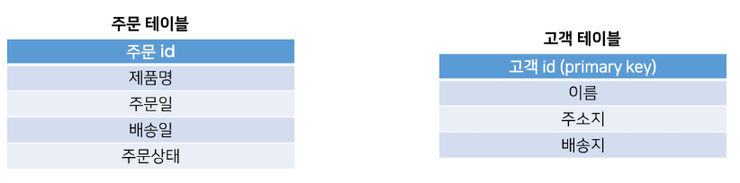
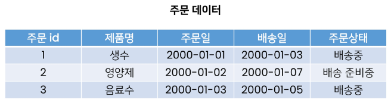
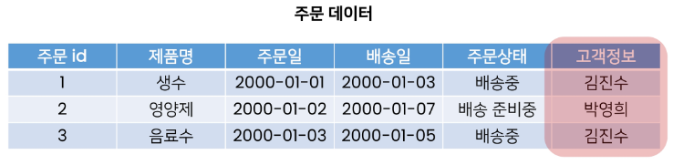
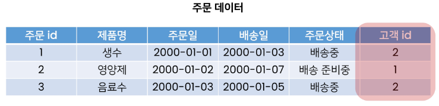
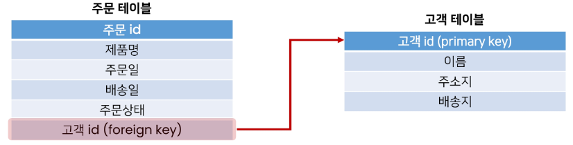
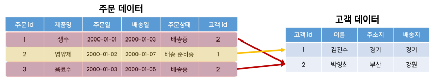

# **A many-to-one relationship**

- 개요
    - 관계형 데이터베이스에서의 외래 키 속성을 사용해 모델간 N:1 관계 설정하기
   

---

## **1. Intro**

1. RDB(관계형 데이터베이스) 복습
    - 데이터를 테이블, 행, 열 등으로 나누어 구조화하는 방식 

    - RDB의 모든 테이블에서 행에서 고유하게 식별 가능한 기본 키라는 속성이 있으며, **외래 키**를 사용하여 각 행에서 서로 다른  테이블 간의 **관계**를 만드는 데 사용할 수 있음
   

2. [참고] 관계 (Relationship)
    - 테이블 간의 상호작용을 기반으로 설정되는 여러 테이블 간의 논리적인 연결
   

3. 테이블 간 관계 예시
    
    
    
    - 다음과 같이 어떠한 서비스의 데이터베이스에 고객 테이블과 주문 테이블이 존재 

    - 고객 테이블에는 고객에 관한 데이터가, 주문 테이블에는 주문에 관한 거래 정보가 포함됨  
    
    
    
    - 만약 고객들이 특정 제품을 주문한다면 주문 테이블에 레코드가 생성됨 

    - 그런데 해당 주문이 올바르게 배송되기 위해서는 어떤 고객이 주문 했는지를 알아야 함
        - 즉, 배송지 주소를 가지고 있는 고객 테이블의 정보를 포함해야 함
    - 주문 테이블에서 어떻게 고객 테이블 정보를 포함할 수 있을까?  
    
    
    
    - 각 주문데이터에 고객 정보를 입력하는 방법이 있음 

    - 하지만 이렇게 이름으로 저장할 경우 이름이 같은 다른 사용자를 구분할 수 없음
    - 그렇다면 고객 정보의 어떤 데이터를 사용하는 것이 적합할까?  
    
    
    
    - 고객 정보의 기본 키인 고객 id 정보를 저장하는 방법이 있음 

    - 이처럼 관계형 데이터베이스에서 한 테이블의 필드 중 다른 테이블의 행을 식별할 수 있는 키를 외래 키(foreign key, FK)라 함  
    
    
    
    - 이렇게 되면 이 두 테이블은 공유된 고객 id를 기반으로 연결되며 다양한 명령 처리를 진행할 수 있음 

        - 특정 날짜에 구매한 모든 고객 정보 확인하기 

        - 지난 달에 배송이 지연된 주문을 받은 고객 처리하기
        - 특정 고객이 주문한 모든 주문 정보 조회하기 … 등
    - 실제 상황보다는 간단한 예시지만 이처럼 RDB는 데이터 간의 매우 복잡한 관계를 보여주고 처리하는 데 탁월한 방식
   

4. RDB에서의 관계
    - 1:1 

        - One-to-one relationships 

        - 한 테이블의 레코드 하나가 다른 테이블의 레코드 단 한개와 관련된 경우
    - N:1
        - Many-to-one relationships 

        - 한 테이블의 0개 이상의 레코드가 다른 테이블의 레코드 한 개와 관련된 경우
        - 기준 테이블에 따라(1:N, One-to-many relationships)이라고도 함
    - M:N
        - Many-to-many relationships 

        - 한 테이블의 0개 이상의 레코드가 다른 테이블의 0개 이상의 레코드와 관련된 경우
        - 양쪽 모두에서 N:1 관계를 가짐
   

5. Many-to-one relationships 예시
    
    
    
    - 여러 개의 주문 입장에서 각각 어떤 주문에 속해 있는지 표현해야 하므로 고객 테이블의 PK를 주문 테이블에 FK로 집어 넣어 관계를 표현 

    - 고객(1)은 여러 주문(N)을 진행할 수 있음
        - 만약 고객에 단 한 개의 주문만 생성할 수 있다면 두 테이블은 1:1 관계라 할 수 있음
   

---

## **2. Foreign Key**

1. 개념
    - 외래 키(외부 키) 

    - 관계형 데이터베이스에서 다른 테이블의 행을 식별할 수 있는 키
    - 참조되는 테이블의 기본 키(Primary Key)를 가리킴
    - 참조하는 테이블의 행 1개의 값은, 참조되는 측 테이블의 행 값에 대응됨
        - 이 때문에 참조하는  테이블의 행에는,  참조되는 테이블에 나타나지 않는 값을 포함할 수 없음
    - 참조하는 테이블 행 여러 개가, 참조되는 테이블의 동일한 행을  참조할 수 있음
   

2. 특징
    - 키를 사용하여 부모 테이블의 유일한 값을 참조 (by 참조 무결성) 

    - 외래 키의 값이 반드시 부모 테이블의 기본 키일 필요는 없지만 유일한 값이어야 함
   

3. [참고] 참조 무결성
    - 데이터베이스 관계 모델에서 관련된 2개의 테이블 간의 일관성을 말함 
    
    - 외래 키가 선언된 테이블의 외래 키 속성(열)의 값은 그 테이블의 부모가 되는 테이블의 기본 키 값으로 존재해야 함
   

---