# **N:1 (Comment - Comment)**

- 개요
    - Comment(N) - Article(1)<br>

    - Comment 모델과 Article 모델 간 관계 설정
    - “0개 이상의 댓글은 1개의 게시글에 작성될 수 있음”
<br><br><br>

---

## **1. 모델 관계 설정**

- 게시판의 게시글과 N:1 관계를 나타낼 수 있는 댓글 구현<br>

- N:1 관계에서 댓글을 담당할 Comment 모델은 N, Article 모델은 1이 될 것

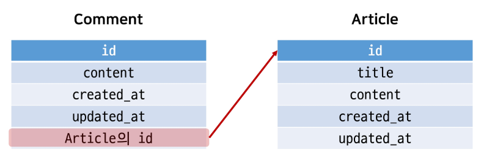

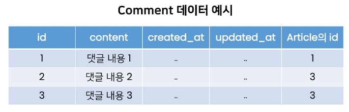

- 만약 comment 테이블에 데이터가 다음과 같이 작성되었다면 1번 게시글에는 1개의 댓글이, 3번 게시글에는 2개의 댓글이 작성되어 있다고 볼 수 있음
<br><br><br>

---

## **2. Django Relationship fields**

1. Django Relationship fields 종류
    - OneToOneField()<br>

        - A one-to-one relationship
    - **ForeignKey()**
        - A many-to-one relationship
    - ManyToManyField()
        - A many-to-many relationship
<br><br><br>

2. ForeignKey(to, on_delete, **options)
    - A many-to-one relationship을 담당하는 Django의 모델 필드 클래스<br>

    - Django 모델에서 관계형 데이터베이스의 외래 키 속성을 담당
    - 2개의  필수 위치 인자가 필요
        - 참조하는 **model class**<br>

        - **on_delete** 옵션
    - [https://docs.djangoproject.com/en/3.2/ref/models/fields/#foreignkey](https://docs.djangoproject.com/en/3.2/ref/models/fields/#foreignkey)
<br><br><br>

---

## **3. Comment Model**

1. Comment 모델 정의
    
    ```python
    # articles/models.py
    
    class Comment(models.Model):
        article = models.ForeignKey(Article, on_delete=models.CASCADE)
        concent = models.CharField(max_length=200)
        created_at = models.DateTimeField(auto_now_add=True)
        updated_at = models.DateTimeField(auto_now=True)
    
        def __str__(self):
            return self.content
    ```
    
    - 외래 키 필드는 ForeignKey 클래스를 작성하는 위치와 관계없이 필드의 마지막에 작성됨<br>

    - ForeignKey() 클래스의 인스턴스 이름은 참조하는 모델 클래스 이름의 단수형(소문자)으로 작성하는 것을 권장 (이유는 이어지는 모델 참조에서 확인 예정)
<br><br><br>

2. ForeignKey arguments - **on_delete**
    - 외래 키가 참조하는 객체가 사라졌을 때, 외래 키를 가진 객체를 어떻게 처리할 지를 정의<br>

    - 데이터 무결성을 위해서 매우 중요한 설정
    - on_delete 옵션 값
        - **CASCADE**: 부모 객체(참조된 객체)가 삭제 됐을 때 이를 참조하는 객체조 삭제<br>

        - PROTECT, SET_NULL, SET_DEFAULT … 등 여러 옵션 값들이 존재
        - 수업에서는 CASCADE 값만 사용할 예정
<br><br><br>

3. [참고] 데이터 무결성 (Data Integrity)
    - 데이터의 정확성과 일관성을 유지하고 보증하는 것<br>

    - 데이터베이스나 RDBMS의 중요한 기능
    - 무결성 제한의 유형
        - 개체 무결성 (Entity integrity)<br>

        - 참조 무결성 (Referential integrity)
        - 범위 무결성 (Domain integrity)
    - [https://en.wikipedia.org/wiki/Data_integrity](https://en.wikipedia.org/wiki/Data_integrity)
<br><br><br>

4. Migration 과정 진행
    - models.py에서 모델에 대한 수정사항이 발생했기 때문에 migration 과정을 진행<br>
        
        `$ python manage.py makemigrations`
        
    - 마이그레이션  파일 002_comment.py 생성 확인
    - migrate 진행
        
        `$ python manage.py migrate`
    <br><br>    
    
    - migrate 후 Comment 모델 클래스로 인해 생성된 테이블 확인
        
        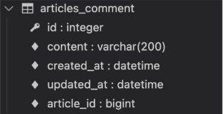
        
    - ForeignKey 모델 필드로 인해 작성된 컬럼의 이름이 article_id인 것을 확인
    - 만약 ForeignKey 인스턴스를 article이 아닌 abcd로 생성했다면 abcd_id로 만들어짐
        - 이처럼 명시적인 모델 관계 파악을 위해 참조하는 클래스 이름의 소문자(단수형)로 작성하는 것이 권장 되었던 이유
<br><br><br>

5. 댓글 생성 연습하기
    - shell_plus 실행
        
        `$ python manage.py shell_plus`
    <br><br>    
    
    - 댓글 생성
        
        ```python
        # Comment 클래스의 인스턴스 comment 생성
        comment = Comment()
        
        # 인스턴스 변수 저장
        comment.content = 'first comment'
        
        # DB에 댓글 저장
        comment.save()
        
        # 에러 발생
        django.db.utils.IntegrityError: NOT NULL constraint failed: articles_comment.article_id
        # articles_comment 테이블의 ForeignKeyField, article_id 값이 저장시 누락되었기 때문
        
        # 게시글 생성 및 확인
        article = Article.objects.create(title='title', content='content')
        article
        => <Article:title>
        
        # 외래 키 데이터 입력
        # 다음과 같이 article 객체 자체를 넣을 수 있음
        comment.article = article
        # 또는 comment.article_id = article.pk 처럼 pk 값을 직접 외래 키 컬럼에
        # 넣어 줄 수 있지만 권장하지 않음
        
        # DB에 댓글 저장 및 확인
        comment.save()
        comment
        => <Comment: first comment>
        ```
      <br>  
    
    - 댓글 속성 값 확인
        
        ```python
        comment.pk
        => 1
        
        comment.content
        => 'first comment'
        
        # 클래스 변수명인 article로 조회 시 해당 참조하는 게시물 객체를 조회할 수 있음
        comment.article
        => <Article: title>
        
        # article_pk는 존재하지 않는 필드이기 때문에 사용 불가
        comment.article_id
        => 1
        ```
      <br>  
    
    - comment 인스턴스를 통한 article 값 접근하기
        
        ```python
        # 1번 댓글이 작성된 게시물의 pk 조회
        comment.article.pk
        => 1
        
        # 1번 댓글이 작성된 게시물의 content 조회
        comment.article.content
        => 'content'
        ```
      <br>  
    
    - 두번째 댓글 작성해보기
        
        ```python
        comment = Comment(content='second comment', article=article)
        comment.save()
        
        comment.pk
        => 2
        
        comment
        => <Comment: second comment>
        
        comment.article_id
        => 1
        ```
       <br> 
    
    - 작성된 댓글 확인 해보기
        
        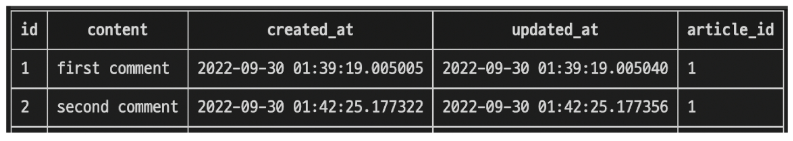
<br><br><br>

---

## **4. 관계 모델 참조**

1. Related manager
    - Related manager는 N:1 혹은 M:N 관계에서 사용 가능한 문맥(context)<br>

    - Django는 모델 간 N:1 혹은 M:N 관계가 설정되는 **역참조**할 때에 사용할 수 있는 manager를 생성
        - 우리가 이전에 모델 생성 시 **objects**라는 매니저를 통해 queryset api를 사용했던 것처럼 related manager를 통해 queryset api를 사용할 수 있게 됨
    - 지금은 N:1 관계에서의 related manager 만을 학습할 것
    - [https://docs.djangoproject.com/en/3.2/ref/models/relations/](https://docs.djangoproject.com/en/3.2/ref/models/relations/)
<br><br><br>

2. 역참조
    - 나를  참조하는 테이블(나를 외래 키로 지정한)을 참조하는 것<br>

    - 즉, 본인을 외래 키로 참조 중인 다른 테이블에 접근하는 것
    - N:1 관계에서는 1이 N을 참조하는 상황
        - 외래 키를 가지지 않은 1이 외래 키를 가진 N을 참조
<br><br><br>

3. 관계 모델 참조
    
    `article.comment_set.method()`
    
    - Article 모델이 Comment 모델을 참조(역참조)할 때 사용하는 매니저<br>

    - article.comment 형식으로는 댓글 객체를 참조할 수 없음
        - 실제로 Article 클래스에는 Comment와의 어떠한 관계도 작성되어 있지 않음
    - 대신 Django가 역ㅊ마조 할 수 있는 **comment_set** manager를 자동으로 생성해 article.comment_set 형태로 댓글 객체를 참조할 수 있음
        - N:1 관계에서 생성되는 Related manager의 이름은 참조하는 “모델명_set” 이름 규칙으로 만들어짐
    - 반면 참조 상황(Comment → Article)에서는 실제 ForeignKey 클래스로 작성한 인스턴스가 Comment 클래스의 클래스 변수이기 때문에 comment.article 형태로 작성 가능
<br><br><br>

4. Related manager 연습하기
    - shell_plus 실행
        
        `$ python manage.py shell_plus`
      <br><br>  
    
    - 1번 게시글 조회하기
        
        ```python
        article = Article.objects.get(pk=1)
        ```
      <br>  
    
    - dir() 함수를 사용해 클래스 객체가 사용할 수 있는 메서드를 확인하기
        
        ```python
        dir(article)
        
        [
          ...중략...,
          'comment_set',
          'content',
          'created_at',
          'date_error_message',
          'delte',
          'from_db',
          'full_clean',
          ...중략...
        ]
        ```
      <br>  
    
    - 1번 게시글에 작성된 모든 댓글 조회하기 (역참조)
        
        ```python
        article.comment_set.all()
        => <QuerySet [<Comment: first comment>, <Comment: second comment>]>
        ```
      <br>  
    
    - 1번 게시글에 작성된 모든 댓글 출력하기
        
        ```python
        comments = article.comment_set.all()
        
        for comment in comments:
            print(comment.content)
        ```
<br><br>
    
5. ForeignKey arguments - **related_name**
    
    ```python
    # articles/models.py
    
    class Comment(models.Model):
        article = models.ForeignKey(Article, on_delete=models.CASCADE, related_name='comments')
        ...
    ```
    
    - ForeignKey  클래스의 선택 옵션<br>

    - 역참조 시 사용하는 매니저 이름(model_set manager)을 변경할 수 있음
    - 작성 후, migration 과정이 필요
    - 선택 옵션이지만 상황에 따라 반드시 작성해야 하는 경우가 생기기도 하는데 이는 추후 자연스럽게 만나볼 예정
    - 작성 후 다시 원래 코드로 복구
        - 위와 같이 변경 하면 기존 article.comment_set은 더 이상 사용할 수 없고, article.comments로 대체됨
<br><br><br>

6. admin site 등록
    - 새로 작성한 Comment 모델을 admin site에 등록하기<br><br>

    
    ```python
    # articles/admin.py
    
    from .models import Article,Comment
    
    admin.site.register(Article)
    ad,in.site.register(Comment)
    ```
<br><br>

---

## **5. Comment 구현**

1. CREATE
    - 사용자로부터 댓글 데이터를 입력 받기 위한 CommentForm 작성
        
        ```python
        # articles/forms.py
        
        from .models import Article, Comment
        
        class CommentForm(forms.ModelForm):
        
            class Meta:
                model = Comment
                fields = '__all__'
        ```
      <br>  
    
    - detail 페이지에서 CommentForm 출력 (view 함수)
        
        ```python
        # articles/views.py
        
        from .forms import ArticleForm, CommentForm
        
        def detail(request, pk):
            article = Article.objects.get(pk=pk)
            comment_form = CommentForm()
            context = {
                'article': article,
                'comment_form': comment_form,
            }
            return render(request, 'articles/detail.html', context)
        ```
        
        → 기존에 ArticleForm 클래스의 인스턴스명을 form으로 작성했기 때문에 헷갈리지 않도록 comment_form으로 작성
      <br><br>  
    
    - detail 페이지에서 CommentForm 출력 (템플릿)
        
        ```html
        <!-- articles/detail.html -->
        
        
        
        
          ...
          <a href="">back</a>
          <hr>
          <form action="#" method="POST">
            
            {{ comment_form }}
            <input type="submit">
          </form>
          
        ```
        
    <br>

    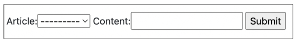
    
    - detail 페이지에 출력된 CommentForm을 살펴보면 다음과 같이 출력됨<br>

    - 실 서비스에서는 댓글을 작성할 때 댓글을 어떤 게시글에 작성하는지 직접 게시글 번호를 선택하지 않음
    - 실제로는 해당 게시글에 댓글을 작성하면 자연스럽게 그 게시글에 댓글이 작성되어야 함
    - 다음과 같이 출력되는 이유는 Comment 클래스의 외래 키 필드 article 또한 데이터 입력이 필요하기 때문에 출력 되고 있는 것
    - 하지만, 외래 키 필드는 **사용자의 입력으로 받는 것이 아니라 view 함수 내에서 받아 별도로 처리되어 저장**되어야 함
    <br><br>
    - 외래 키 필드를 출력에서 제외 후 확인
        
        ```python
        # articles/forms.py
        
        class CommentForm(forms.ModelForm):
        
            class Meta:
                model = Comment
                exclude = ('article',)
        ```
        
        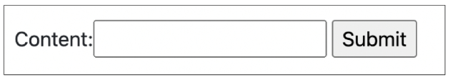
        
    <br><br>
    - 출력에서 제외된 외래 키 데이터는 어디서 받아와야 할까?<br>

    - detail 페이지의 url을 살펴보면 path(’**<int:pk>**’, views.detail, name=’detail’) url에 해당 게시글의 pk 값이 사용 되고 있음
    - 댓글의 외래 키 데이터에 필요한 정보가 바로 게시글의 pk 값
    - 이전에 학습했던 url을 통해 변수를 넘기는 **variable routing**을 사용
    <br><br>
    ```python
    # articles/urls.py
    
    urlpatterns = [
        ...,
        path('<int:pk>/comments/', views.comment_create, name='comments_create'),
    ]
    ```
    
    ```python
    # articles/views.py
    
    def comments_create(request, pk):
        article = Article.objects.get(pk=pk)
        comment_form = CommentForm(request.POST)
        if comment_form.is_valid():
            # article 객체는 언제 저장할 수 있을까?
            comment_form.save()
        return redirect('articles:detail', article.pk)
    ```
    
    ```html
    <!-- articles/detail.html -->
    
    <form action="" method="POST">
      
      {{ comment_form }}
      <input type="submit">
    </form>
    ```
    
    - 작성을 마치고 보면 article 객체 저장이 이루어질 타이밍이 보이지 않음
    - 그래서 save() 메서드는 데이터베이스에 저장하기 전에 객체에 대한 추가적인 작업을 진행할 수 있도록 인스턴스만을 반환해주는 옵션 값을 제공
<br><br><br>

2. The **save()** method
    - `save(commit=False)`<br>

        - “Create, but don’t save the new instance.”<br>

        - 아직 데이터베이스에 저장되지 않은 인스턴스를 반환
        - 저장하기 전에 객체에 대한 사용자 지정 처리를 수행할 때 유용하게 사용
    - [https://docs.djangoproject.com/en/3.2/topics/forms/modelforms/#the-save-method](https://docs.djangoproject.com/en/3.2/topics/forms/modelforms/#the-save-method)
<br><br><br>

3. CREATE
    - save 메서드의 commit 옵션을 사용해 DB에 저장되기 전 article 객체 저장하기
        
        ```python
        # articles/views.py
        
        def comments_create(request, pk):
            article = Article.objects.get(pk=pk)
            comment_form = CommentForm(request.POST)
            if comment_form.is_valid():
                comment = comment_form.save(commit=False)
                comment.article = article
                comment_form.save()
            return redirect('articles:detail', article.pk)
        ```
      <br>  
    
    - 댓글 작성 후 테이블 확인
        
        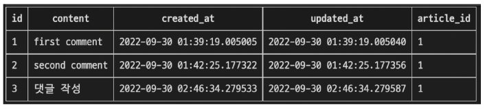
<br><br><br>        
    
4. READ
    - 작성한 댓글 목록 출력하기<br>

    - 특정 article에 있는 모든 댓글을 가져온 후 context에 추가
        
        ```python
        # articles/views.py
        
        from .models import Article. Comment
        
        def detail(request, pk):
            article = Article.objects.get(pk=pk)
            comment_form = CommentForm()
            comments = article.comment_set.all()
            context = {
                'article': article,
                'comment_form': comment_form,
                'comments': comments,
            }
            return render(request, 'articles/detail.html', context)
        ```
      <br>  
    
    - detail 템플릿에서 댓글 목록 출력하기
        
        ```html
        <!-- articles/detail.html -->
        
        
        
        
          ...
          <a href="">back</a>
          <hr>
          <h4>댓글 목록</h4>
          <ul>
            
              <li>{{ comment.content }}</li>
            
          </ul>
          <hr>
          ...
        
        ```
      <br>  
    
    - detail 템플릿에서 댓글 목록 출력 확인하기
        
        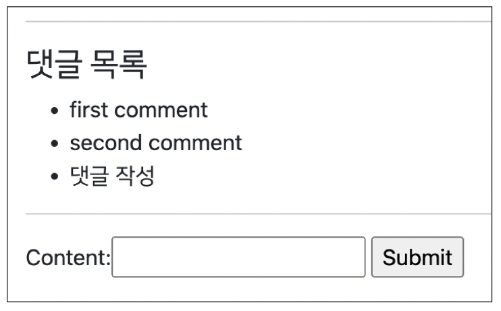
<br><br><br>        
    
5. DELETE
    - 댓글 삭제 구현하기 (url, view)
        
        ```python
        # articles/urls.py
        
        urlpatterns = [
            ...,
            path('<int:article_pk>/comments/<int:comment_pk>/delete/', views.comments_deleete, name='comments_delete'),
        ]
        ```
        
        ```python
        # articles/views.py
        
        def comments_delete(request, article_pk, comment_pk):
            comment = Comment.objects.get(pk=comment_pk)
            comment.delete()
            return redirect('araticles:detail', article_pk)
        ```
      <br>  
    
    - 댓글을 삭제할 수 있는 버튼을 각각의 댓글 옆에 출력 될 수 있도록 함
        
        ```html
        <!-- articles/detail.html -->
        
        
        
        
          ...
          <h4>댓글 목록</h4>
          <ul>
            
              <li>
                {{ comment.content }}
                <form action="" method="POST">
                  
                  <input type="submit" value="DELETE">
                </form>
              </li>
            
          </ul>
          <hr>
          ...
        
        ```
      <br>  
    
    - 댓글 삭제 버튼 출력 확인 및 삭제 시도하기
        
        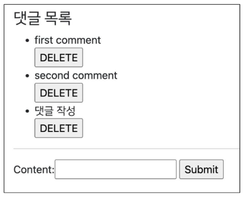
<br><br><br>        
    
6. 댓글 수정을 지금 구현하지 않는 이유
    - 댓글 수정도 게시글 수정과 마찬가지로 구현이 가능<br>

        - 게시글 수정 페이지가 필요했던 것처럼 댓글 수정 페이지가 필요하게 됨
    - 하지만 일반적으로 댓글 수정은 수정 페이지로 이동 없이 현재 페이지가 유지된 상태로 댓글 작성 Form 부분만 변경되어 수정할 수 있도록 함
    - 이처럼 페이지의 일부 내용만 업데이트 하는 것은 JavaScript의 영역이기 때문에 JavaScript를 학습한 후 별도로 진행하도록 함
<br><br><br>

---

## **6. Comment 추가 사항**

1. 개요
    - 댓글에 관련된 아래 2가지 사항을 작성하면서 마무리하기<br>

        - 댓글 개수 출력하기<br>
        
            - DTL filter - **length** 사용<br>

            - Queryset API - **count()** 사용
        - 댓글이 없는 경우 대체 컨텐츠 출력하기
<br><br><br>

2. 댓글 개수 출력하기
    - DTL filter - **length** 사용
        
        ```html
        {{ comments|length }}
        
        {{ article.comment_set.all|length }}
        ```
        
    - Queryset API - **count()** 사용
        
        ```html
        {{ comments.count }}
        
        {{ article.comment_set.count }}
        ```
     <br>   
    
    - detail 템플릿에 작성하기
        
        ```html
        <!-- articles/detail.html -->
        
        <h4>댓글 목록</h4>
        
          <p><b>{{ comments|length }}개의 댓글이 있습니다.</b></p>
        
        ```
      <br>  
    
    - 작성 후 출력 확인하기
        
        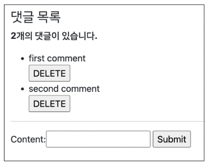
<br><br><br>        
    
3. 댓글이 없는 경우 대체 컨텐츠 출력하기
    - DTL **for empty** 활용하기
        
        ```html
        <!-- articles/detail.html -->
        
        
          <li>
            {{ comment.content }}
            <form action="" method="POST">
              
              <input type="submit" value="DELETE">
            </form>
          </li>
        
          <p>댓글이 없어요..</p>
        
        ```
      <br>  
    
    - 새로운 게시글을 작성하거나 모든 댓글을 삭제 후 확인
        
        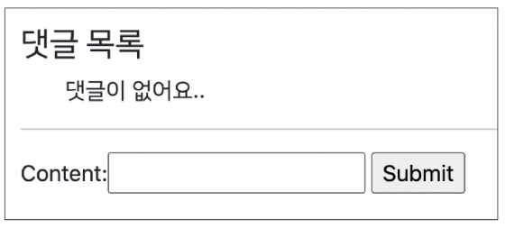
<br><br><br>        

---