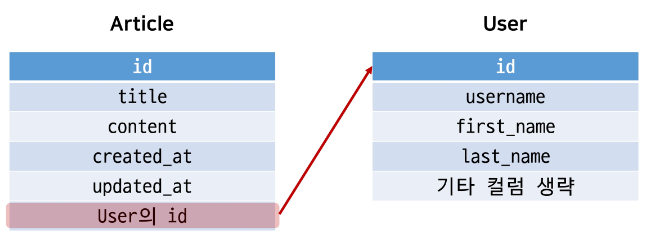
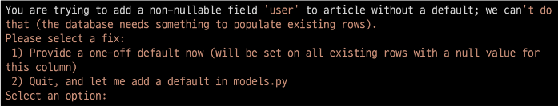
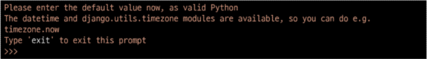
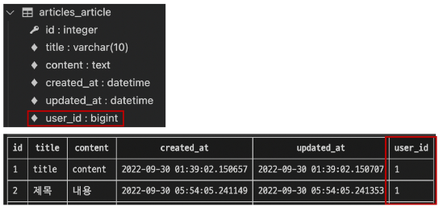
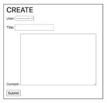
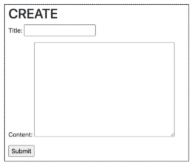
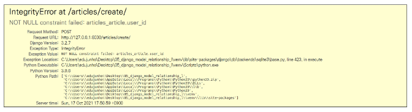
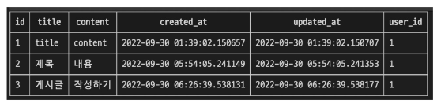
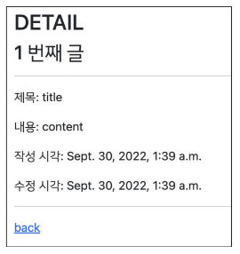
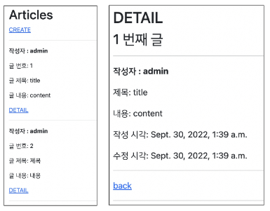

# **N:1 (Article - User)**

- 개요
    - Article(N) - User(1)<br>

    - Article 모델과 User 모델 간 관계 설정
    - “0개 이상의 게시글은 1개의 회원에 의해 작성될 수 있음”
<br><br><br>

---

## **1. Referencing the User model**

- Django에서 User 모델을 참조하는 방법<br>

    - `settings.AUTH_USER_MODEL`<br>

        - 반환 값: ‘accounts.User’ (문자열)<br>

        - User 모델에 대한 외래 키 또는 M:N 관계를 정의할 때 사용
        - **models.py의 모델 필드에서 User 모델을 참조할 때 사용**
    
    - `get_user_model()`
        - 반환 값: User Object (객체)<br>

        - 현재 활성화(active)된 User 모델을 반환
        - 커스터마이징한 User 모델이 있을 경우는 Custom User 모델, 그렇지 않으면 User를 반환
        - models.py가 아닌 다른 모든 곳에서 유저 모델을 참조할 때 사용
<br><br><br>

---

## **2. 모델 관계 설정**

1. Article과 User간 모델 관계 설정
    
    
    <br><br>

    - Article 모델에 User 모델을 참조하는 외래 키 작성
        
        ```python
        # articles/miodles.py
        
        from django.conf import settings
        
        class Article(modles.Model)
            user = models.ForeignKey(settings.AUTH_USER_MODEL, on_delete=models.CASCADE)
            ...
        ```
<br><br>

2. Migration 진행
    - 기존에 존재하던 테이블에 새로운 컬럼이 추가되어야 하는 상황이기 때문에 migrations 파일이 곧바로 만들어지지 않고 일련의 과정이 필요
        
        `$ python [manage.py](http://manage.py) makemigrations`
      <br><br>  
    
    - 첫 번째 화면
        
        
        
        - 기본적으로 모든 컬럼은 NOT NULL 제약조건이 있기 때문에 데이터가 없이는 새로 추가되는 외래 키 필드 user_id가 생성되지 않음
        - 그래서 기본값을 어떻게 작성할 것인지 선택해야 함
        - 1을 입력하고 Enter 진행 (다음 화면에서 직접 기본 값 입력)
      <br><br>

    - 두 번째 화면
        
        
        
        - article의 user_id에 어떤 데이터를 넣을 것인지 직접 입력해야 함
        - 마찬가지로 1 입력하고 Enter 진행
        - 그러면 기존에 작성된 게시글이 있다면 모두 1번 회원이 작성한 것으로 처리됨
      <br><br>

    - migrations 파일 생성 후 migration 진행
        
        `$ python manage.py migrate`
      <br><br> 
    
    - article 테이블 스키마 변경 및 확인
        
        
<br><br><br>        
    
3. Django에서 User 모델을 참조하는 방법 정리
    - 문자열과 객체를 반환하는 특징과 Django의 내부적인 실행 원리에 관련된 것이므로 이렇게만 외우도록 한다.<br>

    - User 모델을 참조할 때
        - models.py에서는 **settings.AUTH_USER_MODEL**<br>

        - 다른 모든 곳에서는 **get_user_model()**
<br><br><br>

---

## **3. CREATE**

1. 개요
    - 인증된 회원의 게시글 작성 구현하기<br>

    - 작성하기 전 로그인을 먼저 진행한 상태로 진행
<br><br><br>

2. ArticleForm
    
    
    
    - ArticleForm 출력을 확인해보면 create 템플릿에서 불필요한 필드(user)가 출력됨<br>

    - 이전에 CommentForm에서 외래 키 필드 article이 출력되는 상황과 동일한 상황
    - user 필드에 작성해야 하는 user 객체는 view 함수의 request 객체를 활용해야 함
    <br><br>
    - ArticleForm의 출력 필드 수정
        
        ```python
        # articles/forms.py
        
        class ArticleForm(forms.ModelForm):
        
            class Meta:
                model = Article
                fields = ('title', 'content',)
        ```
      <br>  
    
    - 수정 확인 후 게시글 작성하기
        
        
<br><br><br>        
    
3. 외래 키 데이터 누락
    - 게시글 작성 시 **NOT NULL constraint failed: articles_article.user_id** 에러 발생<br>

        
        
        
    - “NOT NULL 제약 조건이 실패했다. articles_article 테이블의 user_id 컬럼에서”
    - 게시글 작성 시 외래 키에 저장되어야 할 작성자 정보가 누락 되었기 때문
    <br><br>

    - 게시글 작성 시 작성자 정보가 함께 저장될 수 있도록 save의 commit 옵션을 활용
        
        ```python
        # articles/views.py
        
        @login_required
        @require_http_methods(['GET', 'POST'])
        def create(request):
            if request.method == 'POST':
                form = ArticleForm(request.POST)
                if form.is_valid():
                    article = form.save(commit=False)
                    article.user = request.user
                    article.save()
                    return redirect('articles:detail', article.pk)
        ```
      <br>  
    
    - 수정 후 게시글이 잘 작성 되는지 확인
        
        
<br><br><br>        

---

## **4. DELETE**

- 게시글 삭제 시 작성자 확인<br>

    - 이제 게시글에는 작성자 정보가 함께 들어있기 때문에 현재 삭제를 요청하려는 사람과 게시글을 작성한 사람을 비교하여 본인의 게시글만 삭제 할 수 있도록 함
        
        ```python
        # articles/views.py
        
        @require_POST
        def delete(request, pk):
            article = Article.objects.get(pk=pk)
            if request.user.is_authenticated:
                if request.user == article.user:
                    article.delete()
                    return redirect('articles:index')
            return redirect('articles:detail', article.pk)
        ```
<br><br>        

---

## **5. UPDATE**

- 게시글 수정 시 작성자 확인<br>

    - 수정도 마찬가지로 수정을 요청하려는 사람과 게시글을 작성한 사람을 비교하여 본인의 게시글만 수정할 수 있도록 함
        
        ```python
        # articles/views.py
        
        @login_required
        @require_http_methods(['GET', 'POST'])
        def update(request, pk):
            article = Article.objects.get(pk=pk)
            if request.user == araticle.user:
                if request.method == 'POST':
                    form = ArticleForm(request.POST, instance=article)
                    if form.is_valid():
                        form.save()
                        return redirect('articles:detail', article.pk)
                else:
                    form = ArticleForm(instance=article)
            else:
                return redirect('articles:index')
        ```
      <br>  
    
    - 추가로 해당 게시글의 작성자가 아니라면, 수정/삭제 버튼을 출력하지 않도록 함
        
        ```html
        <!-- articles/detail.html -->
        
        
        
        
          ...
          
            <a href="">UPDATE</a>
            <form action="" method="POST">
              
              <input type="submit" value="DELETE">
            </form>
          
        ...
        ```
      <br>  
    
    - 다른 계정으로 접속하여 detail 템플릿에서 다른 회원이 작성한 게시글을 확인
        
        
<br><br><br>        

---

## **6. READ**

- 게시글 작성자 출력<br>

    - index 템플릿과 detail 템플릿에서 각 게시글의 작성자 출력
        
        ```html
        <!-- articles/index.html -->
        
        
        
        
        
          ...
          
            <p><b>작성자 : {{ article.user }}</b></p>
            <p>글 번호: {{ article.pk }}</p>
            <p>글 제목: {{ article.title }}</p>
            <p>글 내용: {{ article.content }}</p>
            <a href="">DETAIL</a>
            <hr>
          
        
        
        ```
        
        ```html
        <!-- articles/detail.html -->
        
        
        
        
          <h2>DETAIL</h2>
          <h3>{{ article.pk }} 번째 글</h3>
          <hr>
          <p><b>작성자 : {{ article.user }}</b></p>
          <p>제목: {{ article.title }}</p>
          <p>내용: {{ article.content }}</p>
          <p>작성 시각: {{ article.created_at }}</p>
          <p>수정 시각: {{ article.updated_at }}</p>
          <hr>
        ```
      <br>  
    
    - 출력 확인하기
        
        
<br><br><br>        

---