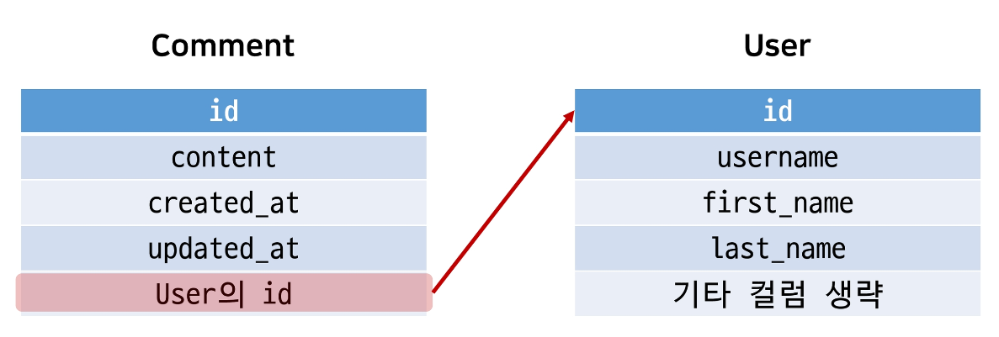
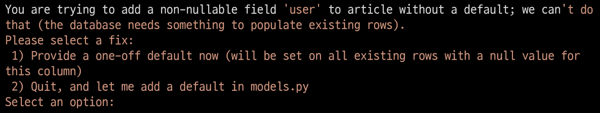
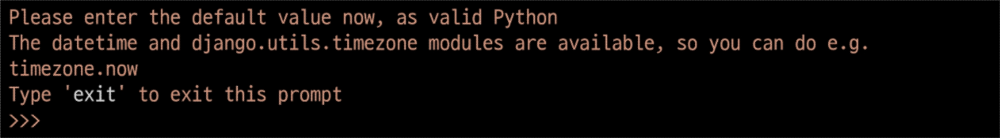
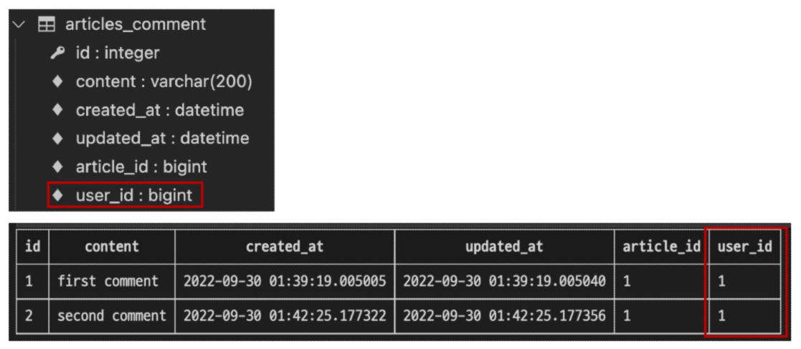
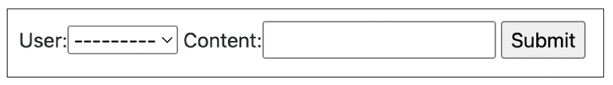
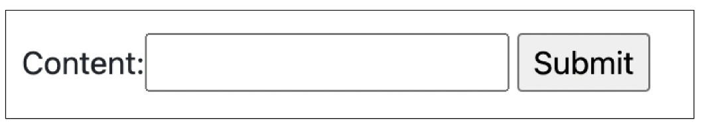
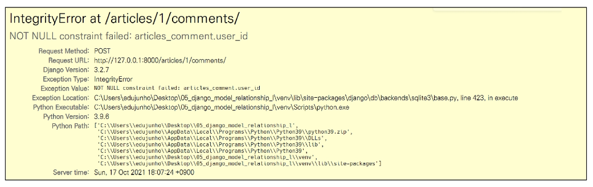
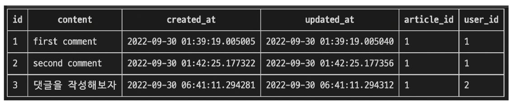
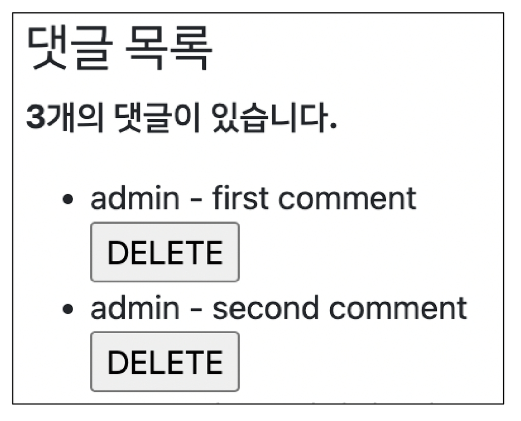
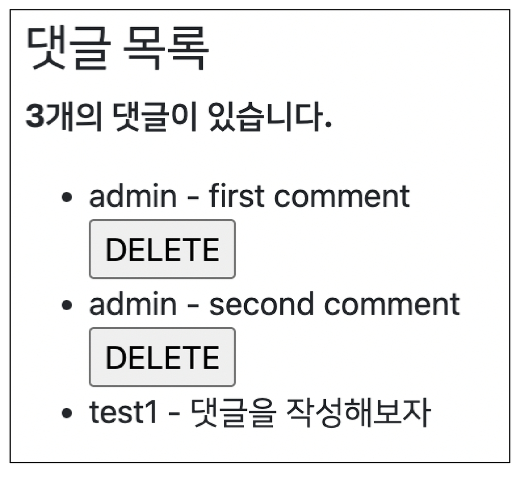

# **N:1 (Comment - User)**

- 개요
    - Comment(N) - User(1)<br>

    - Comment 모델과 User 모델 간 관계 설정
    - “0개 이상의 댓글은 1개의 회원에 의해 작성될 수 있음”
<br><br><br>

---

## **1. 모델 관계 설정**

1. Comment와 User간 모델 관계 설정
    
    
    <br><br>

    - Comment 모델에 User 모델을 참조하는 외래 키 작성
        
        ```python
        # articles/models.py
        
        class Comment(models.Model):
            article = models.ForeignKey(Article, on_delete=models.CASCADE)
            user = models.ForeignKey(settings.AUTH_USER_MODEL, on_delete=models.CASCADE)
            ...
        ```
<br><br>        
    
2. Migration 진행
    - 이전에 User와 Article 모델 관계 설정 때와 마찬가지로 기존에 존재하던 테이블에 새로운 컬럼이 추가되어야 하는 상황이기 때문에 migrations 파일이 곧바로 만들어지지 않고 일련의 과정이 필요<br>
        
        `$ python manage.py makemigrations`
    <br><br>    
    
    - 첫 번째 화면
        
        
        
        - 기본적으로 모든 컬럼은 NOT NULL 제약조건이 있기 때문에 데이터 없이는 새로 추가되는 외래 키 필드 user_id가 생성되지 않음<br>

        - 그래서 기본값을 어떻게 작성할 것인지 선택해야 함
        - 1을 입력하고 Enter 진행 (다음 화면에서 직접 기본 값 입력)
    <br><br>

    - 두 번재 화면
        
        
        
        - comment의 user_id에 어떤 데이터를 넣을 것인지 직접 입력해야 함<br>

        - 마찬가지로 1을 입력하고 Enter 진행
        - 그러면 기존에 작성된 댓글이 있다면 모두 1번 회원이 작성한 것으로 처리됨
    <br><br>

    - migrations 파일 생성 후 migrate 진행
        
        `$ python manage.py migrate`
    <br><br>    
    
    - comment 테이블 스키마 변경 및 확인
        
        
<br><br><br>

---

## **2. CREATE**

1. 개요
    - 인증된 회원의 댓글 작성 구현하기<br>

    - 작성하기 전 로그인을 먼저 진행한 상태로 진행
<br><br><br>

2. CommentForm
    
    
    
    - CommentForm 출력을 확인해보면 create 템플릿에서 불필요한 필드(user)가 출력됨<br>

    - user 필드에 작성해야 하는 user 객체는 view 함수의 request 객체를 활용해야 함
    <br><br>

    - CommentForm의 출력 필드 수정
        
        ```python
        # articles/forms.py
        
        class CommentForm(forms.ModelForm):
        
            class Meta:
                model = Comment
                exclude = ('article', 'user',)
        ```
      <br>  
    
    - 수정 확인 후 댓글 작성하기
        
        
<br><br><br>        
    
3. 외래 키 데이터 누락
    - 댓글 작성 시 NOT **NULL constraint failed: articles_comment.user_id** 에러 발생<br>

        
        
        
    - “NOT NULL 제약조건이 실패했다. articles_comment 테이블의 user_id 컬럼에서”
    - 댓글 작성 시 외래 키에 저장되어야 할 작성자 정보가 누락되었기 때문
    <br><br>

    - 댓글 작성 시 작성자 정보가 함께 저장될 수 있도록 save의 commit 옵션을 활용
        
        ```python
        # articles/views.py
        
        def comments_create(request, pk):
            article = Article.objects.get(pk=pk)
            comment_form = CommentForm(request.POST)
            if comment_form.is_valid():
                comment = comment_form.save(commit=False)
                comment.article = article
                comment.user = request.user
                comment.save()
            return redirect('articles:detail', article.pk)
        ```
      <br>  
    
    - 수정 후 댓글이 잘 작성되는지 확인
        
        
<br><br><br>

---

## **3. READ**

- 댓글 작성자 출력<br>

    - detail 템플릿에서 각 게시글의 작성자 출력<br>

        
        ```html
        <!-- articles/detail.html -->
        
        
        
        
        
          ...
          <h4>댓글 목록</h4>
          ...
          <ul>
            
              <li>
                {{ comment.user }} - {{ comment.content }}
                <form action="" method="POST">
                  
                  <input type="submit" value="DELELTE">
                </form>
        ...
        ```
       <br> 
    
    - 출력 확인하기
        
        
<br><br><br>

---

## **4. DELETE**

- 댓글 삭제 시 작성자 확인하기<br>

    - 이제 댓글에는 작성자 정보가 함께 들어있기 때문에 현재 삭제를 요청하려는 사람과 댓글 작성한 사람을 비교하여 본인의 댓글만 삭제할 수 있도록 함
        
        ```python
        # articles/views.py
        
        def comments_delete(request, article_pk, comment_pk):
            comment = Comment.objects.get(pk=comment_pk)
            if request.user == comment.user:
                comment.delete()
            return redirect('articles:detail', article_pk)
        ```
      <br>  
    
    - 추가로 해당 댓글의 작성자가 아니라면, 삭제 버튼을 출력하지 않도록 함
        
        ```html
        <!-- articles/detail.html -->
        
        
        
        
          ...
          <ul>
            
              <li>
                {{ comment.user }} - {{ comment.content }}
                
                  <form action="" method="POST">
                    
                    <input type="submit" value="DELELTE">
                  </form>
                
                ...
        ```
      <br>  
    
    - 다른 계정으로 접속하여 detail 템플릿에서 다른 회원이 작성한 댓글을 확인
        
        
<br><br><br>

---

## **5. 인증된 사용자에 대한 접근 제한하기**

1. 개요
    - is_authenticated와 View decorator를 활용하여 코드 정리하기
<br><br><br>

2. 인증된 사용자인 경우만 댓글 작성 및 삭제하기
    
    ```python
    # articles/views.py
    
    @require_POST
    def comments_create(request, pk):
        if request.user.is_authenticated:
            article = Article.objects.get(pk=pk)
            comment_form = CommentForm(request.POST)
            if comment_form.is_valid():
                comment = comment_form.save(commit=False)
                comment.article = article
                comment.user = request.user
                comment.save()
            return redirect('articles:detail', article.pk)
        return redirect('accounts:login')
    ```
    
    ```python
    # articles/views.py
    
    @require_POST
    def comments_delete(request, article_pk, comment_pk):
        if request.user.is_authenticated:
            comment = Comment.objects.get(pk=comment_pk)
            if request.user == comment.user:
                comment.delete()
        return redirect('articles:detail', article_pk)
    ```
<br><br>

3. 비인증 사용자는 CommentForm을 볼 수 없도록 하기
    
    ```html
    <!-- articles/detail.html -->
    
    
    
    
      ...
    <hr>
      
        <form action="" method="POST">
          
          {{ comment_form }}
          <input type="submit">
        </form>
      
        <a href="">[댓글을 작성하려면 로그인하세요.]</a>
      
    
    ```
<br><br>    

---