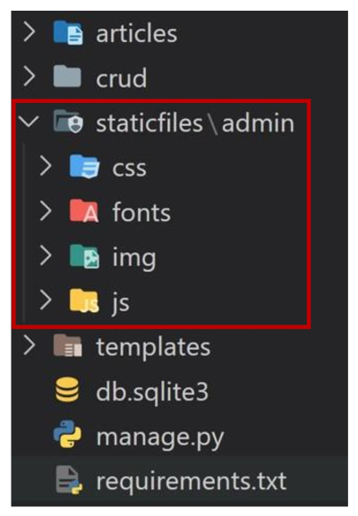

# **Managing static files**

- 개요
    - 개발자가 서버에 미리 준비한 혹은 사용자가 업로드한 정적파일을 클라이언트에게 제공하는 방법
<br><br><br>

---

## **1. static files**

1. 정적 파일
    - 응답할 때 별도의 처리 없이 파일 내용을 그대로 보여주면 되는 파일<br>

        - 사용자의 요청에 따라 내용이 바뀌는 것이 아니라 요청한 것을 그대로 보여주는 파일
    - **파일 자체가 고정**되어 있고, 서비스 중에도 추가되거나 **변경되지 않고 고정**되어 있음
        - 예를 들어, 웹 사이트는 일반적으로 이미지, 스크립트 또는 CSS와 같은 미리 준비된 추가 파일(움직이지 않는)을 제공해야 함
    - Django에서는 이러한 파일들을 **static file**이라 함
        - Django는 `staticfiles` 앱을 통해 정적 파일과 관련된 기능을 제공
<br><br><br>

2. Media File
    - 미디어 파일<br>

    - 사용자가 웹에서 업로드하는 정적 파일 (user_uploaded)
    - 유저가 업로드한 모든 정적 파일
<br><br><br>

3. 웹 서버와 정적 파일
    
    
    
    - 웹 서버의 기본동작은<br>

        - 특정 위치(URL)에 있는 자원을 요청(HTTP request) 받아서<br>

        - 응답(HTTP response)을 처리하고 제공(serving)하는 것<br><br>
    
    
    
    - 이는 “자원과 자원에 접근 가능한 주소가 있다.”라는 의미<br>

        - 예를 들어, 사진 파일은 자원이고 해당 **사진 파일을 얻기 위한 경로인 웹 주소(URL)가 존재**함<br>

    - 즉, 웹 서버는 요청 받은 URL로 서버에 존재하는 정적 자원(static resource)을 제공함
<br><br><br>

---

## **2. static files 구성하기**

1. Django에서 정적파일을 구성하고 사용하기 위한 몇가지 단계
    - `INSTALLED_APPS`에 `django.contrib.staticfiles`가 포함되어 있는지 확인하기<br>

    - `settings.py`에서 **STATIC_URL**을 정의하기
    - 앱의 static 폴더에 정적 파일을 위치하기
        - 예시) `my_app/static/sample_img.jpg`
    - 템플릿에서 static 템플릿 태그를 사용하여 지정된 경로에 있는 정적 파일의 URL 만들기
        
        ```html
        
        
        
        ```
<br><br>        
    
2. Django template tag
    
    ``
    
    - load tag<br>

    - 특정 라이브러리, 패키지에 등록된 모든 템플릿 태그와 필터를 로드
    
    ``
    
    - static tag<br>

    - STATIC_ROOT에 저장된 정적 파일에 연결
<br><br><br>

3. Static files 관련 Core Settings
    - `STATIC_ROOT`<br>

    - `STATICFILES_DIRS`
    - `STATIC_URL`
<br><br><br>

4. **STATIC_ROOT**
    - Default: None<br>

    - **Django 프로젝트에서 사용하는 모든 정적 파일을 한 곳에 모아 넣는 경로**
    - `collectstatic`이 배포를 위해 정적 파일을 수집하는 디렉토리의 절대 경로
    - **개발 과정에서 setting.py의 DEBUG 값이 True로 설정되어 있으면 해당 값은 작용되지 않음**
    - 실 서비스 환경(배포 환경)에서 Django의 모든 정적 파일을 다른 웹 서버가 직접 제공하기 위해 사용
    - 배포 환경에서는 Django를 직접 실행하는 것이 아니라, 다른 서버에 의해 실행되기 때문에 실행하는 다른 서버는 Django에 내장되어 있는 정적 파일들을 인식하지 못함 (내장되어 있는 정적 파일들을 밖으로 꺼내는 이유)
<br><br><br>

5. [참고] `collectstatic`
    
    
    - `STATIC_ROOT`에 Django 프로젝트의 모든 정적 파일을 수집
        
        ```python
        # settings.py
        
        STATIC_ROOT = BASE_DIR / 'staticfiles'
        ```
        
        `$ python manage.py collectstatic`
        
        → 결과를 확인하고 수집된 정적파일을 모두 삭제한다.
        
    
    
<br><br><br>

6. [참고] 소프트웨어 배포 (Deploy)
    - 프로그램 및 애플리케이션을 서버와 같은 기기에 설치하여 서비스를 제공하는 것<br>

    - 클라우드 컴퓨팅 서비스(AWS, Google Cloud, MS Azure 등)에 프로그램 및 애플리케이션을 설치해 제공하는 것
        
        
<br><br><br>
    
7. **STATICFILES_DIR**
    - Default: [] (Empty list)<br>

    - **app/static/** 디렉토리 경로를 사용하는 것(기본 경로) 외에 추가적인 정적 파일 경로 목록을 정의하는 리스트
    - 추가 파일 디렉토리에 대한 전체 경로를 포함하는 문자열 목록으로 작성되어야 함
        
        ```python
        # 작성 예시
        
        STATICFILES_DIRS = [
            BASE_DIR / 'static',
        ]
        ```
<br><br>        
    
8. **STATIC_URL**
    - Default: None<br>

    - `STATIC_ROOT`에 있는 정적 파일을 참조할 때 사용할 URL
    - 개발 단계에서는 실제 정적 파일들이 저장되어 있는 `app/static/` 경로(기본 경로) 및 `STATICFILES_DIRS`에 정의된 추가 경로들을 탐색
    - **실제 파일이나 디렉토리가 아니며, URL로만 존재**
    - 비어 있지 않은 값으로 설정 한다면 반드시 slash(/)로 끝나야 함
        
        ```python
        # 작성 예시
        
        STATIC_URL = '/static/'
        ```
<br><br><br>

---

## **3. static files 사용하기**

1. static file 가져오기
    - Static file을 가져오는 2가지 방법<br>

        - 기본 경로에 있는 static file 가져오기<br>

        - 추가 경로에 있는 static file 가져오기
    <br><br>

    - 기본 경로에 있는 static file 가져오기
        - articles/static/articles 경로에 있는 이미지 파일 배치하기
            
            
            
        - static tag를 사용해 이미지 파일 출력하기
            
            ```html
            <!-- articles/index.html -->
            
            
            
            
            
              
              <h1>Articles</h1>
            ...
            ```
            
        - 이미지 출력 확인
            
            
            
    <br><br>

    - 추가 경로에 있는 static file 가져오기
        - 추가 경로 작성
            
            ```python
            # setting.py
            
            STATICFILES_DIRS = [
            BASE_DIR / 'static',
            ]
            ```
            
        - static/경로에 이미지 파일 배치하기
            
            
            
        - static tag를 사용해 이미지 파일 출력하기
            
            ```html
            <!-- articles/index.html -->
            
            
                # base.html 안에 쓰는 것 상관없이 항상 써야하고,  아래에 써야한다!!!!!
            
            
              
              
              <h1>Articles</h1>
            ...
            ```
            
        - 이미지 출력 확인하기
            
            
<br><br><br>            
    
2. STATIC_URL 확인하기
    - Django가 해당 이미지를 클라이언트에게 응답하기 위해 만든 image url 확인하기<br>

        - 개발자도구 - Inspect 버튼을 통해 확인
    - **STATIC_URL + static file 경로**로 설정됨
        - http://127.0.0.1:8000**/static/**articles/sample_img_1.png
            
            .png)
            
    
    - 개발자도구 - Network에서 Request URL 확인해보기
        - 클라이언트에게 이미지를 응답하기 위한 요청 URL을 만든 것
            
            .png)
<br><br><br>            

---