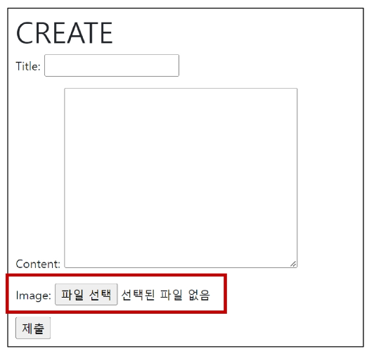
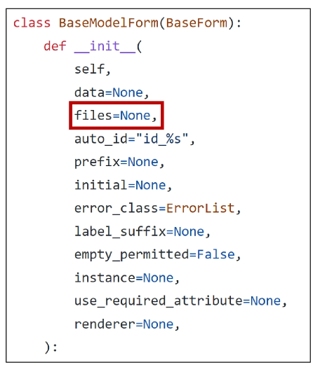
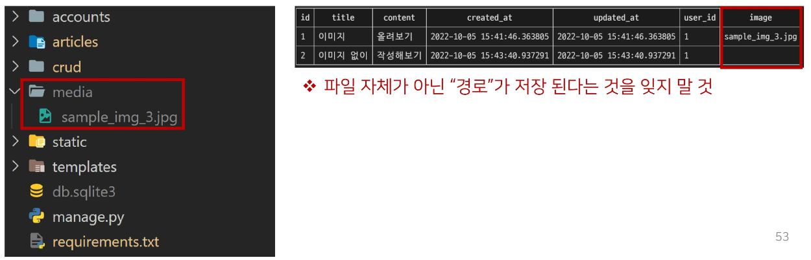
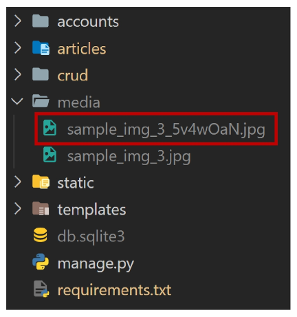
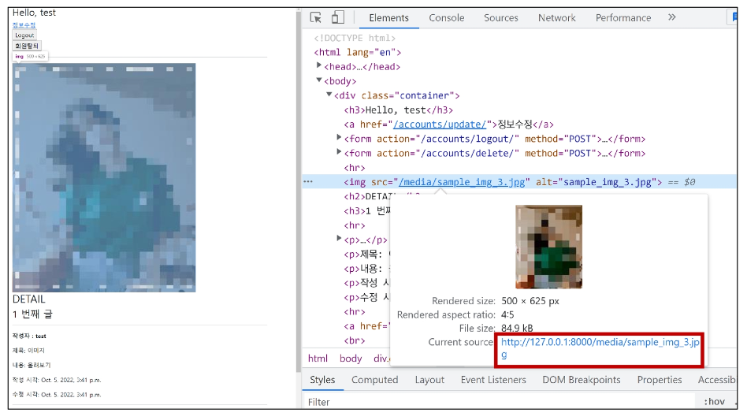
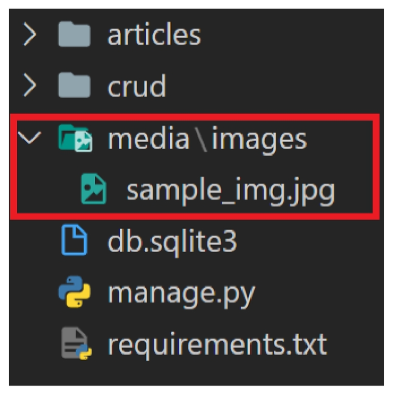
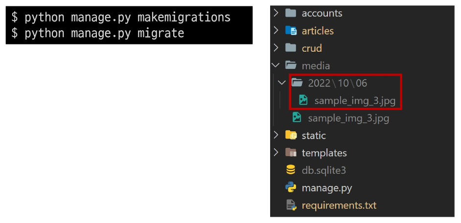
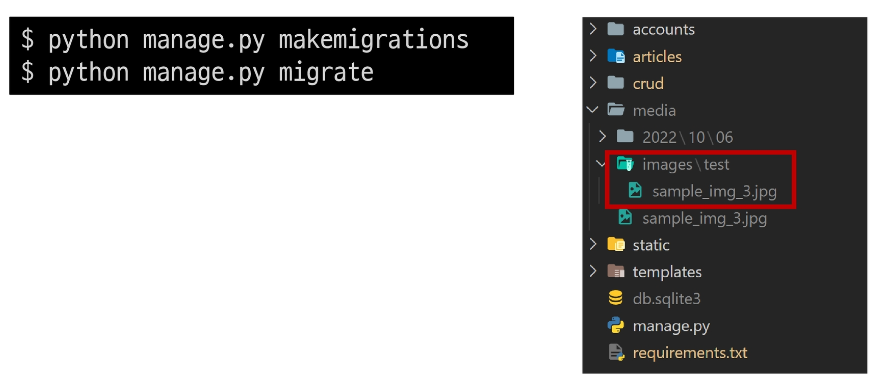

# **Image Upload**

- 개념
    - Django ImageField를 사용해  사용자가 업로드한 정적 파일(미디어 파일) 관리하기
<br><br><br>

---

## **1. ImageField**

1. ImageField()
    - 이미지 업로드에 사용하는 모델 필드<br>

    - FileField를 상속받는 서브 클래스이기 때문에 FileField의 모든 속성 및 메서드를 사용 가능
    - 더해서 사용자에 의해 업로드된 객체가 유효한 이미지인지 검사
    - ImageField 인스턴스는 최대 길이가 100자인 문자열로 DB에 생성되며, max_length 인자를 사용하여 최대 길이를 변경할 수 있음
<br><br><br>

2. FileField()
    - `FileField(upload_to=’’, storage=None, max_length=100, **options)`<br>

    - 파일 업로드에 사용하는 모델 필드
    - 2개의 선택 인자를 가지고 있음
        - upload_to   → 파일을 MEDIA_ROOT 내부에 생성<br>

        - storage
<br><br><br>

3. FileField / ImageField를 사용하기 위한 단계
    - `setting.py`에 **MEDIA_ROOT**, **MEDIA_URL** 설정<br>

    - **upload_to** 속성을 정의하여 업로드된 파일에 사용할 MEDIA_ROOT의 하위 경로를 지정 (선택사항 but 지정하는 게 좋다)
<br><br><br>

4. MEDIA_ROOT
    - Default: ‘’ (Empty string)<br>

    - 사용자가 업로드한 파일(미디어 파일)들을 보관할 디렉토리의 절대 경로
    - Django는 성능을 위해 업로드 파일은 데이터베이스에 저장하지 않음
        - 데이터베이스에 저장되는 것은 **파일 경로**
    - MEDIA_ROOT는 STATIC_ROOT와 반드시 다른 경로로 지정해야 함
    - \[ ](리스트) 아님 주의, 하나만 지정하면 된다 !
        
        ```python
        # settings.py
        
        MEDIA_ROOT = BASE_DIR / 'media'
        ```
<br><br>        
    
5. MEDIA_URL
    - Default: ‘’ (Empty string)<br>

    - MEDIA_ROOT에서 제공되는 미디어 파일을 처리하는 URL
    - 업로드된 파일의 주소(URL)를 만들어 주는 역할
        - 웹 서버 사용자가 사용하는 public URL
    - 비어 있지 않은 값으로 설정 한다면 반드시 slash(/)로 끝나야 함
    - MEDIA_URL은 STATIC_URL과 반드시 다른 경로로 지정해야 함
        
        ```python
        # settings.py
        
        MEDIA_URL = '/media/'
        ```
<br><br>        
    
6. 개발 단계에서 사용자가 업로드한 미디어 파일 제공하기
    
    ```python
    # crud/urls.py
    
    from django.conf import settings
    from django.conf.urls.static import static
    
    urlpatterns = [
        path('admin/', admin.site.urls),
        path('articles/', include('articles.urls')),
        path('accounts/', include('articles.urls')),
    ] + static(settings.MEDIA_URL, document_root=settings.MEDIA_ROOT)
    ```
    
    - 사용자로부터 업로드된 파일이 프로젝트에 업로드 되고나서, 실제로 사용자에게 제공하기 위해서는 업로드된 파일의 URL이 필요함<br>

        - 업로드된 파일의 URL == `settings.MEDIA_URL`<br>

        - 위 URL을 통해 참조하는 파일의 실제 위치 == `settings.MEDIA_ROOT`
<br><br><br>

---

### **2. CREATE**

1. ImageField 작성
    
    ```python
    # articles/models.py
    
    class Article(models.Model):
        title = models.CharField(max_length=20)
        content = models.TextField()
        image = models.ImageField(blank=True)
        created_at = models.DateTimeField(auto_not_add=True)
        updated_at = models.DateTimeField(auto_not=True)
    ```
    
    - 기존 컬럼 사이에 작성해도 실제 테이블에 추가될 때는 가장 우측(뒤)에 추가됨
<br><br><br>

2. Model field option
    - Model field option 중 아래 2가지 사항 알아보기
        - blank<br>

        - null
        
        
<br><br><br>        
    
3. blank
    - Default: False<br>

    - True인 경우 필드를 비워 둘 수 있음
        - 이럴 경우 DB에는 ‘’(빈 문자열)이 저장됨
    - 유효성 검사에서 사용 됨(is_valid)
        - “Validation-related”<br>

        - 필드에 blank=True가 있으면 form 유효성 검사에서 빈 값을 입력할 수 있음
            
            [http://docs.djangoproject.com/en/3.2/ref/models/fields/#blank](http://docs.djangoproject.com/en/3.2/ref/models/fields/#blank)
<br><br><br>            
    
4. null
    - Default: False<br>

    - True인 경우 Django는 빈 값을 DB에 NULL로 저장함
        - “Database_related”
<br><br><br>

5. null 관련 주의사항
    - **CharField, TextField와 같은 문자열 기반 필드에는 null 옵션 사용을 피해아 함**<br>

        - 문자열 기반 필드에 `null=True`로 설정 시 데이터 없음에 대한 표현에 “빈 문자열”과 “NULL” 2가지 모두 가능하게 됨<br>

        - “데이터 없음”에 대한 표현에 두 개의 가능한 값을 갖는 것은 좋지 않음
        - Django는 문자열 기반 필드에서 NULL이 아닌 빈 문자열을 사용하는 것이 규칙
<br><br><br>

6. Migrations
    - ImageField를 사용하려면 반드시 Pillow 라이브러리가 필요<br>

        - Pillow 설치 없이는 makemigrations 실행 불가
            
            
<br><br><br>            
    
7. [참고] Pillow
    - 광범위한 파일 형식 지원, 효율적이고 강력한 이미지 처리 기능을 제공하는 라이브러리<br>

    - 이미지 처리 도구를 위한 견고한 기반을 제공
<br><br><br>

8. ArticleForm에서 image 필드 출력 확인
    - 확인 후 이미지를 첨부하여 게시글 작성 시도<br>

        
        
        
    - 하지만 이미지가 업로드 되지 않음
    - 파일 또는 이미지 업로드 시에는 form 태그에 enctype 속성을 다음과 같이 변경해야 함
        
        ```html
        <!-- articles/create.html -->
        
        
        
        
          <h1>CREATE</h1>
          <form action="" method="POST" enctype="multipart/form-data">
            
            {{ form.as_p }}
            <input type="submit">
          </form>
        ...
        ```
<br><br>        
    
9. [참고] form 태그의 enctype(인코딩) 속성 값
    - `aplication/x-www-form-urlencoded`<br>

        - 기본 값<br>

        - 모든 문자 인코딩
    - `multipart/form-data`
        - 파일/이미지 업로드 시에 **반드시** 사용해야 함<br>

        - 전송되는 데이터의 형식을 지정
        - \<input type=”file”>을 사용할 경우 사용
    - `text/plain`
<br><br><br>

10. request.FILES
    - 파일 및 이미지는 request의 POST 속성 값으로 넘어가지 않고 FILES 속성 값에 담겨 넘어감
        
        ```python
        # articles/views.py
        
        @login_required
        @require_http_methods(['GET', 'POST'])
        def create(request):
            if request.method == 'POST':
                form = ArticleForm(request.POST, request.FILES)
        ...
        ```
<br><br>        
    
11. [참고] request.FILES가 두번째 위치 인자인 이유
    - BaseModelForm Class의 생성자 함수 살펴보기
        
        
<br><br><br>        
    
12. 이미지 첨부하기
    - 이미지를 첨부해서 한번, 첨부하지 않고 한번 게시글 작성해보기<br>

    - 이미지를 첨부하지 않으면 blank=True 속성으로 인해 빈 문자열이 저장되고, 이미지를 첨부한 경우는 MEDIA_ROOT 경로에 이미지가 업로드 됨
        
        
     <br><br>   
    
    - 만약 같은 이름의 파일을 업로드 한다면 Django는 파일 이름 끝에 임의의 난수 값을 붙여 저장함
        
        
<br><br><br>

---

## **3. READ**

- 업로드 이미지 출력하기<br>

    - 업로드된 파일의 상대 URL은 Django가 제공하는 url 속성을 통해 얻을 수 있음
        
        ```html
        <!-- articles/detail.html -->
        
        
        
        
          
          <h2>DETAIL</h2>
        ...
        ```
        
    - `article.image.url` - 업로드 파일의 경로
    - `article.image` - 업로드 파일의 파일 이름
    <br><br>

    - 출력 확인하기
        
        
        
    <br><br>

    - MEDIA_URL 확인하기
        
        
        
    <br><br>

    - 이미지를 업로드하지 않은 게시물은 detail 템플릿을 출력할 수 없는 문제 해결하기<br>

        - 이미지 데이터가 있는 경우만 이미지 출력할 수 있도록 처리
            
            ```html
            <!-- articles/detail.html -->
            
            
            
            
              
                
              
              <h2>DETAIL</h2>
            ...
            ```
<br><br>

---

## **4. UPDATE**

1. 개요
    - 이미지는 바이너리 데이터이기 때문에 텍스트처럼 일부만 수정하는 것은 불가능<br>

    - 때문에 새로운 사진으로 대체하는 방식을 사용
<br><br><br>

2. 업로드 이미지 수정하기
    - enctype 속성값 추가
        
        ```html
        <!-- articles/update.html -->
        
        
        
        
          <h1>UPDATE</h1>
          <form action="" method="POST" enctype="multipart/form-data">
        ...
        ```
    <br>    
    
    - 이미지 파일이 담겨있는 request.FILES 추가 작성
        
        ```python
        # articles/views.py
        
        @login_required
        @require_http_methods(['GET', 'POST'])
        def update(request, pk):
            article = Article.objects.get(pk=pk)
            if request.user == article.user:
                if request.method == 'POST':
                    form = ArticleForm(request.POST, request.FILES, instance=article)
        ...
        ```
<br><br>

---

## **5. ‘upload_to’ argument**

- 사용자 지정 업로드 경로와 파일 이름 설정하기<br>

    - ImageField는 업로드 디렉토리와 파일 이름을 설정하는 2가지 방법을 제공<br>

        - 문자열 값이나 경로 지정 방법<br>

        - 함수 호출 방법
<br><br><br>

- 문자열 값이나 경로 지정 방법
    - upload_to 인자에 새로운 이미지 저장 경로를 추가 후 migration 과정 진행
        
        ```python
        # articles/models/py
        
        class Article(models.Model):
            title = models.CharField(max_length=20)
            content = models.TextField()
            # image = models.ImageField(blank=True)
            image = models.ImageField(blank=True, upload_to='images/')
            created_at = models.DateTimeField(auto_now_add=True)
            updated_at = models.DateTimeField(auto_now=True)
        ```
        
        ```python
        $ python manage.py makemegrations
        $ python manage.py migrate
        ```
      <br>  
    
    - 이미지 업로드 후 변경된 업로드 경로 확인
    - MEDIA_ROOT 이후 경로가 추가 되는 것
        
        
        
    <br><br>

    - 단순 문자열 뿐만 아니라 파이썬 time 모듈의 `strtime()` 형식도 포함될 수 있으며, 이는 파일 업로드 날짜/시간으로 대체 됨
        
        ```python
        # articles/models/py
        
        class Article(models.Model):
            title = models.CharField(max_length=20)
            content = models.TextField()
            # image = models.ImageField(blank=True)
            # image = models.ImageField(blank=True, upload_to='images/')
            image = models.ImageField(blank=True, upload_to='%Y/%m/%d/')
            created_at = models.DateTimeField(auto_now_add=True)
            updated_at = models.DateTimeField(auto_now=True)
        ```
      <br>  
    
    - migration 과정 진행 후 이미지 업로드 결과 확인하기
        
        
<br><br><br>        

- 함수 호출 방법
    - upload_to는 독특하게 함수처럼 호출이 가능하며 해당 함수가 호출 되면서 반드시 2개의 인자를 받음
        
        ```python
        # articles/models/py
        
        def articles_image_path(instance, filename):
            return f'images/{instance.user.username}/{filename}'
        
        class Article(models.Model):
            user = models.ForeignKey(settings.AUTH_USER_MODEL, on_delete=models.CASCADE)
            title = models.CharField(max_length=20)
            content = models.TextField()
            # image = models.ImageField(blank=True)
            # image = models.ImageField(blank=True, upload_to='%Y/%m/%d/')
            image = models.ImageField(blank=True, upload_to=articles_image_path)
        ...
        ```
      <br>  
    
    - `instance`
        - FileField가 정의된 모델의 인스턴스<br>

        - 대부분 이 객체는 아직 데이터베이스에 저장되기 전이므로 아직 PK 값이 없을 수 있으니 주의
    - `filename`
        - 기존 파일 이름
    <br><br>

    - migration 가정 진행 후 이미지 업로드 결과 확인하기
    - username이 test인 회원이 업로드한 결과
        
        
<br><br><br>        

---