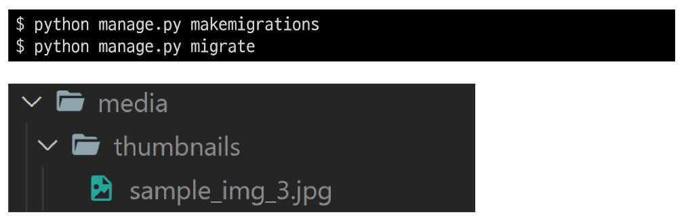
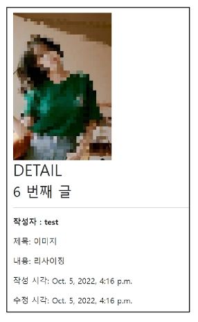
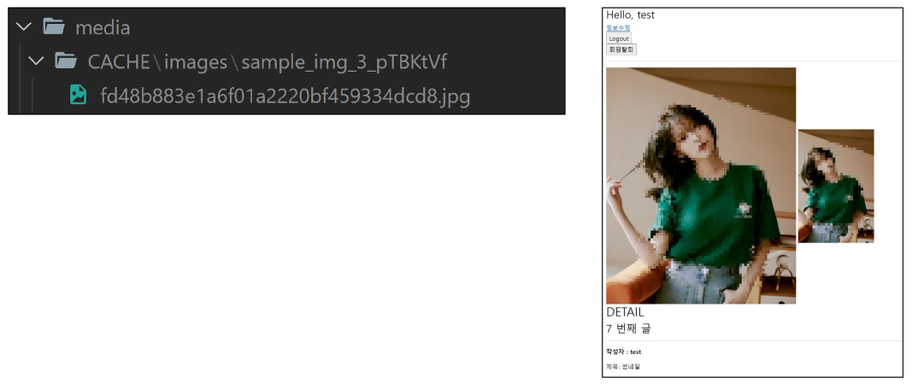
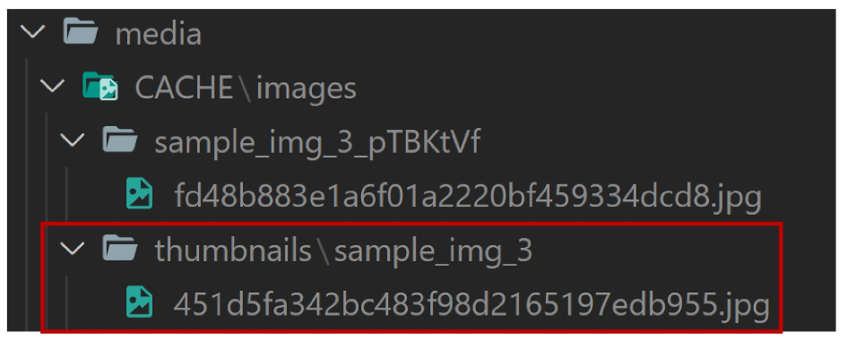

# **Image Resizing**

1. 개요
    - 실제 원본 이미지를 서버에 그대로 로드 하는 것은 여러 이유로 부담이 큼<br>

    - HTML \ 태그에서 직접 사이즈를 조정할 수 있지만, 업로드될 때 이미지 자체를 resizing하는 것을 사용해 볼 것
<br><br><br>

2. 사전 준비
    - django-imagekit 모듈 설치 및 등록
        
        ```python
        $ pip install django-imagekit
        
        $ pip freeze > requirements.txt
        ```
        
        ```python
        # settings.py
        
        INSTALLED_APPS = [
            'articles',
            'accounts',
            'django_extenstions',
            'imagekit',
        ]
        ```
<br><br>

3. [참고] django-imagekit
    - 이미지 처리를 위한 Django 앱<br>

        - 썸네일, 해상도, 사이즈, 색깔 등을 조정할 수 있음
<br><br><br>

4. 썸네일 만들기
    - 2가지 방식으로 썸네일 만들기를 진행<br>

        - 원본 이미지 저장 X<br>

        - 원본 이미지 저장 O
<br><br><br>

5. 썸내일 만들기 - 원본 이미지 저장 X
    - ProcessedImageField()의 parameter로 작성된 값들은 makemigrations 후에 변경이 되더라도 다시 makemigrations를 해줄 필요없이 즉시 반영됨
        
        ```python
        # articles/models/py
        
        from imagekit.processors import Thumbnail
        from imagekit.models import ProcessedImageField
        
        class Article(models.Model):
            user = models.ForeignKey(settings.AUTH_USER_MODEL, on_delete=models.CASCADE)
            title = models.CharField(max_length=10)
            content = models.TextField()
            # image = models.ImageField(blank=True)
            # image = models.ImageField(blank=True, upload_to='%Y/%m/%d/')
            # image = models.ImageField(blank=True, upload_to=articles_image_path)
            image = ProcessedImageField(
                blank=True,
                upload_to='thumbnails/',
                processors=[Thumbnail(200,300)],
                format='JPEG',
                options={'quality': 80},
            )
        ...
        ```
     <br>    
    
    - Migration 진행 후 이미지 업로드
        
        
        
    <br>

    - 작아진 이미지 사이즈 확인
        
        
<br><br><br>        
    
6. [참고] pilit
    - processors에 작성하는 여러 클래스는 해당 라이브러리 문서를 별도로 확인<br>

    - [https://github.com/matthewwithanm/pilkit](https://github.com/matthewwithanm/pilkit)
<br><br><br>

7. 썸내일 만들기 - 원본 이미지 저장 O
    
    ```python
    # articles/models/py
    
    from imagekit.processors import Thumbnail
    from imagekit.models import ProcessedImageField, ImageSpecField
    from django.db import models
    from django.conf import settings
    
    class Article(models.Model):
        user = models.ForeignKey(settings.AUTH_USER_MODEL, on_delete=models.CASCADE)
        title = models.CharField(max_length=10)
        content = models.TextField()
        image = models.ImageField(blank=True)
        image_thumbnail = ImageSpecField(
            source='image',
            processors=[Thumbnail(200,300)],
            format='JPEG',
            options={'quality': 80},
        )
    ...
    ```
    <br>

    - Migration 진행 후 이미지 업로드
        
        ```python
        $ python manage.py makemigrations
        $ python manage.py migrate
        ```
        
    - 확인해보면 기본적으로 원본 이미지가 업로드되고 출력됨
    <br><br>

    - 하지만 다음과 같이 입력 후 detail 페이지에서 다시 새로고침을 진행해보기
        
        ```html
        <!-- articles/detail.html -->
        
        
        
        
          
            
            
          
        ...
        ```
      <br>  
    
    - 처음에는 원본만 사용하며 썸네일이 사용되었을 때만 resizing한 이미지를 생성
        
        
    <br><br>    
    
    - 이미지가 출력되는 다른 detail 페이지에 이동할 때 썸네일이 생성됨
        
        
<br><br><br>        

---