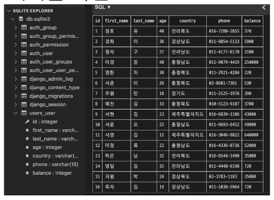

# **QuerySet API Advanced**

- 사전 준비
    - 가상 환경 생성 및 활성화<br>

    - 패키지 목록 설치
    - migrate 진행
        
        `$ python manage.py migrate`
        
    - sqlite3에서 csv 데이터 import 하기
        
        `$ sqlite3 db.sqlite3`
        
        
        
    - 테이블 확인
        
        
        
    - shell_plus 실행
        
        `$ python [manage.py](http://manage.py) shell_plus`
<br><br><br>

---

## **1. CRUD 기본**

1. 모든 user 레코드 조회
    
    `User.objects.all()`
<br><br><br> 

2. user 레코드 생성
    
    ```python
    User.objects.create(
        first_name='길동',
        last_name='홍',
        age=100,
        country='제주도',
        phone='010-1234-5678',
        balance=10000,
    )
    ```
<br><br>

3. 101번 user 레코드 조회
    
    `User.objects.get(pk=101)`
<br><br><br>

4. 101번 user 레코드의 last_name 을 김 으로 수정
    
    ```python
    user = User.objects.get(pk=101)
    user.last_name = '김'
    user.save()
    
    # 확인
    user.last_name
    ```
<br><br>

5. 101번 user 레코드 삭제
    
    ```python
    user = User.objects.get(pk=101)
    user.delete()
    
    # 확인
    User.objects.get(pk=101)
    ```
<br><br>

6. 전체 인원 수 조회
    
    ```python
    # 1
    User.objects.count()
    
    # 2
    len(User.objects.all())
    ```
<br><br>

7. **.count()**
    - QuerySet과 일치하는 데이터베이스의 개체 수를 나타내는 정수를 반환<br>

    - .all()을 사용하지 않아도 됨
<br><br><br>

---

## **2. Sorting data**

1. 나이가 어린 순으로 이름과 나이 조회하기
    
    `User.objects.order_by('age').values('first_name', 'age')`
<br><br><br>

2. **order_by()**
    - `.order_by(*fields)`<br>

    - QuerySet의 정렬을 재정의
    - 기본적으로 오름차순으로 정렬하며 필드명에 ‘-’ (하이픈) 을 작성하면 내림차순으로 정렬
    - 인자로 ‘?’를 입력하면 랜덤으로 정렬
<br><br><br>

3. **values()**
    - `.values(*fields, **expressions)`<br>

    - 모델 인스턴스가 아닌 딕셔너리 요소들을 가진 QuerySet을 반환
    - *fields는 선택인자이며 조회하고자 하는 필드명을 가변인자로 입력 받음
        - 필드를 지정하면 각 딕셔너리에는 지정한 필드에 대한 key와 value만을 출력<br>

        - 입력하지 않을 경우 각 딕셔너리에는 레코드의 모든 필드에 대한 key와 value를 출력
    - values 사용 여부에 따른 출력 비교
        
        ```python
        # 미사용
        User.objects.filter(age=30)
        <QuerySet [<User: User object (5)>, <User: User object (57)>, <User: User object (60)>]>
        
        # 사용
        User.objects.filter(age=30).values('first_name')
        <QuerySet [{'first_name': '영환'}, {'first_name': '보람'}, {'first_name': '은영'}]>
        ```
<br><br>        
    
4. 이름과 나이를 나이가 많은 순서대로 조회하기
    
    `User.objects.order_by('-age').values('first_name', 'age')`
<br><br><br>

5. 이름, 나이, 계좌 잔고를 나이가 어린순으로, 만약 같은 나이라면 계좌 잔고가 많은 순으로 정렬해서 조회하기
    
    `User.objects.order_by('age', '-balance').values('first_name', 'age', 'balance')`
<br><br><br>

6. [참고] order_by 주의사항
    - 다음과 같이 작성할 경우 앞에 호출은 모두 지워지고 마지막 호출만 적용됨
        
        ```python
        User.objects.order_by('balance').order_by('-age')
        
        # 결국 User.objects.order_by('-age') 와 같다.
        ```
<br><br>

---

## **3. Filtering data**

1. 중복없이 모든 지역 조회하기
    
    `User.objects.distinct().values('country')`
<br><br><br>

2. 지역 순으로 오름차순 정렬하여 중복없이 모든 지역 조회하기
    
    `User.objects.distinct().values('country').order_by('country')`
<br><br><br>

3. 이름과 지역이 중복 없이 모든 이름과 지역 조회하기
    
    `User.objects.distinct().values('first_name', 'country')`
<br><br><br>

4. 이름과 지역이 중복 없이 지역 순으로 오름차순 정렬하여 모든 이름과 지역 조회하기
    
    `User.objects.distinct().values('first_name', 'country').order_by('country')`
<br><br><br>

5. 나이가 30인 사람들의 이름 조회
    
    `User.objects.filter(age=30).values('first_name')`
<br><br><br>

6. 나이가 30살 이상인 사람들의 이름과 나이 조회하기
    
    `User.objects.filter(age__gte=30).values('first_name', 'age')`
<br><br><br>

7. Field lookups
    - SQL WHERE 절의 상세한 조건을 지정하는 방법<br>

    - QuerySet 메서드 filter(), exclude() 및 get()에 대한 키워드 인자로 사용됨
    - 문법 규칙
        - 필드명 뒤에 “double-underscore” 이후 작성됨
            
            `field__lookuptype=value`
            
    - [https://docs.djangoproject.com/en/3.2/ref/models/querysets/_-_field-lookups](https://docs.djangoproject.com/en/3.2/ref/models/querysets/_-_field-lookups)
<br><br><br>

8. 나이가 30살 이상이고 계좌 잔고가 50만원 초과인 사람들의 이름, 나이, 계좌 잔고 조회하기
    
    `User.objects.filter(age__gte=30, balance__`
    
    `gt=500000).values('first_name', 'age', 'balance')`
<br><br><br>

9. 이름에 ‘호’가 포함되는 사람들의 이름과 성 조회하기
    
    `User.objects.filter(first_name__contains='호').values('first_name', 'last_name')`
<br><br><br>

10. 핸드폰 번호가 011로 시작하는 사람들의 이름과 핸드폰 번호 조회
    
    `User.objects.filter(phone__startswith='011-').values('first_name', 'phone')`
    
    - SQL에서의 ‘%’ 와일드 카드와 같음<br>

    - ‘-’(under score)는 별도로 정규 표현식을 사용해야 함
<br><br><br>

11. 이름이 ‘준’으로 끝나는 사람들의 이름 조회하기
    
    `User.objects.filter(first_name__endswith='준').values('first_name')`
<br><br><br>

12. 경기도 혹은 강원도에 사는 사람들의 이름과 지역 조회하기
    
    `User.objects.filter(country__in=['경기도', '강원도']).values('first_name', 'country')`
<br><br><br>

13. 경기도 혹은 강원도에 살지 않는 사람들의 이름과 지역 조회하기
    
    `User.objects.exclude(country__in=['경기도', '강원도']).values('first_name', 'country')`
<br><br><br>

14. **exclude()**
    - `exclude(**kwargs)`<br>

    - 주어진 매개변수와 일치하지 않는 객체를 포함하는 QuerySet 반환
<br><br><br>

15. 나이가 가장 어린 10명의 이름과 나이 조회하기
    
    `User.objects.order_by('age').values('first_name', 'age')[:10]`
<br><br><br>

16. 나이가 30이거나 성이 김씨인 사람들 조회
    
    ```python
    # shell_plus에서는 import 문 생략 가능
    from django.db.models import Q
    
    User.objects.filter(Q(age=30) | Q(last_name='김'))
    ```
<br><br>

17. **‘Q’ object**
    - 기본적으로 filter()와 같은 메서드의 키워드 인자는 AND statement를 따름<br>

    - 만약 더 복잡한 쿼리를 실행해야 하는 경우가 있다면 Q 객체가 필요함
        - 예를 들어 QR statement 같은 경우
            
            ```python
            # 예시
            
            from django.db.models import Q
            
            Q(question__startswith='What')
            ```
            
    - [https://docs.djangoproject.com/en/3.2/topics/db/queries/#complex-lookups-with-q-objects](https://docs.djangoproject.com/en/3.2/topics/db/queries/#complex-lookups-with-q-objects)
    <br><br>

    - ‘&’ 및 ‘|’를 사용하여 Q 객체를 결합할 수 있음
        
        ```python
        # 예시
        
        Q(question__startswith='Who') | Q(question__startswith='What')
        ```
      <br>  
    
    - 조회를 하려면 여러 Q 객체를 제공할 수도 있음
        
        ```python
        # 예시
        
        Article.objects.get(
            Q(title__startswith='Who'),
            Q(created_at=date(2005, 5, 2)) | Q(created_at=date(2005, 5, 6))
        )
        ```
<br><br>

---

## **4. Aggregation(Grouping data)**

1. **aggregate()**
    - “Aggregate calculates values for the entire queryset.”<br>

    - 전체 queryset에 대한 값을 계산
    - 특정 필드 전체의 합, 평균, 개수 등을 계산할 때 사용
    - 딕셔너리를 반환
    <br><br>

    - Aggregation functions
        - Avg, Count, Max, Min, Sum 등<br>

        - [https://docs.djangoproject.com/en/3.2/ref/models/querysets/#aggregation-functions](https://docs.djangoproject.com/en/3.2/ref/models/querysets/#aggregation-functions)
<br><br><br>

2. 나이가 30살 이상인 사람들의 평균 나이 조회하기
    
    ```python
    # shell_plus 에서는 import하지 않아도 된다.
    
    form django.db.models import Avg
    
    User.objects.filter(age__gte=30).aggregate(Avg('age'))
    => {'age__avg': 37.65909090909091}
    ```
    
    ```python
    # 딕셔너리 key 이름을 수정할 수도 있다.
    
    User.objects.filter(age__gte=30).aggregate(avg_value=Avg('age'))
    => {'age__avg': 37.65909090909091}
    ```
<br><br>

3. 가장 높은 계좌 잔액 조회하기
    
    ```python
    from django.db.models import Max
    
    User.objects.aggregate(Max('balance'))
    => {'balance__max': 1000000}
    ```
<br><br>

4. 모든 계좌 잔액 총액 조회하기
    
    ```python
    from django.db.models import Sum
    
    User.objects.aggregate(Sum('balance'))
    => {'balance__sum': 14435040}
    ```
<br><br>

5. **annotate()**
    - 쿼리의 각 항목에 대한 요약 값을 계산<br>

    - SQL의 GROUP BY에 해당
    - ‘주석을 달다’라는 사전적 의미를 가지고 있음
<br><br><br>

6. 각 지역별로 몇 명씩 살고 있는지 조회하기
    
    ```python
    from django.db.models import Count
    
    User.objects.values('country').annotate(Count('country'))
    
    => <QuerySet [{'country': '강원도'}, {'country__count': 14}, {'country': '경기도'}, {'country__count': 9}, {'country': '경상남도'}, {'country__count': 9},]...>
    ```
    
    ```python
    # aggregate와 마찬가지로 딕셔너리의 key 값을 변경할 수 있다.
    
    User.objects.values('country').annotate(num_of_country=Count('country'))
    
    => <QuerySet [{'country': '강원도'}, {'country__count': 14}, {'country': '경기도'}, {'country__count': 9}, {'country': '경상남도'}, {'country__count': 9},]...>
    ```
<br><br>

7. 각 지역별로 몇 명씩 살고 있는지 + 지역별 계좌 잔액 평균 조회하기
    - 한 번에 여러 값을 계산해 조회할 수 있음
        
        `User.objects.values('country').annotate(Count('country'), avg_balance=Avg('balance'))`
<br><br><br>        
    
8. 각 성씨가 몇 명씩 있는지 조회하기
    
    `User.objects.values('last_name').annotate(Count('last_name'))`
<br><br><br>

9. N:1 예시
    - 만약 Comment - Article 관계가 N:1인 경우 다음과 같은 참조도 가능<br><br>
    
        
        ```python
        # 예시
        
        Article.objects.annotate(
            number_of_comment=Count('comment'),
            pub_date=Count('comment', filter=Q(comment__created_at__lte='2000-01-01'))
        )
        ```
        
    - 전체 게시글을 조회하면서(Article.objects.all())
    - annotate로
    - 각 게시글의 댓글 개수(number_of_comment)와
    - 2000-01-01보다 나중에 작성된 댓글의 개수(pub_date)를 함께 조회하는 것
<br><br><br>

---