# **Many to many relationship**

- RDB에서의 관계 복습
    - 1:1<br>

        - One-to-one relationships<br>

        - 한 테이블의 레코드 하나가 다른 테이블의 레코드 단 한 개와 관련된 경우
    - N:1
        - Many-to-one relationships<br>

        - 한 테이블의 0개 이상의 레코드가 다른 테이블의 레코드 한 개와 관련된 경우
        - 기준 테이블에 따라(1:N, One-to-many relationships)이라고도 함
    - M:N
        - Many-to-many relationships<br>

        - 한  테이블의 0개 이상의 레코드가 다른 테이블의 0개 이상의 레코드와 관련된 경우
        - 양쪽 모두에게 N:1 관계를 가짐
<br><br><br>

---

## **1. Intro**

1. 개요
    - 병원에 내원하는 환자와 의사의 예약 시스템을 구축하라는 업무를 지시 받음<br>

        - 필요한 데이터 베이스 모델을 고민해보고 모델링 진행하기<br>

        - 모델링을 하는 이유는 현실 세계를 최대한 유사하게 반영하기 위함
    - 무엇부터 고민해야 할까?
        - 병원 시스템에서 가장 핵심이 되는 것은? → 의사와 환자<br>

        - 이 둘의 관계를 어떻게 표현할 수 있을까?
    - 우리 일상에 가까운 예시를 통해 DB를 모델링하고 그 내부에서 일어나는 데이터의 흐름을 어떻게 제어할 수 있을지 고민해보기
<br><br><br>

2. [참고] 데이터 모델링
    - 주어진 갠며으로부터 논리적인 데이터 모델을 구성하는 작업<br>

    - 물리적인 데이터베이스 모델로 만들어 고객의 요구에 따라 특정 정보 시스템의 데이터베이스에 반영하는 작업
<br><br><br>

3. 시작하기 전 용어 정리
    - target model<br>

        - 관계 필드를 가지지 않은 모델
    - source model
        - 관계 필드를 가진 모델
<br><br><br>    

4. N:1의 한계
    - 의사와 환자간 예약 시스템을 구현<br>

    - 지금까지 배운 N:1 관계를 생각해 한 명의 의사에게 여러 환자가 예약할 수 있다고 모델 관계를 설정
        
        ```python
        # hospitals/models.py
        
        class Doctor(models.Model):
            name = models.TextField()
        
            def __str__(self):
                return f'{self.pk}번 의사 {self.name}'
        
        class Patient(models.Mddel):
            doctor = models.ForeignKey(Doctior. on_delete=models.CASCADE)
            name = models.TextField()
        
            def __str__(self):
                return f'{self.pk}번 환자 {self.name}'
        ```
      <br>  
    
    - Migration 진행 및 shell_plus 실행
        
        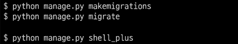
    <br><br>    
    
    - 각각 2명의 의사와 환자를 생성하고 환자는 서로 다른 의사에게 예약을 했다고 가정
        
        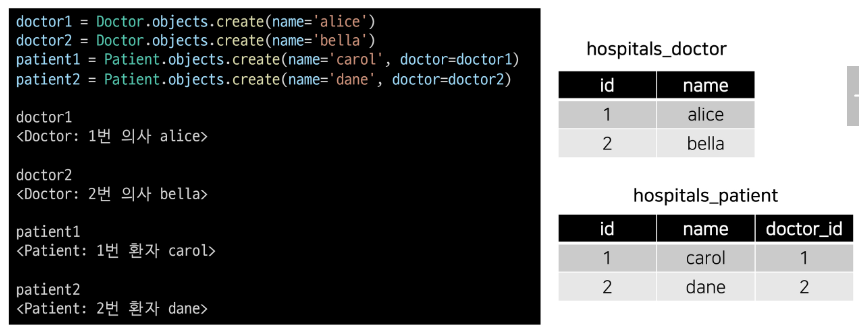
    <br><br>    
    
    - 1번 환자(carol)가 두 의사 모두에게 방문하려고 함
        
        `patient3 = Patient.objects.create(name='carol', doctor=doctor2)`
        
        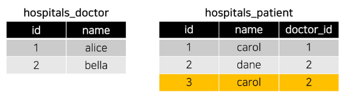
    <br><br>    
    
    - 동시에 예약할 수는 없을까?
        
        ```python
        patient4 = Patient.objects.create(name='carol', doctor=doctor1, doctor2)
        File "<ipython-input-9-6edaf3ffb4e6>", line 1
             patient4 = patient.objects.create(name='carol', doctor=doctor1, doctor2)
        
        SyntaxError: positional argument follows keyword argument
        ```
        
        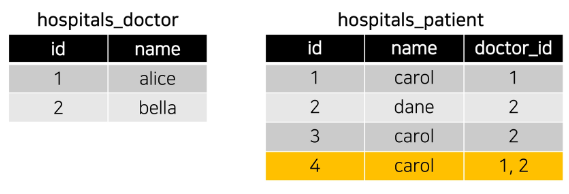
    <br><br>    
    
    - 동일한 환자지만 다른 의사에게 예약하기 위해서는 객체를 하나 더 만들어서 예약을 진행해야 함<br>

        - 새로운 환자 객체를 생성할 수 밖에 없음
    - 외래 키 컬럼에 ‘1, 2’ 형태로 참조하는 것은 Integer 타입이 아니기 때문에 불가능
    - 그렇다면 **예약 테이블을 따로 만들자**
<br><br><br>

5. 중개 모델
    - 환자 모델의 외래 키를 삭제하고 별도의 예약 모델을 새로 작성<br>

    - 예약 모델은 의사와 환자에 각각 N:1 관계를 가짐
        
        ```python
        # hospitals/midels.py
        
        # 외래키 삭제
        class Patiend(models.Model):
            name = models.TextField()
        
            def __str__(self):
                return f'{self.pk}번 환자 {self.name}'
        
        # 중개모델 작성
        class Reservation(models.Model):
            doctor = models.ForeignKey(Doctor, on_delete=models.CASCASDE)
            patient = models.ForeignKey(Patient, on_delete=models.CASCADE)
        
            def __str__(self):
                return f'{self.doctor_id}번 의사의 {self.patient_id}번 환자'
        ```
        
        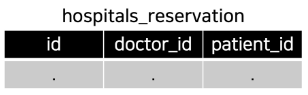
    <br><br>    
    
    - 데이터베이스 초기화 후 Migration 진행 및 shell_plus 실행
        - migration 파일 삭제<br>

        - 데이터베이스 파일 삭제
        
        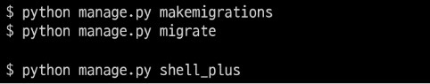
      <br><br>  
    
    - 의사와 환자 생성 후 예약 만들기
        
        ```python
        doctor1 = Doctor.objects.create(name='alice')
        patient1 = Patient.objects.create(name='carol')
        
        Reservation.objects.create(doctor=doctor1, patient=patient1)
        ```
        
        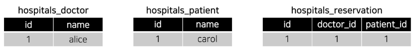
      <br><br>  
    
    - 예약 정보 조회
        
        ```python
        # 의사 -> 예약 정보 찾기
        doctor1.reservation_set.all()
        <QuerySet [<Reservation: 1번 의사의 1번 환자>]>
        
        # 환자 -> 예약 정보 찾기
        patient1.reservation_set.all()
        <QuerySet [<Reservation: 1번 의사의 1번 환자>]>
        ```
      <br>  
    
    - 1번 의사에게 새로운 환자 예약이 생성 된다면
        
        ```python
        patient2 = Patient.objects.create(name='dane')
        
        Reservation.objects.create(doctor=doctor1, patient=patient2)
        ```
        
        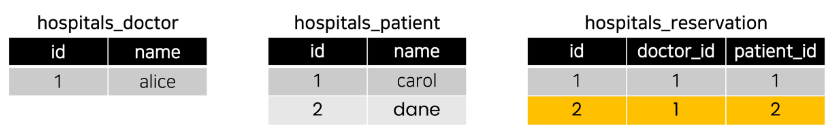
      <br><br>  
    
    - 1번 의사의 예약 정보 조회
        
        ```python
        # 의사 -> 환자 목록
        doctor1.reservation_set.all()
        <QuerySet [<Reservation: 1번 의사의 1번 환자>, <Reservation: 1번 의사의 2번 환자>]>
        ```
<br><br>        
    
6. Django ManyToManyField
    - 환자 모델에 Django ManyToManyField 작성<br>

        
        ```python
        # hospitals/models.py
        
        class Patient(models.Model):
            # ManyToManyField 작성
            doctors = models.ManyToManyField(Doctor)
            name = models.TextField()
        
            def __str__(self):
                return f'{self.pk}번 환자 {self.name}'
        
        # Reservation Class 주석 처리
        ```
     <br>   
    
    - 데이터베이스 초기화 후 Migration 진행 및 shell_plus 실행
        - migration 파일 삭제
        - 데이터베이스 파일 삭제
        
        
     <br><br>   
    
    - 생성된 중개 테이블 hospitals_patient_doctors 확인
        
        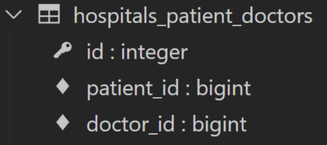
     <br><br>   
    
    - 의사 1명과 환자 2명 생성
        
        ```python
        doctor1 = Doctor.objects.create(name='alice')
        patient1 = Patient.objects.create(name='carol')
        patient2 = Patient.objects.create(name='dane')
        ```
     <br>   
    
    - 예약 생성 (환자가 의사에게 예약)
        
        ```python
        # patient1이 doctor1에게 예약
        patient1.doctors.add(doctor1)
        
        # patient1 - 자신이 예약한 의사목록 확인
        patient1.doctors.all()
        <QuerySet [<Doctor: 1번 의사 alice>]>
        
        # doctor1 - 자신의 예약된 환자목록 확인
        doctor1.patient_set.all()
        <QuerySet [<Patient: 1번 환자 carol>]>
        ```
      <br>  
    
    - 예약 생성 (의사가 환자를 예약)
        
        ```python
        # doctor1이 patient2을 예약
        doctor1.patient_set.add(patient2)
        
        # doctor1 - 자신의 예약 환자목록 확인
        doctor1.patient_set.all()
        <QuerySet [<Patient: 1번 환자 carol>, <Patient: 2번 환자 dane>]>
        
        # patient1, 2 - 자신이 예약한 의사목록 확인
        patient1.doctors.all()
        <QuerySet [<Doctor: 1번 의사 alice>]>
        
        patient2.doctors.all()
        <QuerySet [<Doctor: 1번 의사 alice>]>
        ```
       <br> 
    
    - 예약 현황 확인
        
        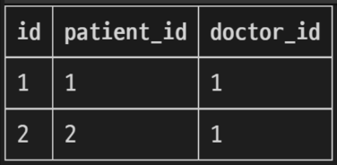
      <br><br>  
    
    - 예약 취소하기 (삭제)
    - 기존에는 해당하는 Reservation을 찾아서 지워야 했다면, 이제는 `.remove()` 사용
        
        
        ```python
        # doctor1이 patient1 진료 예약 취소
        
        doctor1.patient_set.remove(patient1)
        
        doctor1.patient_set.all()
        <QuerySet [<Patient: 2번 환자 harry>]>
        
        patient1.doctors.all()
        <QuerySet []>
        ```
        
        ```python
        # patient2가 doctor1 진료 예약 취소
        
        patient2.doctors.remove(doctor1)
        
        patient2.doctors.all()
        <QuerySet []>
        
        doctor1.patient_set.all()
        <QuerySet []>
        ```
       <br> 
    
    - Django ManyToManyField
        - Django는  ManyToManyField를 통해 중개 테이블을 자동으로 생성함
<br><br><br>

7. ‘related_name’ argument
    - target model이 source model을 참조할 때 사용할 manager name<br>

    - ForeignKey()의 related_name과 동일
        
        ```python
        class Patient(models.Model):
            # ManyToManyField - related_name 작성
            doctors = models.ManyToManyField(Doctor, related_name='patients')
            name = models.TextField()
        
            def __str__(self):
                return f'{self.pk}번 환자 {self.name}'
        ```
      <br>  
    
    - Migration 진행 및 shell_plus 실행
        
        
      <br><br>  
    
    - related_name 설정 값 확인하기
        
        ```python
        # 1번 의사 조회하기
        doctor1 = Doctor.objects.get(pk=1)
        
        # 에러 발생 (related_name을 설정하면 기존 _set manager는 사용할 수 없음)
        doctor1.patient_set.all()
        AttributeError: 'Doctor' object has no attribute 'patteint_set'
        
        # 변경 후
        doctor1.patients.all()
        <QuerySet []>
        ```
<br><br>        
    
8. ‘through’ argument
    - 그렇다면 중개 모델을 직접 작성하는 경우는 없을까?<br>

        - 중개 테이블을 수동으로 지정하려는 경우 **through** 옵션을 사용하여 사용하려는  중개 테이블을 나타내는 Django 모델을 지정할 수 있음
    - 가장 일반적인 용도는 **중개테이블에 추가 데이터를 사용**해 다대다 관계와 연결하려는 경우
  <br><br>

    - through 설정 및 Reservation Class 수정
        - 이제는 예약 정보에 증상과 예약일이라는 추가 데이터가 생김
            
            ```python
            class Patient(models.Model):
                doctors = models.ManyToManyField(Doctor, through='Reservation')
                name = models.TextField()
            
                def __str__(self):
                    return f'{self.pk}번 환자 {self.name}'
            
            class Reservation(models.Model):
                doctor = models.ForeignKey(Doctor, on_delete=models.CASCADE)
                patient = models.ForeignKey(Patient, on_delete=models.CASCADE)
                symptom = models.TextField()
                reserved_at = models.DateTiemField(auto_now_add=True)
            
                def __str__(self):
                    return f'{self.doctor.pk}번 의사의 {self.patient.pk}번 환자'
            ```
     <br>       
    
    - 데이터베이스 초기화 후 Migration 진행 및 shell_plus 실행
        - migration 파일 삭제<br>

        - 데이터베이스 파일 삭제
        
        
      <br><br>  
    
    - 의사 1명과 환자 2명 생성
        
        ```python
        doctor1 = Doctor.objects.create(name='alice')
        patient1 = Patient.objects.create(name='carol')
        patient2 = Patient.objects.create(name='dane')
        ```
     <br>   
    
    - 예약 생성 1
        
        ```python
        # 1. Reservation class를 통한 예약 생성
        
        reservation1 = Reservation(doctor-doctor1, patient=patient1, symptom='headache')
        reservation1.save()
        
        doctor1.patient_set.all()
        <QuerySet [<Patient: 1번 환자 carol>]>
        
        patient1.doctors.all()
        <QuerySet [<Doctor: 1번 의사 alice>]>
        ```
      <br>  
    
    - 예약 생성 2
        
        ```python
        # 2. Patient 객체를 통한 예약 생성
        
        patient2.doctors.add(doctor1, through_defaults={'symptom': 'flu'})
        
        doctor1.patient_set.all()
        <QuerySet [<Patient: 1번 환자 carol>, <Patient: 2번 환자 dane>]>
        
        patient2.doctors.all()
        <QuerySet [<Doctor: 1번 의사 alice>]>
        ```
        
        → through_defaults 값에 딕셔너리 타입으로 입력
      <br><br>  
    
    - 예약 삭제
        
        ```python
        doctor1.patient_set.remove(patient1)
        
        patient2.doctors.remove(doctor1)
        ```
<br><br>        
    
9. 정리
    - M:N 관계로 맺어진 두 테이블에는 변화가 없음<br>

    - Django의 ManyToManyField은 중개 테이블을 자동으로 생성함
    - Django의 ManyToManyField는 M:N 관계를 맺는 두 모델 어디에 위치해도 상관 없음
        - 대신 필드 작성 위치에 따라 참조와 역참조 방향을 주의할 것
    - N:1은 완전한 종속의 관계였지만 M:N은 의사에게 진찰받는 환자, 환자를 진찰하는 의사의 두 가지 형태로 모두 표현이 가능한 것
<br><br><br>

---

## **2. ManyToManyField**

1. ManyToManyField 란
    - `ManyToManyField(to, **options)`<br>

    - 다대다 (M:N, many-to-many) 관계 설정 시 사용하는 모델 필드
    - 하나의 필수 위치인자(M:N 관계로 설정할 모델 클래스)가 필요
    - 모델 필드의 RelatedManager를 사용하여 관련 개체를 추가, 제거 또는 만들 수 있음
        - add(), remove(), create(), clear() …
<br><br><br>

2. 데이터베이스에서의 표현
    - Django는 다대다 관계를 나타내는 중개 테이블을 만듦<br>

    - 테이블 이름은 ManyToManyField 이름과 이를 포함하는 모델의 테이블 이름을 조합하여 생성됨
    - ‘db_table’ arguments을 사용하여 중개 테이블의 이름을 변경할 수도 있음
<br><br><br>

3. ManyToManyField’s Arguments
    - `related_name`<br>

        - target model이 source model을 참조할 때 사용할 manager name<br>

        - ForeignKey의 related_name과 동일
        
    - `through`
        - 중개 테이블을 직접 작성하는 경우, through 옵션을 사용하여 중개 테이블을 나타내는 Django 모델을 지정<br>

        - 일반적으로 중개 테이블에 추가 데이터를 사용하는 다대다 관계와 연결하려는 경우(extra data with a many-to-many relationship)에 사용됨
        
    - `symmetrical`
        - 기본 값: True<br>

        - ManyToManyField가 동일한 모델(on self)을 가리키는 정의에서만 사용
            
            ```python
            # 예시
            
            class Person(models.Model):
                friends= models.ManyToManyField('self')
                # freinds = models.ManyToManyField('self', symmetrical=False)
            ```
            
        - True일 경우
            - _set 매니저를 추가 하지 않음<br>

            - source 모델의 인스턴스가 target 모델의 인스턴스를 참조하면 자동으로 target 모델 인스턴스도 source 모델 인스턴스를 자동으로 참조하도록 함(대칭)
            - 즉, 내가 당신의 친구라면 당신도 내 친구가 됨
        - 대칭을 원하지 않는 경우 False로 설정
            - Follow 기능 구현에서 다시 확인할 예정
<br><br><br>

4. Related Manager
    - N:1 혹은 M:N 관계에서 사용 가능한 문맥(context)<br>

    - Django는 모델 간 N:1 혹은 M:N 관계가 설정되면 역참조시에 사용할 수 있는 manager를 생성
        - 우리가 이전에 모델 생성 시 objects 라는 매니저를 통해 queryset api를 사용했던 것처럼 related manager를 통해 queryset api를 사용할 수 있게 됨
    - 같은 이름의 메서드여도 각 관계(N:1. M:N)에 따라 다르게 사용 및 동작됨
        - N:1에서는 target 모델 객체만 사용 가능<br>

        - **M:N관계에서는 관련된 두 객체에서 모두 사용 가능**
    - 메서드 종류
        - **add(), remove()**, create(), clear(), set() 등
<br><br><br>

5. methods
    - (many-to-many relationships 일 때의 동작만 작성되었음)<br>

    - **add()**
        - “지정된 객체를 관련 객체 집합에 추가”<br>

        - 이미 존재하는 관계에서 사용하면 관계가 복제되지 않음
        - 모델 인스턴스, 필드 값(PK)을 인자로 허용
    - **remove()**
        - “관련 객체 집합에서 지정된 모델 개체를 제거”<br>

        - 내부적으로 QuerySet.delete()를 사용하여 관계가 삭제됨
        - 모델 인스턴스, 필드 값(PK)을 인자로 허용
<br><br><br>

6. 중개 테이블 필드 생성 규칙
    - 소스(source model) 및 대상(target model) 모델이 다른 경우<br>

        - id<br>

        - \<containing_model>_id
        - \<other_model>_id
        
        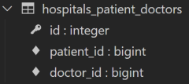
        
    - ManyToManyField가 동일한 모델을 가리키는 경우
        - id<br>

        - f
        - to_\<model>_id
<br><br><br>

---