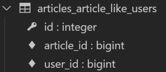

# **M:N (Article-User)**

- 개요
    - Article과 User의 M:N 관계 설정을 통한 좋아요 기능 구현하기
<br><br><br>

---

## **1. Like**

1. 모델 관계 설정
    - ManyToManyField 작성<br>

        
        ```python
        # articles/models.py
        
        class Article(models.Model):
            user = models.ForeignKey(settings.AUTH_USER_MODEL, on_delete=models.CASCASDE)
            like_users = models.ManyToManyField(settings.AUTH_USER_MODEL)
            title = models.CharField(max_length=10)
            content = models.TextField()
            created_at = models.DateTimeField(auto_now_add=True)
            updated_at = models.DateTimeField(auto_now=True)
        ```
     <br>   
    
    - Migration 진행 후 에러 확인
        
        `$ python manage.py makemigrations`
        
        
     <br><br>   
    
    - like_users 필드 생성 시 자동으로 역참조에는 `.article_set` 매니저가 생성됨<br>

    - 그러나 이전 N:1(Article-User) 관계에서 이미 해당 매니저를 사용 중
        - `user.article_set.all()` → 해당 유저가 작성한 모든 게시글 조회<br>

        - **user가 작성한 글들(user.article_set)과 user가 좋아요를 누른 글(user.article_set)을 구분할 수 없게 됨**
    - user와 관계된 ForeignKey 혹은 ManyToManyField 중 하나에 related_name을 작성해야 함
    <br><br>

    - ManyToManyField에 related_name 작성 후 Migration
        
        ```python
        # articles/models.py
        
        class Article(models.Model):
            user = models.ForeignKey(settings.AUTH_USER_MODEL, on_delete=models.CASCASDE)
            like_users = models.ManyToManyField(settings.AUTH_USER_MODEL, related_name='like_articles')
            title = models.CharField(max_length=10)
            content = models.TextField()
            created_at = models.DateTimeField(auto_now_add=True)
            updated_at = models.DateTimeField(auto_now=True)
        ```
        
        `$ python manage.py makemigrations`
        
        `$ python manage.py migrate`
      <br><br>  
    
    - 생성된 중개 테이블 확인
        
        
      <br><br>  
    
    - User - Article간 사용 가능한 related manager 정리
        - `article.user`<br>

            - 게시글을 작성한 유저 - N:1
        - `user.article_set`
            - 유저가 작성한 게시글(역참조) - N:1
        - `article.like_users`
            - 게시글을 좋아요한 유저 - M:N
        - `user.like_articles`
            - 유저가 좋아요한 게시글(역참조) - M:N
<br><br><br>

2. LIKE 구현
    - url 및 view 함수 작성<br>

        
        ```python
        # articles/urls.py
        
        urlpatterns = [
            ...
            path('<int:article_pk>/likes/', views.likes, name='likes'),
        ]
        ```
        
        ```python
        # articles/views.py
        
        def likes(request, article_pk):
            article = Article.objects.get(pk=article_pk)
        
            if article.like_users.filter(pk=request.user.pk).exists():
            # if request.user in article.like_users.all():
                article.like_users.remove(request.user)
            else:
                article.like_users.add(request.user)
            return redirect('articles:index')
        ```
<br><br>        
    
3. **.exists()**
    - QuereySet에 결과가 포함되어 있으면 True를 반환하고 그렇지 않으면 False를 반환<br>

    - 특히 큰 QuerySet에 있는 특정 개체의 존재와 관련된 검색에 유용
<br><br><br>

4. LIKE 구현
    - index 템플릿에서 각 게시글에 좋아요 버튼 출력하기<br>

        
        ```html
        <!-- articles/index.html -->
        
        
        
        
          ...
          
            ...
            <div>
              <form action="" method="POST">
                
                
                  <input type="submit" value="좋아요 취소">
                {$ else $}
                  <input type="submit" value="좋아요">
                
              </form>
            </div>
            <a href="">DETAIL</a>
            <hr>
          
        
        ```
      <br><br>  
    
    - 좋아요 버튼 출력 확인
        
        
     <br><br>   
    
    - 좋아요 버튼 클릭 후 좋아요 테이블 확인
        
        
     <br><br>   
    
    - 데코레이터 및 is_authenticated 추가
        
        ```python
        # articles/views.py
        
        @require_POST
        def likes(request, article_pk):
            if request.user.is_authenticated:
                article = Article.objects.get(pk=article_pk)
        
                if article.like_users.filter(pk=request.user.pk).exists():
                # if request.user in article.like_users.all():
                    article.like_users.remove(request.user)
               else:
                    article.like_users.add(request.user)
                return redirect('articles:index')
            return redirect('accounts:login')
        ```
<br><br>        

---