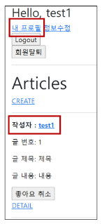
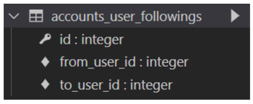
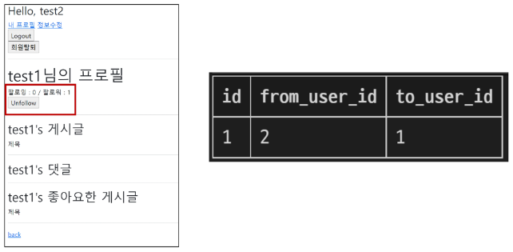

# **M:N (User-User)**

- 개요
    - User 자기 자신과의 M:N 관계 설정을 통한 팔로우 기능 구현하기
<br><br><br>

---

## **1. Profile**

1. 개요
    - 자연스러운 follow 흐름을 위한 프로필 페이지를 먼저 작성
<br><br><br>

2. Profile 구현
    - url 및 view 함수 작성
        
        ```python
        # accounts/urls.py
        
        urlpatterns = [
            ...
            path('profile/<username>/', views.profile, name='profile'),
        ]
        ```
        
        ```python
        # accounts/views.py
        
        from django.contrib.auth import get_user_model
        
        def profile(request, username):
            User = get_user_model()
            person = User.objects.get(username=username)
            context = {
                'person': person,
            }
            return render(request, 'accounts/profile.html', context)
        ```
     <br>   
    
    - profile 템플릿 작성
        
        ```html
        <!-- accounts/profile.html -->
        
        
        
        
          <h1>{{ person.username }}님의 프로필</h1>
        
          <hr>
        
          <h2>{{ person.username }}'s 게시글</h2>
          
            <div>{{ article.title }}</div>
          
        
          <hr>
        
          <h2>{{ person.username }}'s 댓글</h2>
          
            <div>{{ comment.content }}</div>
          
        
          <hr>
        
          <h2>{{ person.username }}'s 좋아요한 게시글</h2>
          
            <div>{{ article.title }}</div>
          
        
          <hr>
        
          <a href="">back</a>
        
        ```
     <br>  
    
    - Profile 템플릿으로 이동할 수 있는 하이퍼링크 작성
        
        ```html
        <!-- base.html -->
        
        <body>
          <div class="container">
            
              <h3>Hello, {{ user }}</h3>
              <a href="">내 프로필</a> 
        ```
        
        ```html
        <!-- articles/index.html -->
        
        <p>
          <b>작성자 : <a href="">{{ article.user }}</a></b>
        </p>
        ```
      <br>  
    
    - Profile 템플릿으로 이동할 수 있는 하이퍼 링크 출력 확인
        
        
<br><br><br>

---

## **2. Follow**

1. 모델 관계 설정
    - ManyToManyField 작성 및 Migration 진행
        
        ```python
        # accounts/models.py
        
        class User(AbstractUser):
            followings = models.ManyToManyField('self', symmetrical=False, related_name='followers')
        ```
        
        `$ python manage.py makemigrations`
        
        `$ python manage.py migrate`
        
    - 생성된 중개 테이블 확인
        
        
<br><br><br>        
    
2. Follow 구현
    - url 및 view 함수 작성
        
        ```python
        # accounts/urls.py
        
        urlpatterns = [
            ...,
            path('<int:user_pk>/follow/', views.follow, name='follow'),
        ]
        ```
        
        ```python
        # accounts/views.py
        
        def follow(request, user_pk):
            User = get_user_model()
            person = User.objects.get(pk=user_pk)
            if person != request.user:
                if person.followers.filter(pk=reqest.user.pk).exists():
                # if request.user in person.followers.all():
                    person.followers.remove(reuqest.user)
                else:
                    person.followers.add(request.user)
            return redirect('accounts:profile', person.username)
        ```
     <br>   
    
    - 프로필 유저의 팔로잉, 팔로워 수 & 팔로우, 언팔로우 버튼 작성
        
        ```html
        <!-- accounts/profile.html -->
        
        
        
        
          <h1>{{ person.username }}님의 프로필</h1>
          <div>
            <div>
              팔로잉 : {{ person.followings.all|length }} / 팔로워 : {{ person.followers.all|length }}
            </div>
            
            <div>
              <form action="" method="POST">
                
                
                  <input type="submit" value="Unfollow">
                
                  <input type="submit" value="Follow">
                
              </form>
            </div>
          
        </div>
        ```
      <br>  
    
    - 팔로우 버튼 클릭 후 필로우 버튼 변화 및 테이블 변화
        
        
      <br><br>  
    
    - 데코레이터 및 is_authenticated 추가
        
        ```python
        # accounts/views.py
        
        @require_POST
        def follow(request, user_pk):
            if request.user.is_authenticated:
                User = get_user_model()
                person = User.objects.get(pk=user_pk)
                if person != request.user:
                    if person.followers.filter(pk=request.user.pk).exists():
                        # if request.user in person.followers.all():
                        person.followers.remove(request.user)
                    else:
                        person.followers.add(request.user)
                return redirect('accounts:profile', person.username)
            return redirect('accounts:login')
        ```
<br><br>        

---