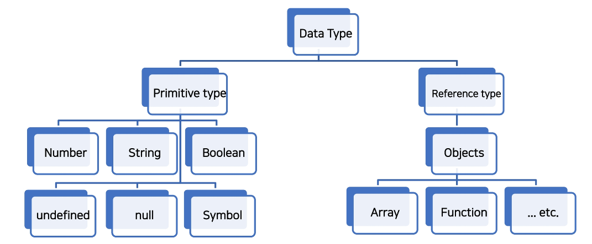
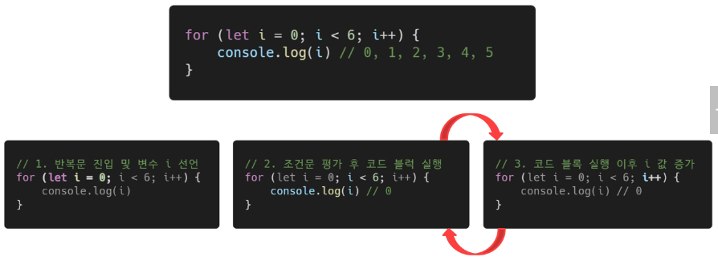

# **JavaScript 기초 문법**

## **1. 코드 작성법**

1. 세미콜론 (semicolon)
    - 자바스크립트는 세미콜론을 선택적으로 사용 가능<br>

    - 세미콜론이 없으면 ASI에 의해 자동으로 세미콜론이 삽입됨
        - ASI (Automatic Semicolon Insertion, 자동 세미콜론 삽입 규칙)
    - 본 수업에서는 자바스크립트의 문법 및 개념적 측면에 집중하기 위해 세미콜론을 사용하지 않고 진행
    - 세미콜론 예시
        
        ```jsx
        // 01_basic.JavaScript
        
        console.log('hello');
        console.log('javascript')
        ```
<br><br>      
    
2. 들여쓰기와 코드 블럭
    - python은 4칸 들여쓰기를 사용했으나, JavaScript는 **2칸** 들여쓰기를 사용<br>

    - **블럭(block)**은 if, for, 함수에서 중괄호**{  }** 내부를 말함
        - python은 들여쓰기를 이용해서 코드 블럭을 구분<br>

        - JavaScript는 중괄호 { }를 사용해 코드 블럭을 구분
        
        ```jsx
        if (isClean) { // 중괄호를 사용해서 코드 블럭 구분
          console.log('clean')  // 2칸 들여쓰기
        }
        ```
<br><br>        
    
3. 코드 스타일 가이드
    - 코딩 스타일의 핵심은 합의된 원칙과 일관성<br>

    - 코드의 품질에 직결되는 중요한 요소
        - 코드의 가독성, 유지보수 또는 팀원과의 커뮤니케이션 등 개발 과정 전체에 영향을 끼침
    - Python에도 PEP8이라는 코드 스타일 가이드가 있었듯, JavaScript에도 코드 스타일 가이드 존재
    - 다만 JavaScript는 여러 코드 스타일 가이드가 회사마다 존재하는데, 수업에서는 Airbnb Style Guide를 기반으로 사용할 것
        - 단, 가이드의 일부 항목은 문법 및 개념적 측면에 집중하기 위해 변형해서 사용하는 경우 있음
<br><br><br> 

4. [참고] 다양한 JavaScript 코드 스타일 가이드
    - Airbnb JavaScript Style Guide<br>

    - Google JavaScript Style Guide
    - standardJavaScript
<br><br><br> 

5. 주석
    - 한 줄 주석(**//**)과 여러 줄(**/* */**) 주석
        
        ```jsx
        // 01_basic.JavaScript
        
        // 이 줄은 주석입니다.
        // console.log('화면에 표시되지 않아요')
        ```
        
        ```jsx
        // 01_basic.JavaScipt
        
        /*
        여러 줄 주석은
        이렇게 사용합니다.
        */
        ```
<br><br><br>

---

## **2. 변수와 식별자**

1. 식별자 정의와 특징
    - 식별자(identifier)는 변수를 구분할 수 있는 변수명을 말함<br>

    - 식별자는 반드시 문자, 달러($) 또는 밑줄(_)로 시작
    - 대소문자를 구분하며, 클래스명 외에는 모두 소문자로 시작
    - 예약어 사용 불가능
        - 예약어 예시: for, if, function 등
    <br><br>

    - 카멜 케이스(camelCase, lower-camel-case)
        - 변수, 객체, 함수에 사용
    - 파스칼 케이스(PascalCase, upper-camel-case)
        - 클래스, 생성자에 사용
    - 대문자 스네이크 케이스(SNAKE_CASE)
        - 상수(constants)에 사용<br>

        - 상수: 개발자의 의도와 상관없이 변경될 가능성이 없는 값을 의미
    <br><br>

    - 카멜 케이스(camelCase, lower-camel-case)
        
        ```jsx
        // 변수
        let dog
        let variableNmae
        
        // 객체
        const userInfo = { name: 'Tom', age: 20 }
        
        // 함수
        function add() {}
        function getName() {}
        ```
    <br>    
    
    - 파스칼 케이스(PascalCase, upper-camel-case)
        
        ```jsx
        // 클래스
        class User {
          constructor(options) {
            this.name = options.name
          }
        }
        
        // 생성자 함수
        function User(options) {
          this.name = options.name
        }
        ```
    <br>    
    
    - 대문자 스네이크 케이스(SNAKE_CASE)
        
        ```jsx
        // 값이 바뀌지 않을 상수
        const API_KEY = 'my-key'
        const PI = Math.PI
        
        // 재할당이 일어나지 않는 변수
        const NUMBERS = [1, 2, 3]
        ```
<br><br>        
    
2. 변수 선언 키워드 🔥
    - Python과 다르게 JavaScript는 변수를 선언하는 키워드가 정해져 있음
        - (1) `let`<br>

            - 블록 스코프 지역 변수를 선언 (추가로 동시에 값을 초기화)
        - (2) `const`
            - 블록 스코프 읽기 전용 상수를 선언 (추가로 동시에 값을 초기화)
        - (3) `var`
            - 변수를 선언 (추가로 동시에 값을 초기화)
<br><br><br> 

3. [참고] 선언, 할당, 초기화
    - 선언 (Declaration)<br>

        - 변수를 생성하는 행위 또는 시점
    - 할당 (Assignment)
        - 선언된 변수에 값을 저장하는 행위 또는 시점
    - 초기화 (Initialization)
        - 선언된 변수에 처음으로 값을 저장하는 행위 또는 시점
    <br><br>
    ```jsx
    let foo          // 선언
    console.log(foo) // undefined
    
    foo = 11         // 할당
    console.log(foo) // 11
    
    let bar = 0      // 선언 + 할당
    console.log(bar) // 0
    ```
<br><br>

4. [참고] 블록 스코프 (block scope)
    - if, for, 함수 등의 중괄호 내부를 가리킴<br>

    - 블록 스코프를 가지는 변수는 블록 바깥에서 접근 불가능
        
        ```jsx
        let x = 1
        
        if (x === 1) {
          let x = 2
          console.log(x)  // 2
        }
        
        console.log(x)    // 1
        ```
<br><br>        
    
5. 변수 선언 키워드 - let
    - `let`
        - 재할당 가능 & 재선언 불가능<br>

            
            ```jsx
            let number = 10  // 1. 선언 및 초기값 할당
            number = 20      // 2. 재할당
            ```
            
            ```jsx
            let number = 10  // 1. 선언 및 초기값 할당
            let number = 20  // 2. 재선언 불가능
            ```
            
        - 블록 스코프를 갖는 지역 변수를 선언
        - 선언과 동시에 원하는 값으로 초기화 할 수 있음
<br><br><br> 

6. 변수 선언 키워드 - const
    - `const`
        - 재할당 불가능 & 재선언 불가능<br>

            
            ```jsx
            const number = 10  // 1. 선언 및 초기값 할당
            number = 10        // 2. 재할당 불가능
            ```
            
            ```jsx
            const number = 10  // 1. 선언 및 초기값 할당
            const number = 20  // 2. 재선언 불가능
            ```
            
        - 선언 시 반드시 초기값을 설정해야 하며, 이후 값 변경이 불가능
        - let 과 동일하게 블록 스코프를 가짐
<br><br><br> 

7. 변수 선언 키워드 - var
    - `var`
        - 재할당 가능 & 재선언 가능<br>

        - ES6 이전에 변수를 선언할 때 사용되던 키워드
        - **“호이스팅”** 되는 특성으로 인해 예기치 못한 문제 발생 가능
            - 따라서 ES6 이후부터는 var 대신 const와 let을 사용하는 것을 권장
            
        - 변수 선언 시 var, const, let 키워드 중 하나를 사용하지 않으면 자동으로 var로 선언됨
<br><br><br> 

8. [참고] 함수 스코프 (function scope)
    - 함수의 중괄호 내부를 가리킴<br>

    - 함수 스코프를 가지는 변수는 함수 바깥에서 접근 불가능
        
        ```jsx
        function foo() {
          var x = 5
          console.log(x)  // 5
        }
        
        // ReferenceError: x is not defined
        console.log(x)
        ```
<br><br>

9. [참고] 호이스팅 (hoisting)
    - 변수를 선언 이전에 참조할 수 있는 현상<br>

    - var 로 선언된 변수는 선언 이전에 참조할 수 있으며, 이러한 현상을 호이스팅이라 함
    - 변수 선언 이전의 위치에서 접근 시 undefined를 반환
        
        ```jsx
        console.log(name)  // undefined => 선언 이전에 참조
        
        var name = '홍길동'  // 선언
        ```
        
        ```jsx
        // 위 코드를 암묵적으로 아래와 같이 이해함
        var name  // undefined 로 초기화
        console.log(name)
        
        var name = '홍길동'
        ```
      <br>  
    
    - 즉, JavaScript에서 변수들은 실제 실행시에 코드의 최상단으로 끌어 올려지게 되며(hoisted)
    - 이러한 이유 때문에 var 로 선언된 변수는 선언 시 undefined 로 값이 초기화되는 과정이 동시에 일어남
    - 반면 let, const는 호이스팅이 일어나면 에러를 발생시킴
        
        ```jsx
        console.log(username)  // undefined
        var username = '홍길동'
        
        console.log(email)  // Uncaught ReferenceError
        let email = 'gildong@gmail.com'
        
        console.log(age)  // Uncaught ReferenceError
        const age = 50
        ```
    <br>    
    
    - 변수를 선언하기 전에 접근이 가능한 것은 코드의 논리적인 흐름을 깨뜨리는 행위이며 이러한 것을 방지하기 위해 let, const가 추가되었음
        - 즉 var 는 사용하지 않아야 하는 키워드
    - 다만, 아직까지도 많은 기존의 JavaScript 코드는 ES6 이전의 문법으로 작성되어 있으므로 호이스팅에 대한 이해가 필요
<br><br><br> 

10. 변수 선언 키워드 정리
    
    
    | 키워드 | 재선언 | 재할당 | 스코프 | 비고 |
    | --- | --- | --- | --- | --- |
    | let | X | O | 블록 스코프 | ES6부터 도입 |
    | const | X | X | 블록 스코프 | ES6부터 도입 |
    | var | O | O | 함수 스코프 | 사용 X |
    - 어디에 변수를 쓰고 상수를 쓸지 결정하는 것은 프로그래머의 몫<br>

    - Airbnb 스타일 가이드에서는 기본적으로 `const` 사용을 권장
        - 재할당해야 하는 경우만 `let`
    - 다만, 실습에서는 편의를 위해 재할당이 가능한 let을 기본적으로 사용해도 됨
<br><br><br> 

---

## **3. 데이터 타입**

1. 데이터 타입
    - JavaScript의 모든 값은 특정한 데이터 타입을 가짐<br>

    - 크게 원시 타입(Primitive type)과 참조 타입(Reference type)으로 분류됨
        
        
<br><br><br>         
    
2. Number
    - 정수 또는 실수형 숫자를 표현하는 자료현
        
        ```jsx
        const a = 13
        const b = -5
        const c = 3. 14  // float - 숫자표현
        const d = 2.99e8  // 2.998 * 10^8 = 299,800,000
        const e = Infinity
        const f = -Infinity
        const g = NaN  // Not a Number를 나타내는 값
        ```
    <br>    
    
    - `NaN`
        - Not a Number(숫자가 아님)를 나타냄
        - `Number.isNaN()` 의 경우 주어진 값의 유형이 Number이고 값이 NaN이면 true, 아니면 false를 반환
            
            ```jsx
            Number.isNaN(NaN)    // true
            Number.isNaN(0 / 0)  // true
            
            // isNaN() 으로는 True
            Number.isNaN('NaN')      // false
            Number.isNaN(undefined)  // false
            Number.isNaN({})         // false
            Number.isNaN('blabla')   // false
            
            // 이들 모두 false
            Number.isNaN(true)
            Number.isNaN(null)
            Number.isNaN(37)
            Number.isNaN('37')
            Number.isNaN('37 37')
            Number.isNaN('')
            Number.isNaN(' ')
            ```
    <br>        
    
    - NaN을 반환하는 경우
        - 숫자로서 읽을 수 없음 (parseInt(”어쩌구”), Number(undefined))<br>

        - 결과가 허수인 수학 계산식 (Math.sqrt(-1))
        - 피연산자가 NaN (7 ** NaN)
        - 정의할 수 없는 계산식 (0 * Infinity)
        - 문자열을 포함하면서 덧셈이 아닌 계산식 (”가” / 3)
<br><br><br> 

3. String
    - 문자열을 표현하는 자료형<br>

    - 작은 따옴표 또는 큰 따옴표 모두 가능
        
        ```jsx
        const sentence1 = 'Ask and go to the blue'  // single quote
        const sentence2 = "Ask and go to the blue"  // double quote
        
        console.log(sentence1)
        console.log(sentence2)
        ```
        
    - 곱셈, 나눗셈, 뺄셈은 안되지만 덧셈을 통해 문자열 붙일 수 있음
        
        ```jsx
        const firstName = 'Tony'
        const lastName = 'Sstark'
        const fullName = firstName + lastName
        
        console.log(fullName)
        ```
    <br>    
    
    - Quote를 사용하면 선언 시 줄 바꿈이 안됨
    - 대신 escape sequence를 사용할 수 있기 때문에 \n를 사용해야 함
        
        ```jsx
        // Bad
        const word = "안녕
        하세요"  // Uncaught SyntaxError: Invalid or unexpected token
        
        // Good
        const.word1 = "안녕 \n하세요"
        console.log(word1)
        ```
     <br>   
    
    - **Template Literal**을 사용하면 줄바꿈이 되며, 문자열 사이에 변수도 삽입 가능
    - (단, escape sequence를 사용할 수 없다) == Python의 “f-string”
        
        ```jsx
        const word2 = '안녕
        들 하세요'
        console.log(word2)
        
        const age = 10
        cost message = '홍길동은 ${age}세입니다.'
        console.log(message)
        ```
<br><br>        
    
4. Template literals (템플릿 리터럴)
    - 내장된 표현식을 허용하는 문자열 작성 방식<br>

    - ES6+ 부터 지원
    - Backtick(` `)을 이용하여, 여러 줄에 걸쳐 문자열을 정의할 수도 있고 JavaScript의 변수를 문자열 안에 바로 연결할 수 있는 이점이 생김
    - 표현식을 넣을 수 있는데, 이는 $와 중괄호( $ {expression} )로 표기
        
        ```jsx
        const age = 10
        const message = '홍길동은 ${age}세입니다.'
        ```
<br><br>        
    
5. Empty Value
    - 값이 존재하지 않음을 표현하는 값으로 JavaScript에서는 `null` 과 `undefined` 가 존재<br>

    - 동일한 역할을 하는 이 두개의 키워드가 존재하는 이유는 단순한 JavaScript의 설계 실수
    - 큰 차이를 두지 말고 interchangeable 하게 사용할 수 있도록 권장함
<br><br><br>

6. null
    - null 값을 나타내는 특별한 키워드<br>

    - 변수의 **값이 없음을 의도적으로 표현**할 때 사용하는 데이터 타입
        
        ```jsx
        let lastName = null
        console.log(lastName)  // null - 의도적으로 값이 없음을 표현함
        ```
<br><br>        
    
7. undefined
    - 값이 정의되어 있지 않음을 표현하는 값<br>

    - 변수 선언 이후 직접 값을 할당하지 않으면 자동으로 할당됨
        
        ```jsx
        let firstName  // 선언만 하고 할당하지 않음
        console.log(firstName)  // undefined
        ```
<br><br>        
    
8. null과 undefined
    - null과 undefined의 가장 대표적인 차이점은 `typeof` 연산자를 통해 타입을 확인헀을 때 나타남
        
        ```jsx
        typeof null       // "object"
        typeof undefined  // "undefined"
        ```
        
    - null 이 원시 타입임에도 불구하고 object로 출력되는 이유는 JavaScript 설계 당시 버그를 지금까지 해결하지 못한 것
    - 쉽게 해결할 수 없는 이유는 이미 null 타입에 의존성을 띄고 있는 많은 프로그램들이 망가질 수 있기 때문 (하위 호환 유지)
<br><br><br> 

9. Boolean
    - true와 false<br>

    - 참과 거짓을 표현하는 값
    - 조건문 또는 반복문에서 유용하게 사용
        - 조건문 또는 반복문에서 boolean이 아닌 데이터 타입은 **자동 형변환 규칙**에 따라 true 또는 false로 변환됨
<br><br><br> 

10. ToBoolean Conversions (자동 형변환)
    - [https://tc39.es/ecma262/#sec-toboolean](https://tc39.es/ecma262/#sec-toboolean)
        
        
        | 데이터 타입 | false | true |
        | --- | --- | --- |
        | undefined | 항상 거짓 | X |
        | null | 항상 거짓 | X |
        | Number | 0, -0, NaN | 나머지 모든 경우 |
        | String | 빈 문자열 | 나머지 모든 경우 |
        | Object | X | 항상 참 |
<br><br><br> 

---

## **4. 연산자**

1. 할당 연산자
    - 오른쪽에 있는 피연산의 평가 결과를 왼쪽
     피연산에 할당하는 연산자

    - 다양한 연산에 대한 단축 연산자 지원
    - Increment 및 Decrement 연산자
        - Increment(++): 피연산자의 값을 1 증가시키는 연산자

        - Decrement(—): 피연산자의 값을 1 감소시키는 연산자
        - += 또는 -=와 같이 더 분명한 표현으로 적을 것을 권장
    <br>

    ```jsx
    let c = 0
    
    c += 10
    console.log(c)  // 10 => c에 10을 더한다.
    
    c -= 3
    console.log(c)  // 7 => c에 3을 뺀다.
    
    c *= 10
    console.log(c)  // 70 => c에 10을 곱한다.
    
    c++
    console.log(c)  // 71 => c에 1을 더한다.(증감식)
    
    c--
    console.log(c)  // 70 => c에 1을 뺀다.(증감식)
    ```
<br><br>

2. 비교 연산자
    - 피연산자들(숫자, 문자, Boolean 등)을 비교하고 결과값을 boolean으로 반환하는 연산자

    - 문자열은 유니코드 값을 사용하며 표준 사전 순서를 기반으로 비교
        - ex) 알파벳끼리 비교할 경우
            - 알파벳 순서상 후순위가 더 크다

            - 소문자가 대문자보다 크다
    

    ```jsx
    3 > 2  // true
    3 < 2  // false
    
    'A' < 'B'  // true
    'Z' < 'a'  // true
    '가' < '나'  // true
    ```
<br><br>

3. 동등 연산자 (**==**)
    - 두 연산자가 같은 값으로 평가되는지 비교 후 boolean 값을 반환

    - 비교할 때 **암묵적으로 타입 변환**을 통해 타입을 일치시킨 후 같은 값인지 비교
    - 두 피연산자가 모두 객체일 경우 메모리의 같은 객체를 바라보는지 판별
    - 예상치 못한 결과가 발생할 수 있으므로 특별한 경우를 제외하고 사용하지 않음
        
        ```jsx
        const a = 1
        const b = '1'
        
        console.log(a == b)  // true
        console.log(a == true)  // true
        
        // 자동 형변환 예시
        console.log(8 * null)  // 0, null은 0
        console.log('5' - 1)  // 4
        console.log('5' + 1)  // '51'
        console.log('five' * 2)  // NaN
        ```
<br><br>        
    
4. 일치 연산자 (**===**)
    - 두 연산자의 값과 타입이 모두 같은 경우 true를 반환

    - 같은 객체를 가리키거나, 같은 타입이면서 같은 값인지를 비교
    - 엄격한 비교가 이뤄지며 **암묵적 타입 변환이 발생하지 않음**
        - 엄격한 비교 : 두 비교 대상의 타입과 값 모두 같은 지 비교하는 방식
    
    ```jsx
    const a = 1
    const b = '1'
    
    console.log(a === b) // false
    console.log(a === Number(b))  // true
    ```
<br><br>

5. 논리 연산자
    - 세 가지 논리 연산자로 구성

        - and 연산은 ‘&&’ 연산자

        - or 연산자는 ‘||’ 연산자
        - not 연산자는 ‘!’ 연산자
    - 단축 평가 지원
        - ex) false && true ⇒ false

        - ex) true || false ⇒ true
    
    ```jsx
    true && false  // false
    true && true   // true
    
    false || true  // true
    false || false // false
    
    !true   // false
    
    1 && 0  // 0
    0 && 1  // 0
    4 && 7  // 7
    
    1 || 0  // 1
    0 || 1  // 1
    4 || 7  // 4
    ```
<br><br>

6. 삼항 연산자 (Ternary Operator)
    - 3개의 피연산자를 사용하여 조건에 따라 값을 반환하는 연산자

    - 가장 앞의 조건식이  참이면 :(콜론) 앞의 값이 반환되며, 그 반대일 경우 : 뒤의 값이 반환되는 연산자
    - 삼항 연산자의 결과 값이기 때문에 변수에 할당 가능
        
        ```jsx
        true ? 1 : 2  // 1
        false ? 1 : 2 // 2
        
        const result = Math.PI > 4 ? 'Yep' : 'Nope'
        console.log(result)  // Nope
        ```
<br><br>

---

## **5. 조건문**

1. 조건문의 종류와 특징
    - **if** statement

        - 조건 표현식의 결과값을 boolean 타입으로 변환 후 참/거짓을 판단
    - **switch** statement
        - 조건 표현식의 결과값이 어느 값(case)에 해당하는지 판별

        - 주로 특정 변수의 값에 따라 조건을 분기할 때 활용
            - 조건에 많아질 경우 if문보다 가독성이 나을 수 있음
<br><br><br> 

2. `if` statement
    - if, else if, else

        - 조건은 소괄호(condition) 안에 작성

        - 실행할 코드는 중괄호{ } 안에 작성
        - 블록 스코프 생성
        
        ```jsx
        const name = 'manager'
        
        if (name === 'admin') {
          console.log('관리자님 환영합니다.')
        } else if (name === 'manager') {
          console.log('매니저님 환영합니다.')
        } else {
          console.log(`${name}님 환영합니다.`)
        }
        ```
<br><br>        
    
3. `switch` statement
    - 표현식(expression)의 결과값을 이용한 조건문

    - 표현식의 결과값과 case문의 오른쪽 값을 비교
    - break 및 default문은 [선택적]으로 사용 가능
    - break문이 없는 경우 break문을 만나거나 default문을 실행할 때까지 다음 조건문 실행
    - 블록 스코프 생성
    
    ```jsx
    switch(expression) {
      case 'first value': {
        // do something
        [break]
      }
      case 'second value': {
        [break]
      }
      [default: {
        // do something
      }]
    }
    ```
    <br>

    - 이 경우 모든 console이 출력됨 (Fall-through 현상)
        
        ```jsx
        const name = '홍길동'
        
        switch(name) {
          case '홍길동': {
            console.log('관리자님 환영합니다.'}
          }
          case 'manager': {
            console.log('매니저님 환영합니다.')
          }
          default: {
            console.log(`${name}님 환영합니다.`)
          }
        }
        ```
        
        ```jsx
        // 출력 결과
        관리자님 환영합니다.
        매니저님 환영합니다.
        홍길동님 환영합니다.
        ```
        
    <br>

    - `break`를 작성하면 의도한대로 동작
        
        ```jsx
        const name = '홍길동'
        
        switch(name) {
          case '홍길동': {
            console.log('관리자님 환영합니다.'}
            break
          }
          case 'manager': {
            console.log('매니저님 환영합니다.')
            break
          }
          default: {
            console.log(`${name}님 환영합니다.`)
          }
        }
        ```
        
        ```jsx
        // 출력 결과
        홍길동님 환영합니다.
        ```
<br><br>        
    
4. `if` / `switch`
    - 조건이 많은 경우 switch문을 통해 가독성 향상을 기대할 수 있음

    - 일반적으로 중첩 else if문은 유지보수하기 힘들다는 문제도 있음
        
        ```jsx
        const numOne = 5
        const numTwo = 10
        let operator = '+'
        
        if (operator === '+') {
          console.log(numOne + numTwo)
        } else if (operator === '-') {
          console.log(numOne - numTwo)
        } else if (operator === '*') {
          console.log(numOne * numTwo)
        } else if (oeprator === '/') {
          console.log(numOne / numTwo)
        } else{
          console.log('유효하지 않은 연산자입니다.')
        }
        ```
        
        ```jsx
        onst numOne = 5
        const numTwo = 10
        let operator = '+'
        
        switch(operator) {
          case '+': {
            console.log(numOne + numTwo)
            break
          }
          case '-': {
            console.log(numOne - numTwo)
            break
          }
          case '*': {
            console.log(numOne * numTwo)
            break
          }
          case '/': {
            console.log(numOne / numTwo)
            break
          }
          default: {
            console.log('유효하지 않은 연산자입니다.')
          }
        }
        ```
<br><br>

---

## **6. 반복문**

1. 반복문 종류
    - `while`

    - `for`
    - `for...in`
    - `for...of`
<br><br><br> 

2. `while`
    - 조건문이 참이기만 하면 문장을 계속해서 수행
        
        ```jsx
        while (조건문) {
          // do something
        }
        ```
        
    - 예시
        
        ```jsx
        let i = 0
        
        while (i < 6) {
          console.log(i)
          i += 1
        }
        
        // 0, 1, 2, 3, 4, 5
        ```
<br><br>        
    
3. `for`
    - 특정한 조건이 거짓으로 판별될 때까지 반복

        
        ```jsx
        for ([초기문]; [조건문]; [증감문]) {
          // do something
        }
        ```
        
    - 예시
        
        ```jsx
        for (let i = 0; i < 6, i++) {
          console.log(i)
        }
        
        // 0, 1, 2, 3, 4, 5
        ```
        
    - `for` 동작 예시
        
        
<br><br><br>         
    
4. `for...in`
    - 객체(object)의 **속성을 순회**할 때 사용

    - 배열도 순회 가능하지만 인덱스 순으로 순회한다는 보장이 없으므로 권장하지 않음
        
        ```jsx
        for (variable in object) {
          statements
        }
        ```

    - 예시
        
        ```jsx
        const fruits = { a: 'apple', b: 'banana' }
        
        for (const key in fruits) {
          console.log(key)  // a, b
          console.log(fruits[key])  // apple, banana
        }
        ```
<br><br>        
    
5. `for...of`
    - 반복 가능한 객체를 순회할 때 사용

    - 반복 가능한(iterable) 객체의 종류: `Array`, `Set`, `String` 등
        
        ```jsx
        for (variable of object) {
          statement
        }
        ```
        
    - 예시
        
        ```jsx
        const numbers = [0, 1, 2, 3]
        
        for (const number of numbers) {
          console.log(number)  // 0, 1, 2, 3
        }
        ```
<br><br>        
    
6. `for...in`과 `for...of` 차이
    - `for...in` 은 ”속성 이름”을 통해 반복

    - `for...of` 는 “속성 값”을 통해 반복
        
        ```jsx
        const arr = [3, 5,  7]
        
        for (const i in arr) {
          console.log(i)  // 0 1 2
        }
        
        for (const i of arr) {
          console.log(i)  // 3 5 7
        }
        ```
    <br>

    
    - `for ... in` (객체 순회 적합)
        
        ```jsx
        // Array
        const numbers = [10, 20, 30]
        for (const number in numbers) {
          console.log(number)  // 0 1 2
        }
        
        // Object
        const capitals = {
          korea: '서울',
          france: '파리',
          japan: '도쿄'
        }
        for (const capital in capitals) {
          console.log(capital)  // korea france japan
        }
        ```
        
    - `for ... of` (Iterable 순회 적합)
        
        ```jsx
        // Array
        const numbers = [10, 20, 30]
        for (const number of numbers) {
          console.log(number)  // 10 20 30
        }
        
        // Object
        const capitals = {
          korea: '서울',
          france: '파리',
          japan: '도쿄'
        }
        for (const capital of capitals) {
          console.log(capital)
          // TypeError: capitals is not iterable
        }
        ```
<br><br>        
    
7. [참고] `for...in`, `for...of`와 const
    - for문
    
        - for (let i = 0; i < arr.length; i++) { … }의 경우에는 최초 정의한 i를 재할당 하면서 사용하기 때문에 const를 사용하면 **에러 발생**
    - for…in , for…of
        - 재할당이 아니라, 매 반복 시 해당 변수를 새로 정의하여 사용하므로 **에러가 발생하지 않음**
<br><br><br> 

8. 조건문과 반복문 정리
    
    
    | 키워드 | 종류 | 연관 키워드 | 스코프 |
    | --- | --- | --- | --- |
    | if | 조건문 | - | 블록 스코프 |
    | switch | 조건문 | case, break, default | 블록 스코프 |
    | while | 반복문 | break, continue | 블록 스코프 |
    | for | 반복문 | break, continue | 블록 스코프 |
    | for…in | 반복문 | 객체 순회 | 블록 스코프 |
    | for…of | 반복문 | Iterable 순회 | 블록 스코프 |
<br><br><br> 

---