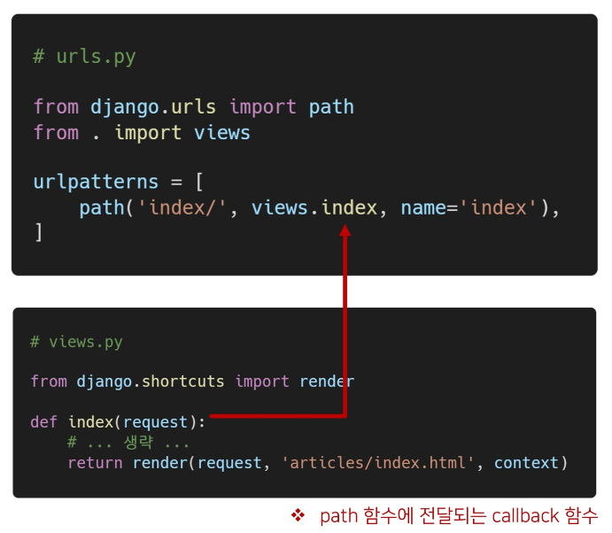
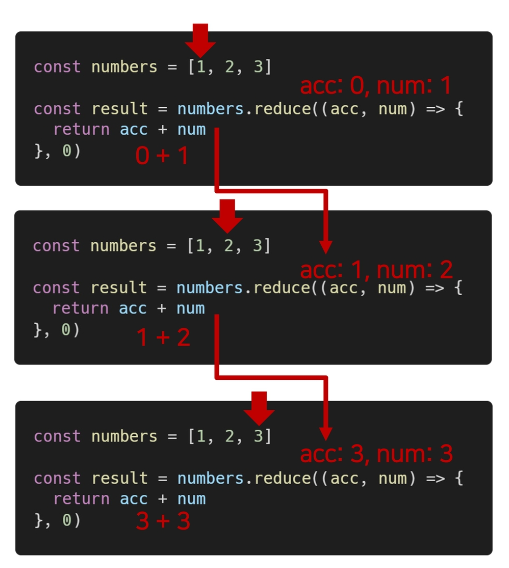

# **Array와 Object**

- 개요
    - JavaScript의 데이터 타입 중 참조 타입(reference)에 해당 하는 타입은 **Array**와 **Object**이며, 객체라고도 함<br>

    - 객체는 속성들의 모음(collection)
<br><br><br>

---

## **1. 배열(Array)**

- 배열 (Array)
    - 키와 속성들을 담고 있는 참조 타입의 객체<br>

    - 순서를 보장하는 특징이 있음
    - 주로 대괄호([ ])를 이용하여  생성하고, 0을 포함한 양의 정수 인덱스로 특정 값에 접근 가능
    - 배열의 길이는 array, length 형태로 접근 가능
        - (참고) 배열의 마지막 원소는 array.length - 1로 접근
    <br><br>
    ```jsx
    const numbers = [1, 2, 3, 4, 5]
    
    console.log(number[0])       // 1
    console.log(numbers[-1])     // undefined
    console.log(numbers.length)  // 5
    ```
    
    ```jsx
    const numbers = [1, 2, 3, 4, 5]
    
    console.log(numbers[numbers.length - 1])  // 5
    console.log(numbers[numbers.length - 2])  // 4
    console.log(numbers[numbers.length - 3])  // 3
    console.log(numbers[numbers.length - 4])  // 2
    console.log(numbers[numbers.length - 5])  // 1
    ```
<br><br><br>

---

## **2. 배열의 메서드 기초**

- 배열 메서드 기초
    
    
    | 메서드 | 설명 | 비고 |
    | --- | --- | --- |
    | reverse | 원본 배열의 요소들의 순서를 반대로 정렬 |  |
    | push & pop | 배열의 가장 뒤에 요소를 추가 또는 제거 |  |
    | unshift & shift | 배열의 가장 앞에 요소를 추가 또는 제거 |  |
    | includes | 배열에 특정 값이 존재하는지 판별 후 참/거짓 반환 |  |
    | indexOf | 배열에 특정 값이 존재하는지 판별 후 인덱스 반환 | 요소가 없을 경우 -1 반환 |
    | join | 배열의 모든 요소를 구분자를 이용하여 연결 | 구분자 생략 시 쉼표 기준 |
<br><br><br>

- `array.reverse()`
    - 원본 배열 요소들의 순서를 반대로 정렬
        
        ```jsx
        const numbers = [1, 2, 3, 4, 5]
        numbers.reverse()
        console.log(numbers)  // [5, 4, 3, 2, 1]
        ```
<br><br>        

- `array.push()`

    - 배열의 가장 뒤에 요소 추가

- `array.pop()`

    - 배열의 마지막 요소 제거
    <br>
    
    ```jsx
    const numbers = [1, 2, 3, 4, 5]
    
    numbers.push(100)
    console.log(numbers)  // [1, 2, 3, 4, 5, 100]
    
    numbers.pop()
    console.log(numbers)  // [1, 2, 3, 4, 5]
    ```
<br><br>    

- `array.includes(value)`

    - 배열에 특정 값(value)이 존재하는지 판별 후 true 또는 false 반환

        
        ```jsx
        const numbers = [1, 2, 3, 4, 5]
        
        console.log(numbers.includes(1))  // true
        
        console.log(numbers.includes(100))  // false
        ```
<br><br>        

- `array.indexOf(value)`

    - 배열에 특정 값이 존재하는지 확인 후 가장 첫 번째로 찾은 요소의 인덱스 반환

    - 만약 해당 값이 없을 경우 -1 반환
        
        ```jsx
        const numbers = [1, 2, 3, 4, 5]
        let reult
        
        result = numbers.indexOf(3)  // 2
        console.log(result)
        
        result = numbers.indexOf(100)  // -1
        console.log(result)
        ```
<br><br>        

- `array.join([separator])`

    - 배열의 모든 요소를 연결하여 반환
    - separator(구분자)는 선택적으로 지정 가능하며, 생략 시 쉼표를 기본 값으로 사용
        
        ```jsx
        const numbers = [1, 2, 3, 4, 5]
        let result
        
        result = numbers.join()    // 1,2,3,4,5
        console.log(result)
        
        result = numbers.join('')    // 12345
        console.log(result)
        
        result = numbers.join(' ')    // 1 2 3 4 5
        console.log(result)
        
        result = numbers.join('-')    // 1-2-3-4-5
        console.log(result)
        ```
<br><br>

---

## **3. 배열 메서드 심화**

1. Array Helper Methods
    - 배열을 순회하며 특정 로직을 수행하는 메서드

    - 메서드 호출 시 인자로 callback 함수를 받는 것이 특징

        - callback 함수 : 어떤 함수의 내부에서 실행될 목적으로 인자로 넘겨받는 함수
    
    | 메서드 | 설명 | 비고 |
    | --- | --- | --- |
    | forEach | 배열의 각 요소에 대해 콜백 함수를 한 번씩 실행 | 반환 값 없음 |
    | map | 콜백 함수의 반환 값을 요소로 하는 새로운 배열 반환 |  |
    | filter | 콜백 함수의 반환 값이 참인 요소들만 모아서 새로운 배열을 반환 |  |
    | reduce | 콜백 함수의 반환 값들을 하나의 값(acc)에 누적 후 반환 |  |
    | find | 콜백 함수의 반환 값이 참이면 해당 요소를 반환 |  |
    | some | 배열의 요소 중 하나라도 판별 함수를 통과하면 참을 반환 |  |
    | every | 배열의 모든 요소가 판별 함수를 통과하면 참을 반환 |  |
<br><br><br>


2. [참고] Django로 보는 콜백함수 예시
    
    
<br><br><br>

3. Array Helper Methods - forEach
    
    ```jsx
    array.forEach(elements, index, array) => {
      // do something
    })
    ```
    
    - `array.forEach(callback(element[, index[,array]]))`

    - 인자로 주어지는 함수(콜백 함수)를 배열의 각 요소에 대해 한 번씩 실행
        - 콜백 함수는 3가지 매개변수로 구성

            - (1) element: 배열의 요소

            - (2) index: 배열 요소의 인덱스
            - (3) array: 배열 자체
    - 반환 값(return) 없음
  <br><br>

    ```jsx
    // 1. 일단 사용해보기
    
    const colors = ['red', 'blue', 'green']
    
    printFunc = function (color) {
      console.log(color)
    }
    colors.forEach(printFunc)
    
    // red
    // blue
    // green
    ```
    
    ```jsx
    // 2. 함수 정의를 인자로 넣어보기
    
    colors.forEach(function (color) {
      console.log(color)
    })
    ```
    
    ```jsx
    // 3. 화살표 함수 적용하기
    
    colors.forEach((color) => {
      return console.log(color)
    })
    ```
<br><br>

4. Array Helper Methods - map
    
    ```jsx
    array.map((element, index, array) => {
      // do something
    })
    ```
    
    - `array.map(callback(element[, index[, array]]))`

    - 배열의 각 요소에 대해 콜백 함수를 한 번씩 실행
    - **콜백 함수의 반환 값을 요소로 하는 새로운 배열 반환**
    - 기존 배열 전체를 다른 형태로 바꿀 때 유용
        - forEach + return 이라고 생각하기
    <br><br>    
    
    ```jsx
    // 1. 일단 사용해보기
    
    const numbers = [1, 2, 3]
    
    // 함수 정의 (표현식)
    const doubleFunc = function (number) {
      return number * 2
    }
    
    // 함수를 다른 함수의 인자로 넣기(콜백 함수)
    const doubleNumbers = numbers.map(doubleFunc)
    console.log(doubleNumbers)  // [ 2, 4, 6 ]
    ```
    
    ```jsx
    // 2. 함수 정의를 인자로 넣어보기
    
    const doubleNumbers = numbers.map(function (number) {
      return number * 2
    })
    console.log(doubleNumbers)  // [ 2, 4, 6 ]
    ```
    
    ```jsx
    // 3. 화살표 함수 적용하기
    
    const doubleNumbers = numbers.map(number) => {
      return number * 2
    }
    console.log(doubleNumbers)  // [ 2, 4, 6 ]
    ```
<br><br>

5. Array Helper Methods - filter
    
    ```jsx
    array.filter((element, index, array) => {
      // do something
    })
    ```
    
    - `array.filter(callback(element[, index[, array]]))`

    - 배열의 각 요소에 대해 콜백 함수를 한 번씩 실행
    - **콜백 함수의 반환 값이 true인 요소들만 모아서 새로운 배열 반환**
    - 기존 배열의 요소들을 필터링할 때 유용
   <br><br>

    ```jsx
    // 1. 일단 사용해보기
    
    const products = [
      { name: 'cucumber', type: 'vegetable' },
      { name: 'banana', type: 'fruit' },
      { name: 'carrot', type: 'vegetable' },
      { name: 'apple', type: 'fruit' },
    ]
    
    // 함수 정의하고
    const fruitFilter = function (product) {
      return product.type === 'fruit'
    }
    
    // 콜백으로 넘기고
    const fruits = products.filter(fruitFilter)
    
    console.log(fruits)
    // [ { name: 'banana', type: 'fruit' }, { name: 'apple', type: 'fruit' } ]
    ```
    
    ```jsx
    // 2. 함수 정의를 인자로 넣어보기
    
    const fruits = products.filter(function (product) {
      return product.type === 'fruit'
    })
    ```
    
    ```jsx
    // 3. 화살표 함수 적용하기
    
    const fruits = products.filter((product) => {
      return product.type === 'fruit'
    })
    ```
<br><br>

6. Array Helper Methods - reduce
    
    ```jsx
    array.reduce((acc, element, index, array) => {
      // do something
    }, initialValue)
    ```
    
    - `array.reduce(callback(acc, element, [index[, array]])[, initialValue])`

    - 인자로 주어지는 함수(콜백 함수)를 배열의 각 요소에 대해 한 번씩 실행해서, 하나의 결과 값을 반환
    - 즉, 배열을 하나의 값으로 계산하는 동작이 필요할 때 사용(총합, 평균 등)
    - `map`, `filter` 등 여러 배열 메서드 동작을 대부분 대체할 수 있음
  <br><br>

    - reduce 메서드의 주요 매개변수

        - `acc`

            - 이전 callback 함수의 반환 값이 누적되는 변수
        - `initialValue` (optional)
            - 최초 callback 함수 호출 시 acc에 할당되는 값, default 값은 배열의 첫 번째 값

    - reduce의 첫 번째 매개변수인 콜백함수의 첫 번째 매개변수(acc)는 누적된 값(전 단계 까지의 결과)
    - reduce의 두 번째 매개변수인 initialValue 는 누적될 값의 초기값, 지정하지 않을 시 첫 번째 요소의 값이 됨
        - 빈 배열의 경우 initialValue를 제공하지 않으면 에러 발생
    <br><br>

    ```jsx
    // 이제 부터는 바로 콜백 함수를 정의해보자.
    
    const tests = [90, 90, 80, 77]
    
    // 총합
    const sum = tests.reduce(function (total, x) {
      return total + x
    }, 0)  // 여기서 0 생략 가능
    
    // 화살표 함수
    const sum = tests.reduce((total, x) => total + x, 0)
    
    // 평균
    const sum = tests.reduce((total, x) => total + x, 0) / tests.length  
    ```
    
    - reduce 동작 방식
        
        
<br><br><br>        
    
7. Array Helper Methods - find
    
    ```jsx
    array.find((element, index, array)) {
      // do something
    }
    ```
    
    - `array.find(callback(element[, index[, array]]))`

    - 배열의 각 요소에 대해 콜백 함수를 한 번씩 실행
    - 콜백 함수의 반환 값이 true면, 조건을 만족하는 첫 번째 요소를 반환
    - 찾는 값이 배열에 없으면 undefined 반환
  <br><br>

    ```jsx
    const avengers = [
      { name: 'Tony Stark', age: 45 },
      { name: 'Steve Rogers', age: 32 },
      { name: 'Thor', age: 40 },
    ]
    
    const avenger = avengers.find(function (avenger) {
      return avenger.name === 'Tony Stark'
    })
    
    // 화살표 함수 적용
    const avenger = avengers.find((avenger) => {
      return avenger.name === 'Tony Stark'
    })
    ```
<br><br>

8. Array Helper Methods - some
    
    ```jsx
    array.some((element, index, array) => {
      // do something
    })
    ```
    
    - `array.some(callback(element[, index[, array]]))`

    - 배열의 **요소 중 하나라도** 주어진 판별 함수를 통과하면 true 반환
    - 모든 요소가 통과하지 못하면 거짓 반환
    - 빈 배열은 항상 false 반환
  <br><br>

    ```jsx
    const arr = [1, 2, 3, 4, 5]
    
    const result = arr.some((elem) => {
      return elem % 2 === 0
    })
    // true
    ```
<br><br>

9. Array Helper Methods - every
    
    ```jsx
    array.every((element, index, array) => {
      // do something
    })
    ```
    
    - `array.every(callback(element[, index[, array]]))`

    - 배열의 **모든 요소가** 주어진 판별 함수를 통과하면 true 반환
    - 하나의 요소라도 통과하지 못하면 false 반환
    - 빈 배열은 항상 true 반환
  <br><br>

    ```jsx
    const arr = [1, 2, 3, 4, 5]
    
    const result = arr.every((elem) => {
      return elem % 2 === 0
    })
    // false
    ```
<br><br>

10. 배열 순회 비교
    
    ```jsx
    const chars = ['A', 'B', 'C', 'D']
    
    // for loop
    for (let idx = 0; idx < chars.length; idx++) {
      console.log(idx, chars[idx])
    }
    
    // for ... of
    for (const char of chars) {
      console.log(char)
    }
    
    // forEach
    chars.forEach((char, idx) => {
      console.log(idx, char)
    })
    
    chars.forEach(char => {
      console.log(char)
    })
    ```
    
    | 방식 | 특징 | 비고 |
    | --- | --- | --- |
    | for loop | - 모든 브라우저 환경에서 지원</br>- 인덱스를 활용하여 배열의 요소에 접근</br>- break, continue 사용 가능 |  |
    | for…of | - 일부 오래된 브라우저 환경에서 지원 X<br>- 인덱스 없이 배열의 요소에 바로 접근 가능<br>- break, continue 사용 가능 |  |
    | forEach | - 대부분의 브라우저 환경에서 지원<br>- break, continue 사용 불가능 | Airbnb Style Guide<br>권장 방식 |

<br><br><br>

---

## **4. 객체 (Object)**

- 개요
    - 객체는 속성(property)의 집합이며, 중괄호 내부에 key와 value의 쌍으로 표현

    - key
        - 문자열 타입만 가능

        - key 이름에 띄어쓰기 등의 구분자가 있으면 따옴표로 묶어서 표현
    - value
        - 모든 타입(함수포함) 가능
    - 객체 요소 접근
        - 점(.) 또는 대괄호([ ])로 가능

        - key 이름에 띄어쓰기 같은 구분자가 있으면 대괄호 접근만 가능
<br><br><br>

- 객체 (Object) 예시
    
    ```jsx
    const me = {
      name: 'jack',
      phoneNumber: '01012345678',
      'samsung products': {
        buds: 'Galaxy Buds pro',
        galaxy: 'Galaxy s99',
      },
    }
    
    console.log(me.name)
    console.log(me['name'])
    console.log(me['samsung products'])
    console.log(me.samsung products)  // 불가능
    console.log(me['samsung products'].buds)
    ```
<br><br>

---

## **5. 객체 관련 문법**

1. 객체 관련 ES6 문법 익히기
    - ES6에 새로 도입된 문법들로 객체 생성 및 조작에 유용하게 사용 가능

        - (1) 속성명 축약

        - (2) 메서드명 축약
        - (3) 계산된 속성명 사용하기
        - (4) 구조 분해 할당
        - (5) 객체 전개 구문(Spread Operator)
<br><br><br>

2. 속성명 축약
    - 객체를 정의할 때 key와 할당하는 변수의 이름이 같으면 예시외 같이 축약 가능

        
        ```jsx
        var books = ['Learning JavaScript', 'Learning Pyhton']
        var magazines = ['Vogue', 'Science']
        
        // ES5
        var bookShop = {
          books: books,
          magazines: magazines,
        }
        console.log(bookShop)
        
        /*
        {
          books = ['Learning JavaScript', 'Learning Pyhton'],
          magazines = ['Vogue', 'Science']
        }
        */
        ```
        
        ```jsx
        const books = ['Learning JavaScript', 'Learning Pyhton']
        const magazines = ['Vogue', 'Science']
        
        // ES6+
        const bookShop = {
          books,
          magazines,
        }
        console.log(bookShop)
        
        /*
        {
          books = ['Learning JavaScript', 'Learning Pyhton'],
          magazines = ['Vogue', 'Science']
        }
        */
        ```
<br><br>

    
3. 메서드명 축약
    - 메서드 선언 시 function 키워드 생략 가능
        
        
        ```jsx
        // ES5
        var obj = {
          greeting: function () {
            console.log('Hi!')
          }
        }
        
        obj.greeting()  // Hi!
        ```
        
        ```jsx
        // ES6+
        const obj = {
          greeting() {
            console.log('Hi!')
          }
        }
        
        obj.greeting()  // Hi!
        ```
<br><br>        
    
4. 계산된 속성 (computed property name)
    - 객체를 정의할 때 key의 이름을 표현식을 이용하여 동적으로 생성 가능
        
        ```jsx
        const key = 'country'
        const value = ['한국', '미국', '일본', '중국']
        
        const myObj = {
          [key]: value,
        }
        
        console.log(myObj)  // { country: ['한국', '미국', '일본', '중국'] }
        console.log(myObj.country)  // ['한국', '미국', '일본', '중국']
        ```
<br><br>        
    
5. 구조 분해 할당 (destructing assignment)
    - 배열 또는 객체를 분해하여 속성을 변수에 쉽게 할당할 수 있는 문법
        
        ```jsx
        // ES5
        
        const userInformation = {
          name: 'kim',
          userId: 'Student1234',
          phoneNumber: '010-1234-5678',
          email: 'kim@naver.com'
        }
        
        const name = userInformation.name
        const userId = userInformation.userId
        const phoneNumber = userInformation.phoneNumber
        const email = userInformation.email
        ```
        
        ```jsx
        // ES6+
        
        const userInformation = {
          name: 'kim',
          userId: 'Student1234',
          phoneNumber: '010-1234-5678',
          email: 'kim@naver.com'
        }
        
        const { name } = userInformation
        const { userId } = userInformation
        const { phoneNumber } = userInformation
        const { email } = userInformation
        
        // 여러 개도 가능
        const { name, userId } = userInformation
        ```
<br><br>        
    
6. Spread syntax (…)
    - 배열과 마찬가지로 전개구문을 사용해 객체 내부에서 객체 전개 가능

    - 얕은 복사에 활용 가능
        
        ```jsx
        const obj = {b: 2, c: 3, d: 4}
        const newObj = {a: 1, ...obj, e: 5}
        
        console.log(newObj)  // {a: 1, b: 2, c: 3, d: 4, e: 5}
        ```
<br><br>        
    
7. JSON
    - JavaScript Object Notation

    - Key-Value 형태로 이루어진 자료 표기법
    - JavaScript의 Object와 유사한 구조를 가지고 있지만 Object는 그 자체로 타입이고, JSON은 형식이 있는 “문자열”
    - **즉, JSON을 Object로 사용하기 위해서는 변환 작업이 필요**
<br><br><br>

8. JSON 변환
    
    ```jsx
    const jsObject = {
      coffee: 'Americano',
      iceCream: 'Cookie and cream',
    }
    ```
    
    ```jsx
    // Object -> JSON
    
    const objToJson = JSON.stringify(jsObject)
    
    console.log(objToJson)  // {"coffee":"Americano", "iceCream":"Cookie and cream"}
    console.log(typeof objToJson)  // string
    ```
    
    ```jsx
    // JSON -> Object
    
    const jsonToObj = JSON.parse(objToJson)
    
    console.log(jsonToObj)  // { coffee: 'Americano', iceCream: 'Cookie and cream' }
    console.log(typeof jsonToObj)  // object
    ```
    
    → Django와 같은 API 서버에서 JSON을 응답한 것을 받아 다음과 같이 변환해야 하는 것!
<br><br><br>

9. [참고] 배열은 객체다
    - 배열은 키와 속성들을 담고 있는 참조 타입의 객체
    
    - 배열은 인덱스를 키로 가지며 `length` 프로퍼티를 갖는 특수한 객체
        
        ```jsx
        Object.getOwnPropertyDescriptors([1, 2, 3])
        
        /*
        {
          '0': { value: 1, writable: true, enumerable: true, configurable: true },
          '1': { value: 2, writable: true, enumerable: true, configurable: true },
          '2': { value: 3, writable: true, enumerable: true, configurable: true },
          'length': { value: 3, writable: true, enumerable: false, configurable: false },
        }
        */
        ```
<br><br>        

---