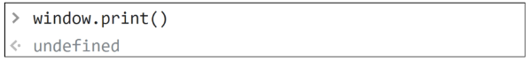

# **DOM**

- 개요
    - “브라우저에서의 JavaScript”

        - 웹 페이지에서 복잡한 기능을 구현하는 스크립트 언어

        - 가만히 정적인 정보만 보여주는 것이 아닌 주기적으로 갱신되거나, 사용자와 상호 작용이 가능하거나, 애니메이션이 적용된 그래픽 등에 관여
    - [참고] 스크립트 언어 (Script Language)

        - 응용 소프트웨어를 제어하는 컴퓨터 프로그래밍 언어
<br><br><br>

---

## **1. DOM**

1. Browser APIs
    - 웹 브라우저에 내장된 API로, 현재 컴퓨터 환경에 관한 데이터를 제공하거나 여러가지 유용하고 복잡한 일을 수행

    - 종류
        - DOM

        - Geolocation API
        - WebGL 등
<br><br><br>

2. DOM
    - “문제 객체 모델 (Document Object Model)”

    - 문서의 구조화된 표현을 제공하여 프로그래밍 언어가 DOM 구조에 접근할 수 있는 방법을 제공
        - 문서 구조, 스타일, 내용 등을 변경할 수 있게 도움

        - HTML 콘텐츨르 추가, 제거, 변경하고, 동적으로 페이지에 스타일을 추가하는 등 HTML/CSS를 조작할 수 있음
    - 문서가 구조화되어 있으며 각 요소는 객체(object)로 취급
    - 단순한 속성 접근, 메서드 활용 뿐만 아니라 프로그래밍 언어적 특성을 활용한 조작 가능
   <br><br>

    - DOM은 문서를 논리 트리로 표현

    - DOM 메서드를 사용하면 프로그래밍적으로 트리에 접근할 수 있고 이를 통해 문서의 구조, 스타일, 컨텐츠를 변경할 수 있음
        
        
    <br><br>    
    
    - 웹 페이지는 일종의 문서(document)

    - 이 문서는 웹 브라우저를 통해 그 내용이 해석되어 웹 브라우저 화면에 나타나거나 HTML 코드 자체로 나타나기도 함
    - DOM은 동일한 문서를 표현하고, 저장하고, 조작하는 방법을 제공
    - DOM은 웹 페이지의 객체 지향 표현이고, JavaScript와 같은 스크립트 언어를 이용해 DOM을 수정할 수 있음
<br><br><br>

3. DOM에 접근하기
    - DOM을 사용하기 위해 특별히 해야 할 일은 없음

    - 모든 웹 브라우저는 스크립트 언어가 접근할 수 있는 웹페이지를 만들기 위해 DOM을 항상 사용함
    - **DOM의 주요 객체들**을  활용하여 문서를 조작하거나 특정 요소들을 얻을 수 있음
<br><br><br>

4. DOM의 주요 객체
    - **window**

    - **document**
    - navigator, location, history, screen 등
<br><br><br>

5. **window** object
    - DOM을 표현하는 창

    - 가장 최상위 객체 (작성 시 생략 가능) → global
    - 탭 기능이 있는 브라우저에서는 각각의 탭을 각각의 window 객체로 나타냄
        
        
<br><br><br>        
    
6. window의 메서드 예시
    - 새 탭 열기
        
        
        
    - 경고 대화 상자 표시
        
        
        
    - 인쇄 대화 상자 표시
        
        
<br><br><br>        
    
7. **document** object
    - 브라우저가 불러온 웹 페이지

    - 페이지 컨텐츠의 **진입점 역할**을 하며, <body> 등과 같은 수많은 다른 요소들을 포함하고 있음
        
        
<br><br><br>        
    
8. document의 속성 예시
    - 현재 문서의 제목 (HTTP의 \<title> 값)
        
        
        
    - 제목 수정하기
        
        
<br><br><br>        
    
9. [참고] document는 window의 속성이다.
    
    
<br><br><br>

10. [참고] 파싱 (Parsing)
    - 구문 분석, 해석

    - 브라우저가 문자열을 해석하여 DOM Tree로 만드는 과정
        
        
<br><br><br>

---

## **2. DOM 조작**

1. 개요
    - Document가 제공하는 기능을 사용해 웹 페이지 문서 조작하기

    - DOM 조작 순서 🔥
        - (1) **선택 (Select)**

        - (2) **조작 (Manipulation)**
            - 생성, 추가, 삭제 등
<br><br><br>

2. 선택 관련 메서드
    - **document.querySelector(selector)**

        - 제공한 선택자와 일치하는 element 한 개 선택

        - 제공한 CSS selector를 만족하는 첫 번째 element 객체를 반환 (없다면 null 반환)
    - **document.querySelectorAll(selector)**
        - 제공한 선택자와 일치하는 여러 element를 선택

        - 매칭 할 하나 이상의 셀렉터를 포함하는 유효한 CSS selector를 인자(문자열)로 받음
        - 제공한 CSS selector를 만족하는 NodeList를 반환
<br><br><br>

3. 선택 관련 메서드 실습
    - `01_select.html` 에서 진행 (브라우저)

        
        
    - `01_select.html`에서 진행 (vscode)
        
        ```jsx
        console.leg(document.querySelector('#title'))
        // <h1 id="title">JS 기초</h1>
        
        console.log(document.querySelectorAll('.text'))
        // NodeList(2) [p.text, p.text]
        
        console.log(document.querySelector('.text'))
        // <p class="text">querySelector</p>
        
        console.log(document.querySelectorAll('body > ul> li'))
        // NodeList(2) [li, li]
        ```
<br><br>        
    
4. [참고] NodeList
    - index로만 각 항목에 접근 가능

    - 배열의 forEach 메서드 및 다양한 배열 메서드 사용 가능
        
        ```jsx
        <script>
        		...
            liTags = document.querySelectorAll('body > ul > li')
        
            liTags.forEach(element => {
              console.log(element)
            })
          </script>
        ```
        
    - querySelectorAll()에 의해 반환되는 NodeList는 DOM의 변경사항을 실시간으로 반영하지 않음 (정적)

        - 기본적으로 NodeList는 DOM의 변경사항을 실시간으로 반영!!
<br><br><br>
    
5. 조작 관련 메서드 (생성)
    - **document.createElement(tagName)**

        - 작성한 tagName의 HTML 요소를 생성하여 반환
<br><br><br>

6. 조작 관련 메서드 (입력)
    - **Node.innerText**

        - Node 객체와 그 자손의 텍스트 컨텐츠(DOMString)를 표현 (해당 요소 내부의 raw text)

        - 사람이 읽을 수 있는 요소만 남김
        - 즉, 줄 바꿈을 인식하고 숨겨진 내용을 무시하는 등 최종적으로 스타일링이 적용된 모습으로 표현
<br><br><br>

7. 조작 관련 메서드 (추가)
    - **Node.appendChild()** 🔥

        - 한 Node를 특정 부모 Node의 자식 NodeList 중 마지막 자식으로 삽입

        - 한번에 오직 하나의 Node만 추가할 수 있음
        - 추가된 Node 객체를 반환
        - 만약 주어진 Node가 이미 문서에 존재하는 다른 Node를 참조한다면 현재 위쳉서 새로운 위치로 이동
<br><br><br>

8. 조작 관련 메서드 (삭제)
    - **Node.removeChild()**

        - DOM에서 자식 Node를 제거

        - 제거된 Node를 반환
<br><br><br>

9. 조작 관련 메서드 실습
    - `02_create_append.html`에서 진행 (브라우저)

        
        
        
    - `02_create_append.html`에서 진행 (vscode) / 출력 확인 후 삭제
        
        ```jsx
        // h1 요소(element)를 만들고
        const title = document.createElement('h1')
        
        // 텍스트를 추가하고
        title.innerText = 'DOM 조작'
        
        // 선택자로 div 태그를 가져와서
        const div = document.querySelector('div')
        
        // div 태그의 자식 요소로 추가
        div.appendChild(title)
        
        // div의 h1 요소 삭제
        div.removeChild(title)
        ```
<br><br>        
    
10. 조작 관련 메서드 (속성 조회 및 설정) 🔥
    - Element**.getAttribute**(attributeName)

        - 해당 요소의 지정된 값(문자열)을 반환

        - 인자(attributeName)는 값을 얻고자 하는 속성의 이름
    - Element**.setAttribute**(name, value)
        - 지정된 요소의 값을 설정

        - 속성이 이미 존재하면 값을 갱신, 존재하지 않으면 지정된 이름과 값으로 새 속성을 추가
<br><br><br>

11. 조작 관련 메서드 실습
    - `03_select.html`에서 진행 (브라우저)
        
        
        
    - `03_attribute.html`에서 진행 (vscode)
        
        ```jsx
        // a tag 생성 및 컨텐츠 추가
        const aTag = document.createElement('a')
        aTag.innerText = '구글'
        
        // div 태그의 자식 태그로 a 태그 추가
        const div = document.querySelector('div')
        div.appendChild(aTag)
        
        // a 태그의 href 속성 추가
        aTag.setAttribute('href', 'httpsL//google.com')
        console.log(aTag.getAttribute('href'))
        
        // h1 tag 선택 및 클래스 목록 조회
        const h1 = document.querySelector('h1')
        console.log(h1.classList)
        
        // 클래스가 존재한다면 제거하고 false를 반환,
        // 존재하지 않으면 클래스를 추가하고 true를 반환
        h1.classList.toggle('blue')
        console.log(h1.classList)
        ```
<br><br>        
    
12. DOM 조작 정리
    
    (1) 선택한다
    
    - `querySelector()`

    - `querySelectorAll()`
    
    (2) 조작한다
    
    - `innerText`
    
    - `setAttribute()`
    - `getAttribute()`
    - `createElement()`
    - `appendChild()`
    - …
<br><br><br>

---