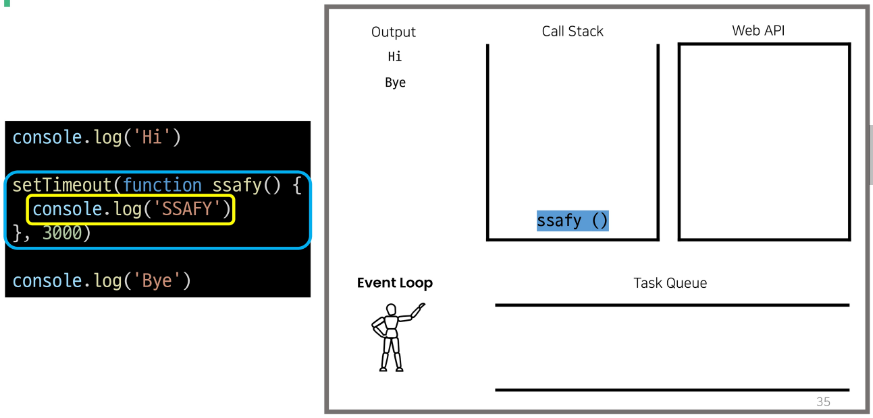

# **동기와 비동기**

- INTRO
    - 주문 후 커피가 나올 때까지 기다려야 함 (동기식)

    - 주문 후 진동벨이 울리면 커피를 가져옴 (비동기)
<br><br><br>

---

## **1. 동기 (Synchronous)**

- 모든 일을 **순서대로 하나씩** 처리하는 것

- 순서대로 처리한다 == 이전 작업이 끝나면 다음 작업을 시작한다.
- 우리가 작성했던 Python 코드가 모두 동기식
    
    ```python
    print('첫번째 작업')
    for i in range(10):
        print('두번째 작업')
    print('세번째 작업')
    ```
  
- 요청과 응답을 동기식으로 처리한다면?
    - 요청을 보내고 응답이 올 때까지 기다렸다가 다음 로직을 처리
<br><br>

- 웹에서의 동기 경험하기
    
    ```jsx
    <body>
      <button>버튼</button> 
      <script>
        const btn = document.querySelector('button')
        btn.addEventListener('click', () => {
          alert('you clicked me!')
          const pElem = document.createElement('p')
          pElem.innerText = 'p Element'
          document.body.appendChild(pElem)
      })
      </script>
    </body>
    ```
    
    → 확인을 누르기 전까지 p태그는 보이지 않음
<br><br><br>

---

## **2. 비동기 (Asynchronous)**

- 작업을 시작한 후 **결과를 기다리지 않고** 다음 작업을 처리하는 것 (병렬적 수행)

- 시간이 필요한 작업들은 요청을 보낸 뒤 응답이 빨리 오는 작업부터 처리
- 예시) Gmail에서 메일 전송을 누르면 목록 화면으로 전환되지만 실제로 메일을 보내는 작업은 병렬적으로 뒤에서 처리됨
<br><br>

```jsx
function slowRequest(callBack) {
  console.log('1. 오래 걸리는 작업 시작 ...')
  setTimeout(function () {     // 3 초를 기다리는 함수 (오래 걸리는 작업)
    callBack()
  }, 3000)
}

function myCallBack() {
  console.log('2. 콜백함수 실행됨')  // 가장 마지막에 출력
}

slowRequest(myCallBack)
console.log('3. 다른 작업 실행')
```
<br>

- 비동기(Asynchronous)를 사용하는 이유

    - **사용자 경험**

        - 예를 들어 아주 큰 데이터를 불러온 뒤 실행되는 앱이 있을 때,

        - 동기로 처리한다면 데이터를 모두 불러온 뒤에야 앱의 실행 로직이 수행되므로 사용자들은 마치 앱이 멈춘 것과 같은 경험을 겪에 됨
        - 즉, 동기식 처리는 특정 로직이 실행되는 동안 다른 로직 실행을 차단하기 때문에 마치 프로그램이 응답하지 않은 듯한 사용자 경험을 만들게 됨
        - **비동기로 처리한다면 먼저 처리되는 부분부터 보여줄 수 있으므로,** 사용자 경험에 긍정적인 효과를 볼 수 있음
        - 이와 같은 이유로 많은 웹 기능은 비동기 로직을 사용해서 구현되어 있음
<br><br><br>

---

## **3. JavaScript의 비동기 처리**

1. Single Thread 언어, JavaScript
    - 그러면 응답이 먼저 오는 순서대로 처리하지 않고, 아예 여러 작업을 동시에 처리하면 되지 않을까?

    - JavaScript는 한 번에 하나의 일만 수행할 수 있는 **Single Thread** 언어로 동시에 여러 작업을 처리할 수 없음
    - [참고] Thread란?
        - 작업을 처리할 때 실제로 작업을 수행하는 주제로, multi-thread라면 업무를 수행할 수 있는 주체가 여러 개라는 의미

    - 즉, JavaScript는 하나의 작업을 요청한 순서대로 처리할 수 밖에 없다!
<br><br><br>

2. JavaScript Runtime
    - JavaScipt 자체는 Single Thread이므로 비동기 처리를 할 수 있도록 도와주는 환경이 필요함

    - 특정 언어가 동작할 수 있는 환경을 “런타임(Runtime)”이라 함
    - JavaScript에서 비동기와 관련한 작업은 브라우저 또는 Node 환경에서 처리
    - 이중에서 브라우저 환경에서의 비동기 동작은 크게 아래의 요소들로 구성됨
        - (1) JavaScript Engine의 **Call Stack**

        - (2) **Web API**
        - (3) **Tash Queue**
        - (4) **Event Loop**
<br><br><br>

3. 비동기 처리 동작 방식
    - 브라우저 환경에서의 JavaScript의 비동기는 아래와 같이 처리된다.

        - 모든 작업은 **Call Stack**(LIFO)으로 들어간 후 처리된다.

        - 오래 걸리는 작업은 **Call Stack**으로 들어오면 **Web API**로 보내 별도로 처리하도록 한다.
        - Web API에서 처리가 끝난 작업들은 곧바로 **Call Stack**으로 들어가지 못하고 **Task Queue**(FIFO)에 순서대로 들어간다.
        - **Event Loop**가 Call Stack이 비어 있는 것을 계속 체크하고 Call Stack이 빈다면 Task Queue에서 가장 오래된 (가장 앞에 있는) 작업을 Call Stack으로 보낸다.
    <br><br>

    - **Call Stack**

        - 요청이 들어올 때마다 순차적으로 처리하는 Stack(LIFO)

        - 기본적인 JavaScript의 Single Thread 작업 처리
    - **Web API**
        - JavaScript 엔진이 아닌 브라우저에서 제공하는 runtime 환경으로 시간이 소요되는 작업을 처리 (setTimeout, DOM Event, AJAX 요청 등)

    - **Task Queue**
        - 비동기 처리된 Callback 함수가 대가히는 Queue(FIFO)
    - **Event Loop**
        - Call Stack과 Task Queue를 지속적으로 모니터링

        - Call Stack이 비어있는지 확인 후 비어 있다면 Task Queue에서 대기 중인 오래된 작업을 Call Stack으로 Push
<br><br><br>

4. 그림으로 보는 비동기 처리(Runtime)
    
    
    
    
    
    
    
    
    
    
    
    
    
    
    
    
    
    
    
    
    
    
    
    
    
    
    
    
    
    
    
    
    
    
    
    
    
    
<br><br><br>

5. 정리
    - JavaScript는 한 번에 하나의 작업을 수행하는 Single Thread 언어로 동기적 처리르 하지만, 브라우저 환경에서는 Web API에서 처리된 작업이 지속적으로 Task Queue를 거쳐 Event Loop에 의해 Call Stack에 들어와 순차적으로 실행됨으로써 비동기 작업이 가능한 환경이 된다.
<br><br><br>

---
