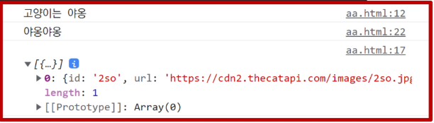
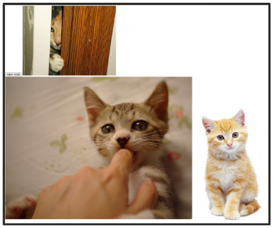

# **Axios 라이브러리**

- Axios
    - JavaScript의 HTTP 웹 통신을 위한 라이브러리

    - 확장 가능하나 인터페이스와 쉽게 사용할 수 있는 비동기 통신 기능을 제공
    - node 환경은 npm을 이용해서 설치 후 사용할 수 있고, browser 환경은 CDN을 이용해서 사용할 수 있음
    - Axios 공식문서 및 github
        - [https://axios-http.com/kr/docs/intro](https://axios-http.com/kr/docs/intro)

        - [https://github.com/axios/axios/](https://github.com/axios/axios/)
<br><br><br>

---

## **1. Axios 기본 구조**

1. Axios 사용해보기
    
    ```jsx
    <script src="https://cdn.jsdeliver.net/npm/axios/dist/axios.min.js"></script>
    <script>
      axios.get('요청할 URL')
        .then(성공하면 수행할 콜백함수)
        .catch(실패하면 수행할 콜백함수)
    </script>
    ```
    
    - get, post 등 여러 method 사용가능

    - **then**을 이용해서 성공하면 수행할 로직을 작성
    - **catch**를 이용해서 실패하면 수행할 로직을 작성
<br><br><br>

2. 고양이 사진 사져오기
    - The Cat API([https://api.thecatapi.com/v1/images/search](https://api.thecatapi.com/v1/images/search))

        - 이미지를 요청해서 가져오는 작업을 비동기로 처리

    - response 구조
        
        ```jsx
        // https://api.thecatapi.com/v1/images/search
        
        [
          {
            "id": "d6n",
            "url": "https://cdn2.thecatapi.com/images/d6n.jpg",
            "width": 333,
            "height": 500,
          }
        ]
        ```
    <br>    
    
    - Python으로 요청해보기 (동기)
        
        ```python
        import requests 
        
        print('고양이는 야옹')
        
        cat_image_search_url = 'https://api.thecatapi.com/v1/images/search'
        response = requests.get(cat_image_search_url)
        
        if response.status_code == 200:
            print(response.json())
        else: 
            print('실패했다옹')
            
        print('야옹야옹')
        ```
        
        ```python
        # 실행 결과
        고양이는 야옹
        [{'id': 'MTc0NTYwMA', 'url': 'https://cdn2.thecatapi.com/images/MTc0NTYwMA.gif', 'width': 500, 'height': 300}]
        야옹야옹
        ```
    <br>    
    
    - Axios로 요청해보기 (비동기)
        
        ```jsx
        <script src="https://cdn.jsdelivr.net/npm/axios/dist/axios.min.js"></script>
        <script>
          console.log('고양이는 야옹')
          const catImageSearchURL = 'https://api.thecatapi.com/v1/images/search'
        
          axios.get(catImageSearchURL)
            .then((response) => {
              console.log(response.data)
            })
            .catch((error) => { 
              console.log('실패했다옹')
            })
            console.log('야옹야옹') 
        </script>
        ```
        
        
<br><br><br>        
    
3. 고양이 사진 가져오기 (결과 비교)
    - 동기식 코드(python)은 위에서부터 순서대로 처리다 되기 때문에 첫 번째 print 가 출력되고 이미지를 가져오는 처리를 기다렸다가 다음 print가 출력되는 반면

    - 비동기식 코드(JavaScript)는 바로 처리가 가능한 작업(`console.log`)은 바로  처리하고, 오래 걸리는 작업인 이미지를 요청하고 가져오는 일은 요청을 보내 놓고 기다리지 않고 다음 코드로 진행 후 완료가 된 시점에 결과 출력이 진행됨
<br><br><br>

4. 고양이 사진 가져오기 (완성하기)
    - 작업 Flow

        - (1) 버튼을 누르면

        - (2) 고양이 이미지를 요청하고
        - (3) 요청이  처리되어 응답이 오면
        - (4) 처리된 response에 있는 url을 img 태그에 넣어 보여주기
    <br><br>

    - 현재 HTML Body
        
        ```jsx
        <script src="https://cdn.jsdeliver.net/npm/axios/dist/axios.min.js"></script>
        <script>
          console.log('고양이는 야옹')
          const catImageSearchURL = 'https://api.thecatapi.com/v1/images/search'
          
          axios.get(catImageSearchURL)
          .then((response) => {
            console.log(response.data)
          })
          .catch((error) => {
            console.log('실패했다옹')
          })
          console.log('야옹야옹')
        </script>
        ```
    <br>    
    
    - (1) 버튼을 추가하고 이벤트 리스너  달기
        
        ```jsx
        <script src="https://cdn.jsdeliver.net/npm/axios/dist/axios.min.js"></script>
        <script>
          console.log('고양이는 야옹')
          const catImageSearchURL = 'https://api.thecatapi.com/v1/images/search'
          const btn = document.querySelector('button')  
        
          btn.addEventListener('click', function () {
            axios.get(catImageSearchURL)
            .then((response) => {
              console.log(response.data)
            })
            .catch((error) => {
              console.log('실패했다옹')
            })
            console.log('야옹야옹')
          })
        </script>
        ```
    <br>    
    
    - (2) 비동기 요청을 보내고, 응답이 오면 처리하기
        
        ```jsx
        <script src="https://cdn.jsdeliver.net/npm/axios/dist/axios.min.js"></script>
        <script>
          console.log('고양이는 야옹')
          const catImageSearchURL = 'https://api.thecatapi.com/v1/images/search'
          const btn = document.querySelector('button')  
        
          btn.addEventListener('click', function () {
            axios.get(catImageSearchURL)
            .then((response) => {
              imgElem = document.createElement('img')
              imgElem.setAttribute('src', response.data[0].url)
              document.body.appendChild(imgElem)
            })
            .catch((error) => {
              console.log('실패했다옹')
            })
            console.log('야옹야옹')
          })
        </script>
        ```
    <br>    
    
    - (3) 완성 코드 (body)
        
        ```jsx
        <button>야옹아 이리온</button>
        <script src="https://cdn.jsdeliver.net/npm/axios/dist/axios.min.js"></script>
        <script>
          console.log('고양이는 야옹')
          const catImageSearchURL = 'https://api.thecatapi.com/v1/images/search'
          const btn = document.querySelector('button')  
        
          btn.addEventListener('click', function () {
            axios.get(catImageSearchURL)
            .then((response) => {
              imgElem = document.createElement('img')
              imgElem.setAttribute('src', response.data[0].url)
              document.body.appendChild(imgElem)
            })
            .catch((error) => {
              console.log('실패했다옹')
            })
            console.log('야옹야옹')
          })
        </script>
        ```
    <br>    
    
    - 실행 결과
        - 버튼을 누르면 console.log가 먼저 출력되고 이미지 요청을 보낸다.

        - 버튼을 여러 번 누르면 먼저 로딩되는 이미지부터 나오는 것을 볼 수 있다.
        
        
        
    
5. 정리
    - axios는 비동기로 데이터 통신을 가능하게 하는 라이브러리

    - 같은 방식으로 우리가 배운 Django REST API로  요청을 보내서 데이터를 받아온 후 처리할 수 있음
<br><br><br>

---