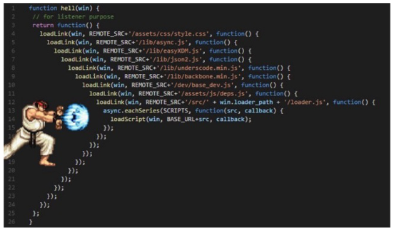

# **Callback과 Promise**

- 비동기 처리의 단점
    - 비동기 처리의 핵심은 Web API로 들어오는 순서가 아니라 **작업이 완료되는 순서에 따라 처리**한다는 것

    - 그런데 이는 개발자 입장에서 코드의 실행 순서가 불명확하다는 단점이 있음
    - 이와 같은 단점은 **실행 결과를 예상하면서 코드를 작성할 수 없게 함**
        - 콜백 함수를 사용하자!!!
<br><br><br>

---

## **1. 콜백 함수 (Callback Function)**

1. 콜백 함수란?
    - 특별한 함수가 아님! **다른 함수의 인자로 전달되는 함수**를 콜백 함수라고 한다.

    - 비동기에만 사용되는 함수가 아니며 동기, 비동기 상관없이 사용 가능
    - 시간이 걸리는 **비동기 작업이 완료된 후  실행할 작업을 명시하는 데 사용**되는 콜백 함수를 **비동기 콜백(asynchronour callback)** 이라 부름
<br><br><br>

2. 콜백 함수 예시
    
    ```jsx
    // JavaScript의 EventListener
    
    const btn = document.querySelector('button')
    btn.addEventListener('click', () => {
      alert('Completed')
    })
    ```
    
    ```python
    # Django의 View Function
    
    from django.urls import path
    from . import view
    
    urlpatterns = [
        path('index/', views.index),
    ]
    ```
<br><br><br>

3. 콜백 함수를 사용하는 이유
    - 명시적인 호출이 아닌 특정한 조건 혹은 행동에 의해 호출되도록 작성할 수 있음

    - “요청이 들어오면”, “이벤트가 발생하면”, “데이터를 받아오면” 등의 조건으로 이후 로직을 제어할 수 있음
    - **비동기 처리를 순차적으로 동작할 수 있게 함**
    - 비동기 처리를 위해서는 콜백 함수의 형태가 반드시 필요함
<br><br><br>

4. 콜백 지옥 (Callback Hell)
    - 콜백 함수는 연쇄적으로 발생하는 비동기 작업을 순차적으로 동작할 수 있게 함

    - 보통 어떤 기능의 실행 결과를 받아서 다른 기능을 수행하기 위해 많이 사용되는데, 이 과정을 작성하다 보면 비슷한 패턴이 계속 발생하게 됨
        - A를 처리해서 결과가 나오면, 첫 번째 callback 함수를 실행하고

        - 첫 번째 callback 함수가 종료되면, 두 번째 callback 함수를 실행하고
        - 두 번째 callback 함수가 종료되면, 세 번째 callback 함수를 실행하고…
    <br><br>

    - 비동기 처리를 위한 콜백을 작성할 때 마주하느 문제를 Callback Hell(콜백 지옥)이라 하며, 그때의 코드 작성 형태가 마치 “피라미드와 같다”고 해서 “Pyramid of doom(파멸의 피라미드)”라고도 부름
        
        
<br><br><br>        
    
5. 정리
    - 콜백 함수는 비동기 작업을 순차적으로 실행할 수 있게 하는 반드시 필요한 로직

    - 비동기 코드를 작성하다 보면 콜백 함수로 인한 콜백 지옥(callback hell)은 반드시 나타나는 문제
        - 코드의 가독성을 해치고

        - 유지 보수가 어려워짐
<br><br><br>

---

## **2. 프로미스 (Promise)**

1. 프로미스(Promise)
    - Callback Hell 문제를 해결하기 위해 등장한 비동기 처리를 위한 객체

    - “작업이 끝나면 실행 시켜줄게”라는 약속(promise)
    - **비동기 작업의 완료 또는 실패를 나타내는 객체**
    - Promise 기반의 클라이언트가 바로 이전에 사용한 **Axios** 라이브러리 !
        - “Promise based HTTP client for the browser and node.js”

        - 성공에 대한 약속 **then()**
        - 실패에 대한 약속 **catch()**
    <br><br>

    - **then(callback)**
        - 요청한 작업이 성공하면 callback 실행

        - callback은 **이전 작업의 성공 결과를 인자로 전달 받음**
    - **catch(callback)**
        - then()이 하나라도 실패하면 callback 실행

        - callback은 이전 작업의 실패 객체를 인자로 전달 받음
    <br><br>

    - then과 cathc 모두 항상 promise 객체를 반환
    - 즉, 계속해서 **chaining을 할 수 있음**
    - **axios로 처리한 비동기 로직이 항상 promise 객체를 반환**
    - 그래서 then을 계속 이어 나가면서 작성할 수 있던 것
        
        ```jsx
        axis.get('요청할 URL').then(...).then(...).catch(...)
        ```
        
        ```jsx
        axis.get('요청할 URL')   // Promise 객체 return
          .then(성공하면 수행할 1번 콜백함수)
          .then(1번 콜백함수가 성공하면 수행할 2번 콜백함수)
          .then(2번 콜백함수가 성공하면 수행할 3번 콜백함수)
          ...  
          .catch(실패하면 수행할 콜백함수)
        ```
    <br>    
    
    ```jsx
    // 기존의 콜백 함수 작성 방식
    
    work1(function () {
      // 첫번째 작업 ...
      work2(result1, function (result2) {
        // 두번째 작업 ...
        work3(result2, functon (result3) {
          console.log('최종 결과 :' + result3)
        })
      })
    })
    ```
    <br>
    
    - promise 방식은 비동기 처리를 마치 우리가 일반적으로 위에서 아래로 적는 방식처럼 코드를 작성할 수 있음
        
        ```jsx
        // promise 방식
        
        work1()
          .then((result1) => {
            // work 2
            return result2  // return 해서 두 번째 인자로 넘어가는 거 중요!!!
          })
          .then((result2) => {
            // work3
            return result3
          })
          .catch((error) => {
            // error handling
          })
        ```
<br><br>        
    
2. Promise가 보장하는 것 (vs 비동기 콜백)
    - 비동기 콜백 작성 스타일과 달리 Promise가 보장하는 특징

    - (1) callback 함수는 JavaScript의 Event Loop가 현재 실행 중인 Call Stack을 완료하기 이전에는 절대 호출되지 않음

        - Promise callback 함수는 Event Queue에 배치되는 엄격한 순서로 호출됨

    - (2) 비동기 작업이 성공하거나 실패한 뒤에 `.then()` 메서드를 이용하여 추가한 경우에도 1번과 똑같이 동작
    - (3) `.then()`을 여러 번 사용해서 여러 개의 callback 함수를 추가할 수 있음 (Chaining)
        - 각각의 callback은 주어진 순서대로 하나하나 실행하게 됨

        - Chaining은 Promise의 가장 뛰어난 장점
<br><br><br>

---
