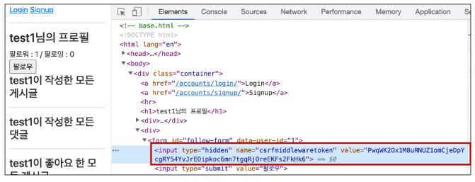
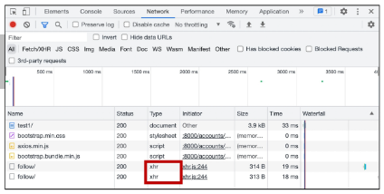
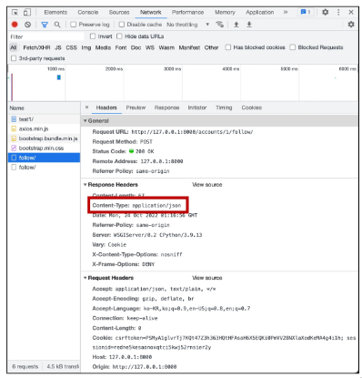

# **AJAX**

- AJAX란?
    - 비동기 통신을 이용하면 화면 전체를 새로고침 하지 않아도 서버로 요청을 보내고, 데이터를 받아 화면의 일부분만 업데이트 가능

    - 이러한 ‘비동기 통신 웹 개발 기술’을 Asynchronous Javascript And XML(AJAX)라 함
    - **AJAX의 특징**
        - (1) 페이지 새로고침 없이 서버에 요청

        - (2) 서버로부터 응답(데이터)을 받아 작업을 수행
    - 이러한 비동기 웹 통신을 위한 라이브러리 중 하나가 Axios
<br><br><br>

---

## **1. 비동기 적용하기**

1. 사전 준비
    - 마지막 Django 프로젝트 준비하기 (M:N까지 진행한 프로젝트)

    - 가상 환경 생성 및 활성화, 패키지 설치
<br><br><br>

2. 팔로우 (follow)
    - 각각의 템플릿에서 script 코드를 작성하기 위한 block tag 영역 작성
        
        ```html
        <!-- base.html -->
        
        <body>
          ...
          
          
        </body>
        </html>
        ```
    <br>    
    
    - axios CDN 작성
        
        ```html
        <!-- accounts/profile.html -->
        
        
          <script src="https://cdn.jsdeliver.net/npm/axios/dist/axios.min.js"></script>
          <script>
          </script>
        
        ```
      <br>  
    
    - form 요소 선택을 위해 id 속성 지정 및 선택
    - 불필요해진 action과 method 속성은 삭제 (요청은 axios로 대체되기 때문)
        
        ```html
        <!-- accounts/profile.html -->
        
        <form id="follow-form">
          ...
        </form>
        ```
        
        ```html
        <!-- accounts/profile.html -->
        
        <script>
          const form = document.querySelector('#follow-form')
        </script>
        ```
      <br>  
    
    - form 요소에 이벤트 핸들러 작성 및 submit 이벤트 취소
        
        ```html
        <!-- accounts/profile.html -->
        
        <script>
          const form = document.querySelector('#follow-form')
          form.addEventListener('submit', function (event) {
            event.preventDefault()
          })
        </script>
        ```
    <br>    
    
    - axios 요청 준비
        
        ```html
        <!-- accounts/profile.html -->
        
        <script>
          const form = document.querySelector('#follow-form')
          form.addEventListener('submit', function (event) {
            event.preventDefault()
            axios({
              method: 'post',
              url: '/accounts/${???}/follow/',
            })
          })
        </script>
        ```
      <br>  
    
    - 현재 axios로 POST 요청을 보내기 위해 필요한 것
        - **(1) url에 작성할 user pk는 어떻게 작성해야 할까?**

        - (2) csrftoken은 어떻게 보내야 할까?
    <br><br>

    - url에 작성할 user pk 가져오기 (HTML → JavaScript)
        
        ```html
        <!-- accounts/profile.html -->
        
        <form id="follow-form" data-user-id="{{ person.pk }}">
          ...
        </form>
        ```
        
        ```html
        <!-- accounts/profile.html -->
        
        <script>
          const form = document.querySelector('#follow-form')
          form.addEventListener('submit', function (event) {
            event.preventDefault()
            
            const userId = event.target.dataset.userId
            ...
          })
        </script>
        ```
<br><br>        
    
3. data-* attributes
    - 사용자 지정 데이터 특성을 만들어 임의의 데이터를 HTML과 DOM 사이에서 교환할 수 있는 방법

    - 사용 예시
        
        ```html
        <div data-my-id="my-data"></div>
        <script>
          const myId = event.target.dataset.myId
        </script>
        ```
        
    - 모든 사용자 지정 데이터는 dataset 속성을 통해 사용할 수 있음
        
        [https://developer.mozilla.org/ko/docs/Web/HTML/Global_attributes/data-*](https://developer.mozilla.org/ko/docs/Web/HTML/Global_attributes/data-*) 
<br><br><br>        
    
4. 팔로우
    - url 작성 마치기
        
        ```html
        <!-- accounts/profile.html -->
        
        <script>
          const form = document.querySelector('#follow-form')
          form.addEventListener('submit', function (event) {
            event.preventDefault()
            axios({
              method: 'post',
              url: `/accounts/${userId}/follow/`
            })
          })
        </script>
        
        ```
<br><br>        
    
5. data-* attributes
    - 예를 들어 `data-test-value` 라는 이름의 특성을 지정했다면 JavaScript에서는 `element.dataset.testValue`로 접근할 수 있음

    - 속성명 작성 시 주의사항
        - 대소문자 여부에 상관없이 xml로 시작하면 안 됨

        - 세미콜론을 포함해서는 안됨
        - 대문자를 포함해서는 안됨
<br><br><br>

6. 팔로우 (follow)
    - 현재 axios로 POST 요청을 보내기 위해 필요한 것

        - (1) url에 작성할 user pk는 어떻게 작성해야 할까?

        - **(2) csrftoken은 어떻게 보내야 할까?**
    <br><br>

    - 먼저 hidden 타입으로 숨겨져있는 csrf 값을 가진 input 태그를 선택해야 함
        - [https://docs.djangoproject.com/en/3.2/ref/csrf/](https://docs.djangoproject.com/en/3.2/ref/csrf/)
        
        
        
        ```html
        <!-- accounts/profile.html -->
        
        <script>
          const form = document.querySelector('#follow-form')
          const csrftoken = document.querySelector('[name=csrfmiddlewaretoken]').value
        </script>
        ```
    <br>    
    
    - AJAX로 csrftoken을 보내는 방법

        - [https://docs.djangoproject.com/en/3.2/ref/csrf/#setting-the-token-on-the-ajax-request](https://docs.djangoproject.com/en/3.2/ref/csrf/#setting-the-token-on-the-ajax-request)
            
            ```html
            <!-- accounts/profile.html -->
            
            <script>
              const form = document.querySelector('#follow-form')
              form.addEventListener('submit', function (event) {
                event.preventDefault()
                axios({
                  method: 'post',
                  url: `/accounts/${userId}/follow/`,
                  headers: {'X-CSRFToken': csrftoken,}
                })
              })
            </script>
            ```
    <br>        
        
    - 팔로우 버튼을 토글하기 위해서는 현재 팔로우가 된 상태인지 여부 확인이  필요

    - axios 요청을 통해 받는 response 객체를 활용해 view 함수를 통해서 팔로우 여부를 파악할 수 있는 변수를 담아 JSON 타입으로 응답하기
    <br><br>

    - 팔로우 여부를 확인하기 위한 is_followed 변수 작성 및 JSON 응답
        
        ```python
        # accounts/views.py
        
        from django.http import JsonResponse
        
        @require_POST
        def follow(request, user_pk):
            if request.user.is_authenticated:
            User = get_user_model()
            me = request.user
            you = User.objects.get(pk=user_pk)
            if me != you:
                if you.followers.filter(pk=me.pk).exist():
                    you.followers.remove(me)
                    is_followed = False
                else:
                    you.followers.add(me)
                    is_followed = True
                context = {
                    'is_followed': is_followed,
                }
                return JasonResponse(context)
            return redirect('accounts:profile', you.username)
        return redirect('accounts:login')
        ```
    <br>    
    
    - view 함수에서 응답한 is_followed를 사용해 버튼 토글하기
        
        ```html
        <!-- accounts/profile.html -->
        
        <script>
          ...
            axios({
              method: 'post',
              url: `/accounts/${userId}/follow/`,
              headers: {'X-CSRFToken': csrftoken,}
            })
            .then((response) => {
              const isFollowed = response.data.is_follwed
              const followBtn = document.querySelector('#follow-form > input[type=submit]')
              if (isFollowed === true) {
                followBtn.value = '언팔로우'
              } else {
                followBtn.value = '팔로우'
              }
            })
        </script>
        ```
    <br>    
    
    - 결과 확인 (개발자 도구 - Network)
        
        
        
        
<br><br><br>        
    
7. [참고] XHR
    - “XMLHttpRequest”

    - AJAX 요청을 생성하는 JavaScript API
    - XHR의 메서드로 브라우저와 서버 간 네트워크 요청을 전송힐 수 있음
    - **Axios**는 손쉽게 XHR을 보내고 응답 결과를 Promise 객체로 반환해주는 라이브러리
<br><br><br>

8. 팔로워 & 팔로잉 수 비동기 적용
    - 해당 요소를 선택할 수 있도록 span 태그와 id 속성 작성
        
        ```html
        <!-- accounts/profile.html -->
        
        
        
        
          <h1>{{ person.username }}님의 프로필</h1>
          <div>
            팔로워 : <span id="followers-count">{{ person.followers.all|length }}</span> /
            팔로잉 : <span id="followers-count">{{ person.followings.all|length }}</span>
          </div>
        ```
    <br>    
    
    - 직전에 작성한 span 태그를 각각 선택
        
        ```html
        <!-- accounts/profile.html -->
        
        <script>
          ...
            axios({
              method: 'post',
              url: `/accounts/${userId}/follow/`,
              headers: {'X-CSRFToken': csrftoken,}
            })
            .then((response) => {
              ...
              const followersCountTag = document.querySelector('#followers-count')
              const followingsCountTag = document.querySelector('#followings-count')
            })
        </script>
        ```
    <br>    
    
    - 팔로워, 팔로잉 인원 수 연산은 view 함수에서 진행하여 결과를 응답으로 전달
        
        ```python
        # accounts/views.py
        
        from django.http import JsonResponse
        
        @require_POST
        def follow(request, user_pk):
            ...
                context = {
                    'is_followed': is_followed,
                    'followers_count': you.followers.count(),
                    'followings_count': you.followings.count(),
                }
                return JasonResponse(context)
            return redirect('accounts:profile', you.username)
        return redirect('accounts:login')
        ```
    <br>    
    
    - view 함수에서 응답한 연산 결과를 사용해 각 태그의 인원 수 값 변경하기
        
        ```html
        <!-- accounts/profile.html -->
        
        <script>
          ...
            axios({
              method: 'post',
              url: `/accounts/${userId}/follow/`,
              headers: {'X-CSRFToken': csrftoken,}
            })
            .then((response) => {
              ...
              const followersCountTag = document.querySelector('#followers-count')
              const followingsCountTag = document.querySelector('#followings-count')
              followersCountTag.innerText = followersCount
              followingsCountTag.innerText = followingsCount
            })
        </script>
        ```
      <br>  
    
    - 최종 코드
        - HTML 코드

            
            ```html
            <!-- accounts/profile.html -->
            
            
            
            
              <h1>{{ person.username }}님의 프로필</h1>
              <div>
                팔로워 : <span id="followers-count">{{ person.followers.all|length }}</span> /
                팔로잉 : <span id="followers-count">{{ person.followings.all|length }}</span>
              </div>
            
              
              <div>
                <form id="follow-form" data-user-id="{{ person.pk }}">
                  
                  
                    <input type="submit" value="언팔로우">
                  
                    <input type="submit" value="팔로우">
                  
                </form>
              <div>
              
            ...
            ```
            
        - Python 코드
            
            ```python
            # accounts/views.py
            
            from django.http import JsonResponse
            
            @require_POST
            def follow(request, user_pk):
                if request.user.is_authenticated:
                User = get_user_model()
                me = request.user
                you = User.objects.get(pk=user_pk)
                if me != you:
                    if you.followers.filter(pk=me.pk).exist():
                        you.followers.remove(me)
                        is_followed = False
                    else:
                        you.followers.add(me)
                        is_followed = True
                    context = {
                        'is_followed': is_followed,
                        'followers_count': you.followers.count(),
                        'followings_count': you.followings.count(),
                    }
                    return JasonResponse(context)
                return redirect('accounts:profile', you.username)
            return redirect('accounts:login')
            ```
            
        - JavaScript 코드
            
            ```jsx
            <!-- accounts/profile.html -->
            const form = document.querySelector('#follow-form')
            const csrftoken = document.querySelector('[name=csrfmiddlewaretoken]').value
            
            form.addEventListener('submit', function (event) {
              event.preventDefault()
              const userId = event.target.dataset.userId
            
                axios({
                  method: 'post',
                  url: `/accounts/${userId}/follow/`,
                  headers: {'X-CSRFToken': csrftoken,}
                })
                .then((response) => {
                  const isFollowed = response.data.is_followed
                  const followBtn = document.querySelector('#follow-form > input[type=submit]')
                  if (isFollowed === true) {
                    followBtn.value = '언팔로우'
                  } else {
                    followBtn.value = '팔로우'
                  }
                  const followersCountTag = document.querySelector('#followers-count')
                  const followingsCountTag = document.querySelector('#followings-count')
                  const followersCount = response.data.followers_count
                  const followingsCount = response.data.followings_count
                  followersCountTag.innerText = followersCount
                  followingsCountTag.innerText = followingsCount
                })
                .catch((error) => {
                  console.log(error.response)
                })
              })
            </script>
            ```
<br><br>            
    
9. 좋아요 (like)
    - 좋아요 비동기 적용은 “팔로우와 동일한 흐름 + **forEach()** & **querySelectorAll()**”
    
        - index 페이지 각 게시글에 좋아요 버튼이 있기 때문
<br><br><br>

10. 최종 코드
    - HTML 코드
        
        ```html
        <!-- articles/index.html -->
        
        
        
        
          <h1>Articles</h1>
          
            <a href="">CREATE</a>
          
          <hr>
          
          <p>
            <b>작성자 : <a href="">{{ article.user }}</a></b>
          </p>
          <p>글 번호 : {{ article.pk }}</p>
          <p>제목 : {{ article.title }}</p>
          <p>내용 : {{ article.content }}</p>
          <div>
            <form class="like-forms" data-article-id="{{ article.pk }}">
              
              
                <input type="submit" value="좋아요 취소" id="like-{{ article.pk }}">
              
                <input type="submit" value="좋아요" id="like-{{ article.pk }}">
              
            </form>
          </div>
          <a href="">상세 페이지</a>
          <hr>
          
        
        ```
        
    - Python 코드
        
        ```python
        # articles/views.py
        
        from django.http import JsonResponse
        
        @require_POST
        def likes(reqeust, article_pk):
            if request.user.is_authenticated:
                article = Article.objects.get(pk=article_pk)
        
                if article.like_users.filter(pk=request.user.pk).exists():
                    article.like_users.remove(request.user)
                    is_liked = False
                else:
                    article.like_users.add(request.user)
                    is_liked = True
                context = {
                    'is_liked': is_liked,
                }
                return JsonResponse(context)
            return redirect('accounts:login')
        ```
        
    - JavaScript 코드
        
        ```jsx
        <!-- articles/index.html -->
        
        const forms = document.querySelectorAll('.like-forms')
        const csrftoken = document.querySelector('[name=csrfmiddlewaretoken]').value
        
        forms.forEach((form) => {
          form.addEventListener('submit', function (event) {
            event.preventDefault()
            const articleId = event.target.dataset.articleId
        
            axios({
              method: 'post',
              url: `http://127.0.0.1:8000/articles/${articleId}/likes/`,
              headers: {'X-CSRFToken': csrftoken},
            })
            .then((response) => {
              const isLiked = response.data.is_liked
              const likeBtn = document.querySelector(`#like-${articleId}`)
              if (isLiked === true) {
                likeBtn.value = '좋아요 취소'
              } else {
                likeBtn.value = '좋아요'
              }
            })
            .catch((error) => {
              console.log(error.response)
            })
          })
        })
        ```
<br><br>        

---