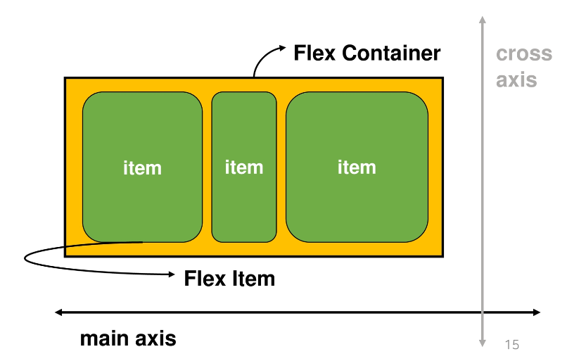
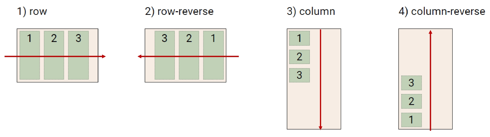
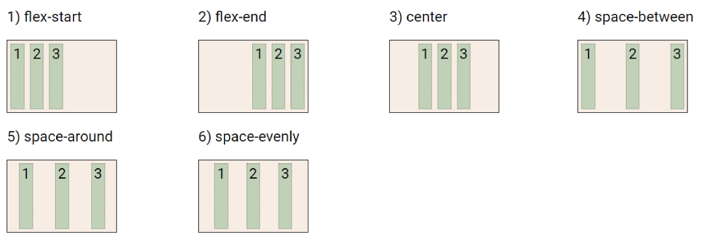
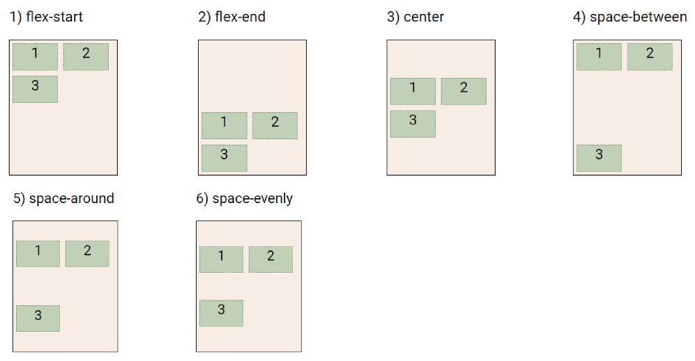
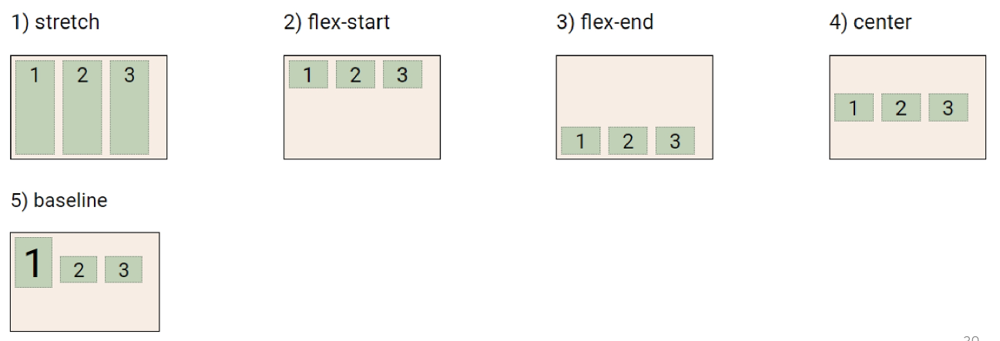
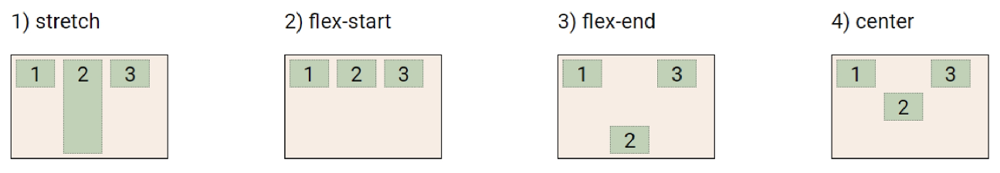
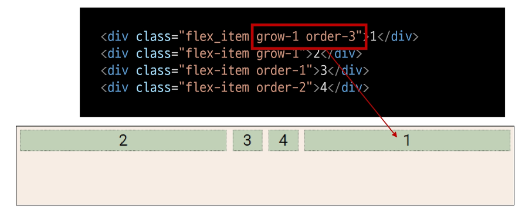
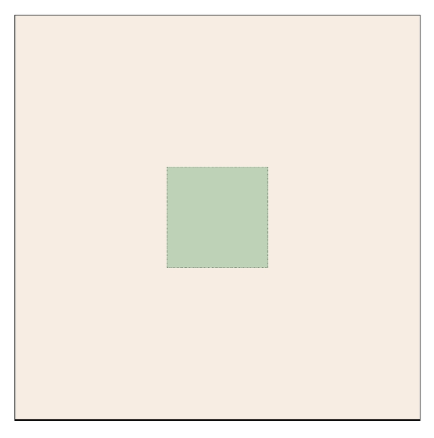
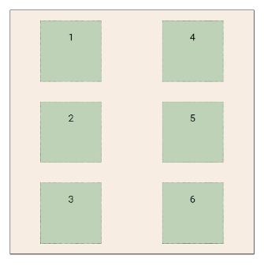
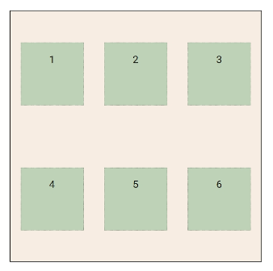

# CSS Layout

**4. CSS Layout**

1. CSS layout techniques
    - Display
    - Position
    - Float (CSS1, 1996)
    - Flexbox (2012)
    - Grid (2017)
    - 기타
        - Responsive Web Design(2010), Media Queries (2012)
<br><br>      

### **1. float**

1. CSS 원칙 1
    - Normal Flow
        - Inline Direction : 왼쪽에서 오른쪽으로
        - Block Direction : 위에서 아래로
    - 모든 요소는 네모(박스모델)이고, 위에서부터 아래로, 왼쪽에서 오른쪽으로 쌓인다. (죄측 상단에 배치)
    - 어떤 요소를 감사는 형태로 배치는?
    - 혹은 좌/우측에 배치는?
<br><br>

2. Float
    - 박스를 왼쪽 혹은 오른쪽으로 이동시켜 텍스트를 포함 인라인요소들이 주변을 wrapping 하도록 함
    - 요소가 Normal flow를 벗어나도록 함
    - Float Left / Float Right
<br><br>

3. Float 속성
    - none : 기본값
    - left : 요소를 왼쪽으로 띄움
    - right : 요소를 오른쪽으로 띄움
<br><br>

4. Float 예시
    
    ```html
    <!DOCTYPE html>
    <html lang="en">
    <head>
      <meta charset="UTF-8">
      <meta http-equiv="X-UA-Compatible" content="IE=edge">
      <meta name="viewport" content="width=device-width, initial-scale=1.0">
      <title>Document</title>
      <style>
        /* css 작성 */
        .box {
          width: 150px;
          height: 150px;
          border: 1px solid black;
          background-color: crimson;
          margin: 20px;
        }
        .left {
          float: left;
        }
    
        .right {
          float: right;
        }
      </style>
    </head>
    <body>
      <!-- 클래스 선택자 . -->
      <div class="box left">float left</div>
      <!-- <div class="box left">float left</div> -->
      <!-- <div class="box right">float right</div> -->
      <p>Lorem ipsum dolor sit amet consectetur adipisicing elit. Pariatur veritatis, debitis vitae, est illo enim ipsum dolores, animi voluptatibus eius magnam. Reprehenderit expedita animi illo cum fugiat sint quos fugit!
      Lorem ipsum dolor sit amet consectetur adipisicing elit. Blanditiis exercitationem tempore, ipsa culpa cumque vitae. Pariatur quia eius officia minus magnam ipsa. Illo vel blanditiis quae voluptate quam beatae. Iste!
      Lorem ipsum dolor sit amet consectetur adipisicing elit. Quod ab voluptatibus ipsa amet nisi odio eum dolores, sit minus? Suscipit modi corrupti dignissimos illo optio itaque facilis expedita consequatur quidem!
      Lorem ipsum, dolor sit amet consectetur adipisicing elit. Id, ea. Maiores, consectetur at deleniti dicta sapiente, molestiae illum cum quo velit distinctio iste. Sequi quod impedit, et harum perferendis ducimus?
      Lorem ipsum dolor sit amet consectetur adipisicing elit. Blanditiis exercitationem tempore, ipsa culpa cumque vitae. Pariatur quia eius officia minus magnam ipsa. Illo vel blanditiis quae voluptate quam beatae. Iste!
      Lorem ipsum dolor sit amet consectetur adipisicing elit. Quod ab voluptatibus ipsa amet nisi odio eum dolores, sit minus? Suscipit modi corrupti dignissimos illo optio itaque facilis expedita consequatur quidem!
      Lorem ipsum, dolor sit amet consectetur adipisicing elit. Id, ea. Maiores, consectetur at deleniti dicta sapiente, molestiae illum cum quo velit distinctio iste. Sequi quod impedit, et harum perferendis ducimus?
      </p>
    </body>
    </html>
    ```
<br><br><br>    

### '**2. flexbox**

1. CSS Flexible Box Layout
    
    
    
    - 행과 열 형태로 아이템들을 배치하는 1차원 레이아웃 모델
    - 축 🔥
        - main axis (메인 축)
        - cross axis (교차 축)
    - 구성 요소
        - Flex Container (부모 요소)
        - Flex Item (자식 요소)
<br><br>

2. Flexbox 축
    - flex-direction : row
<br><br>

3. Flexbox 구성 요소
    - Flex Container (부모요소)
        - flexbox 레이아웃을 형성하는 가장 기본적인 모델
        - Flex item들이 놓여있는 영역
        - display 속성을 flex 혹은 inline-flex로 지정
    - Flex Item (자식 요소)
        - 컨테이너에 속해 있는 컨텐츠(박스)
    
    ```css
    .flex-container {
    	display: flex;
    }
    ```
<br>

4. CSS Flexible Box Layout
    - 왜 Flexbox를 사용해야 할까?
        - 이전까지 Normal Flow를 벗어나는 수단은 Float 혹은 Position
    - 하기 여러웠던 것?
        - (수동 값 부여 없이) 수직정렬 / 아이템의 너비와 높이 혹은 간격을 동일하게 배치
<br><br>

5. flexbox 시작
    
    ```css
    .flex-container {
    	display: flex;
    }
    ```
    
    - 부모 요소에 display: flex 혹은 inline-flex
<br><br>

6. Flex 속성
    - 배치 설정
        - flex-direction
        - flex-wrap
    - 공간 나누기
        - justify-content (main axis)
        - align-content (cross axis)
    - 정렬
        - align-items (모든 아이템을 cross axis 기준으로)
        - align-self (개별 아이템)
<br><br>

7. Flex 속성 : flex-direction 🔥
    
    
    
    - Main axis 기준 방향 설정
    - 역방향의 경우 HTML 태그 선언 순서와 시각적으로 다르니 유의 (웹 접근성에 영향)
<br><br>

8. Flex 속성 : flex-wrap
    
    
    
    - 아이템이 컨테이너를 벗어나는 경우 해당 영역 내에 배치되도록 설정
    - 즉, 기본적으로 컨테이너 영역을 벗어나지 않도록 함
<br><br>

9. Flex 속성 : flex-wrap & flex-wrap
    - flex-direction: Main axis의 방향을 설정
    - flex-wrap: 요소들이 강제로 한 줄에 배치 되게 할 것인지 여부 설정
        - nowrap (기본 값): 한 줄에 배치
        - wrap: 넘치면 그 다음 줄에 배치
    - flex-flow
        - flex-direction과 flex-wrap의 shorthand
        - flex-direction과 flex-wrap에 대한 설정 값을 차례로 작성
        - 예시) flex-flow: row nowrap;
<br><br>

10. Flex 속성 : justify-content 
    
    
    
    - main axis를 기준으로 공간 배분
<br><br>

11. Flex 속성 : align-content (cross axis)
    
    
    
    - Cross axis를 기준으로 공간 배분 (아이템이 한 줄로 배치되는 경우 확인할 수 없음)
<br><br>

12. Flex 속성 : justify-content & align-content
    - 공간 배분
        - flex-start (기본 값) : 아이템들을 axis 시작점으로
        - flex-end : 아이템들을 axis 끝 쪽으로
        - center : 아이템들을 axis 중앙으로
        - space-between : 아이템 사이의 간격을 균일하게 분배
        - space-around : 아이템을 둘러싼 영역을 균일하게 분배 (가질 수 있는 영역을 반으로 나눠서 양쪽에)
        - space-evenly : 전체 영역에서 아이템 간 간격을 균일하게 분배
<br><br>

13. Flex 속성 : align-items
    
    
    
    - 모든 아이템을 Cross axis를 기준으로 정렬
<br><br>

14. Flex 속성 : align-self
    
    
    
    - 개별 아이템을 Cross axis 기준으로 정렬
        - 주의! 해당 속성은 컨테이너에 적용하는 것이 아니라 개별 아이템에 적용
<br><br>

15. Flex 속성 : align-items & align-self
    - Cross axis를 중심으로
        - stretch (기본 값) : 컨테이너를 가득 채움
        - flex-start : 위
        - flex-end : 아래
        - center : 가운데
        - baseline : 텍스트 baseline에 기준선을 맞춤
<br><br>

16. Flex에 적용하는 속성
    - 기타 속성
        - flex-grow : 남은 영역을 아이템에 분배
        - order : 배치 순서
    
    ```html
    <div class="flex_item grow-1 order-3">1</div>
    <div class="flex_item grow-1">2</div>
    <div class="flex_item order-1">3</div>
    <div class="flex_item order-2">4</div>
    ```
    
    
<br><br>

17. 활용 레이아웃 - 수직 수평 가운데 정렬
    
    
    
    
    ```css
    /* 방법 1
    컨테이너 설정
    */
    
    .container {
    	display: flex;
    	justify-content: center;
    	align-items: center;
    }
    
    /* 방법 2
    아이템 설정
    */
    
    .container {
    	display: flex;
    }
    .item {
    	margin: auto;
    }
    ```
<br>

18. 활용 레이아웃 - 카드 배치
    
    
    
    
    ```css
    #layout_03 {
    	display: flex;
    	flex-direction: column;
    	flex-wrap: wrap;
    	justify-content: space-around;
    	align-content: space-around;
    }
    ```
    
    
    
    ```css
    #layout_03 {
    	display: flex;
    	flex-direction: row;
    	flex-wrap: wrap;
    	justify-content: space-around;
    	align-content: space-around;
    }
    ```
<br><br>    

---
