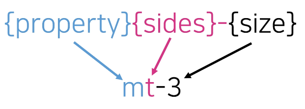
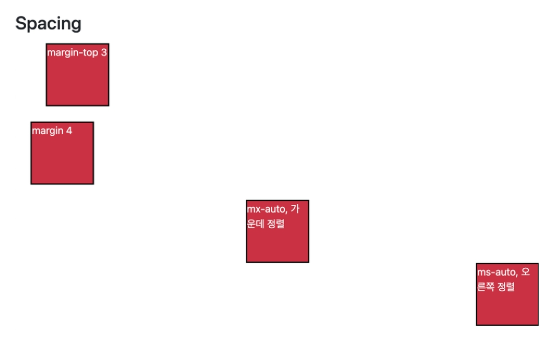
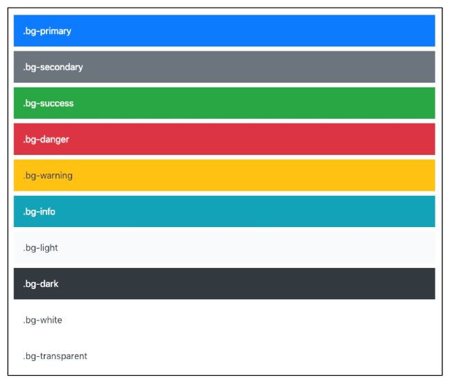
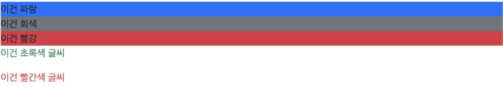
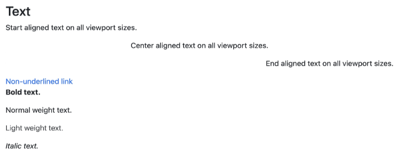
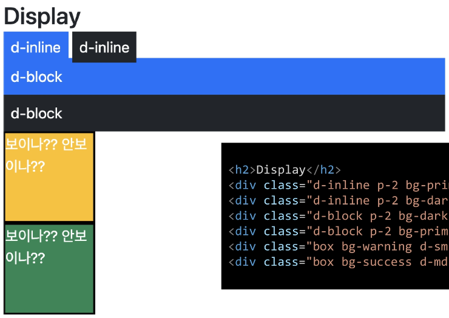
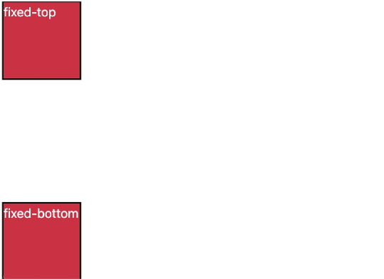

# Bootstrap

**5. Bootstrap**

- CDN
    - Content Delivery(Distribution) Network
    - 컨텐츠(CSS, JS, Image, Text 등)을 효율적으로 전달하기 위해 여러 노드에 가진 네트워크에 데이터를 제공하는 시스템.
    - 개별 end-user의 가까운 서버를 통해 빠르게 전달 가능(지리적 이점)
    - 외부 서버를 활용함으로써 본인 서버의 부하가 적어짐
<br><br>

### 1. Bootstrap 기본 원리 - spacing

1. spacing (Margin and padding)
    
    
    
    ```html
    <div class="mt-3 ms-5">bootstrap-spacing</div>
    ```
<br>

2. **{property}**
    - Where *property* is one of:
        - m - for classes that set `margin`
        - p - for classes that set `padding`
<br><br>

3. **{sides}**
    - Where *sides* is one of:
        - t - for classes that set `margin-top` or `padding-top`
        - b - for classes that set `margin-bottom` or `padding-bottom`
        - s - (start) for classes that set `margin-left` or `padding-left` in LTR, `margin-right` or `padding-right` in RTL
        - e - (end) for classes that set `margin-right` or `padding-right` in LTR, `margin-left` or `padding-left` in RTL
        - x - for classes that set both `*-left` and `*-right`
        - y - for classes that set both `*-top` and `*-bottom`
        - blank - for classes that set a `margin` or `padding` on all 4 sides of the element
<br><br>

4. **{size}**
    - Where *size* is one of:
        - e - for classes that eliminate the `margin` or `padding` by setting it to 0
        - 1 - (by default) for classes that set the `margin` or `padding` to `$spacer * .25`
        - 2 - (by default) for classes that set the `margin` or `padding` to `$spacer * .5`
        - 3 - (by default) for classes that set the `margin` or `padding` to `$spacer`
        - 4 - (by default) for classes that set the `margin` or `padding` to `$spacer * 1.5`
        - 5 - (by default) for classes that set the `margin` or `padding` to `$spacer * 3`
        - auto - for classes that set the `margin` to auto
<br><br>

5. **spacing**
    
    ```css
    .mt-1 {
    	margin-top: 0.25rem !important;
    }
    ```
    
    - 0.25rem
        - 16 * 0.25 = 4px
        - 브라우저 <html>의 root 글꼴 크기는 16px
    
    | class name | rem | px |
    | --- | --- | --- |
    | m-1 | 0.25 | 4 |
    | m-2 | 0.5 | 8 |
    | m-3 | 1 | 16 |
    | m-4 | 1.5 | 24 |
    | m-5 | 3 | 48 |
    
    - .mx-0
        - 가로(왼쪽, 오른쪽) margin이 0
        
        ```css
        .mt-0 {
        	margin-right: 0 !important;
        	margin-left: 0 !important;
        }
        ```
        
    
    - .mx-auto
        - 수평 중앙 정렬
        - 가로 가운데 정렬
        
        ```css
        .mx-auto {
        	margin-right: auto !important;
        	margin-left: auto !important;
        }
        ```
        
    
    - .py-0
        - 위 아래 padding이 0
        
        ```css
        .py-0 {
        	padding-top: 0 !important;
        	padding-bottom: 0 !important;
        }
        ```
<br>        
    
6. spacing 종합
    
    
    | m | margin |
    | --- | --- |
    | p | padding |
    
    | t | top |
    | --- | --- |
    | b | bottom |
    | s | left |
    | e | right |
    | x | left, right |
    | y | top, bottom |
    
    | 0 | 0 rem | 0px |
    | --- | --- | --- |
    | 1 | 0.25 rem | 4px |
    | 2 | 0.5 rem | 8px |
    | 3 | 1 rem | 16px |
    | 4 | 1.5 rem | 24px |
    | 5 | 3 rem | 48px |
<br><br>

7. spacing 실습
    
    
    
    ```html
    <h2>Spacing</h2>
    <div class="box mt-3 ms-5">margin-top 3</div>
    <div class="box m-4">margin 4</div>
    <div class="box mx-auto">mx-auto, 가운데 정렬</div>
    <div class="box ms-auto">ms-auto, 오른쪽 정렬</div>
    ```
<br><br><br>    

### 2. Bootstrap 기본 원리

1. **color**
    
    
    ```css
    :root {
    	--primary: #007bff;
    	--secondary: #6c757d;
    	--success: #28a745;
    	--info: #17a2b8;
    	--warning: #ffc107;
    	--danger: #dc3545;
    	--light: #f8f9fa;
    	--dark: #343a40;
    }
    ```
    
    
    
    
    
    ```html
    <h2>Color</h2>
    <div class="bg-primary">이건 파랑</div>
    <div class="bg-secondary">이건 회색</div>
    <div class="bg-danger">이건 빨강</div>
    <p class="text-success">이건 초록색 글씨</p>
    <p class="text-danger">이건 빨간색 글씨</p>
    ```
 <br>

2. **Text**
    
    
    
    ```html
    <h2>Text</h2>
    <p class="text-start">margin-top 3</p>
    <p class="text-center">margin 4</p>
    <p class="text-end">mx-auto, 가운데 정렬</p>
    <a href="#" class="text-decoration-none">Non-underlined link</a>
    <p class="fw-bold">Bold text.</p>
    <p class="fw-normal">Normal weight text.</p>
    <p class="fw-light">Light weight text.</p>
    <p class="fst-italic">Italic text.</p>
    ```
<br>

3. **Display**
    
    
    
    ```html
    <h2>Display</h2>
    <div class="d-line p-2 bg-primary text-white">d-inline</div>
    <div class="d-line p-2 bg-dark text-white">d-inline</div>
    <div class="d-block p-2 bg-dark text-white">d-inline</div>
    <div class="d-block p-2 bg-primary text-white">d-inline</div>
    <div class="box bg-warning d-sm-none d-md-block">보이나?? 안보이나??</div>
    <div class="box bg-success d-sm-none d-x1-block">보이나?? 안보이나??</div>
    ```
<br>

4. **Position**
    
    
    
    ```html
    <h2>Position</h2>
    <div class="box fixed-top">fixed-top</div>
    <div class="box fixed-bottom">fixed-bottom</div>
    ```
    
<br>

---
