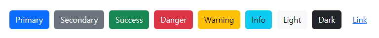
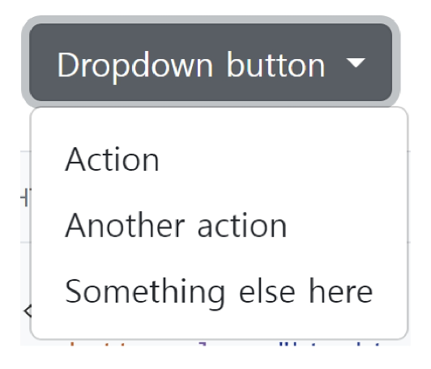
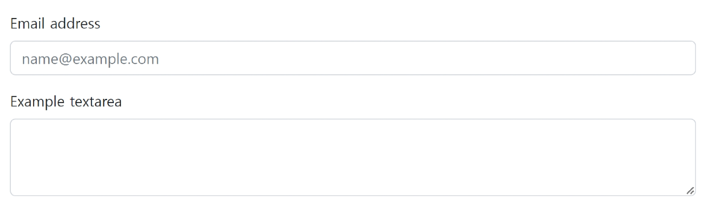
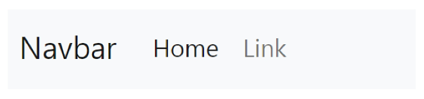
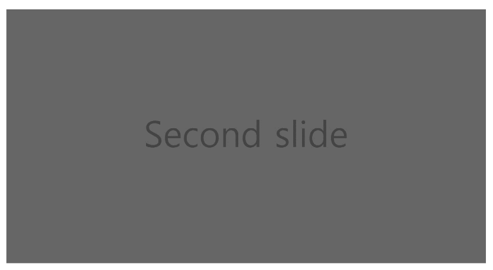
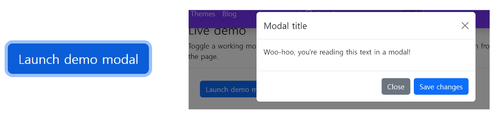
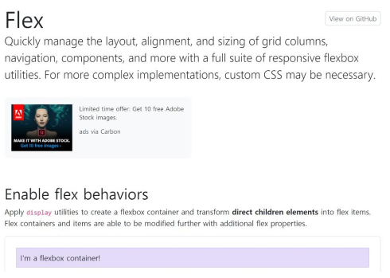
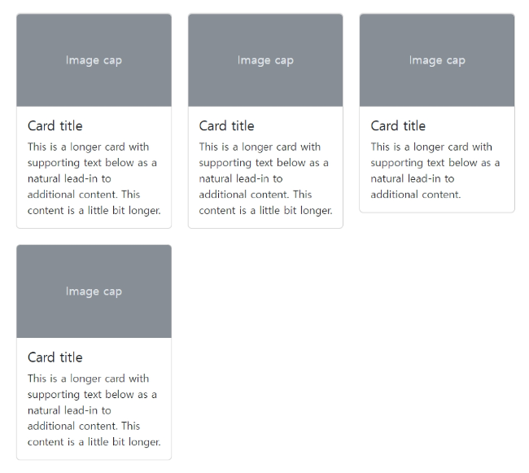
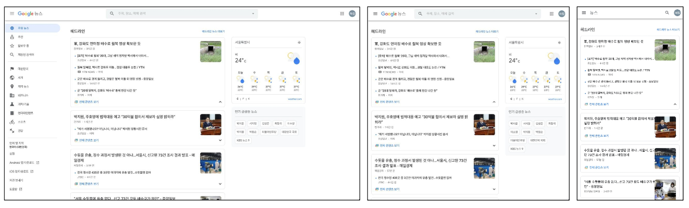

# Bootstrap

### **3. Bootstrap 컴포넌트**

1. Components
    - Bootstrap의 다양한 UI 요소를 활용할 수 있음
    - 아래 Components 탭 및 검색으로 원하는 UI 요소를 찾을 수 있음
    - 기본 제공된 Components를 변환해서 활용
<br><br>

2. **Buttons**
    - 클릭 했을 때 어떤 동작이 일어나도록 하는 요소
    
    
    
    ```html
    <button type="button" class="btn btn-primary">Primary</button>
    <button type="button" class="btn btn-secondary">Secondary</button>
    <button type="button" class="btn btn-success">Success</button>
    <button type="button" class="btn btn-danger">Danger</button>
    <button type="button" class="btn btn-warning">Warning</button>
    <button type="button" class="btn btn-info">Info</button>
    <button type="button" class="btn btn-light">Light</button>
    <button type="button" class="btn btn-dark">Dark</button>
    <button type="button" class="btn btn-link">Link</button>
    ```
<br>

3. **Dropdowns**
    - dropdown, dropdown-menu, dropdown-item 클래스를 활용해 옵션 메뉴를 만들 수있다.
    
    
    
    ```html
    <div class="dropdown">
      <button class="btn btn-secondary dropdown-toggle" type="button" data-bs-toggle="dropdown" aria-expanded="false">
        Dropdown button
      </button>
      <ul class="dropdown-menu">
        <li><a class="dropdown-item" href="#">Action</a></li>
        <li><a class="dropdown-item" href="#">Another action</a></li>
        <li><a class="dropdown-item" href="#">Something else here</a></li>
      </ul>
    </div>
    ```
<br>

4. **Forms > Form controls**
    - form-control 클래스를 사용해 <input> 및 <form> 태그를 스타일링 할 수 있다.
    
    
    
    ```html
    <div class="mb-3">
      <label for="exampleFormControlInput1" class="form-label">Email address</label>
      <input type="email" class="form-control" id="exampleFormControlInput1" placeholder="name@example.com">
    </div>
    <div class="mb-3">
      <label for="exampleFormControlTextarea1" class="form-label">Example textarea</label>
      <textarea class="form-control" id="exampleFormControlTextarea1" rows="3"></textarea>
    </div>
    ```
<br>

5. **Navbar**
    - navbar 클래스를 활용하면 네비게이션 바를 제작할 수 있다.
    
    
    
    ```html
    <nav class="navbar navbar-expand-lg bg-light">
      <div class="container-fluid">
        <a class="navbar-brand" href="#">Navbar</a>
        <button class="navbar-toggler" type="button" data-bs-toggle="collapse" data-bs-target="#navbarSupportedContent" aria-controls="navbarSupportedContent" aria-expanded="false" aria-label="Toggle navigation">
          <span class="navbar-toggler-icon"></span>
        </button>
        <div class="collapse navbar-collapse" id="navbarSupportedContent">
          <ul class="navbar-nav me-auto mb-2 mb-lg-0">
            <li class="nav-item">
              <a class="nav-link active" aria-current="page" href="#">Home</a>
            </li>
            <li class="nav-item">
              <a class="nav-link" href="#">Link</a>
            </li>
          </ul>
        </div>
      </div>
    </nav>
    ```
<br>

6. **Carousel**
    - 콘텐츠(사진)을 순환시키기 위한 슬라이드쇼
    
    
    
    ```html
    <div id="carouselExampleSlidesOnly" class="carousel slide" data-bs-ride="carousel">
      <div class="carousel-inner">
        <div class="carousel-item active">
          
        </div>
        <div class="carousel-item">
          
        </div>
        <div class="carousel-item">
          
        </div>
      </div>
    </div>
    ```
<br>

7. **Modal**
    - 사용자와 상호작용 하기 위해서 사용하며, 긴급 상황을 알리는 데주로 사용
    - 현재 열려 있는 페이지 위에 또 다른 레이어를 띄움
    - 페이지를 이동하면 자연스럽게 사라짐(제거를 하지 않고도 배경 클릭시 사라짐)
    - 모달 부분은 body의 자식으로 넣어주기
    - place your modal HTML in a top-level position to avoid potential interference from other elements.
    
    
    
    ```html
    <!-- Button trigger modal -->
    <button type="button" class="btn btn-primary" data-bs-toggle="modal" data-bs-target="#exampleModal">
      Launch demo modal
    </button>
    
    <!-- Modal -->
    <div class="modal fade" id="exampleModal" tabindex="-1" aria-labelledby="exampleModalLabel" aria-hidden="true">
      <div class="modal-dialog">
        <div class="modal-content">
          <div class="modal-header">
            <h5 class="modal-title" id="exampleModalLabel">Modal title</h5>
            <button type="button" class="btn-close" data-bs-dismiss="modal" aria-label="Close"></button>
          </div>
          <div class="modal-body">
            ...
          </div>
          <div class="modal-footer">
            <button type="button" class="btn btn-secondary" data-bs-dismiss="modal">Close</button>
            <button type="button" class="btn btn-primary">Save changes</button>
          </div>
        </div>
      </div>
    </div>
    ```
<br>

8. **Flexbox in Bootstrap**
    
    
    
    ```html
    <div class="d-flex justify-content-start">...</div>
    <div class="d-flex align-items-start">...</div>
    <div class="d-flex">
    	<div class="align-self-start">Aligned flex item</div>
    </div>
    ```
<br>

9. **Card > Grid Card**
    - 화면이 작아지면 1줄에 표시되는 카드의 개수가 줄어듬
    
    
    
    ```html
    <div class="row row-cols-1 row-cols-md-2 g-4">
      <div class="col">
        <div class="card">
          
          <div class="card-body">
            <h5 class="card-title">Card title</h5>
            <p class="card-text">This is a longer card with supporting text below as a natural lead-in to additional content. This content is a little bit longer.</p>
          </div>
        </div>
      </div>
      <div class="col">
        <div class="card">
          
          <div class="card-body">
            <h5 class="card-title">Card title</h5>
            <p class="card-text">This is a longer card with supporting text below as a natural lead-in to additional content. This content is a little bit longer.</p>
          </div>
        </div>
      </div>
     ...
    ```
<br>

10. **Responsive Web**
    - 같은 컨텐츠를 보는 각기 다른 디바이스
        
        
<br><br>        
    
11. Responsive Web Design
    - 다양한 화면 크기를 가진 디바이스들이 등장함에 따라 responsive web design 개념이 등장
    - 반응형 웹은 별도의 기술이 아닌 웹 디자인에 대한 접근 방식, 반응형 레이아웃 작성에 도움이 되는 사례들의 모음 등을 기술하는데 사용되는 용어
    - 예시
        - Media Queries, Flexbox, Bootstrap Grid System, The viewport meta tag
<br><br><br>

### 4. Bootstrap Grid System 🔥🔥

1. Grid system (web design)
    - 요소들의 디자인과 배치에 도움을 주는 시스템
    - 기본 요소
        - Column : 실제 컨텐츠를 포함하는 부분
        - Gutter : 칼럼과 칼럼 사이의 공간 (사이 간격)
        - Container : Column들을 담고 있는 공간
<br><br>

2. Bootstrap grid System
    - Bootstrap grid System은 flexbox로 제작됨
    - container, rows, column으로 컨텐츠를 배치하고 정렬
    - 반드시 row가 부모, col이 자식
    - 반드시 기억해야 할 2가지 !
        - 12개의 column
        - 6개의 grid breakpoints
<br><br>

3. Grid system
    
    ```html
    <div class="container">
    	<div class="row">
    		<div class="col"></div>
    		<div class="col"></div>
    		<div class="col"></div>
    	</div>
    </div>
    ```
<br><br>

4. Grid system breakpoints 연습하기
    
    ```html
    <div class="container">
    	<h2 class="text-center">column</h2>
    	<div class="row">
    		<div class="col"></div>
    		<div class="col"></div>
    		<div class="col"></div>
    	</div>
    <hr>
    
    <div class="row">
    		<div class="box col"></div>
    		<div class="box col"></div>
    		<div class="w-100"></div>
    		<div class="box col"></div>
    		<div class="box col"></div>
    	</div>
    	<hr>
    </div>
    ```
    
<br>

---
